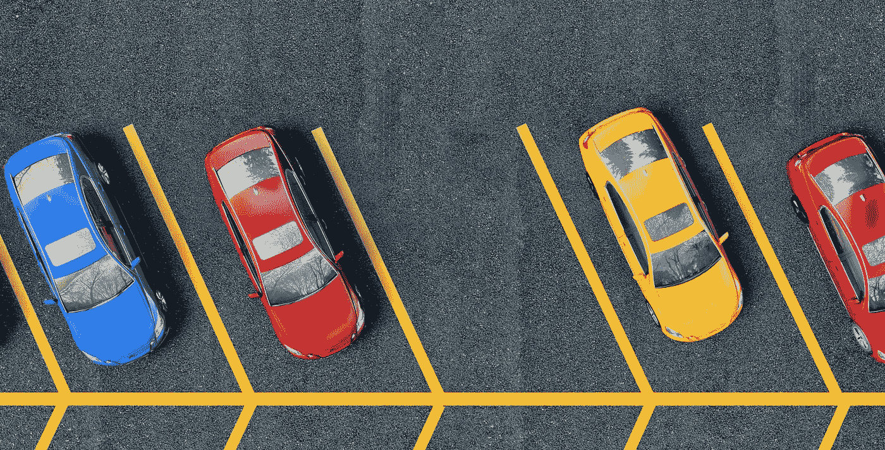

# 建筑限速器。第一部分。理论。

> 原文：<https://medium.com/geekculture/building-rate-limiter-part-1-theory-ce65ff69ef41?source=collection_archive---------11----------------------->

几乎每个应用程序都面临着过滤传入请求的任务。

有两种类型的问题请求——DDoS 攻击或来自真实服务客户的过于频繁的请求。

DDoS 问题可以通过 CouldFare 这样的怪物来解决。他们拥有令人难以置信的庞大基础设施，这有助于有效地过滤垃圾邮件请求。

但是它们无法帮助我们在应用程序级别过滤流量。
带着这个问题，我遇到过。
我们的应用程序中有复杂的逻辑，需要很长时间才能执行。我们的客户编写了一个脚本，开始每秒发送数千个请求。这些请求导致我们的服务对所有客户的响应延迟。

本文将研究构建速率限制器的理论部分。

我们将在下一集看到我们可以使用什么工具来实现它。

为了更好地理解我们为什么需要限速器，让我们看一个真实的例子。
我们有一个能容纳 60 辆车的停车场。如果已经满了，让更多的车进来就没有意义了，因为他们找不到新的停车位，这只会导致停车场一片混乱。在任何时候，停车场最多可以容纳 60 辆车。这是我们必须保持的主要不变量。如果一些车辆离开，创造了一个空位，我们可以让一个新的进入。为此，我们在入口处设置了一道屏障。我们的项目也需要同样的屏障。

**Issue** :
创建一个服务来限制用户对我们系统的请求数量。服务必须工作得非常快、可靠，并且消耗很少的资源。
它必须是可扩展的，能够为每个客户端动态更新访问规则。该服务应该提供一组丰富的指标，以便您可以看到任何突发的活动。

让我们看看创建的基本方法:一个桶和滑动窗口。

立即想到的第一个想法是使用我们可以给予请求的权限。
在停车示例中，这可能是停车罚单。在计算机世界里，它称之为令牌。为客户提供代币有两种方式:

令牌桶和泄漏桶。让我们看看它们是如何工作的。

我们研究了我们的停车场很长一段时间，并得出结论，停车场的汽车在一个小时内离开。我们给了保安卡，司机必须拿着这些卡才能打开安全门。他每小时往机器里插入 60 张卡片。因此，每小时只有 60 辆车可以进入停车场。

但是我们要考虑到，一个小时一辆车不走，我们停车场就有 60 多辆车，会出问题。
在这种情况下，我们需要更加注意发卡数量和/或发卡时间。可以用漏桶解决。

漏水的桶看起来像一个代币桶——我们发放停车卡，正好 60 张。我们把它们交给保安。任何一辆车离开停车场后，警卫会把我们的卡交还给路障。在这种情况下，我们在停车场最多只能停 60 辆车。但是我们有了一个新问题。如果所有的车都停在停车场超过一个小时怎么办？使用这种方法，我们还必须想出如何强制释放停车位。

还有其他几种处理查询的方法，即所谓的窗口函数。

第一个想法是固定窗口。我们可以把柜台交给我们的警卫。告诉他每小时让 60 辆车进来。从下午 1 点到 2 点，让 60 辆车通过，从下午 2 点到 3 点，让 60 辆车通过，以此类推。

但是这个解决方案有严重的缺陷。假设窗口结束前 10 分钟，60 辆车到了。在新的 10 分钟内，60 辆车也到了。总共 20 分钟，我们停车场的车多了一倍。然而，我们期望他们在 120 分钟内均匀到达。

我们可以用两种方法来解决这个问题。第一个是滑动窗口日志。让我们存储每辆车的时间戳，并计算自 60 辆车到达后已经过了多长时间。如果是不到 60 分钟前，我们不给停放新车。

这个系统的好处是我们精确地控制了汽车的数量。但是它也有一个明显的缺点。我们必须为每辆车节省时间，并不断删除超过 60 分钟前的条目。

或者我们可以使用滑动算法方法。这里我们有两种方法。假设 10 分钟前开始了一个新窗口。为了让一辆新车进入，门卫会计算过去一个小时内每分钟的平均车辆数量，然后将这个数字乘以 50 分钟。然后加上在这 10 分钟内到达的汽车数量。如果小于 60，它允许汽车通过。

或者，一个小时可以分成几个篮子，每个篮子 10 分钟。然后警卫会把前一个小时的五个篮子和这一个小时的一个篮子加起来。如果总数小于 60，那也没问题。我们给新的篮子加+1，让汽车通过。

**结论**。我们现在已经熟悉了组织限速器的方法。在下一篇文章中，我们将实现我们的内存速率限制器并测试它的工作，将其与现成的解决方案进行比较，看看反应式方法是否有任何优势。