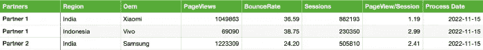
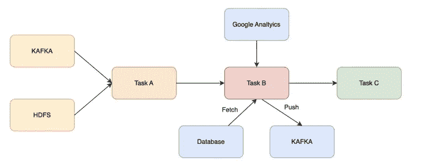
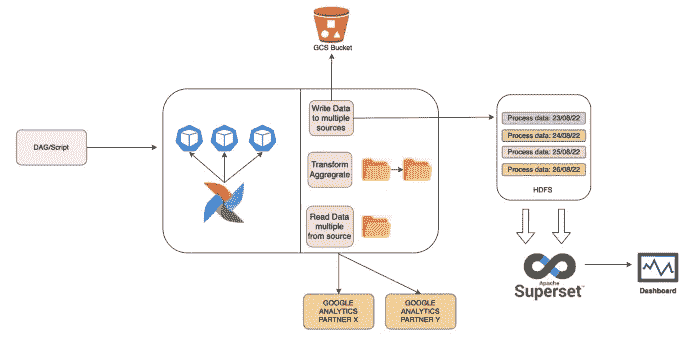
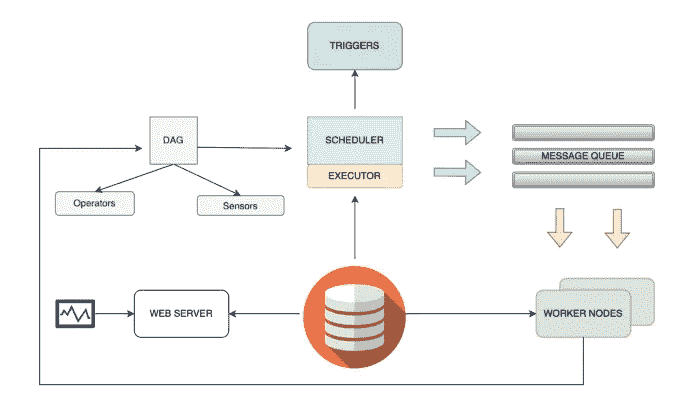
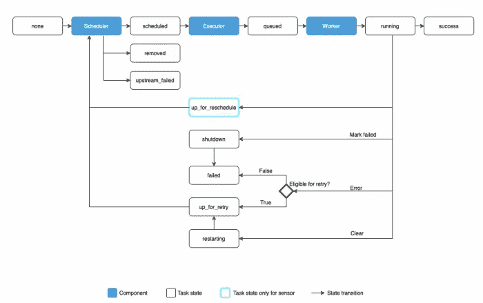
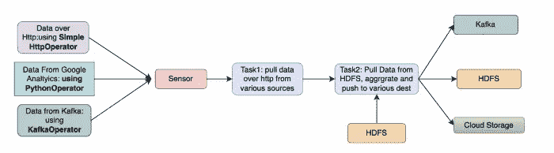
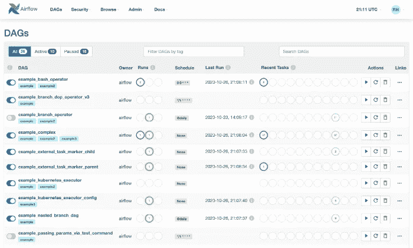
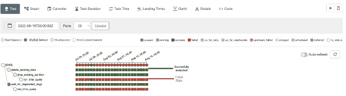

# 深入研究气流架构，构建弹性数据管道

> 原文：<https://medium.com/geekculture/building-resilient-data-pipelines-with-deep-dive-into-airflow-architecture-38bb9efa7239?source=collection_archive---------9----------------------->

目标:使用 Airflow、Hive (HDFS 查询分析)和 Superset(数据可视化)从零开始构建弹性数据管道


Photo by [Giuseppe CUZZOCREA](https://unsplash.com/@kuzzogiu?utm_source=medium&utm_medium=referral) on [Unsplash](https://unsplash.com?utm_source=medium&utm_medium=referral)

数据管道对任何组织都至关重要，因为它们消除了流程中的大多数手动步骤，并实现了数据从一个阶段到另一个阶段的平稳自动流动。它们对于实时分析至关重要，有助于做出更快的数据驱动型决策，并构建业务洞察力(文章绩效、主题受欢迎程度、优化(如果有)、自动推荐等)。).由于这些管道非常重要，我们决定管理管道的系统/平台必须满足以下 SLA

*   处理任务相关性
*   支持并发性(能够在任何时间点调度多个作业)
*   处理可伸缩性的分布式系统
*   对失败有弹性(符合**墨菲定律**
*   快速调试的可观察性
*   监控(可操作的 UI 层/仪表板)

让我们通过一个实际的场景来讨论如何构建一个符合上述 SLA 的弹性系统。我们将把讨论分为两个阶段。

*   我们将讨论如何构建一个数据管道，以使用 airflow 和 hive 检索、转换和聚合 Glance 新闻门户合作伙伴的分析数据，从而构建**洞察**并做出**数据驱动的业务决策**
*   [深入探究气流架构，了解数据管道在幕后的工作原理。](#a227)

# 运行中的数据管道

我们将讨论如何使用工作流管理平台构建弹性数据管道，但首先让我们深入了解问题陈述。

Glance 有几个新闻门户合作伙伴，展示他们的内容(新闻、文章等)。)和这些新闻门户网站的分析数据(浏览量、跳出率、地区用户等。)在他们的谷歌分析账户上捕捉到的。

**我们需要一个集中式仪表板来查看所有合作伙伴分析数据，以便构建业务洞察和数据驱动的决策。到目前为止，这是一个手动流程，每个合作伙伴都需要提交日常分析数据，并在我们的系统中进行本地汇总和更新。这一过程涉及大量的手动工作，容易出现人为错误，导致错误的见解和业务决策。这一过程需要端到端的自动化。**



Required Data Format

从问题陈述中可以明显看出，我们需要构建一个弹性数据管道，该管道每天触发并检索合作伙伴数据->聚合数据->存储在各自的目的地以供使用

# 设计决策(CRON 与气流)

任务调度是管理数据管道的任何系统的核心，我们将深入探讨的两个最广泛使用的调度器是 Cron 和 Airflow

用于工作流管理的 Cron:Cron 是一种众所周知的经过试验和测试的方法，用于以预定的方式运行任务，但是它也有一些限制，例如

*   Cron 作业在单个机器上运行，并且不是分布式的，当涉及较少的依赖关系时，它也能很好地工作。例如，考虑以下情况，如果任何一个作业失败，将会产生级联效应



工作流依赖性

*   因为 Cron 作业不生成任何关于任务调度、执行、失败、重试等的元数据。监控和调试成为一项复杂的任务，在未来可能会呈指数级增长。

Cron 本质上不具备**弹性**，也不满足上面列出的任何 SLA。如果您的情况相当简单，几乎没有依赖性，Cron 就很好，否则就使用适合您需求的适当的 WMP。

**Airflow as WMP** : Airflow 是一个让你建立和运行工作流的平台。工作流被表示为一个 [DAG](https://airflow.apache.org/docs/apache-airflow/stable/concepts/dags.html) (一个有向的非循环图，其中可以将单个工作定义为任务),而与 Cron**不同，它在本质上是分布式的，并且是为弹性而构建的**。让我们看看一些受支持的特性

*   监控和可观察性
    1。管道中所有 DAG 及其状态的图形视图
    2。每个任务/子任务级别的失败
    3。暂停/开始/停止 DAG 的选项
    4。查看使用的所有传感器/触发器
*   元数据生成
    1。下一个预定间隔
    2。任务及其子任务花费的时间
*   弹性
    1。可配置的&强制重试选项
    2。外部故障情况下的数据回填
    3。针对突然的系统行为的警报
*   工作流程
    1。依赖关系管理的控制流程
    2。预定义的运算符&连接器，用于从各种来源(数据库、云存储、HDFS、缓存等)接收数据。)

Airflow 固有地支持前面讨论的所有列出的 SLA，并且还提供了一个很好的可操作仪表板来进行监控和观察，因此是我们的用例的默认选择。

# 履行

下面的体系结构在较高的层次上使用气流根据 DAG 中指定的任务依赖关系异步执行任务，结果被转换->聚合并存储在 sink (GCS 和 HIVE)中以供以后使用。



Pipeline Architecture

# 深入探究建筑

1.  我们将把我们的工作流定义为每天调度的 DAG(指定调度信息和要执行的任务的 python 脚本)
2.  以下是 DAG 中指定的各个任务

*   任务 1:检索并转换每个合作伙伴的分析数据
*   任务 2:根据流程日期对数据进行分区(为了加快查询加载时间),并将转换后的数据推送到 GCS 存储桶
*   任务 3:根据流程日期检索 GCS 存储桶中的数据，并将转换后的数据推送到 HIVE

3.Airflow 根据任务依赖关系在内部异步调度和执行指定的任务(使用预定义的执行器( **celery 或 k8s** )和 worker 节点)。

4.一旦数据被推送，**超集**将检索、聚合基于预定时间间隔的流程日期范围的配置单元表中的数据，并在仪表板上显示数据。

# 将工作流定义为 DAG

*   每个 Dag 都需要下面提到的属性，其中最重要的是
    1。*调度间隔*:根据用例，您可以将 dag 调度定义为 cron 表达式或一些预定义的标签(@daily、@weekly 等)。)下面定义的 dag 将在 UTC 每天凌晨 3:00 运行
    2。 *Catchup* :需要回填历史数据时使用。为了完成这个设置，过去的时间开始日期和这个字段值为真
    3。*重试 _ 延迟*

```
default_args = {
    'owner': 'GRAP',
    'depends_on_past': False,
    'start_date': datetime.datetime(2022, 9, 1),
    'email': [alert_email],
    'email_on_failure': True,
    'email_on_retry': False,
    'retries': 5,
    'catchup': True,
    'retry_delay': timedelta(minutes=30)
}dag = DAG(
    dag_id,
    default_args=default_args,
    schedule_interval='0 3 * * *',
    max_active_runs=1,
    catchup=True,
    tags=['DAILY','ANALYTICS']
)
```

*   一旦 DAG 被初始化，下一步就是定义任务。我们主要有两项任务
    1。从各自的合作伙伴谷歌分析账户- >获取合作伙伴分析数据- >推送到 GCP 云存储。这里，我们定义了一个带有 python 可调用函数的任务来执行，op_kwargs 表示提供给函数的参数。如果需要，您甚至可以将这个函数分解成多个任务，并使用 **Xcoms** 在任务实例之间传递数据，这有点棘手，但提供了更多的可读性。

```
fetch_page_analytics_api_data = PythonOperator(
        task_id='fetch_partner_analytics',
        python_callable=fetch_partner_analytics,
        op_kwargs={ 'dateTemp': '{{ ds }}'},
        provide_context=True,
        dag=dag
    )
```

2.下一个任务是从 Gcp 云存储中检索数据，并将其推送到按流程日期划分的 Hive(HDFS)。

```
partition_registry_new = HiveOperator(
          hql=register_new_partitions(table_name),
          hive_cli_conn_id='prod_hive_connection_glance_cube',
          schema='glance_google_analytics',
          hiveconf_jinja_translate=True,
          task_id='add_partition_in_hive',
          dag=dag
     )
```

*   一旦定义了各自的任务，我们就需要引入它们之间的依赖关系(如果有的话)(这里我们希望在创建任何分区之前先获取数据)

```
fetch_page_analytics_api_data >> partition_registry_new
```

*   如果不提供依赖性，则由于其分布式性质，气流将并行执行任务。

这就是如何在带有任务的流程中定义 DAG，并在它们之间引入依赖关系。上面没有显示任务实现，因为它可能会根据用例以及设计代码的风格而变化，这将留给用户去探索。

# 气流建筑



高层次上的 Airflow 是建立在元数据库上的排队系统，该元数据库将任务及其元数据存储在队列中，以及调度器，该调度器可以访问元数据调度(重新安排、设置优先级、删除过期的任务等)。)队列中的任务，并将其提供给执行器，执行器具有自己的工作节点来并行执行任务

*   DAG:一个工作流被表示为一个 [DAG](https://airflow.apache.org/docs/apache-airflow/stable/concepts/dags.html) (一个有向无环图)并且包含被称为[任务](https://airflow.apache.org/docs/apache-airflow/stable/concepts/tasks.html)的单独的工作片段。DAG 指定任务之间的依赖性，以及执行它们和运行重试的顺序
    1。 *Tasks* :在 DAG 中，你可以定义多个任务，并描述每个任务要做的事情，比如获取数据、运行分析、触发其他系统等等。



任务状态自动机

2.*操作符*:操作符是预定义任务的模板，可以根据需要在一个任务中使用多个操作符(例如
->**bash Operator**:执行 bash 命令
- > **Python 操作符**:执行任意 Python 函数
->**simple HTTP Operator**:调用 HTTP 上的端点
3 .传感器:一类特殊的操作者，他们完全是在等待外部事件的发生



示例 DAG(从各种源获取数据，转换并分发到接收器以供使用)

*   **调度器**:气流调度器是一个通过元数据库访问所有 DAG 及其任务的进程，执行以下操作
    1。监控任务并决定任务优先级和执行
    2。一旦任务的依赖关系完成就触发任务。将任务提交给执行者执行
*   **执行器**:气流执行器从调度器接收要运行的任务实例，并将其放入队列中，稍后由工作节点拾取以执行任务。遗嘱执行人基本上有两种类型
    1。*本地执行器*:在本地(在`scheduler`进程内)运行任务*的执行器，主要用于单机安装、本地测试或较小的工作量
    2。*远程执行器*:远程*运行任务*的执行器(通常通过*工作线程*)，如上所示(例如芹菜、库伯内特、芹菜库伯内特执行器)*
*   **网络服务器**:气流*网络服务器*提供了一个方便的用户界面来检查、触发和调试 Dag 和任务的行为。



如果对更多后端感兴趣，请结帐🙂

*   [以高比例实时计算直播流观众数！！|瞥](https://engg.glance.com/computing-live-stream-viewers-count-in-real-time-at-high-scale-ef813bc1b9cb)
*   [如何使用 Google Kubernetes 引擎、Jenkins、DockerHub 和 ArgoCD 通过 CI/CD 实现应用部署自动化](https://blog.bitsrc.io/deploy-node-js-application-over-google-cloud-with-ci-cd-36df0cc42231)

# 离别笔记

我希望上面的讨论是富有成效的，并帮助您了解了关于与 WMP 合作和构建分布式弹性数据管道的一两件事。对[马赫什](https://www.linkedin.com/in/bala-mahesh-jampani-6686b1110/)和[瓦伊巴夫](https://www.linkedin.com/in/vbvasa/)的大力支持，以及[普里扬舒·杜贝](https://www.linkedin.com/in/priyansh/)、[卡尼什克·梅塔](https://www.linkedin.com/in/kanishkm/)、[绍伊布](https://www.linkedin.com/in/shoaib-a-169a649/)提供机会建造令人敬畏的东西。