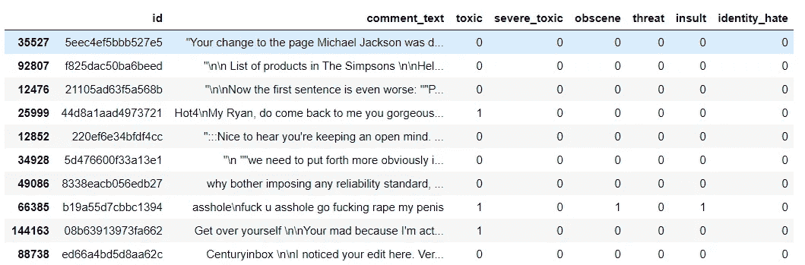
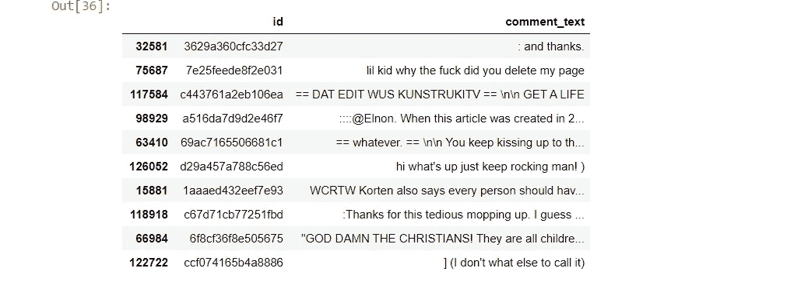
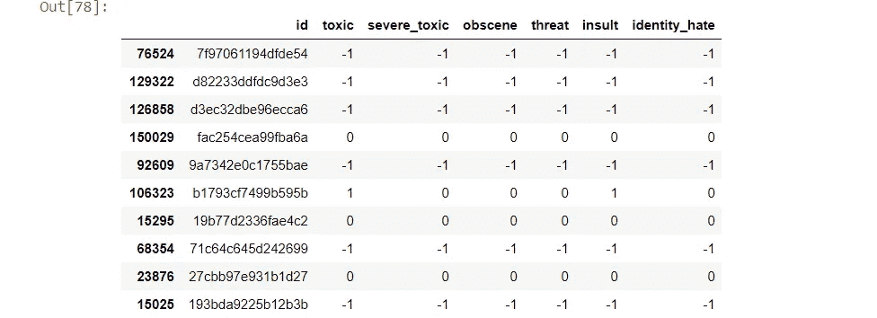
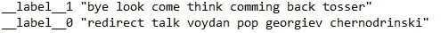
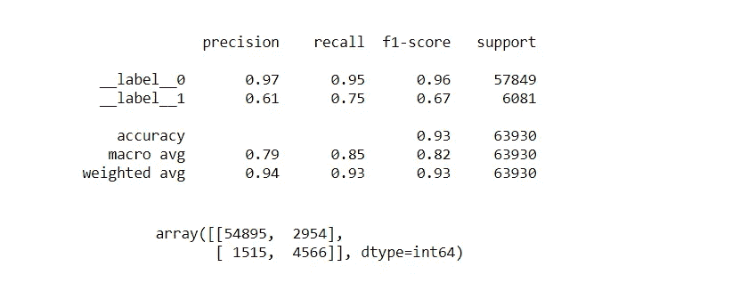
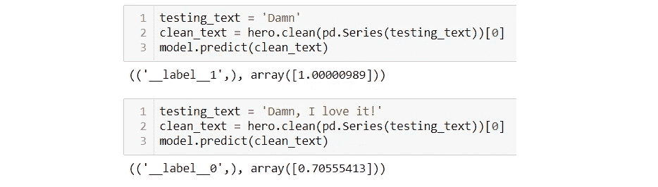
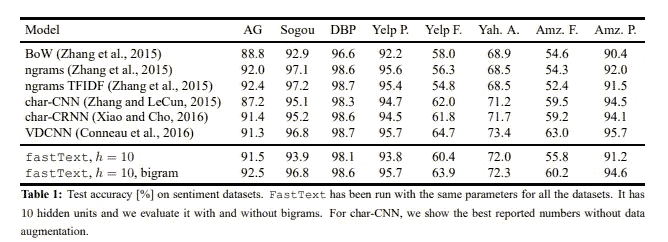

# 用最少的时间和编码工作量建立文本分类模型

> 原文：<https://medium.com/geekculture/building-text-classification-model-in-3-minutes-and-20-lines-of-code-deaca6aced37?source=collection_archive---------15----------------------->

## 如果我们能在做出掏钱(时间和精力)的决定之前获得产品的免费试用(模型预测)该有多好？


Photo by [Nathan Dumlao](https://unsplash.com/@nate_dumlao) on [Unsplash](https://unsplash.com/)

## 介绍

本文利用自然语言处理(NLP)库，如 **Texthero** 和 **FastText** ，它们在不牺牲性能的情况下缩短了文本分类器的开发。一个典型的文本分类器需要几个小时或几天来开发，从探索性数据分析、文本预处理、特征工程和特征选择开始，训练模型并最终评估性能。

因此，数据科学家只能看到投资后的回报。在通过遍历整个管道获得训练好的模型之前，无法回答不确定性。例如，我们不确定从 Kaggle 数据集训练的垃圾邮件分类器能否正确预测英式英语或新加坡英语的邮件？如果我们能在决定掏钱(时间和精力)之前获得产品的免费试用(模型预测)会有多好？

考虑到这一点，本文着重于用 20 行代码和 3 分钟的训练时间来训练模型。不会有关于架构的理论解释。有文章写了 TextHero 预处理文本有多方便，或者用 FastText 训练模型有多快，但是没有一篇文章同时使用这两者来压缩开发时间。

让我们开始吧。

# **导入库**

这项任务将使用四个库

1.  **熊猫**用于读取 csv 文件和操作数据
2.  **Texthero** 用于文本预处理
3.  **快速文本**用于建立分类模型
4.  **sci kit-学习**进行评估

```
# Import the libraries
import texthero as hero
import pandas as pd
import fasttext
from sklearn.metrics import confusion_matrix
from sklearn.metrics import classification_report
```

# 资料组

本文中的数据集取自 Kaggle 竞赛“**有毒评论分类挑战**”。在这次挑战中，来自维基百科对话页面编辑的评论被人工标记为毒性类型(有毒、淫秽、威胁等)。为了简单起见，我们只考虑将注释二进制分类为“*有毒*类。

数据集可以在这里[下载。](https://www.kaggle.com/c/jigsaw-toxic-comment-classification-challenge)

> *免责声明:本次比赛的数据集包含可能被视为亵渎、粗俗或冒犯的文本。*

第一步是使用 Pandas 读取数据集。毒性评论分类挑战数据集由 1 个带标签的训练数据集和 2 个将评论和标签分开的测试数据集组成。

```
train_df = pd.read_csv('train.csv')
test_df = pd.read_csv('test.csv')
test_label_df = pd.read_csv('test_labels.csv')
```



Random 10 samples from training data



Random 10 samples from testing data



Random 10 samples from testing data label

根据 Kaggle 网页，值-1 表示记录未用于评分。然而，我决定删除测试数据中带有'-1 '有毒标签的行，因为'-1 '不属于'有毒'或'无毒'类别。

我们对测试数据集及其标签执行了合并，并仅选择了有毒列中带有“0”或“1”的标签。

```
test_df = test_df.merge(test_label_df, left_on='id', right_on='id')
test_df = test_df[(test_df['toxic'] == 0) | (test_df['toxic']==1)]
```

# 文本清理

> Texthero 是一个 python 包，可以有效地处理文本数据。它为 NLP 开发人员提供了一个工具来快速理解任何基于文本的数据集，并提供了一个可靠的管道来清理和表示文本数据，从零到英雄。

文本清理在任何 NLP 任务中都是必不可少的，因为模型努力学习底层模式来解决我们的问题。文本清理管道是特定于任务的。

例如，许多文本清理删除停用词，因为它在分类中的作用微不足道。然而，在某些情况下，如作者归属(确定文档作者的分类任务)，停用词被保留并用作分类中的特征。

Texthero 通过简单地调用*text hero . preprocessing . clean .*来支持对 Pandas 数据帧的文本清理操作。默认流水线进程执行诸如填充 Nan 值、小写、停用词移除、数字和标点符号移除等步骤。

默认*的预处理方法*可以在[这里](https://texthero.org/docs/api/texthero.preprocessing.clean)找到，附加的预处理方法可以在[这里](https://texthero.org/docs/api-preprocessing)找到。您还可以为文本预处理定义一个自定义管道，如下图[所示](https://towardsdatascience.com/try-texthero-the-absolute-simplest-way-to-clean-and-analyze-text-in-pandas-6db86ed14272)。

在这里，我们演示了可以使用单个命令'*text hero . preprocessing . clean '，*来清理文本数据，以减少时间和复杂性。

```
train_df['comment_text_cleaned'] = train_df['comment_text'].pipe(hero.clean)
test_df['comment_text_cleaned'] = test_df['comment_text'].pipe(hero.clean)
```

# 系统模型化

FastText 是一个由脸书人工智能研究实验室创建的用于学习单词嵌入和文本分类的库。在网站上，它将 Fasttext 描述为:

> FastText 是一个开源、免费、轻量级的库，允许用户学习文本表示和文本分类器。它在标准的通用硬件上工作。模型可以缩小尺寸，甚至适合移动设备。

API 文件可以在[这里](https://fasttext.cc/)找到。

因为 FastText 是作为一个高效的 NLP 工具而设计的。只使用 CPU 就可以非常快速地训练模型，最重要的是，它不需要 GPU。但需要 C++编译器、Python(2.7 版或≥ 3.4 版)，以及支持的 Python 库，如 NumPy & SciPy、pybind11 等。

第一步是格式化要训练的数据集。FastText 要求将数据保存在 txt 文件中，格式为 _ _ label _ _(<category>)<space><cleaned text="">，如下所示:</cleaned></space></category>



> P 用“__label__”重新固定类别列的每一行

```
train_df.iloc[:, 0] = train_df.iloc[:, 0].apply(lambda x: '__label__' + str(x))
test_df.iloc[:, 0] = test_df.iloc[:, 0].apply(lambda x: '__label__' + str(x))
```

> 在本地保存 txt 文件

```
train_df[['toxic', 'comment_text_cleaned']].to_csv('toxic_train.txt', 
                                          index = False, 
                                          sep = ' ',
                                          header = None)test_df[['toxic', 'comment_text_cleaned']].to_csv('toxic_test.txt', 
                                     index = False, 
                                     sep = ' ',
                                     header = None )
```

> 训练模型

```
model = fasttext.train_supervised('toxic_train.txt', wordNgrams=2, epoch = 300, lr = 0.8)
```

尽管有一个大的数据集(大约 160，000 标签数据)，分类模型在我的英特尔处理器 i7–9750h 上在 1.5 分钟(100 个历元)或 4.5 分钟(300 个历元)内训练得非常快。

# 估价

```
y_pred = test_df.iloc[:, 1].apply(lambda x: model.predict(x)[0][0])
y_true = test_df.iloc[:, 0]print(classification_report(y_true, y_pred))
confusion_matrix(y_true, y_pred)
```



Classification report and confusion matrix of 300 epochs

# 做出预测



该模型通过正确地将句子*’****该死的****’*识别为 100%确信它是有毒的和将 ***该死的，我喜欢它***’识别为 70%确信它是无毒的**来展示其分类能力。**

# **开发周期短的好处**

**fast 实施的目的是快速了解数据和活动场所，以便在实际实施之前进行规划。**

## **基线模型**

**我们可以粗略地估计分类器模型，并且可以使用经过训练的模型作为基线模型。**

**下表显示了出色的性能。[来源](https://arxiv.org/pdf/1607.01759.pdf)**

****

**Competitive performance despite short training time**

## **用最少的代码快速训练**

**模型的训练时间通常少于 3 分钟(约 160 条记录)，我们可以通过试验不同的预处理和建模设置来研究模型性能。**

****

**The training and testing time comparison ([link](https://arxiv.org/pdf/1607.01759.pdf))**

## **操场**

**例如，估计要使用的合适单词 Ngrams，或者用不同的预处理技术进行测试(Remove_diacritics？将数字转换成文本？保留停用词？).**

## **选择合适的数据集弄脏你的手**

**较短的开发周期有助于选择训练数据。数据科学家经常不得不在没有给出足够的测试数据的情况下训练 NLP 模型，并且不得不依赖于来自互联网的开放数据集来训练模型。然后，我们可以从未知的训练中获得一个经过训练的模型，看看训练数据是否符合我们的测试数据。**

# **完整代码**

**完整的代码可以在 github [这里](https://github.com/yuanxy33/text-classifier-texthero-fasttext)获得**

```
# Library
import texthero as hero
import pandas as pd
import fasttext
from sklearn.metrics import classification_report
from sklearn.metrics import confusion_matrix# Reading the files
train_df = pd.read_csv('toxic_text_classification/train.csv/train.csv')
test_df = pd.read_csv('toxic_text_classification/test.csv/test.csv')
test_label_df = pd.read_csv('toxic_text_classification/test_labels.csv/test_labels.csv')
test_df = test_df.merge(test_label_df, left_on='id', right_on='id')
test_df = test_df[(test_df['toxic'] == 0) | (test_df['toxic']==1)]# Text-cleaning
train_df['comment_text_cleaned'] = train_df['comment_text'].pipe(hero.clean)
test_df['comment_text_cleaned'] = test_df['comment_text'].pipe(hero.clean)train_df= train_df[['toxic','comment_text_cleaned']]
test_df= test_df[['toxic','comment_text_cleaned']] # Formatting file for modelling
train_df.iloc[:, 0] = train_df.iloc[:, 0].apply(lambda x: '__label__' + str(x))
test_df.iloc[:, 0] = test_df.iloc[:, 0].apply(lambda x: '__label__' + str(x))train_df[['toxic', 'comment_text_cleaned']].to_csv('toxic_train.txt', 
                                          index = False, 
                                          sep = ' ',
                                          header = None)test_df[['toxic', 'comment_text_cleaned']].to_csv('toxic_test.txt', 
                                     index = False, 
                                     sep = ' ',
                                     header = None )# Model training
model = fasttext.train_supervised('toxic_train.txt', wordNgrams=3, epoch = 150, lr = 0.8)# Evaluation
y_pred = test_df.iloc[:, 1].apply(lambda x: model.predict(x)[0][0])
y_true = test_df.iloc[:, 0]print(classification_report(y_true, y_pred))
print(confusion_matrix(y_true, y_pred))# Prediction
testing_text = 'Damn'
clean_text = hero.clean(pd.Series(testing_text))[0]
model.predict(clean_text)
```