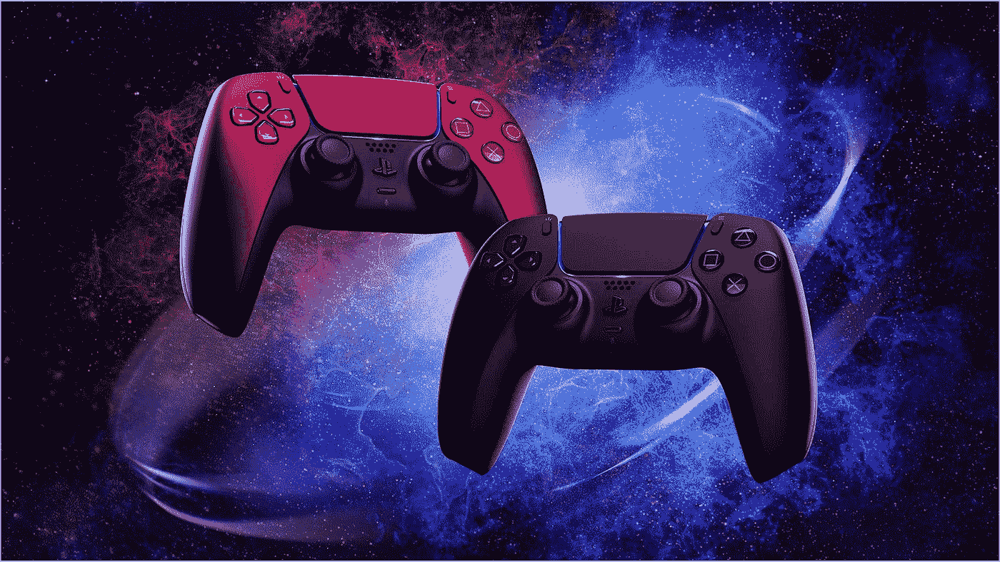

# 通过合作构建触觉学的未来:MPEG 触觉学标准提交(过程更新#2)

> 原文：<https://medium.com/geekculture/building-the-haptics-future-through-collaboration-the-mpeg-haptics-standards-submission-890337435424?source=collection_archive---------45----------------------->

# **如今的触觉学标准化流程在哪里？**

2021 年 10 月实现了两个重要的里程碑，而 [Interhaptics](https://www.interhaptics.com) 是其中的核心。

第一个里程碑是[触觉](https://www.interhaptics.com/explore/what-is-haptics)作为一级媒体类型的不远的将来，在技术领域给予触觉与音频和视频相同的地位。这意味着触觉文件可以被封装，以便在标准化的 MPEG 媒体中以音频和视频格式传送。这是提供内容采用的第一步。这意味着您的流媒体服务可以包含当前 MPEG 形式中包含的触觉音轨。

第二个里程碑是 MPEG 发布了触觉编码的参考模型 0 — RM0。RM0 是发布最终触觉编码标准的基础格式。

**haptics 标准的成功取决于行业参与者对该标准的采用。这归结于谁编写了规范。**

RM0 是在 MPEG 发出提案呼吁后发布的。几家公司提交了他们的技术方案，一个具有挑战性的选择过程显示了 RM0 的最佳技术候选。

触觉部分征集提案的发起者和评委包括:

- [苹果](https://www.apple.com)

- [索尼](https://www.sony.com/en/)

- [浸没](https://www.immersion.com)

- [交叉指型](https://www.interdigital.com)

[***苹果***](https://www.apple.com) 拥有世界上最大的触觉平台 iPhone。

[***索尼***](https://www.sony.com/en/) 凭借 PS5 的双感控制器成为触觉领域的领先创新者，凭借 [PSVR](https://www.playstation.com/en-us/ps-vr/) 成为 XR 世界的大玩家。

[***沉浸式***](https://www.immersion.com) 是历史上触觉技术的主要参与者。

[***inter digital***](https://www.interdigital.com)是一家 IP 技术公司，主要 IP 和技术在视频压缩和 3D 场景。

没有比这更好的赞助商来推动 MPEG 标准的采用了。

Interhaptics 将成为 RM0 构建的技术平台。

Interhaptics 在感知渲染保真度、信号压缩和平台兼容性方面展示了卓越的技术。所有这些都是为了振动触觉和动觉反馈。

我们的编码标准将基于其他贡献者的提议包装在兼容层中，以确保未来与 3D 场景和特定高性能配置文件的兼容性。

Interhaptics 拥有专利和基础软件形式的知识产权，能够在 haptics 生态系统中实施这些技术。

**Interhaptics 的提案是 RM0 的基础，是游戏规则的改变者**

-它 100 %兼容苹果[AHAP](https://www.apple.com)格式

-完美转码[沉浸式](https://www.immersion.com) IVS 格式，这是许多智能手机实现的基础

-它与[索尼](https://www.sony.com/en/)的双感知多通道需求相连接，既用于力反馈(自适应触发)，也用于宽带触觉音圈。

-它拥有迄今为止最好的压缩技术，为 XR 的多致动器触觉铺平了道路。(纳米孔伙伴关系:[https://bit.ly/3oqdZ3B](https://bit.ly/3oqdZ3B))(萨尔州大学伙伴关系:[https://bit.ly/3bRT6rW](https://bit.ly/3bRT6rW))(syn touch 伙伴关系:[https://bit.ly/3kgqBJk](https://bit.ly/3kgqBJk))

-它基于感知编码，可轻松扩展用于扩展现实

# 下一步是什么？

Interhaptics 和 RM0 的其他贡献者将在 2022 年 1 月为 MPEG 137 提供一个工作软件参考模型。该模型将经过几次严格的测试，以确保其核心实验阶段的质量和可靠性，最终在短期内推出该标准的第一个商业版本。

# 当前 MPEG 阶段 1:提交材料

提交的材料包括在我们的 Interhaptics 触觉材料格式中编码和压缩 3 种不同的宽带信号的挑战:

*   短暂振动(< 100 ms)
*   Long Vibrations (> 100 毫秒)
*   3D 中的力

征集提案的挑战与满足验证要求所需的高压缩率以及在编码过程中要消化的触觉信号的格式有关。

要消化的信号是多重的，其中一些是矢量的，一些是基于信号的:

*   [苹果公司的 AHAP](https://developer.apple.com/documentation/corehaptics/representing_haptic_patterns_in_ahap_files)
*   [IVS](https://www.electronicdesign.com/technologies/test-measurement/article/21153488/immersion-working-toward-a-standardized-haptics-coding-format) 脱离沉浸状态
*   [来自 Interdigital 的 PCM](https://en.wikipedia.org/wiki/Pulse-code_modulation) 文件

PCM 编码提出了一个特殊的挑战:起始信号是一个 8 kHz、16 位的信号，需要以:

*   64kb/秒
*   16kb/秒
*   2kb/秒

其中 2 kb/s 要求压缩率为 64，这意味着与原来相比，内存消耗减少了 64 倍！

Interhaptics 提供了全部编码要求，有 108 个编码文件满足了招标的所有压缩要求。

提交的编码方案已由一组触觉专家进行评估，他们将向呼叫提议者提供一份关于编码格式质量的公正报告。MPEG 专家收集了这些提交的内容，并选择了每个提案中最有前途的特征来合成最终的标准。

标准化过程是漫长的，它在市场上投入使用还需要几年时间。

# 下一步:召开 MPEG 会议以建立 RM0

MPEG 专家已经选择了每个提议中最有前途的特征。 [Interdigital](https://www.interdigital.com/) 、 [Nanoport Technologies](https://nanoport.io/) 、 [Lofelt](https://lofelt.com/) 、 [Interhaptics](https://www.interhaptics.com/) 将与 MPEG 有一次新的相遇。本次会议的目标是建立代表参考模型 0 的 RM0。每个参与者都必须对他们提交的材料进行辩论。

会议的下一步，MPEG 展示了他们之前的测试结果。每份提案都将被审查，并指出它们的优缺点。此外，将根据测试结果进行头脑风暴，以在 4 个方案中确定 RM0。如果一些特征是互补的，一些提议可以合并成一个。

在 RM0 建立之后，每个参与者将有 6 个月的时间来评估和改进 RM0。

在一个分散的市场中实施公认的标准总是伴随着任何行业的增长和整合。这种情况在科技史上发生过多次，对行业经济产生了巨大影响。一个例子是实现了 mp3 编码格式标准，该标准允许广泛采用数字音频播放器，如 iPod。这一事件一直持续到今天数字音频流媒体服务的主导地位，如 [Spotify](https://www.spotify.com/us/) 。如果没有允许不同制造商的设备之间的音频编码信号的互操作性的一致的和通用的标准，任何事情都是不可能的。

这些标准的实施由不同的组织领导。负责 MP3 和即将到来的[数字触觉编码标准的是 MPEG](/nerd-for-tech/haptic-industry-forum-and-interhaptics-strategy-for-haptic-standards-dd515b7f2755) 。

# **什么是 MPEG？**

MPEG 或运动图像专家组“是由 [ISO](https://en.wikipedia.org/wiki/International_Organization_for_Standardization) 和 [IEC](https://en.wikipedia.org/wiki/International_Electrotechnical_Commission) 的[工作组](https://en.wikipedia.org/wiki/Working_group)组成的联盟，它为媒体编码制定标准，包括对[音频](https://en.wikipedia.org/wiki/Audio_compression_(data))、[视频](https://en.wikipedia.org/wiki/Video_compression)、图形和[基因组](https://en.wikipedia.org/wiki/Compression_of_Genomic_Sequencing_Data)数据的压缩编码，以及针对各种应用的传输和[文件格式](https://en.wikipedia.org/wiki/Container_format_(digital))。MPEG 帮助行业合作伙伴就共享编码格式达成一致，并管理相关专利池的许可，以使第三方软件生产商能够包含增强的功能。

多亏了 MPEG，你可以在你的[亚马逊 Fire TV](https://www.amazon.com/b/ref=smp_cec_nav/ref=s9_acss_bw_cg_smpcec_md1_w?node=8521791011&pf_rd_m=ATVPDKIKX0DER&pf_rd_s=merchandised-search-top-1&pf_rd_r=JK1M9581Y648PZ9K80AE&pf_rd_t=101&pf_rd_p=4a475d9e-71ba-47ee-b393-b625203ab786&pf_rd_i=8521791011) 上听 [Spotify](https://www.spotify.com/us/) ，因为所有这些服务都同意使用一种共同的音乐语言。

# **对触觉标准的需求**

触觉市场分散在不同的筒仓中，这些筒仓来自形成触觉生态系统的非常不同的技术。一个例子是振动:触觉中实施的技术从偏心旋转质量(ERMs)产生的振动，到精致的宽带致动器，如苹果的 [Taptic 引擎或最新](https://developer.apple.com/videos/play/wwdc2019/520) [PlayStation 5 Dualsense 控制器](https://www.playstation.com/en-us/accessories/dualsense-wireless-controller/)中包含的引擎。ERM 和宽带致动器接受和执行根本不同的信号，它们使用不同的语言。

Source: PlayStation 5 DualSense Controllers

在实践中，这意味着如果你为 [Apple Core Haptics](https://developer.apple.com/videos/play/wwdc2019/520) 的 Taptic 引擎构建一个游戏，你将不得不为像 Dual Shock 这样的控制器重新构建所有的 Haptics 实现。这通常意味着游戏开发者根本不会投资于伟大的触觉实现，因为实现它的成本更高。

这就是为什么生态系统需要 haptics 标准，以便能够将每个执行器使用的所有不同语言结合在一起，并允许内容创作者为 Haptics 构建一次，并部署在实现这些技术的所有设备上。

# **MPEG 第一阶段:组织者和参与者**

MPEG 提议的振动触觉标准化提案的第一次征集已经开始，提议者可以在 2021 年 7 月 5 日之前提交他们的提案。

这一呼吁是由沉浸公司发起的，并得到了其他组织的支持，如 T2 苹果 T3。第一轮的原始编码提交来自 [Interdigital](https://www.interdigital.com/) 、 [Nanoport Technologies](https://nanoport.io/) 、 [Lofelt](https://lofelt.com/) 和 [Interhaptics](https://www.interhaptics.com/) 。

# MPEG 阶段 1:提交材料

提交的材料包括在我们的 Interhaptics 触觉材料格式中编码和压缩 3 种不同的宽带信号的挑战:

*   短暂振动(< 100 ms)
*   Long Vibrations (> 100 毫秒)
*   3D 中的力

征集提案的挑战与满足验证要求所需的高压缩率以及在编码过程中要消化的触觉信号的格式有关。

要消化的信号是多重的，其中一些是矢量的，一些是基于信号的:

*   苹果公司的 AHAP
*   [IVS](https://www.electronicdesign.com/technologies/test-measurement/article/21153488/immersion-working-toward-a-standardized-haptics-coding-format) 从沉浸
*   [来自 Interdigital 的 PCM](https://en.wikipedia.org/wiki/Pulse-code_modulation) 文件

PCM 编码提出了一个特殊的挑战:起始信号是一个 8 kHz、16 位的信号，需要以:

*   64kb/秒
*   16kb/秒
*   2kb/秒

其中 2 kb/s 要求压缩率为 64，这意味着与原来相比，内存消耗减少了 64 倍！

Interhaptics 提供了全部编码要求，有 108 个编码文件满足了招标的所有压缩要求。

提交的编码方案将由一组触觉专家进行评估，这些专家将向呼叫提议者提供一份关于编码格式质量的公正报告。MPEG 专家稍后将收集这些提交的内容，并选择每个提案中最有前途的特征来合成最终的标准。标准化委员会的反馈将于 2021 年 9 月底完成。

标准化过程是漫长的，它在市场上投入使用还需要几年时间。

# **触觉的重要性**

[Interhaptics](https://www.interhaptics.com/) 的使命是让创作者能够立即创作出精彩的 haptics 内容。在所有可用的触觉界面上部署他们的创作的能力是实现这一愿景的一部分。

我们意识到碎片化生态系统的挑战，因此，我们在 2016 年开始开发 Interhaptics，创建了一种 haptics 编码格式，即我们的 Haptics Materials，它可以包含不同 Haptics 技术之间的差异。触觉材料不仅可以有效地存储振动触觉，还可以存储力反馈、空间纹理和温度变化。由于提交了我们的触觉材料编码的一部分，能够影响触觉标准将有助于 Interhaptics 生态系统符合即将到来的标准，甚至在它被接受之前。

MPEG 挑战允许 Interhaptics 在高压缩 haptics 编码以及与不同格式的宽带 haptics 兼容性领域开发关键技术。其中一个是我们的感知无损原始编码格式，它允许在没有任何感知信息损失的情况下对宽带信号进行极端压缩。

寻求在软件中实现触觉的创作者将在短期内从这一活动中直接受益。开发的压缩技术将在即将到来的 Haptic Composer 2.0 中可用，以允许创作者将声音导入 Haptic Composer。

设计师的工作流程将包括导入声音文件并将其翻译为触觉，通过作曲家添加他们的触觉，并以他们选择的格式导出它们。支持的格式将包括 Apple 的 AHAP、用于 sound2Haptics 转换的 WAV 以及 Interhaptics 触觉材料格式，这些格式允许编码信号的最佳质量，以便在支持的平台中进行本机集成。

# **这对触觉创造者和设计师意味着什么？**

即将到来的标准将有助于触觉生态系统的发展。增长的关键驱动因素之一是创建高效和有效的触觉内容的能力。Interhaptics 的 [Haptic Composer](https://www.interhaptics.com/tools/haptic-composer) 是一款面向设计人员和开发人员的工具，用于创建高清 haptics 内容。未来与 MPEG 提议的触觉标准的兼容性将确保您今天使用我们的内容创建工具链所做的投资将为明天触觉市场即将到来的创新做好准备。