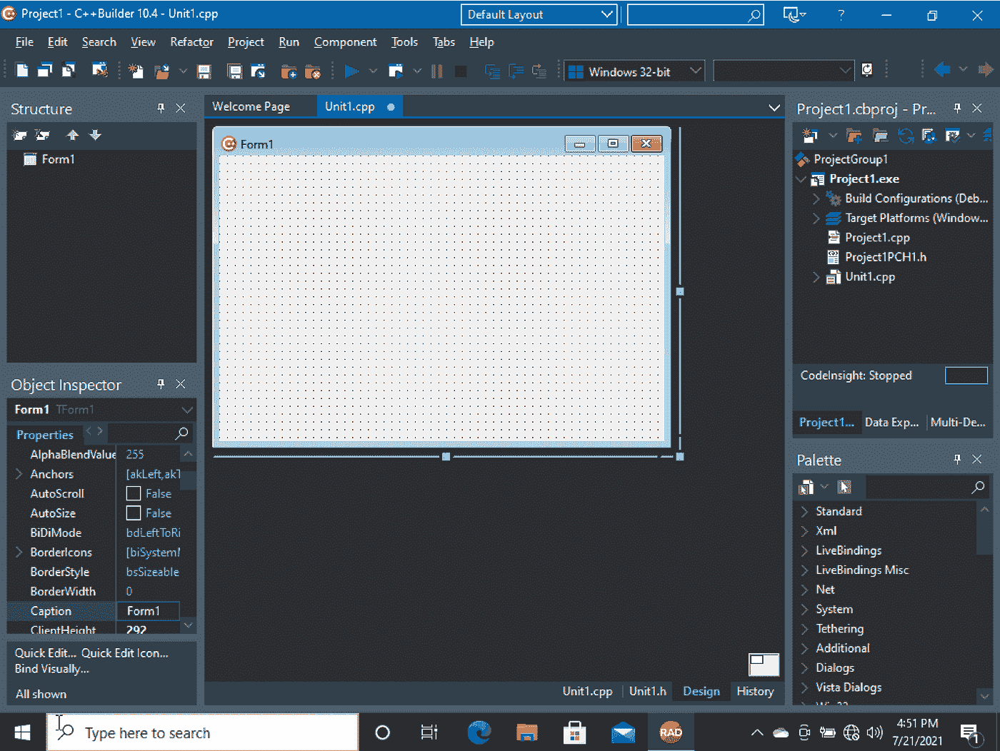
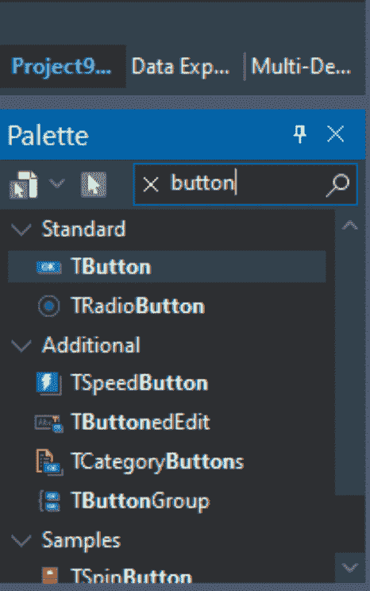
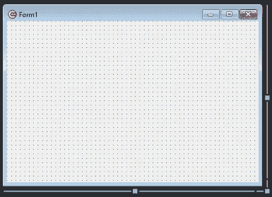
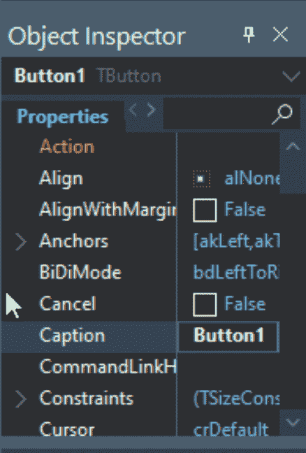
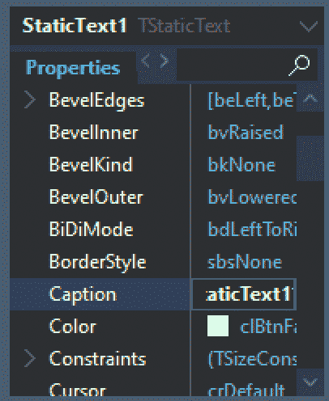
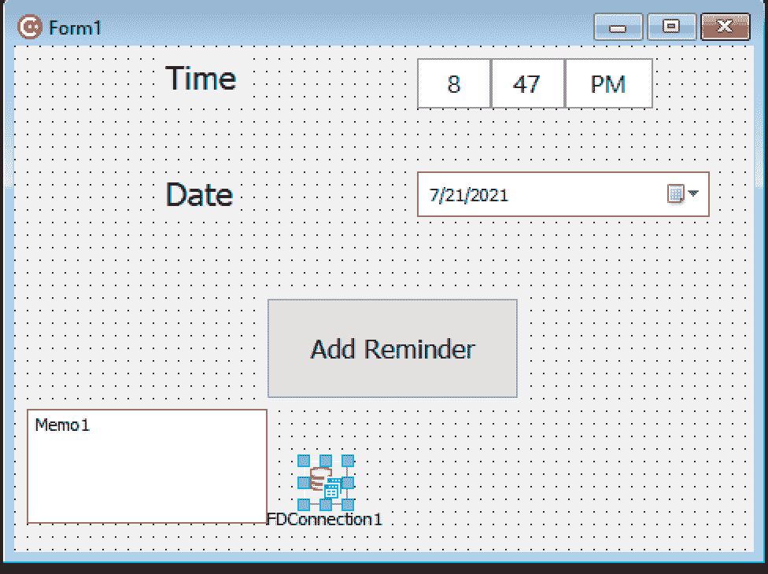
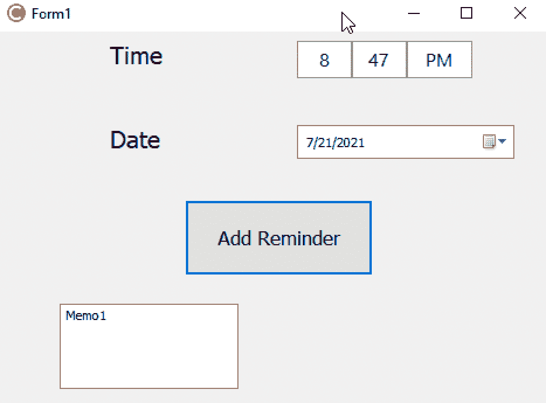
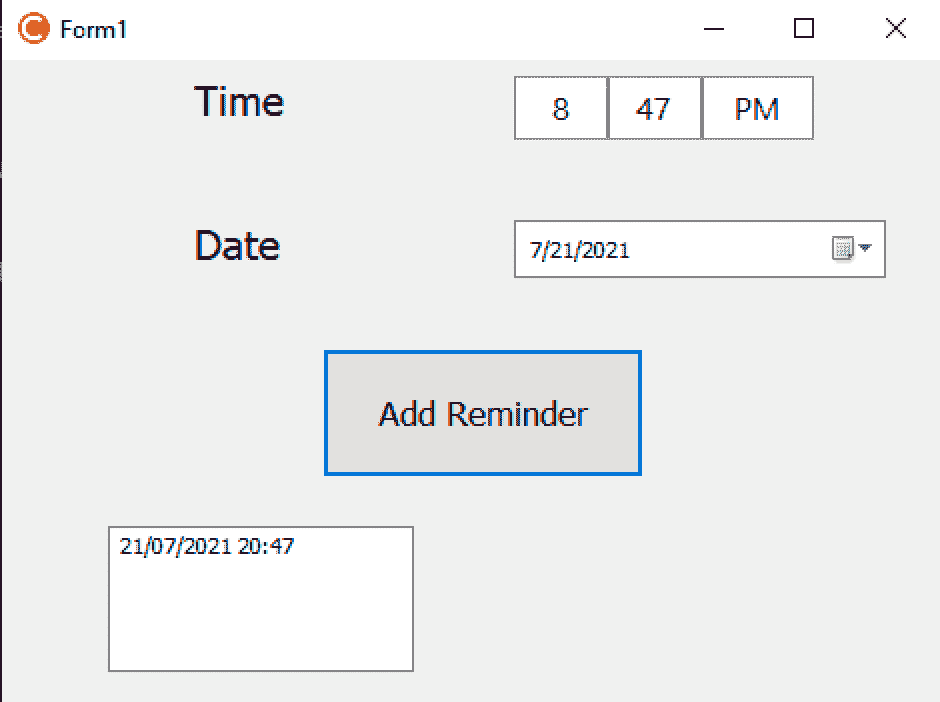

# 使用 C++ Builder 构建您的第一个应用程序(第 1 部分)

> 原文：<https://medium.com/geekculture/building-your-first-app-using-c-builder-part-1-e400789f03b3?source=collection_archive---------7----------------------->


Photo by [Luis Villasmil](https://unsplash.com/@luisviol?utm_source=unsplash&utm_medium=referral&utm_content=creditCopyText) on [Unsplash](https://unsplash.com/s/photos/app?utm_source=unsplash&utm_medium=referral&utm_content=creditCopyText)

构建移动应用有时可能是一项任务。但是 C++Builder 使得在用 C++编写代码的同时构建移动和桌面应用变得很容易。

在本文中，我们将分享使用 C++Builder 构建第一个应用程序的几个步骤。

*如果你没有读过:* [*使用 C++ Builder 构建你的第一个应用(第二部分)*](/@IderaDevTools/building-your-first-app-using-c-builder-part-2-dc26040bffb8)

这里讨论的应用程序是一个迷你提醒应用程序，它具有 SQLite 数据库、一些输入字段、日期/时间选择器和更多组件——各种各样的功能让您知道什么是容易实现的。

## **第一步:设置 C++Builder**

要开始使用 C++Builder 构建您的第一个应用程序，您需要在您的设备上设置 IDE。

设置好 [**C++Builder**](https://www.embarcadero.com/products/cbuilder?utm_source=Medium&utm_medium=Leads%20Acquisition&utm_content=BuildingYourFirstAppUsingCBuilder1&utm_campaign=BuildingYourFirstAppUsingCBuilder1) 之后，下一步就是通过拖拽组件来设计 UI。

组件是像按钮这样的可视控件，或者是像可配置数据库访问这样的非可视功能。

C++Builder 易于使用，因为它允许您简单地将按钮、文本字段、时间选择器、形状等组件拖放到设计表单中(当应用程序运行时，表单将成为您的窗口或屏幕)；这使得设计 UI 和连接其他功能的过程简单而快速。

选择您想要构建的应用程序类型，然后进入下一步。请注意，我们打算构建的应用程序是一个 Windows 应用程序，因此我们建议选择允许您创建应用程序的选项。



## 第二步:拖放

一旦选择了要构建的应用程序类型，就可以开始设计过程了。组件位于页面右下角的“调色板”部分。

只需搜索您感兴趣的组件，并将其拖到表单面板。或者您可以浏览列表，查看可视控件和其他可用的功能—有 700 多个组件。

**调色板部分:**



**表单面板:**



右下角的设计选项卡包含用于为您的应用程序对齐组件的表单。它旁边的 Unit1.cpp 选项卡提供了用于编写 C++代码来控制组件和实现重要功能的编辑器。Unit1.h 选项卡包含 Unit1.cpp 的标题。


左侧的对象检查器用于调整应用程序中组件的属性。选择一个或多个，它们的属性将可供编辑。它有一个事件列表，其中包含可以添加到代码中的事件侦听器。

这使您可以调用代码来响应发生的事情，例如，当单击按钮或更复杂的事情(如设备的位置发生变化)时调用方法。



在我们的迷你提醒应用程序中，我们将从使用一些基本的标签字段和按钮开始，但将遵循迭代设计方法(我们将从简单的设计开始，在我们取得一些进展后，将对 UI 进行进一步的改进)。

我们将从拖动组件开始，如 TLabel 字段、日期/时间选择器、fdconnection、按钮和备忘录。静态文本字段允许我们显示文本。在下面显示的设计表单中，我们的静态文本字段显示“时间”

我们还需要为提醒应用程序添加一个时间选择器和日期选择器。

转到调色板部分，搜索这两个组件。将它们拖放到表单中。

接下来，我们希望有一个按钮将提醒添加到我们的迷你 SQlite 数据库中，以便我们可以在用户请求时检索和显示它们。将按钮拖放到设计表单上。



## 第三步:码，码，码

接下来，我们将编写代码来使用时间选择器和日期选择器检索用户输入，并将代码显示在备忘录中。

现在，我们将使用 Add Reminder 按钮来获取时间和日期输入，并在我们的备忘录中显示它们。在本文的下一部分，我们将使用按钮将值直接存储到 SQLite 数据库中。

双击设计表单中的按钮，这将引导您进入按钮的快速调用功能。在这个函数中，我们将实现将在按钮的 OnClick 事件中执行的代码——这个事件就像它听起来的那样。

它允许您在单击按钮时调用一个方法。事件被命名为“On”加事件，如 OnDoubleClick、OnKeyPress 或 OnDataReceived。

```
void __fastcall TForm1::Button1Click(TObject *Sender)
{
 TDateTime dateTime;
 ReplaceDate(dateTime, DateTimePicker1->Date);
 ReplaceTime(dateTime, TimePicker1->Time);
Memo1->Text = dateTime.FormatString(“dd/mm/yyyy HH:mm”);
}
```

运行您的代码并单击“添加提醒”按钮；您的日期和时间应该显示在备忘录中。

**点击按钮前:**



**点击按钮后:**



恭喜你。我们已经讨论了如何使用 C++Builder 设计表单和使用一些组件，来自 [**Embarcadero**](https://www.embarcadero.com/?utm_source=Medium&utm_medium=Leads%20Acquisition&utm_content=BuildingYourFirstAppUsingCBuilder1&utm_campaign=BuildingYourFirstAppUsingCBuilder1) 。

在本文的下一部分，我们将致力于改进应用程序，包括用户界面，并合并我们的数据库和一些通知。