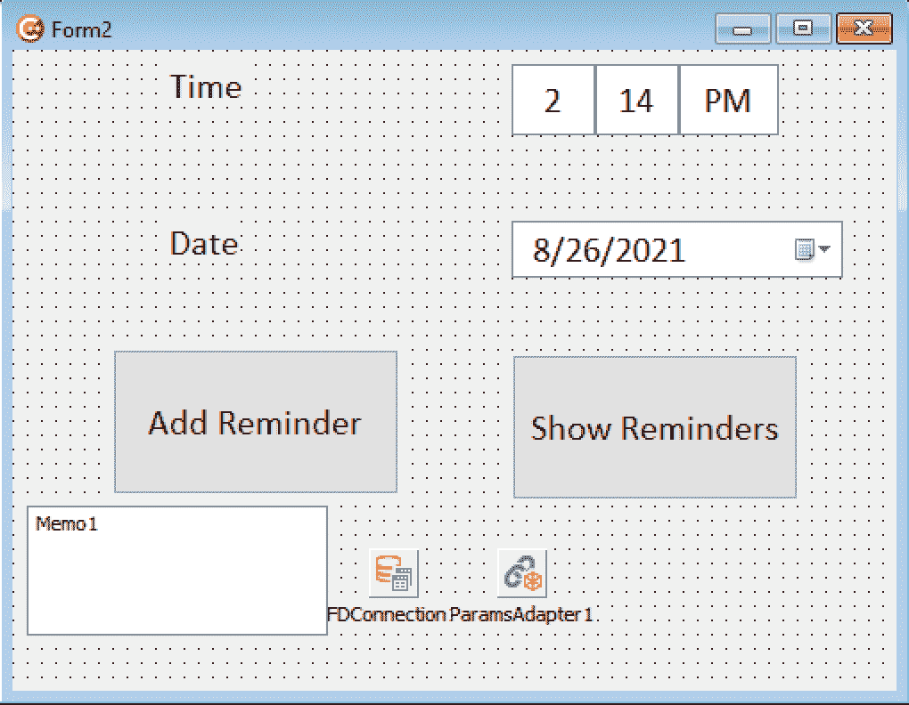
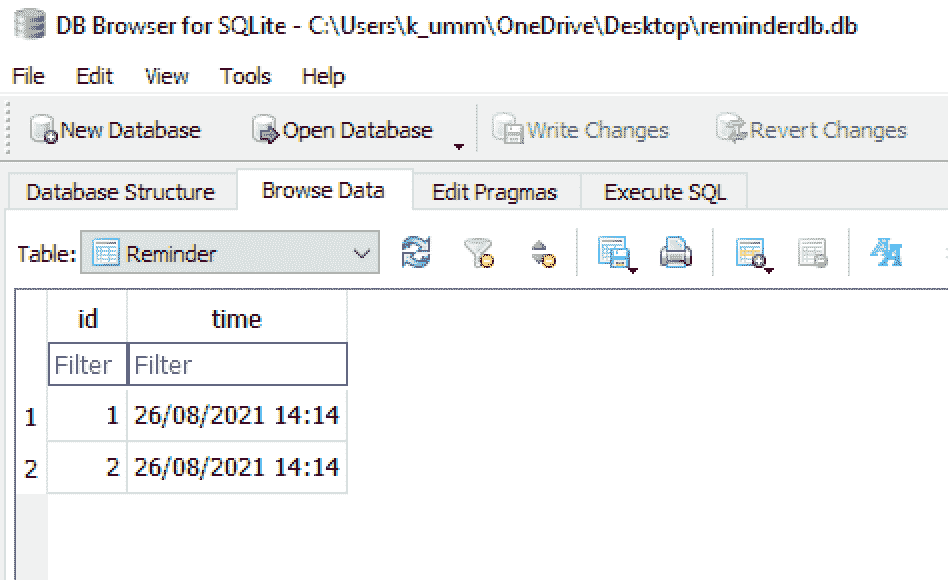
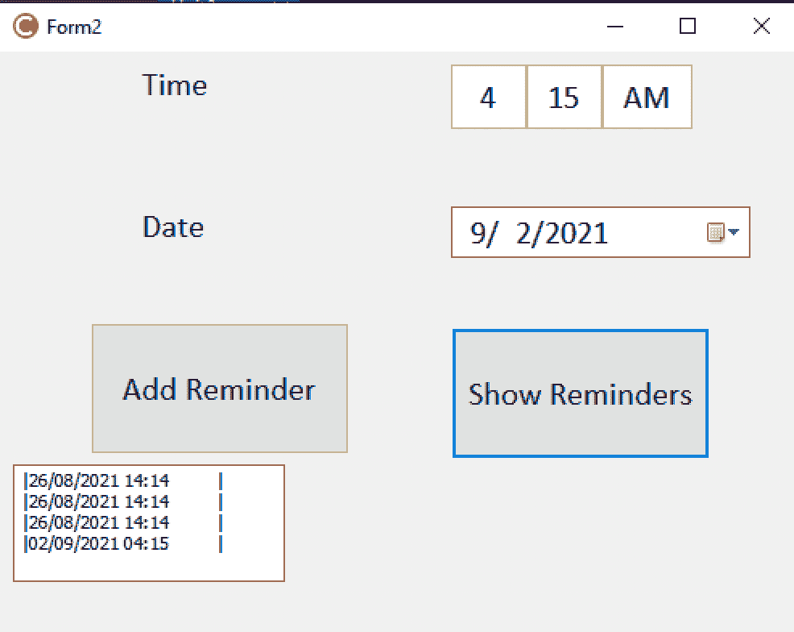

# 使用 C++ Builder 构建您的第一个应用程序(第 2 部分)

> 原文：<https://medium.com/geekculture/building-your-first-app-using-c-builder-part-2-dc26040bffb8?source=collection_archive---------11----------------------->


Photo by [Kelly Sikkema](https://unsplash.com/@kellysikkema?utm_source=unsplash&utm_medium=referral&utm_content=creditCopyText) on [Unsplash](https://unsplash.com/s/photos/app?utm_source=unsplash&utm_medium=referral&utm_content=creditCopyText)

欢迎回到我们关于在 [**C++Builder**](https://www.embarcadero.com/products/cbuilder?utm_source=Medium&utm_medium=Leads%20Acquisition&utm_content=BuildingYourFirstAppUsingBuilderPart2&utm_campaign=BuildingYourFirstAppUsingBuilderPart2) 中创建提醒应用的系列！

我们上一篇文章讨论了[如何设置 C++Builder](https://learncplusplus.org/how-to-set-up-cbuilder-for-your-first-project/) ，通过拖拽组件设计用户界面，编写代码控制一些组件。

*如果你没有读过:* [*使用 C++ Builder 构建你的第一个应用(第一部分)*](/geekculture/building-your-first-app-using-c-builder-part-1-e400789f03b3)

这一部分将把 SQLite 集成到应用程序中，并尝试将用户添加的提醒存储到数据库中。

将提醒添加到数据库后，我们将在用户请求时向他们显示提醒。

# 第四步:创建数据库

[C++Builder](https://www.embarcadero.com/products/cbuilder?utm_source=Mediumn&utm_medium=Leads%20Acquisition&utm_content=BuildingYourFirstAppUsingCBuilderPart2&utm_campaign=BuildingYourFirstAppUsingCBuilderPart2) 允许你在一个带有 FireDAC 库的程序中使用多个数据库。我们将把我们的 SQLite 数据库集成到这个应用程序中。

为此，我们需要从下载和安装 SQLite 数据库开始。请随意选择您想要使用的数据库。

请注意，firedac 允许您将多个数据库集成到应用程序中。下载并设置好数据库后，您需要选择数据库的类型并将其链接到您的应用程序。

双击设计表单中的 Fdconnection。此操作将打开 firedac 连接编辑器。在这里，您可以选择要使用的数据库的名称，并提供有关该数据库的更多详细信息。


对于这个简单的应用程序，我们需要修改的只是驱动程序 Id 和我们在桌面上创建的数据库的位置(在数据库标签旁边)。

完成这一步后，我们可以开始编写代码从数据库中检索数据，并将从用户那里收集的数据存储到数据库中。

我们在位于以下路径的桌面上创建了一个数据库:

```
*C:\\Users\\uk\\OneDrive\\Desktop\\reminderdb.db*
```

# 第五步:写入数据库

当我们单击 add reminder 按钮时，我们希望获取用户的当前时间，以及分别使用时间和日期时间选择器选择的日期，并将它们存储到数据库中。

我们将需要编写一些 SQL 语句，以便在数据库中创建一个提醒表(如果它还不存在的话),并在触发 onClick 事件时将日期/时间值作为字符串插入到数据库中。

我们还添加了一个“显示提醒”按钮，从数据库中检索提醒，并在备忘录中显示它们。



双击“添加提醒”按钮，为“添加提醒”按钮创建一个空的快速调用功能。在这个函数中，我们将利用 FDConnection 连接到数据库。

需要指定数据库的驱动程序名称和路径。这将有助于程序识别将与之通信的数据库的位置。

```
FDConnection1->DriverName = "SQLite";
FDConnection1->Params->Values["Database"] = "C:\\Users\\uk\\OneDrive\\Desktop\\reminderdb.db";
```

完成后，您可以编写代码来修改、插入、更新、删除或检索数据库中的数据。首先使用以下命令打开到数据库的连接，

```
*FDConnection1->Open();*
```

该命令与 close database 命令一起使用，一旦我们执行完所有查询，我们将需要使用以下命令关闭与数据库的连接:

```
*FDConnection1->Close();*
```

建立并打开通信门户后，如果提醒数据库中没有提醒表，我们将执行 SQL 语句来创建提醒表。

该表只需要两个字段，即 id 字段和 DateTime 字段，以字符串格式存储。

为了创建一个表，我们可以调用 ExecSQL 语句来执行一个 SQL 查询。

每当您想要创建表、插入或删除数据时，都可以调用这个 ExecSQL 函数，但是如果需要从数据库中检索数据，就不能使用它。

如果数据库中不存在表，则添加以下语句来创建表。

```
FDConnection1->ExecSQL("CREATE TABLE IF NOT EXISTS Reminder (Id int, time TEXT NOT NULL)");
```

接下来，我们要将时间插入数据库。在使用本文前一部分编写的代码检索日期时间值之后，我们仍然可以使用 ExecSQL 函数:

```
String date =  dateTime.FormatString("dd/mm/yyyy HH:mm");
FDConnection1->ExecSQL("INSERT INTO Reminder (time) VALUES ('"+date+"')");
```



# 第六步:从数据库中读取

要从数据库中检索添加的提醒，双击“显示提醒”按钮创建一个空的快速调用功能来检索提醒。

我们将使用 TFDQuery。TFDQuery 用于执行查询，并允许我们利用结果集。

下面是一些说明如何使用 TFDquery 的示例代码。在这里，我们希望从提醒表中选择所有提醒，并将它们显示给用户。

```
TFDQuery *query;
query = new TFDQuery(this);
query->Connection = FDConnection1;
query->SQL->Text = "SELECT * FROM Reminder";
query->Open();
```

要使用 TFDQuery **，**，需要将以下头添加到您的代码中:

```
*#include <FireDAC.DApt.hpp>*
```

用于输出检索数据的代码

```
TVarRec args[1] = {"time"};
Memo1->Lines->Add(System::UnicodeString::Format("|%25s |", args,ARRAYSIZE(args) - 1));
while (!query->Eof) {
TVarRec arguments[1] = { query->FieldByName("time")->AsString};
	Memo1->Lines->Add(System::UnicodeString::Format("|%-25s |", arguments, ARRAYSIZE(arguments) - 1));
	query->Next();
}
```



当所有共享代码的不同部分加在一起时，我们得到下面的程序:

```
#include <FireDAC.DApt.hpp> 
void __fastcall TForm2::buttonAddReminderOnClick(TObject *Sender)
{
    TDateTime dateTime;
	ReplaceDate(dateTime, DateTimePicker1->Date);
	ReplaceTime(dateTime, TimePicker1->Time);
	Memo1->Text = "";
	FDConnection1->DriverName = "SQLite";
	FDConnection1->Params->Values["Database"] =  "C:\\Users\\k_umm\\OneDrive\\Desktop\\reminderdb.db";
	try
	{
		FDConnection1->Open();
		FDConnection1->ExecSQL("CREATE TABLE IF NOT EXISTS Reminder (id INTEGER PRIMARY KEY AUTOINCREMENT, time TEXT NOT NULL)");
		String date =  dateTime.FormatString("dd/mm/yyyy HH:mm");
		FDConnection1->ExecSQL("INSERT INTO Reminder (time) VALUES ('"+date+"')");
		FDConnection1->Close();
	}
	catch (Exception& E)
	{
		Memo1->Text = E.Message;
	}
}
//---------------------------------------------------------------------------
void __fastcall TForm2::buttonShowReminderOnClick(TObject *Sender)
{
	FDConnection1->DriverName = "SQLite";
	FDConnection1->Params->Values["Database"] =  "C:\\Users\\k_umm\\OneDrive\\Desktop\\reminderdb.db";
	try
	{
		FDConnection1->Open();
		TFDQuery *query;
		query = new TFDQuery(this);
		query->Connection = FDConnection1;
		query->SQL->Text = "SELECT * FROM Reminder";
		query->Open();
		TVarRec args[1] = {"time"};
		Memo1->Lines->Add(System::UnicodeString::Format("|%25s |", args, ARRAYSIZE(args) - 1));
		while (!query->Eof) {
		  TVarRec arguments[1] = { query->FieldByName("time")->AsString};
		  Memo1->Lines->Add(System::UnicodeString::Format("|%-25s |", arguments, ARRAYSIZE(arguments) - 1));
		  query->Next();
		}
		query->Close();
		FDConnection1->Close();
	}
	catch (Exception& E)
	{
		Memo1->Text = E.Message;
	}
}
```

# 第七步:

到目前为止，我们已经构建了一个迷你提醒应用程序，它从用户那里获得输入并将其存储在数据库中。

我们的用户也希望在指定的时间内收到通知。

Android、macOS 和 iOS 都支持 FireDate。可以通过传递应该触发通知的日期和时间信息来使用它。

```
MyNotification->FireDate = System::Dateutils::EncodeDateTime(2015, 12, 16, 17, 30, 00, 00);
```

有关如何在应用程序中使用通知的更多信息，请点击[这里](https://docwiki.embarcadero.com/CodeExamples/Sydney/en/Category:Sample?utm_source=Medium&utm_medium=Leads%20Acquisition&utm_content=BuildingYourFirstAppUsingCBuilderPart2&utm_campaign=BuildingYourFirstAppUsingCBuilderPart2):

对于一些可以参考的样例代码，[点击这里](https://docwiki.embarcadero.com/RADStudio/Sydney/en/Using_Notifications?utm_source=Mediumn&utm_medium=Leads%20Acquisition&utm_content=BuildingYourFirstAppUsingCBuilderPart2&utm_campaign=BuildingYourFirstAppUsingCBuilderPart2)。