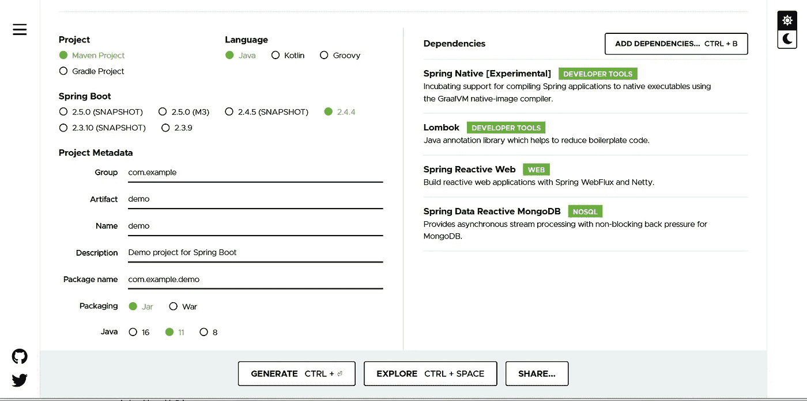

# 构建您的第一个 Spring 本地应用程序

> 原文：<https://medium.com/geekculture/building-your-first-spring-native-application-ae169136e544?source=collection_archive---------7----------------------->

[Spring Native beta 发布](https://spring.io/blog/2021/03/11/announcing-spring-native-beta)，这对 Spring 开发者来说是个好消息。Quarkus 从诞生之日起就得到了 GraalVM 原生映像和 Kubernetes 的支持，micro 姨妈和 Oracle Helidon 也在很长一段时间内加入了 GraalVM 支持。


The image is from [https://unsplash.com/photos/sBNx8CBj12w](https://unsplash.com/photos/sBNx8CBj12w)

正如在 [GraalVM 介绍页面](https://www.graalvm.org/docs/introduction/)，*中所解释的，GraalVM 是一个高性能的 JDK 发行版，旨在加速用 Java 和其他 JVM 语言编写的应用程序的执行，同时支持 JavaScript、Ruby、Python 和许多其他流行语言。GraalVM 的多语言功能使得在一个应用程序中混合多种编程语言成为可能，同时消除了外语调用成本。*

使用 GraalVM 本机映像，Java 应用程序可以在系统本机可执行文件或共享库中编译，并且在运行时不需要 Java 虚拟机。

在本帖中，我们将把[hantsy/Spring-reactive-sample](https://github.com/hantsy/spring-reactive-sample)资源库中的一个简单的现有 [reactive mongo 示例](https://github.com/hantsy/spring-reactive-sample/tree/master/boot-data-mongo-auditing)转换成一个原生应用程序，以体验 Spring Native project 带来的新特性。

> *目前，Spring Native 是一个实验项目，0.9.1 版本与确切的 Spring Boot 2.4.4 兼容。*

# 生成项目

假设您已经安装了以下软件。

*   Java 11
*   Apache Maven 3.8.1
*   Docker，使用`spring-boot:build-image`构建应用程序时需要
*   graal VM 21.0.0.2，通过本机映像 maven 插件直接构建本机映像时需要。

打开浏览器，导航到[https://start . spring . io](https://start.spring.io)。



生成一个带有依赖关系的 WebFlux 项目框架:Spring Native，Lombok，Spring Reactive Web，Spring Data Reactive MongoDB。

从下载的档案中提取文件，并导入到您的 IDE 中，例如 Intellij IDEA。

# 构建应用程序

默认情况下，Spring initializr 已经配置了一个 maven AOT 插件来生成 GraalVM 在编译阶段所需的元数据，并且配置了一个 spring boot maven 插件来使用[paketo build pack](https://paketo.io/)builder`paketobuildpacks/builder:tiny`将您的源代码转换为云原生应用程序(Docker 映像)。

只需运行以下命令，将应用程序构建到 Docker 映像中。

```
mvn clean package spring-boot:build-image
```

[Spring 原生引用](https://docs.spring.io/spring-native/docs/current/reference/htmlsingle/index.html#getting-started-native-image)也引入了通过原生 image maven 插件构建原生应用。

将来自 [reactive mongo 示例](https://github.com/hantsy/spring-reactive-sample/tree/master/boot-data-mongo-auditing)的源代码复制到这个项目中，重构`pom.xml`并引入多个 maven 概要文件，使其适用于这两种情况。

```
<?xml version="1.0" encoding="UTF-8"?>
<project  xmlns:xsi="http://www.w3.org/2001/XMLSchema-instance"
         xsi:schemaLocation="http://maven.apache.org/POM/4.0.0 https://maven.apache.org/xsd/maven-4.0.0.xsd">
    <modelVersion>4.0.0</modelVersion>
    <parent>
        <groupId>org.springframework.boot</groupId>
        <artifactId>spring-boot-starter-parent</artifactId>
        <version>2.4.4</version>
        <relativePath/> <!-- lookup parent from repository -->
    </parent>
    <groupId>com.example</groupId>
    <artifactId>spring-native-demo</artifactId>
    <version>0.0.1-SNAPSHOT</version>
    <name>demo</name>
    <description>Demo project for Spring Boot</description>
    <properties>
        <java.version>11</java.version>
        <spring-native.version>0.9.1</spring-native.version>
    </properties>
    <dependencies>
        <dependency>
            <groupId>org.springframework.boot</groupId>
            <artifactId>spring-boot-starter-data-mongodb-reactive</artifactId>
        </dependency>
        <dependency>
            <groupId>org.springframework.boot</groupId>
            <artifactId>spring-boot-starter-webflux</artifactId>
        </dependency>
        <dependency>
            <groupId>org.projectlombok</groupId>
            <artifactId>lombok</artifactId>
            <optional>true</optional>
        </dependency>
        <dependency>
            <groupId>org.springframework.boot</groupId>
            <artifactId>spring-boot-starter-test</artifactId>
            <scope>test</scope>
        </dependency>
        <dependency>
            <groupId>io.projectreactor</groupId>
            <artifactId>reactor-test</artifactId>
            <scope>test</scope>
        </dependency>
    </dependencies> <build>
        <plugins>
            <plugin>
                <groupId>org.springframework.boot</groupId>
                <artifactId>spring-boot-maven-plugin</artifactId>
                <configuration>
                    <excludes>
                        <exclude>
                            <groupId>org.projectlombok</groupId>
                            <artifactId>lombok</artifactId>
                        </exclude>
                    </excludes>
                </configuration>
            </plugin>
        </plugins>
    </build>
    <profiles>
        <profile>
            <id>default</id>
            <activation>
                <activeByDefault>true</activeByDefault>
            </activation>
            <build>
                <plugins>
                    <plugin>
                        <groupId>org.apache.maven.plugins</groupId>
                        <artifactId>maven-surefire-plugin</artifactId>
                        <version>3.0.0-M5</version>
                        <configuration>
                            <excludes>
                                <exclude>**/FunctionalTests.*</exclude>
                            </excludes>
                        </configuration>
                    </plugin>
                </plugins>
            </build>
        </profile>
        <profile>
            <id>spring-native</id>
            <dependencies>
                <dependency>
                    <groupId>org.springframework.experimental</groupId>
                    <artifactId>spring-native</artifactId>
                    <version>${spring-native.version}</version>
                </dependency>
            </dependencies>
            <build>
                <plugins>
                    <plugin>
                        <groupId>org.springframework.experimental</groupId>
                        <artifactId>spring-aot-maven-plugin</artifactId>
                        <version>${spring-native.version}</version>
                        <executions>
                            <execution>
                                <id>test-generate</id>
                                <goals>
                                    <goal>test-generate</goal>
                                </goals>
                            </execution>
                            <execution>
                                <id>generate</id>
                                <goals>
                                    <goal>generate</goal>
                                </goals>
                            </execution>
                        </executions>
                    </plugin>
                </plugins>
            </build>
        </profile>
        <profile>
            <id>build-docker-image</id>
            <build>
                <plugins>
                    <plugin>
                        <groupId>org.springframework.boot</groupId>
                        <artifactId>spring-boot-maven-plugin</artifactId>
                        <configuration>
                            <image>
                                <name>hantsy/${project.artifactId}:latest</name>
                                <builder>paketobuildpacks/builder:tiny</builder>
                                <env>
                                    <BP_NATIVE_IMAGE>true</BP_NATIVE_IMAGE>
                                </env>
                            </image>
                        </configuration>
                    </plugin>
                </plugins>
            </build>
        </profile>
        <profile>
            <id>build-native-image</id>
            <build>
                <plugins>
                    <plugin>
                        <groupId>org.springframework.boot</groupId>
                        <artifactId>spring-boot-maven-plugin</artifactId>
                        <configuration>
                            <classifier>exec</classifier>
                        </configuration>
                    </plugin>
                    <plugin>
                        <groupId>org.graalvm.nativeimage</groupId>
                        <artifactId>native-image-maven-plugin</artifactId>
                        <version>21.0.0.2</version>
                        <configuration>
                            <!-- The native image build needs to know the entry point to your application -->
                            <mainClass>com.example.demo.DemoApplication</mainClass>
                        </configuration>
                        <executions>
                            <execution>
                                <goals>
                                    <goal>native-image</goal>
                                </goals>
                                <phase>package</phase>
                            </execution>
                        </executions>
                    </plugin> </plugins>
            </build>
        </profile>
        <profile>
            <id>functional-test</id>
            <build>
                <plugins>
                    <plugin>
                        <groupId>org.apache.maven.plugins</groupId>
                        <artifactId>maven-surefire-plugin</artifactId>
                        <version>3.0.0-M5</version>
                        <configuration>
                            <includes>
                                <include>**/FunctionalTests.*</include>
                            </includes>
                        </configuration>
                    </plugin>
                </plugins>
            </build>
        </profile>
    </profiles>
    <repositories>
        <repository>
            <id>spring-releases</id>
            <name>Spring Releases</name>
            <url>https://repo.spring.io/release</url>
        </repository>
    </repositories>
    <pluginRepositories>
        <pluginRepository>
            <id>spring-releases</id>
            <name>Spring Releases</name>
            <url>https://repo.spring.io/release</url>
        </pluginRepository>
    </pluginRepositories></project>
```

默认情况下，我们不包含任何 Spring 本地工具，当运行应用程序时，它就像一个通用的 Spring Boot 应用程序一样工作。

*   `spring-native`概要文件包含 AOT maven 插件的构建进度。
*   `build-docker-image`将通过`paketobuildpacks/builder:tiny`构建器将应用程序构建成 docker 映像。
*   `build-native-image`将使用 GraalVM 本机映像来构建应用程序作为系统本机可执行文件。
*   `functional-test`包括一个简单的`FunctionalTests`来验证应用程序是否按照客户端的预期工作。

# 使用 Paket 构建包构建

Paket BuildPacks 需要 docker 环境，[首先安装它](https://docs.docker.com/engine/install/)。

```
mvn clean package spring-boot:build-image -Pspring-native,build-docker-image -DskipTests
```

应用程序在运行时需要一个正在运行的 MongoDB。有一个 [docker-compose.yml](https://github.com/hantsy/spring-native-example/blob/master/docker-compose.yml) 可以在几秒钟内引导一个 MongoDB 服务。

```
docker-compose up mongodb
```

现在像运行其他 Docker 应用程序一样运行该应用程序。

```
docker run -rm hantsy/spring-native-demo
```

# 使用本机映像 maven 插件构建

首先确保您已经安装了 GraalVM，按照[入门指南](https://www.graalvm.org/docs/getting-started/)进行安装。

> *在 Windows 下，GraalVM 还是实验性的。考虑安装到一个 WSL2 系统中，IDEA 和 VSCode 都有很大的 WSL 支持。*

```
mvn clean package spring-boot:build-image -Pspring-native,build-native-image -DskipTests
```

当*目标*文件夹中有可执行文件时。注意在运行这个命令之前，确保有一个正在运行的 Mongo 服务。

```
./target/com.example.demo.demoapplication
```

你会觉得原生应用程序的构建过程相当缓慢和繁琐，两种方式都会消耗几分钟(而不是几秒钟)，这对开发阶段的开发者来说是很可怕的。我想将它转移到 CI(持续集成)服务中，为您构建它。

# 持续集成

我准备了 [3 个 Github actions 工作流文件](https://github.com/hantsy/spring-native-example/tree/master/.github/workflows)来构建项目。

*   像一般的 Spring Boot 应用程序一样构建和运行测试代码。
*   `build-docker-image` -通过`spring-boot:build-image`目标将应用构建成分层 docker 镜像，并使用上述`FunctionalTests`启动应用并验证。
*   `build-native-image`——通过 GraalVM 原生映像将应用程序构建为系统原生可执行文件，并通过运行`FunctionalTests`启动应用程序并验证其功能。

理想情况下，在构建 Spring 原生应用时，我们只需要像构建一个通用的 Spring Boot 应用一样专注于开发，让 CI 来移交构建原生应用的繁琐工作。

但不幸的是，目前的版本有很多限制，请查看[支持](https://docs.spring.io/spring-native/docs/current/reference/htmlsingle/index.html#support)部分，以获得目前支持的功能列表。要使用那些不在支持列表中的特性，你可能不得不放弃 Spring Native 并切换回 JVM。

> *我还尝试启用 Data Mongo 审计功能，它在本机模式下无法工作。*

## *从*[*hantsy/spring-native-example*](https://github.com/hantsy/spring-native-example/)*中抓取一份源代码自己体验一下。*

# 最后的话

Quarkus 发明了 Arc 容器，它为开发人员提供了 CDI APIs 的子集，但它在编译时为 beans 生成静态代码，而不是在运行时生成动态代理。

在我看来，我希望在 Spring Native 中看到一些类似的机制，提供编译时字节码增强，以取代 Spring 内置的 beans 动态代理，并使其成为当前 Spring IOC 容器的替代方案。我个人有点失望。