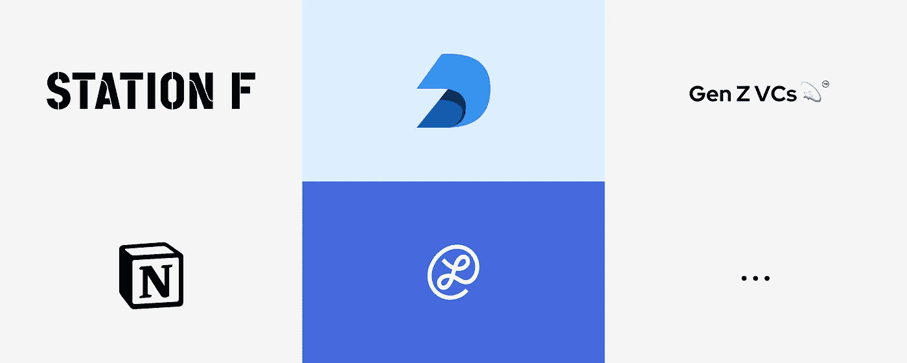
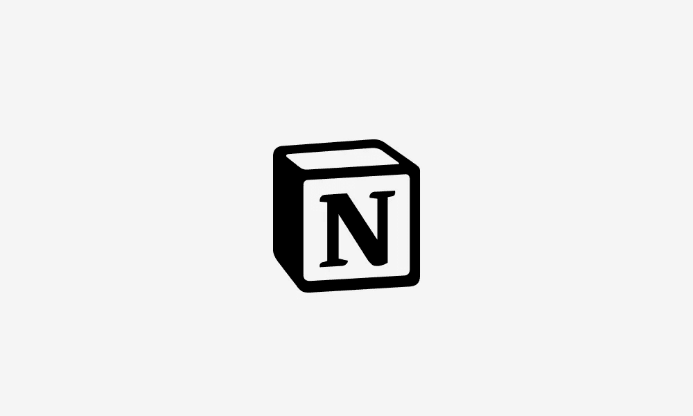
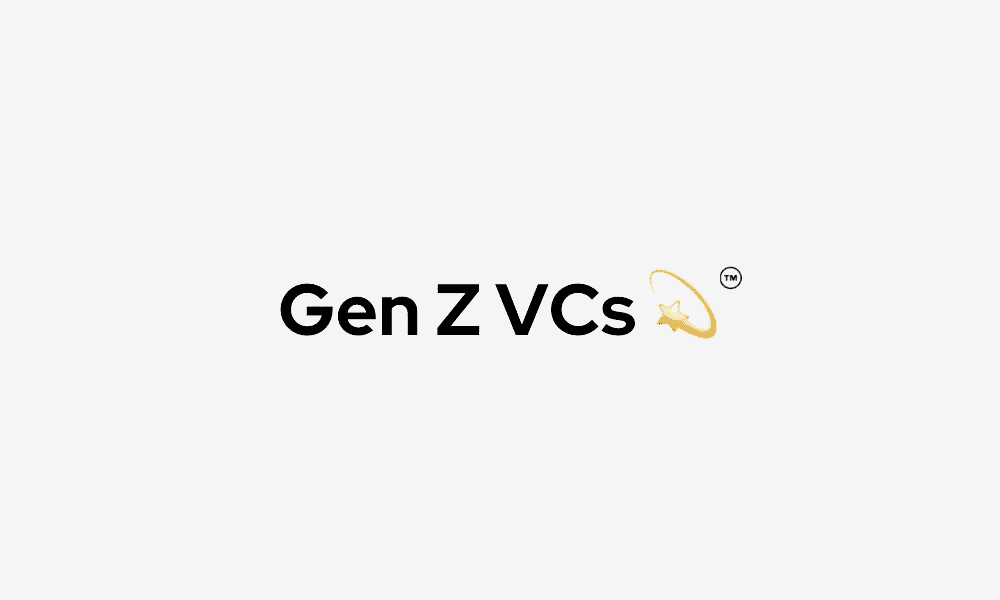

# 在线建立你的关系网

> 原文：<https://medium.com/geekculture/building-your-network-online-545ba7b35ad3?source=collection_archive---------17----------------------->

## 如何在 COVID 世界交朋友

坐在家里很难建立新的联系，但因为 COVID，我们都必须这样做。

一段时间以前，我开始使用不同的东西来扩展我的网络，所以这里有一个我知道和喜欢的社区和服务的简单列表。

Logos of communities or tools I’ve described in this article (Gen Z VCs, STATION F, Notion, Lunchclub)

# 午餐俱乐部

Logo of Lunchclub

这是建立人际网络的最佳工具。

AI 分析你的兴趣和你的联系网络，然后安排与你可能感兴趣的人进行一对一的视频通话。

到目前为止，我已经接到了大约 15 个电话，感觉棒极了。

为了训练这个人工智能，你需要手动“喜欢”和“不喜欢”一个应用程序中的人。

这个社区只接受邀请，所以这是我的邀请链接:[https://lunchclub.com/?invite_code=deniss13](https://lunchclub.com/?invite_code=deniss13)

# 产品社区

## Deepnote 社区

Logo of Deepnote

Deepnote 本身是一个非常强大的机器学习在线集成开发环境:所以这是一个浏览器中的 Jupyter。

这显然是数据科学家的最佳社区之一。地球上几乎任何地方都有许多人在讨论不同的 ML 相关的东西。

这里有 20 个专业小时的代码，还有某处社区的链接:【https://deepnote.com/sign-in?token=c20504b1

## 观念发展

Logo of Notion

概念是一个非常强大的工具，用于存储您的所有数据:报告、图像、带有客户端的表格等等。所以你能想象到的一切都可以储存在那里。

不久前，人们发布了他们的公共 API，现在有一个开发人员使用 API 的社区。

通常问题的主题是用 API 开发东西，但有时你可以看到非常有趣的人在那里开发初创公司(等等)，所以这个 Slack workspace 绝对值得一看。

【https://developers.notion.com/ 

## 诸如此类…

还有很多其他的产品社区。举例来说，就我记忆所及，在一个松散的社区中有一个松散的社区。只要谷歌一下你最喜欢的产品，你就会找到。

# 其他社区

你是知道的

## Z 一代 VC

Logo of Gen Z VCs

我见过的最好的风投社区之一。

有很多(真的，很多)非常有趣的人，包括基金合伙人、年轻的创业者和记者。

观众大多是< 25 (and also there’re those who want to communicate with these “< 25” guys), so be ready to chat with Gen Z folks in their language.

If you’re Gen Z, receive my message:
😎😎🍾💸https://www.genzvcs.com/➡

## F 站国际社区

Logo of STATION F

该社区由一个非常大的法国加速器控制。

很酷的家伙，也很酷的加速器。

[https://stationf.co/](https://stationf.co/)

## 其他的

例如，有一群程序员社区。

此外，还有一些当地社区有类似“柏林创业公司”、“NYCTech”等创业公司。

你可以谷歌一下“程序员社区松弛”，你会发现。

例如，这样的列表之一:[https://medium . com/startupsco/the-full-list-of-400-slack-communities-5545 e 82 cf 65d](/startupsco/the-full-list-of-400-slack-communities-5545e82cf65d)

# 就这样

另一种交友方式是在 Medium 上写文章，在描述中放置 LinkedIn 的链接！:)

我是 Facel 的首席执行官丹尼斯，Facel 是一个神经接口，用于监测一天中的倦怠、压力和其他健康参数。

我们正在筹集种子资金，所以如果你想谈论这些或者 DeepTech 初创公司发展的困难，那么给我写信:【https://www.linkedin.com/in/mixeden/