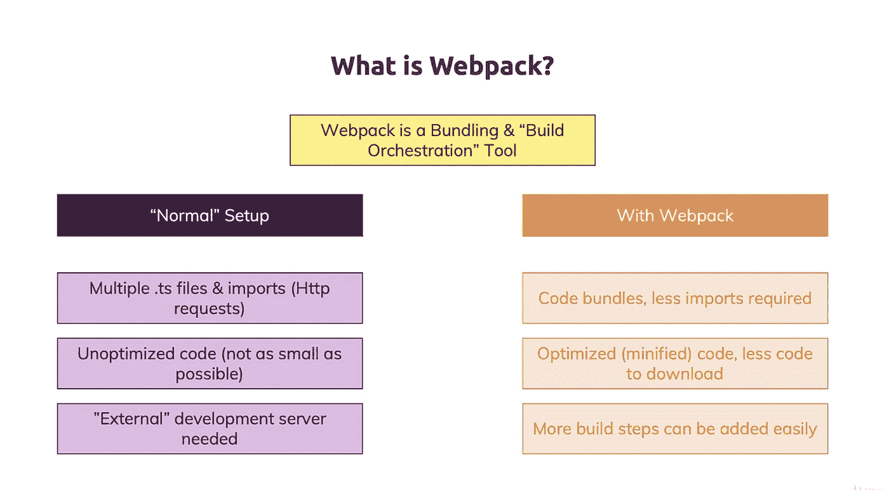
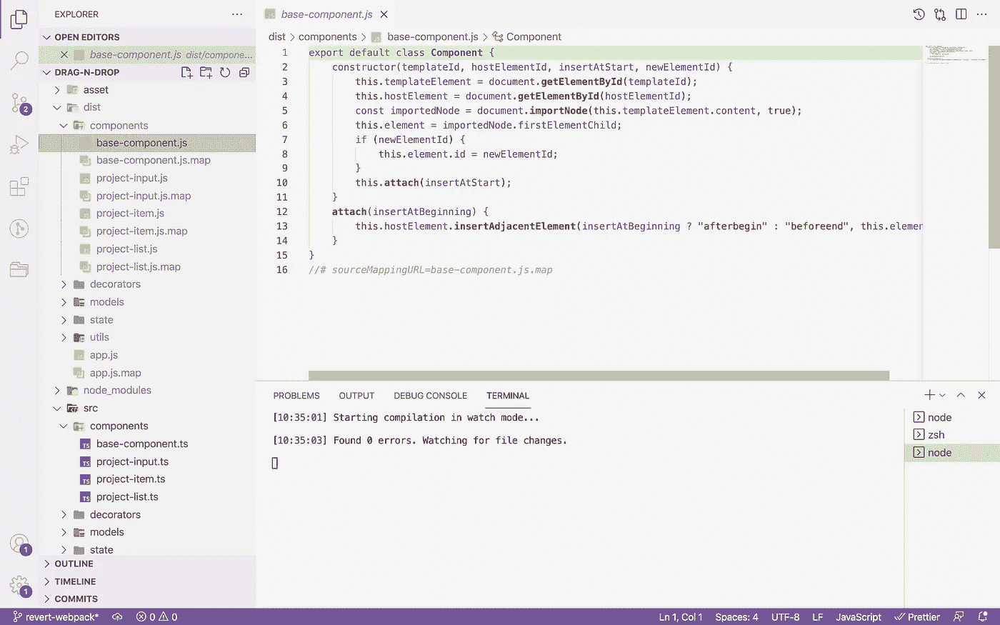
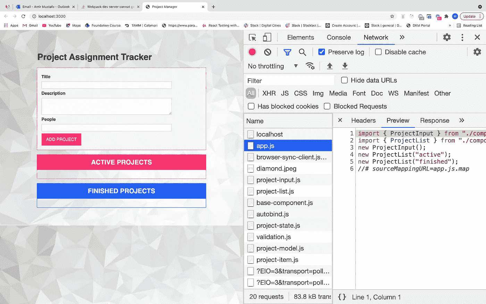
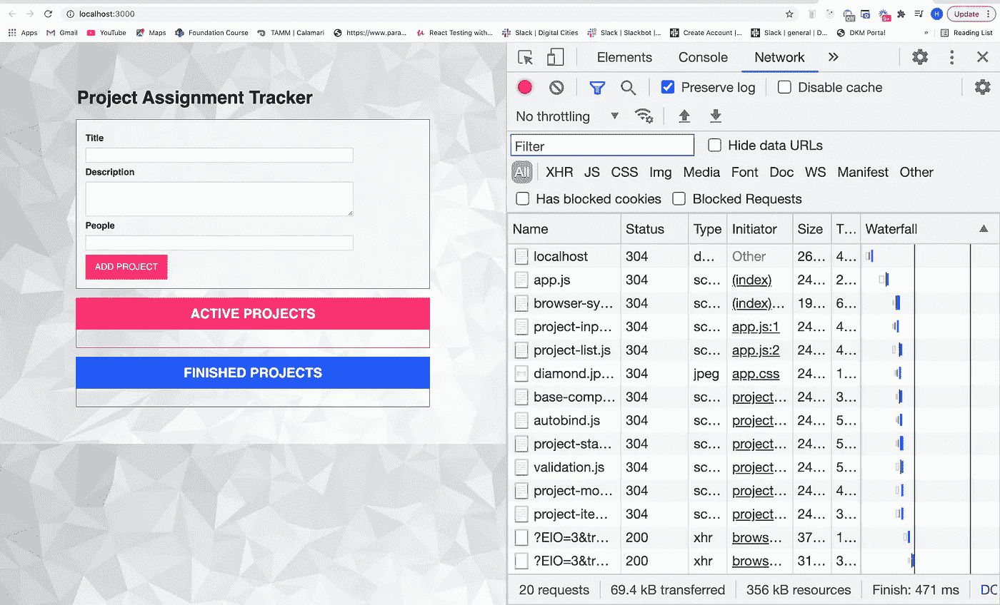
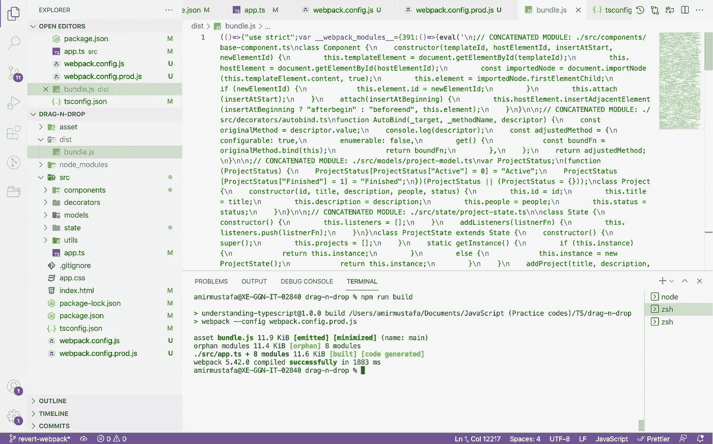
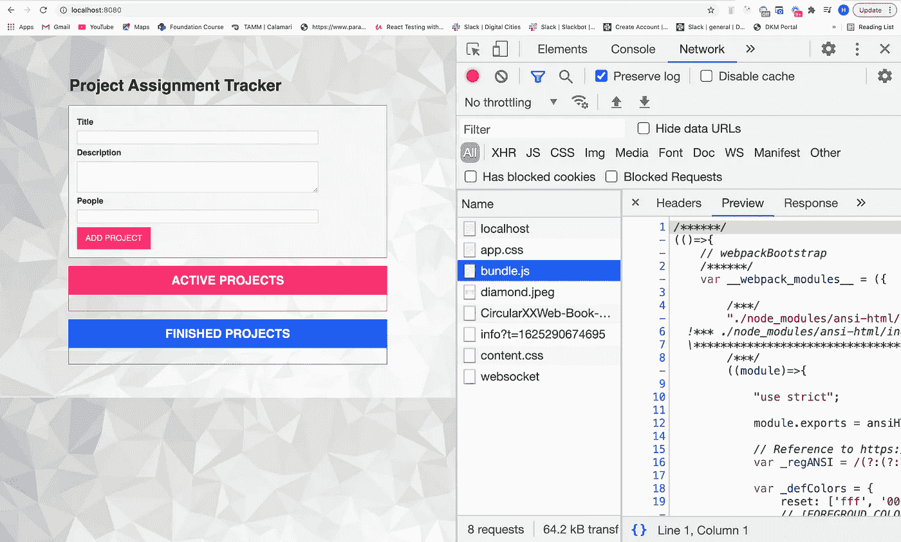
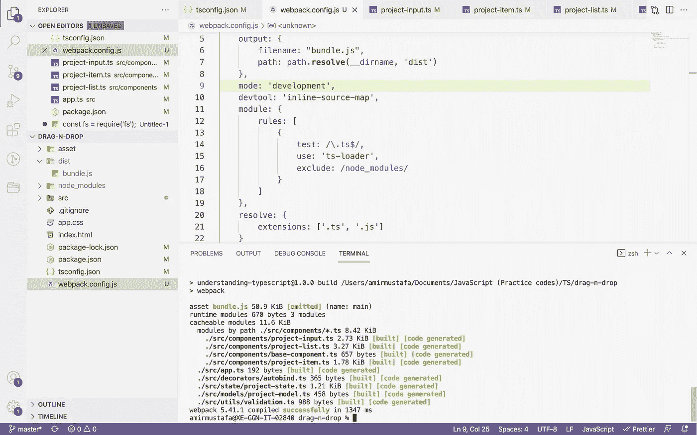
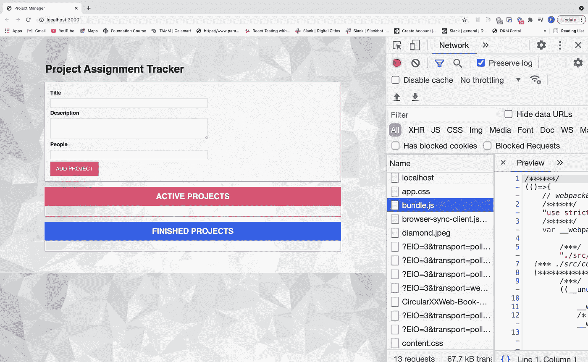
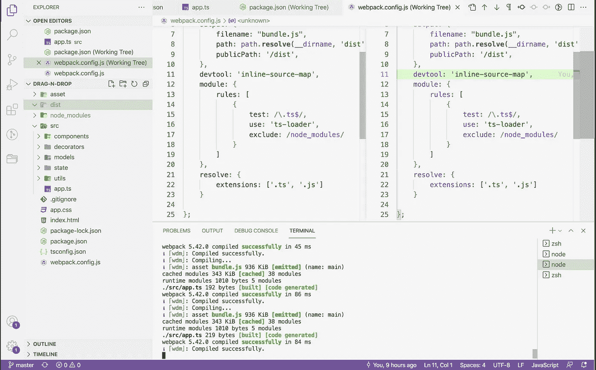
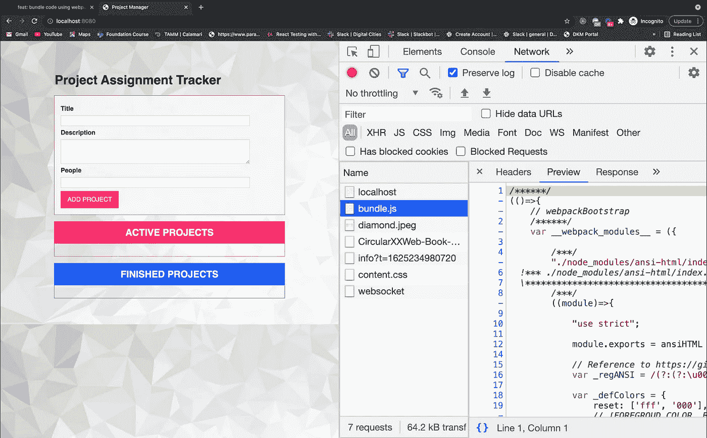

# 使用 Webpack 捆绑代码

> 原文：<https://medium.com/geekculture/bundling-a-code-using-webpack-93eb6fe9ce5d?source=collection_archive---------21----------------------->


# 先决条件:

对 TypeScript 的基本理解。

# 什么是 Webpack？



**→ Webpack** 是帮助我们优化代码性能的代码捆绑工具。

→在一个实时的大项目中，会有很多 ts 文件(可能超过 100 个)。TypeScript 使用`tsc — watch`命令将这些文件转换成 js 文件

→因此将生成相同数量的 js 文件(比如 100 个 JS 文件)。



Multiple files generated inside dist folder

→如果我们观察上面的截图:

这个目录包含了应用程序的所有 tsc 文件

**dist:** 将生成相同数量的 js 文件，这些文件将在浏览器中呈现。



→在上面 chrome 浏览器开发工具的网络选项卡中，我们找到了所有呈现在这里的 JS 文件。

**上述方法的问题:**

a.**多个文件**会调用**多个 HTTP 请求**。**每个电话都需要一段时间才能得到回应。**整体文件响应将花费大量时间，这将**影响站点性能**。

b.我们可以在上面的截图中观察到这个**瀑布标签**。

**白色** **框线:**在 HTTP 请求中告诉我们**等待时间**和

**蓝框线:**是我们得到的的**响应。**

c.这里我们在本地服务器上开发。想象一下，如果我们部署在生产服务器中，页面加载时间会增加更多。

**解决方案:** Webpack

这将在 dist 文件夹中生成一个 bundle.js 文件。

HTTP 调用的数量将是**一个**。因此**总体应用**性能将会**提高**

视频 1: Webpack 安装和一些概述:

最终输出:



Inside



Bundle.js is the only JS file that will be rendered in the browser

让我们开始 Webpack 的开发。

**步骤 1:** 在项目中，终端安装以下插件:

```
npm install — save-dev webpack webpack-cli webpack-dev-server typescript ts-loader;
```

**步骤 2:** 转到 tsconfig.ts 文件

```
"target": "es6", "module": "es2015","sourceMap" true,*// "rootDir": "./src",    // this must be commented*
```

→ **rootDir:** TypeScript 将 ts 文件转换成等价的 JS 文件，并使用这个键保存它。对其进行注释将会停止 JS 文件的默认创建。

→ **目标:**根据浏览器选择，这可以是 es5 或者 es6。

→ **sourceMap:** 这将有助于在浏览器中调试 TS 文件。

→ **模块:**这一定是“es2015”

**第三步:**创建 **webpack.config.js** 。默认情况下，Webpack 会搜索该文件。

此页面遵循 Node js 语法。

```
module.exports = { mode: 'development', entry: "./src/app.ts", output: { filename: "bundle.js", path: path.**resolve**(__dirname, 'dist'), publicPath: '/dist', },` devtool: 'inline-source-map', module: { rules: [ { test: /\.ts$/, use: 'ts-loader', exclude: /node_modules/ } ] }, resolve: { extensions: ['.ts', '.js'] } };
```

解释上面的每个键:

1.  **模式:**这可以是开发，也可以是生产。在生产中，将生成简化的捆绑代码
2.  **条目:**这是应用程序的起始页，这里是 app.ts

3. **output.filename:** 这是将要生成的捆绑文件名(即 bundle.js)

4. **output.path:** 生成捆绑文件的路径。

5. **output.publicPath:**

a.我们将首先使用 **Lite 服务器**来**创建 dist/bundle . js**——因为路径键就足够了。

b.当我们使用 Webpack 服务器时，物理上 dist 目录将是空的，并将来自 webpack 服务器内存。此路径仅在使用 webpack 服务器时添加(通常与路径密钥相同)

6. **devtool:** 开发中—内联源映射，用于生产—可以是无或评估

参考—[https://webpack.js.org/configuration/devtool/](https://webpack.js.org/configuration/devtool/)

7. **modules.rules.test:** 这包含一个规则列表。对于这个应用程序，我们告诉 webpack 哪个监控所有的 ts 文件

8.**模块.规则.用途:**使用 TS 加载器

9.**modules . rules . exclude:**web pack 将忽略监控这里指定的目录。

10. **resolve.extensions:** 在所有的导入语句中，不需要编写扩展名，即 js 和。ts，webpack 会监控它。

**步骤 4:** 转到 package.json 文件

```
{ “name”: “understanding-typescript”, “version”: “1.0.0”, “description”: “Understanding TypeScript Course Setup”, “main”: “app.js”, “scripts”: { “test”: “echo \”Error: no test specified\” && exit 1", “start”: “lite-server”, “build”: “webpack”       // Write this build line},“keywords”: [ “typescript”, “course”],“author”: “Amir Mustafa”,“license”: “ISC”,“devDependencies”: { “lite-server”: “².5.4”, “ts-loader”: “⁹.2.3”, “typescript”: “⁴.3.5”, “webpack”: “⁵.41.1”, “webpack-cli”: “⁴.7.2”, “webpack-dev-server”: “³.11.2” }}
```

**步骤 5:** 现在在终端中运行下面的命令(在项目目录中的三个终端中打开)

```
npm run build // creates bundle.js inside dist directorynpm start     // starts lite servertsc –watch    // Typescript watching
```



→现在我们在浏览器中只看到**一个 bundle.js** 下载，因此**瀑布延迟**

→因此多个页面没有不必要的 HTTP 请求

→在你的 index.html 档案中

```
<script *type*="module" *src*="dist/bundle.js"></script>
```



视频 2:从多个文件转换为一个包。js:

# C.使用 Webpack 服务器:

## 为什么使用 Webpack 服务器？

I .当我们编写代码时，浏览器中的自动刷新就像与服务器反应一样。

二。有了 Lite server，我们习惯一次又一次地点击`npm run bundle`。代码更改后。这里不需要同样的东西。

三。目前 bundle.js 文件创建在 dist 文件夹中。对于 webpack server，不会创建任何物理 bundle.js 文件。这将从 webpack 服务器的内存中呈现。因此，代码更加优化。

我们需要在上面讨论过的 webpack 配置中进行编写。

```
publicPath: '/dist',
```

**第一步:在 package.json 中**

```
"start": "npx webpack serve",
```

您也可以在此处关注这一变化:

[https://github . com/Amir Mustafa/DragNDrop/commit/f 44862849 D4 CD 31d 1089d 34 efb 61 DD 13 C1 ef 079 a](https://github.com/AmirMustafa/DragNDrop/commit/f44862849d4cd31d1089d34efb61dd13c1ef079a)

**第二步:在 webpack.config.js 中**

```
const path = require('path');module.exports = {
    mode: 'development',
    entry: "./src/app.ts",
    output: {
        filename: "bundle.js",
        path: path.resolve(__dirname, 'dist'),
        publicPath: '/dist',     // webpack memory serve - bundle.js
    },
    devtool: 'inline-source-map',
    module: {
        rules: [
```

[https://user-images . githubusercontent . com/15896579/124289049–7e 322380-db6f-11eb-95e 6–17b 5d 2582 f4b . png](https://user-images.githubusercontent.com/15896579/124289049-7e322380-db6f-11eb-95e6-17b5d2582f4b.png)



→现在，当您这次运行`npm start`而不是 lite server 时，webpack server 将运行并打开:8080 端口

→观察:此时 **dist 目录将为空**，文件将从 webpack 存储器中提供

**视频 3:从 Lite 服务器转换到 Webpack 服务器:**

# **D.为生产环境准备 bundle.js**

**在生产环境中，包代码应该是优化的，不可读的。**

**第一步:`npm install clean-webpack-plugin`**

**步骤 2:在 package.json 中，我们将引用新的生产配置文件。**

```
"build": "webpack --config webpack.config.prod"
```

**步骤 3:创建一个新文件 wepack.config.prod.js**

```
const path = require('path');
const CleanPlugin = require('clean-webpack-plugin');module.exports = {
    mode: 'production',
    entry: "./src/app.ts",
    output: {
        filename: "bundle.js",
        path: path.resolve(__dirname, 'dist'),
    },
    devtool: "eval",
    module: {
        rules: [
            {
                test: /\.ts$/,
                use: 'ts-loader',
                exclude: /node_modules/
            }
        ]
    },
    resolve: {
        extensions: ['.ts', '.js']
    },
    plugins: [
        new CleanPlugin.CleanWebpackPlugin() // clear everything, before writing in dist folder
    ],};
```

**→在创建新的 bundle.js 文件之前，清理插件将删除 dist 文件夹中的所有内容**

**→也从输出中删除了`publicPath: ‘/dist’`**

# **结束语:**

**Webpack 在大多数大型应用程序中用于增强代码优化和更快的 web 应用程序加载。**

**我希望你今天学到了一些新东西。这将有助于您开始使用 Webpack。**

> **谢谢你一直坚持到最后🙌。如果你喜欢这篇文章或者学到了新的东西，请点击下面的分享按钮来支持我，让更多的人了解我和/或在[*Twitter*](https://twitter.com/amir__mustafa)*上关注我，看看我在那里学到和分享的其他技巧、文章和东西。***