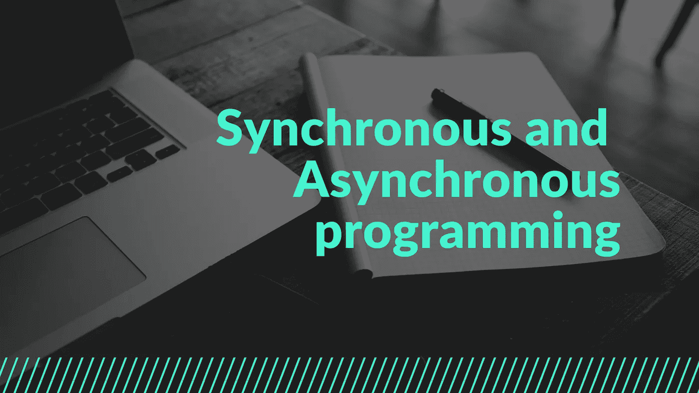
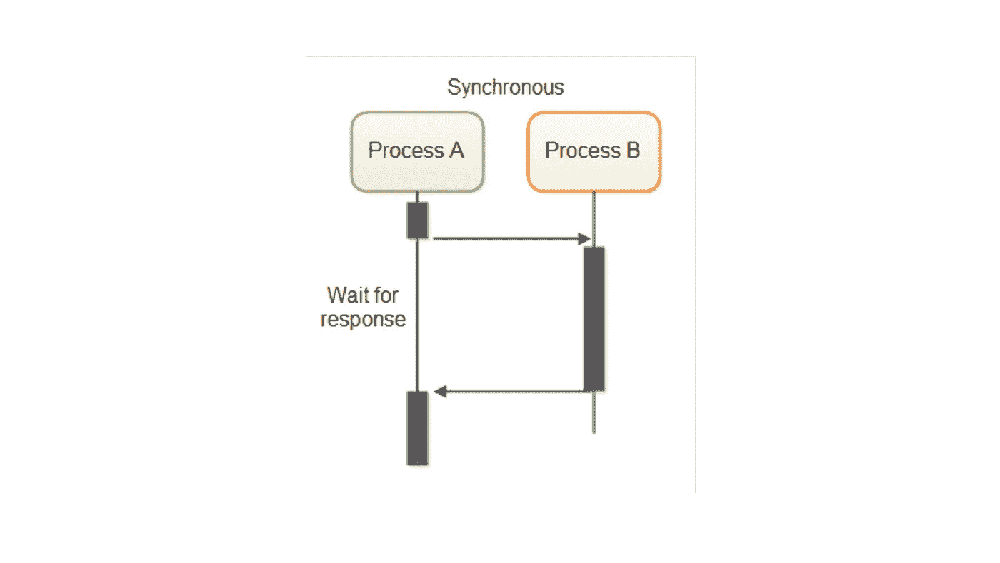
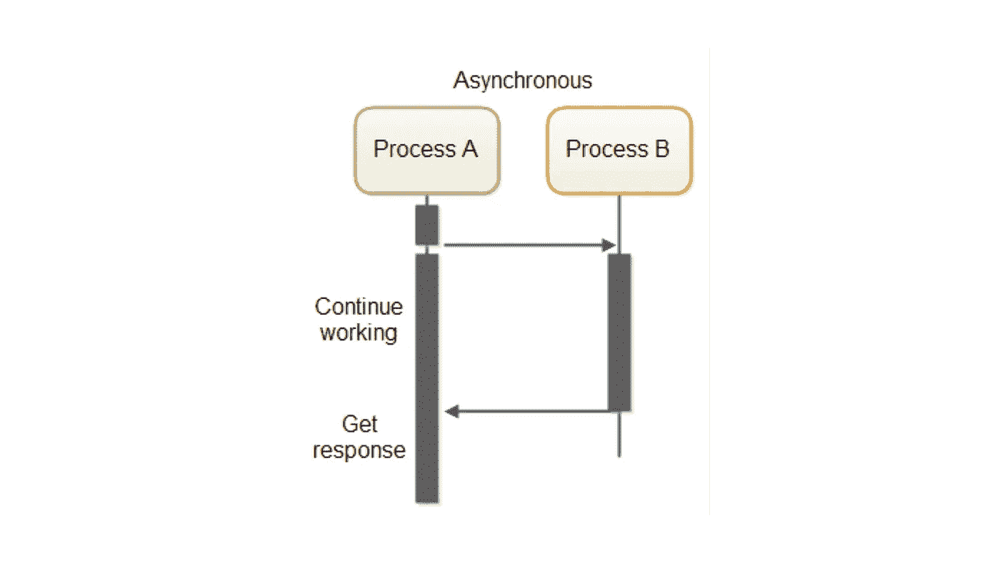
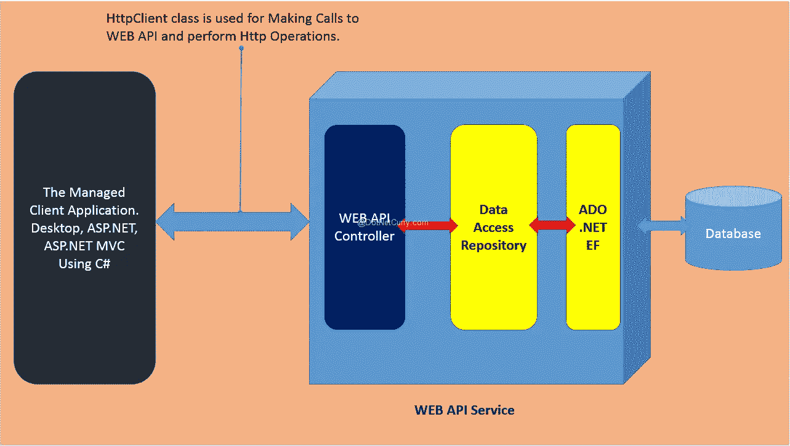

# 但是什么是同步和异步编程呢？

> 原文：<https://medium.com/geekculture/but-what-is-synchronous-and-asynchronous-programming-86d1e92471c?source=collection_archive---------22----------------------->



回调、承诺和异步等待…这些是什么？我们为什么需要它们？如果你是一个新手，很容易被这些术语弄糊涂。所以让我们一劳永逸地结束这种混乱，把它分成更小的、更容易理解的概念。

让我们从弄清楚什么是同步和异步编程开始。

## 同步编程



Source: [https://medium.com/from-the-scratch/wtf-is-synchronous-and-asynchronous-1a75afd039df](/from-the-scratch/wtf-is-synchronous-and-asynchronous-1a75afd039df)

在同步程序中，任务**一次执行一个，只有当一个任务完成**时，下面的任务才被解除阻塞。换句话说，你需要等待一个任务完成才能进入下一个。

```
console.log("Hello,") //Instruction 1const syncExample=()=>{console.log("How are you?") }syncExample()//Instruction 2console.log("World.")//Instruction 3
```

因为 javascript 是单线程编程语言，即它逐行读取代码并按顺序执行，所以上述同步代码片段的输出如下。

```
Hello,
How are you?
World.
```

正如 javascript 编译器所预期的，首先读取并执行指令 1，然后是指令 2 和指令 3。

## 异步编程



异步编程允许您执行并行编程。这样，您可以在不阻塞主进程/线程的情况下执行该工作。

在下面的代码片段中，我修改了前面的代码，并通过添加操作 setTimeout 使其异步。有几个异步函数，如 ClickListener、fetch、setInterval 等。那也可以用。

```
console.log("Hello,"); //Instruction 1const asyncExample = () => {setTimeout(() => {console.log("How are you?");}, 3000);};asyncExample(); //Instruction 2console.log("World."); //Instruction 3
```

你能猜出上面的输出吗？根据我们对 javascript 行为的了解，应该首先执行指令 1，然后在等待 3 秒后执行指令 2，最后执行指令 3。对吗？

不完全是。实际输出如下。

```
Hello,
World.
How are you?
```

这里发生了什么？为什么 javascript 行为不端？

其实不是的。

Javascript 简单地将其异步操作发送给 WebAPI，反过来，WebAPI 跟踪 setTimeout 函数中的计时器。所以基本上，当 JavaScript 编译器遇到异步函数时，它只是将执行上下文弹出到 WebAPI，并继续执行其主函数。从而同时执行两项任务。



Source: [https://www.dotnetcurry.com/aspnet/1192/aspnet-web-api-async-calls-mvc-wpf](https://www.dotnetcurry.com/aspnet/1192/aspnet-web-api-async-calls-mvc-wpf)

但是，如果我们希望在主执行上下文中使用异步函数的结果，该怎么办呢？这就是问题所在。

让我给你看一个例子。

```
console.log("Hello,"); //Instruction 1const asyncExample = (givenName) => {setTimeout(() => {console.log("Execution of function.");return { name: givenName };}, 3000);};console.log(asyncExample("Puja")); //Instruction 2console.log("World."); //Instruction 3
```

由于 setTimeout 函数，asyncExample 在执行 3 秒钟后返回其输出。上述代码片段的输出是

```
Hello,
undefined
World.
Execution of function.
```

由于调用 asyncExample 函数时它仍在运行，编译器返回一个“未定义”的输出。最后，当 setTimeout 函数运行完毕时，我们得到控制台日志输出“函数的执行”在 asyncExample 函数内部。有几种方法可以解决这个问题:允许异步函数完成它的执行，然后在函数调用中检索数据。

在我的下一篇文章中，我将讨论回调、承诺和 async-await，它们有助于处理异步代码的问题。

你好，希望你喜欢这篇文章。我是 Puja，一个正在发展中的开发者。研究和写这样一篇文章需要做很多工作，还需要鼓掌或关注👏从你开始意味着整个世界🌍对我来说。对你来说不到 10 秒，对我来说也是伸手可及！你也可以问我任何问题，或者指出任何事情，或者只是说声“嘿”👇在下面。