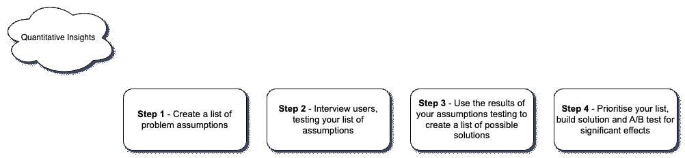
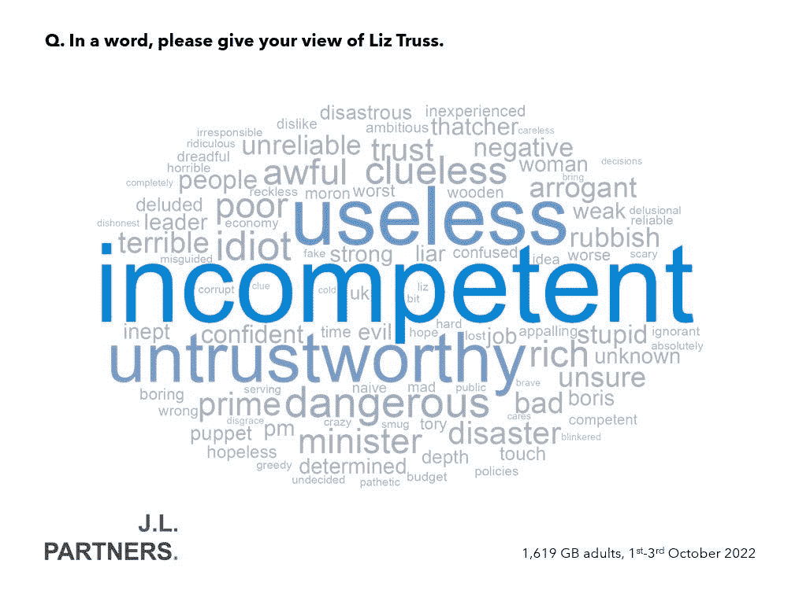

# 但是为什么呢？

> 原文：<https://medium.com/geekculture/but-why-2ab531f716dc?source=collection_archive---------12----------------------->

帮助人性化数据的五种定性方法

Photo by [Gift Habeshaw](https://unsplash.com/@gift_habeshaw?utm_source=medium&utm_medium=referral) on [Unsplash](https://unsplash.com?utm_source=medium&utm_medium=referral)

首先，一个简短的问题。特征重要性算法或 ML 模型解释器告诉你，25 岁以下的男性是最有可能从你的产品中流失的群体。以下哪一项你更有可能去做？

*a)接触年龄在 18-25 岁的不同男性群体，与他们交谈，观察他们使用你的产品的情况，了解他们为什么最有可能流失。*

*b)假设年轻人很容易厌倦，那可能就是原因。推荐保持新颖的特性增加/改进。*

老实点！其中一个选项比另一个选项要快得多，花费的精力也少得多，而刻板印象的存在往往是有原因的。但是如果我们想更好地理解会发生什么呢？如果我们想用一些更友好的定性数据来备份我们的定量数据呢？

定性方法(或用户研究)和定量方法(或数据和分析)通常是相互分离的。在许多组织中，他们位于完全不同的团队中，很少两个人会碰面。几乎一直以来，它们都是由不同的人执行的，从事不同的项目，两者之间没有系统的思考。但是为什么呢？

定量和定性方法协调工作可以带来深度、复杂性和丰富的洞察力，从而为组织带来价值。把他们分开似乎是一种耻辱。

有许多不同的方法将它们结合在一起，但我将集中讨论五种对我很有效的方法——假设测试、内容分析、可用性测试、上下文开发和人种学。

# 假设测试

Photo by [Maxim Hopman](https://unsplash.com/@nampoh?utm_source=medium&utm_medium=referral) on [Unsplash](https://unsplash.com?utm_source=medium&utm_medium=referral)

想象一下这个场景。你一直在分析你的应用程序上用户的留存率，并发现了一个非常重要的见解——在应用程序上与他人联系的用户被留存的可能性是其他用户的 5 倍。

兴奋地，你与高级管理团队分享你的发现，在反复思考一些想法后，你们一起策划了一个计划，通过向那些邀请其他人注册并与他们联系的用户提供促销代码来增加合作。你运行了几个星期的 A/B 测试，花了几千美元的推广代码，然后等待结果。结果出来了，出乎意料。促销代码在连接率上没有产生显著差异。悲伤但现实，你转移到下一个话题。A/B 测试通常不会显示出显著的结果，也许您会在以后的某个时间点回到用户连接。

听起来熟悉吗？这就是一些定性研究有用的地方。尽管与该领域更广泛的专家群体交流想法并不是一个坏主意(在早期黑暗的日子里，我常常在没有任何咨询的情况下独自提出建议)，但仅仅基于数字提出解决方案会错过一些步骤。一个更好的主意不是假设解决方案，而是想出一个当前连接方式的假设问题列表。这将包括用户动机(导致促销代码)，但也可能包括其他事情，如发送和接受邀请时的摩擦。有了这个列表，我们就可以和不同的用户群聊天，并和他们一起测试我们的假设。这种做事方式基于一种叫做[设计思维](https://www.interaction-design.org/literature/article/what-is-design-thinking-and-why-is-it-so-popular)的过程，这是一种让创造力更加系统化的真正有用的方法论，尤其是如果你像我一样，身体里没有创意的骨头！

回到我的场景，在 A/B 测试失败后，我没有继续前进，而是回到了这个我在兴奋中已经忘记的方法。与同一个团队合作，我们为可能出现的问题提出了一系列假设，并去我们的用户参考小组进行测试。事实证明，人们发出邀请并不需要额外的动机，他们喜欢我们的应用程序，并乐意向他们认识的每个人推荐它！阻碍连接率的事情实际上是很难找到邀请按钮，隐藏了 3 层菜单。通过把这个放在前面和中间，一个几乎太琐碎的(和免费的！)修复后，我们的连接率飙升，总体保留率增加了两倍。

下图总结了上述过程。从定量洞察和假设列表开始，有助于我们将重点放在定性方面，并确保这两种方法完美地结合在一起。

# 内容分析

我在定量分析人员中最常看到的定性分析类型，很可能是因为它通常涉及到将定性分析转化为数字分析。内容分析是一个广泛的领域，从特定单词或主题的简单计数(通常在单词云中可视化)，到将文本转换为嵌入内容，以便它们可以像任何其他定量数据一样进行处理(例如聚类)。在我的直接经验中，有两种技术工作得特别好，上面概述的单词云方法和用于监控情感和特征领域趋势的主题建模。

## 单词云

“云”这个词是一个看似简单的技术，这意味着有时它的力量会被低估。文字云可视化得到了公众的广泛认可，可以用少量的文字快速传达为什么定量数据显示了它所显示的内容。例如，在撰写本文时(2022 年 10 月 13 日)，英国执政党的民调支持率急剧下降。其中一项民意调查还要求用一个词来形容现任首相，如下所示。只需几句话，就能清楚地知道问题所在，并让保守派立即知道他们需要把工作重点放在哪里。

Word cloud from JL Partners — [Link](https://mobile.twitter.com/jamesjohnson252/status/1577354669411688453/photo/1)

这种技术可以很容易地应用于多种不同的用途，例如应用程序或组织的情绪跟踪。这个过程中最重要的部分是获取你的用户或你所关注的用户群的代表性样本。剩下的就简单了。有无数的工具和库可用，比如 python 中的 **wordcloud** 库。

除了一个单词的调查答案之外，单词云还可以用于对较长文本的探索性分析，如面试成绩单。它们可以帮助您识别文本中可能的主要区域和主题，或者在进行更深入的分析之前可能需要删除的附加停用词。

从较长的文本片段中创建一个有用的单词云需要一点额外的工作。加载完文本后，您需要删除停用词，即在一种语言中无论上下文如何都会出现的词(例如，and、I、the、in、on…)。有很多用于删除这些单词的库， **Spacy** 和 **NLTK** 是 Python 中最好的两个库， **Stopwords** 在 r 中也不错。一旦你删除了常见的 Stopwords，你可以尝试通过你的单词云可视化来运行你的脚本。然而，你可能会发现有更多上下文相关的停用词(例如，应用程序、电话、笔记本电脑等。)不提供有价值的信息，需要删除。

你可能还会发现，有些词是由一个以上的词组成的，它们被错误地分割开来，单独计算。例如，上面 Liz Truss 的单词 cloud 对单词 **Prime** 有计数，对单词 **Minister** 有计数，而显然这些应该连接在一起，因此会有不同的计数。这些术语在技术上被称为双字母组，或三个单词短语的三字母组。同样，上面的库可以用来自动检测文本中的二元和三元语法，同时你也可以手动添加那些没有检测到的。像这样运行和提炼你的单词云应该会带来更有价值和更强大的视觉化。

## 主题建模

主题建模是一种无监督的方法，用于将多段文本分组为特定的主题。在我从事数据工作的时候，我看到它在生成和跟踪支持票的主题方面发挥了惊人的作用。

主题建模首先计算单词和词组在每篇文章中出现的频率。然后，这些计数可以表示为一个大的数字图，该图可以输入到算法中，以确定特定的主题以及每段文本属于这些主题中的每一个的概率。

它比单词云稍微复杂一点，但是有很多相同的准备工作，包括停用词和二元语法。我们通常还可以通过引入一个称为[lemma tion](https://nlp.stanford.edu/IR-book/html/htmledition/stemming-and-lemmatization-1.html)的过程来提高模型的性能，其中具有多种形式(例如但不限于动词)的单词可以用一个术语来表示，例如，play、playing、played player 都可以作为 play 输入到模型中，而不会丢失单词的含义。与所有其他预处理一样，Python 中的 **NLTK** 库在这方面非常出色。

预处理之后，我们给文本组中的每个单词和文本分配权重，这个过程叫做 [TF-IDF](https://towardsdatascience.com/tf-idf-for-document-ranking-from-scratch-in-python-on-real-world-dataset-796d339a4089) 。这些权重的计算方法是，单词在单个文本中出现的次数除以该单词在所有文本中出现的次数。这意味着在特定文本和所有文本中多次出现的单词的权重低于在特定文本中多次出现但在其他文本中不太常见的单词。因此，这量化了特定单词对单个文本的重要性。

有了单词和文本的加权矩阵，我们现在可以计算出如何将文本分组在一起。这方面的最佳算法是[潜在目录分配](https://towardsdatascience.com/latent-dirichlet-allocation-lda-9d1cd064ffa2)(简称 LDA)。LDA 是一种聚类模型，其工作原理是根据不同文本共享的重要单词对它们进行分组，并根据它们一起出现的频率对单词进行分组。将这些组组合在一起创建最终的主题组，每个主题组由一组重要的单词(加上相似的单词)和文本组成，这些文本根据它们包含的重要单词的数量被分配给一个主题。

例如，对于一个应用程序的支持票，一个主题可以围绕注册之旅，包括注册、登录、电子邮件、密码等术语。，而另一个主题可能包括照片、照相机、图片、滤镜等等。支持票可能包含文本“你的注册过程是一个痛苦的屁股！我必须输入我的电子邮件和密码 4 次，然后一旦完成，它就自动将我注销。你真幸运，照片滤镜很棒！”在那张票里有两个主题的关键词，但是直觉上我们知道它属于哪个主题。基于特定单词的频率，算法也是如此，并且它将分配更高的概率给作为主题一的一部分的票据。

就像常规聚类一样，我们可以通过使用一致性分数计算出最佳主题数量来微调我们的 LDA 模型，一致性分数衡量每个组中重要单词之间的相似性。最佳组数是产生最高一致性分数的组数。

# 可用性测试

Photo by [freestocks](https://unsplash.com/@freestocks?utm_source=medium&utm_medium=referral) on [Unsplash](https://unsplash.com?utm_source=medium&utm_medium=referral)

可用性测试是一个简单的过程，要求用户执行特定的任务并记录他们的反应，通常还要求他们讲述他们的感受和思维过程。根据我的经验，可用性测试是最流行的用户研究形式，这是有充分理由的。这可以通过电子邮件、视频电话甚至专业软件来轻松实现。它专注于要求用户做非常具体的任务，所以非常一致和可重复。它甚至可以自动化，因此是定性研究中最可扩展的形式之一。

一个例子可能是要求用户拍一张照片并与朋友分享。从我们得到的回应中，我们可以看到用户旅程中的问题在哪里，哪些事情做得很好，以及用户对这个过程的感受。作为一种可扩展的方法，我们可以将这个任务发送给许多用户，并开始获得关于我们如何改进特定功能的代表性见解。一种收集定性数据的快速而有效的方法。

# 语境发展

Photo by [Markus Spiske](https://unsplash.com/@markusspiske?utm_source=medium&utm_medium=referral) on [Unsplash](https://unsplash.com?utm_source=medium&utm_medium=referral)

在我看来，美国数据人员犯的最大错误之一是经常忘记正常人不像《黑客帝国》中的代码那样看待世界。人们喜欢景象、声音和气味，最重要的是(感谢人类的进化)，故事。看看下面两个相同数据点的演示-

*   *我们的梯度推进决策树模型显示，平均而言，40 岁以上的男性流失的可能性要高 24%。*
*   *“不幸的是，这个应用对我来说不再有用了。我想我已经太老了。我最不想让人们看到的就是我的老脸照片，从我现在得到的回应来看，他们也不想看到。”* —罗伯特，45 岁。

哪个效果更好？你认为你的同事在改进事情或提出解决方案时，脑子里最有可能记住哪一个？一次又一次的事实表明，人们对故事的参与度更高，记忆也更好。正如您在示例中所看到的，潜在的信息来自相同的量化数据点，但现在它只是更加充实和人性化了一点。欢迎来到上下文开发的世界！

上下文开发与上面的假设测试有很多相同的特征。重要的是，我们收集和使用的定性数据与硬数字相关联，以避免以“舆论”或轶事证据结束，这些证据不能代表你所关注的更广泛的人群。出于同样的原因，从我们感兴趣的每一个群体中找到足够数量的人进行交流也很重要。尼尔森诺曼建议从每组 5 人开始，然后再增加 5 人，如此类推，直到新的见解开始枯竭，我们不断听到相同的东西。在现实世界中，时间和精力的限制(但通常没有预算，用户通常很乐意为一杯咖啡的价格或免费的视频通话提供意见)，通常会限制我们与多少人交谈。然而，尽可能广泛地接触有代表性的人群总是最好的选择。

访谈是为背景发展收集定性数据的主要方法。只要记得记录下来，在视频通话中很容易，因为这意味着你可以用类似[耳语](https://openai.com/blog/whisper/)或谷歌内置的转录工具轻松转录它。其他方法，如调查中的自由文本字段也是可用的，但是，任何人只要发送一份调查就能告诉你人们对自由文本问题的反应如何！最后，如果你有时间，民族志或实地研究(将在下面详细讨论)也是为此目的收集数据的有用方法。

一旦你安排好了你的人，你就需要和他们谈谈。像假设测试一样，你需要一个集中的对话，但是不像假设测试，你不需要太集中。坚持以先前的定量分析为基础的广泛话题。你想要一个更自由的对话，而不仅仅是给出一系列假设。例如，您可能想要谈论您的产品团队正在改进的应用程序的特定功能，或者您可能想要与他们谈论您的产品帮助他们完成特定任务的整体流程。提出开放式问题，为了用户的利益，尽量减少你的发言时间。

一旦你和足够多的人交谈过，就该寻找模式了。首先列出每个采访记录中出现的主题，然后在你采访的人中寻找这些主题的模式和相似之处，同时将它们与你的量化见解进行匹配。例如，定量数据显示，某个特定群体有 20%的可能会流失，而在该群体的访谈中反复出现的主题是，您的产品无法帮助解决他们流程中的关键问题。这让你不仅能理解发生了什么，还能理解为什么会发生，以及一个讲述统计上可靠的数据故事的宝库。

作为一个在一家帮助音乐家创作音乐的公司工作的人，我很幸运，和创作者谈论他们的工作是令人惊讶的。但即使你的用户不是专业音乐人，了解用户如何以你从未想过的方式参与你的产品或服务也是很有趣的。在这些对话中，可能会出现可以转化为快速成功的小抱怨。

# 民族志

Photo by [charlesdeluvio](https://unsplash.com/@charlesdeluvio?utm_source=medium&utm_medium=referral) on [Unsplash](https://unsplash.com?utm_source=medium&utm_medium=referral)

到目前为止，所有的方法都依赖于人们告诉我们他们在做什么，大多是以调查或采访的形式。另一方面，民族志记录了人们实际做的事情，这些事情往往与他们所说的不同。有各种各样的人种学方法，但我将集中讨论最受欢迎的一种——实地研究。

人种学来自人类学的学术领域，有一个非常成问题的过去(有时是现在)。这是一个[道德考量](https://interpreting-ideas.com/2017/09/19/ethical-concerns-before-during-and-after-ethnographic-research/)会出现的领域，正确对待这些道德考量很重要。

人种学非常有用，因为它允许我们观察用户在自然环境中如何与我们的产品互动。这有助于我们更好地了解我们的用户，以及他们如何以我们可能没有想到的方式使用产品，或者他们可能有什么例程或解决方法。人种学倾向于在洞察收集过程的早期出现，因为它们比假设测试等方法给我们提供了更广泛的背景洞察。它们通常通过发现人们如何使用产品来启发定量研究或进一步定性研究的方向。

## 实地研究

当你让人们想象研究人员在用户的自然环境中观察用户时，他们通常会想到实地研究。研究人员变成了“墙上的苍蝇”,详细记录用户行为。在我的工作中，这可能包括在歌曲创作环节或录音棚中观察用户。对于一家超市来说，这甚至可能是观察人们在家的情况、准备饭菜或写购物清单。目的是更深入地了解你的用户和他们的过程，以及他们使用你的产品的环境是如何影响他们的。再次强调，尽可能多的组织一个有代表性的团体是很重要的，这有助于让你相信你的发现可以应用到其他人身上。

和其他任何研究方法一样，你需要在开始之前设定一些目标。我发现，通常最好不要把你的目标和你产品的特定特性联系起来，而是把注意力放在那些特性应该达到的结果上。例如，与其以观察用户如何使用应用程序的歌词功能为目标，不如观察用户如何写歌。通过这种方式，您可以考虑用户在这个过程中可能使用的、您没有考虑到的任何其他功能或解决方法。

一旦你的目标下来了，就该观察了。通常，最可取的方法是尽可能不引人注意，以便用户自然地行动(虽然不总是这样，但您可能希望引导用户到特定的主题)。然而，这是真实的世界，这在物理上是不可能的。你的存在会有意或无意地改变行为，人们可能会觉得有必要更多地使用你的产品，或者做出其他改变。在设计实地研究和分析结果时，努力减轻这些行为变化是有帮助的。这可能包括在向人们介绍你的产品之前，不关注产品的使用量，或者不使用实地研究来观察人们的过程。

对于观察，经典的方法是写实地笔记。这些笔记是对用户的详细描述，用户做了什么和说了什么，以及他们交互的环境。这些往往可以与现代技术强有力地结合起来。例如，如果你的产品是基于浏览器或应用程序的，软件如 [Hotjar](https://www.hotjar.com/) 、 [Mixpanel](http://mixpanel.com) 或 [Google Analytics](http://analytics.google.com) 可以记录用户所走的精确时间标记路径，然后可以在以后访问这些路径，并与你对环境的记录进行比较。你也可以拍照和录音，数据越多越好！

一旦你的观察会议结束，你就可以开始分析你的笔记和你收集的任何其他数据。像上面的其他方法一样，有很多方法可以做到这一点。例如，您可能想要搜索与您的研究目标相关的模式或经常出现的主题或问题，或者您可能想要将您观察到的内容与定量见解进行匹配，或者您甚至可能想要将其与您或其他人以前创建的定性见解进行比较。无论你选择哪一个，你都应该有希望获得丰富的洞察力和对用户体验更深刻的理解。

# 结论

Photo by [Miha Arh](https://unsplash.com/@arhmi?utm_source=medium&utm_medium=referral) on [Unsplash](https://unsplash.com?utm_source=medium&utm_medium=referral)

年复一年，我参加的每个会议或演讲，我都听到同样的话——“数据是新的石油”。但对我来说，数据更像黄金。将原始数据提炼为有价值和可用的形式需要大量的工作，就像将岩石提炼为精炼的黄金一样。在这种状态下，它已经有了价值，人们可以用它来工作。

定量洞察就像金条一样。这些往往有巨大的价值，可以用于许多不同的事情，但不一定是他们的最终形状。

因此，定性的见解赋予我们的数据以意义和形式。它们告诉我们人们为什么以及如何以他们的方式做事，并以他们渴望的方式想要事情。结合我们的纯金洞察力，我们可以创造人们真正珍惜的东西。