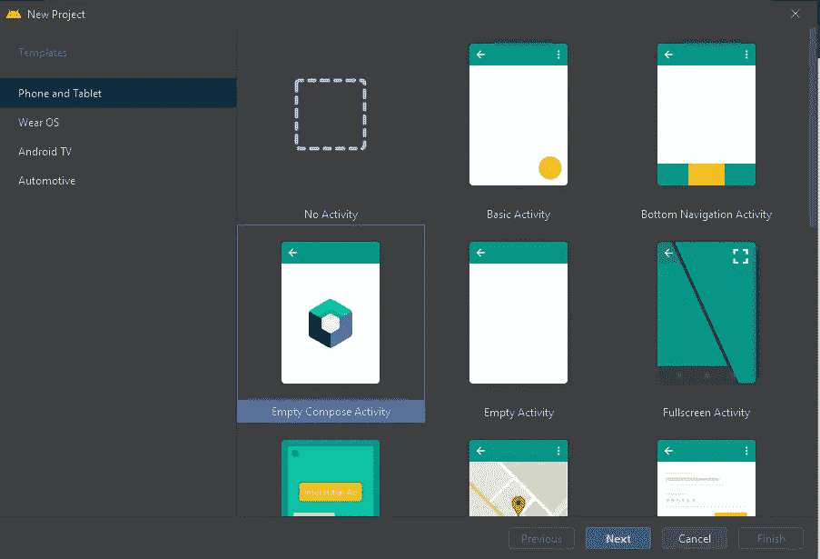
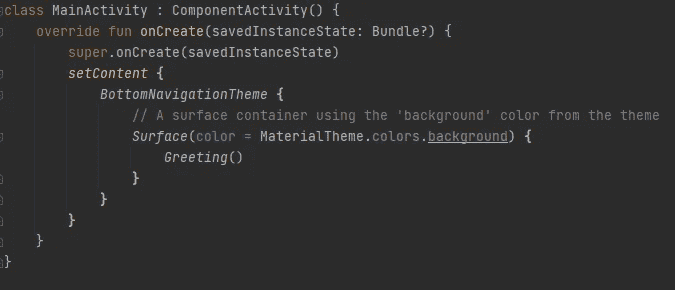

# Jetpack 编写 Android 中的按钮选择器

> 原文：<https://medium.com/geekculture/button-selector-in-jetpack-compose-android-fb77a37d03e8?source=collection_archive---------10----------------------->

众所周知，按钮是 android 的基本视图组件。我们几乎在应用程序的每个屏幕上都使用按钮。但有时我们可以定制 android 按钮来满足我们的应用程序 UI/UX。通过创建一个 drawable 并在按钮 Xml 标签中设置它，我们可以很容易地改变按钮背景，甚至改变按钮背景颜色。但是我们知道 Jetpack compose 是 Xml 的替代品，所以我们需要使用 Composable 函数来应用形状或更改按钮背景颜色。

在本教程中，我将向你展示当用户使用 jetpack compose 中的 composable 函数按下按钮时，如何改变按钮的背景颜色。要使用 jetpack compose，您需要使用带有橙色图标的 android studio 北极狐，因为 jetpack compose 目前不支持我们主要用于开发 android 应用程序的 android studio 蓝色图标。Jetpack compose 是基于 kotlin 语言构建的，所以我假设你熟悉 kotlin 语言。

# 首先，我们需要创建一个新项目

您需要选择空的撰写活动，以便 android studio 将负责重要的库和一些重要的功能，这些功能对于 jetpack compose 应用程序是必要的。



然后在完成创建你的项目后，你将能够看到 activity 类在 onCreate 函数中有一些预先写好的可组合函数，在你的例子中，BottomNavigationTheme 将随着你的项目名而改变，主题是 postfix 文本。Surface 是一个容器，您可以在其中定义可组合函数来显示您的应用程序内容。



```
*setContent* **{** *BottomNavigationTheme* **{** // A surface container using the 'background' color from the theme
        *Surface*(color = MaterialTheme.colors.background) **{** *Greeting*()
        **}
    }
}**
```

下面是 android studio 预先编写的问候功能，我只是修改了它，这样我就可以向你展示当用户按下它时，你如何改变按钮的背景颜色。这个函数应该用@Composable 注释，这样它就可以在上面写的表面体中被调用。

您需要用 remember { MutableInteractionSource()}声明变量，以便您的应用程序能够记住按钮的当前状态。之后，我创建了一个 isPressed 变量，这样我就可以知道按钮是否被按下。
我创建了另一个变量，这样我就可以根据 isPressed true 或 false 来设置它的值。

在 Jetpack compose 中，列充当线性布局，这就是为什么我用一些修改器创建它。修饰符用于在视图上设置不同种类属性，如高度、宽度、填充等，就像我们在视图的 Xml 标签中声明属性一样。在栏内，我用一些修饰符和文本创建了按钮。


```
@Composable
fun Greeting() {

    val interactionSource = *remember* **{** *MutableInteractionSource*() **}** val isPressed by interactionSource.*collectIsPressedAsState*()
    val color = if (isPressed) Color.Blue else Color.Green

    *Column*(modifier = Modifier.*fillMaxHeight*()
        .*fillMaxWidth*()
        .*background*(Color.White)
        .*padding*(20.*dp*),
        verticalArrangement= Arrangement.Center) **{** *Button*(
            onClick = **{}**,
            interactionSource = interactionSource,
            colors= ButtonDefaults.buttonColors(backgroundColor = color),
            modifier = Modifier.*fillMaxWidth*()
                .*height*(50.*dp*)
        )**{** *Text*(
                "Button",
                color=Color.White
            )
        **}
}**
```

如果你想了解更多关于 jetpack compose 的信息，请访问:
【https://developer.android.com/jetpack/compose 