# 2022 年便宜买企业 IT 设备

> 原文：<https://medium.com/geekculture/buy-enterprise-it-equipment-cheaply-in-2022-4356a4e20d46?source=collection_archive---------8----------------------->

## 如何为自学和生产购买便宜的 IT 设备的指南。

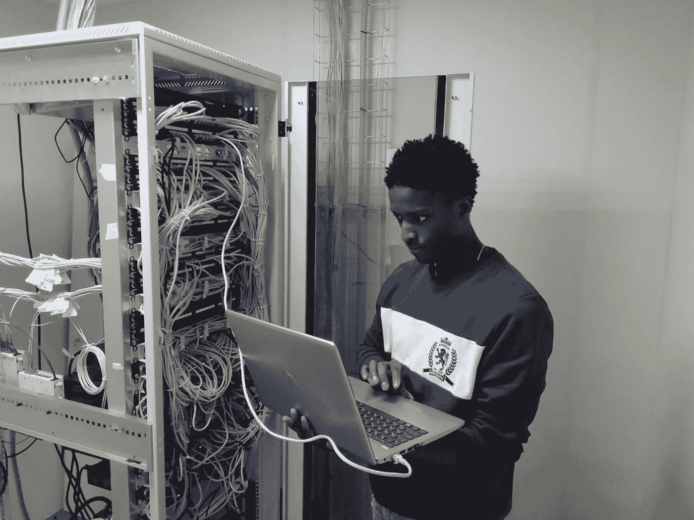

Photo 1 by [Sammyayot254](https://unsplash.com/@superadmins?utm_source=medium&utm_medium=referral) on [Unsplash](https://unsplash.com?utm_source=medium&utm_medium=referral)

把你的脚趾伸进去可能会很棘手。然而，随着全球供应链继续因地缘政治紧张局势加剧而陷入困境，二手 IT 设备市场对公司和个人的吸引力从未像现在这样大。即时采购企业 It 设备可能会令人望而生畏。因为这种设备很容易花费数万美元，使得除了大型数据中心之外的大多数人无法购买这种设备。通过仔细的市场选择，仍然有可能买到便宜的部件。

以下是如何购买便宜的 IT 设备的指南。

## 新硬件与旧硬件

购买企业 IT 设备就像买车一样。新的服务器在制造后总是会花费很多。然而，当它们进入生产线并被使用时，成本会迅速降低。建议人们购买五到十年左右的硬件。购买 IT 设备的人不是像你这样的平民。他们是在世界各地拥有数据中心的公司。这些新服务器在被回收供应商丢弃之前会使用大约五到十年。根据这些服务器的状况，他们可能会将这些服务器出售给第三方公司，由第三方公司转售这些 IT 设备。到那时你可以用原价的零头买到它。

## 购买硬件的最佳网站？

Photo 2 from [https://mynintendonews.com/](https://mynintendonews.com/)

有许多网站提供企业 IT 设备。你可以在[亚马逊](https://www.amazon.com/)、[戴尔](https://www.dell.com/en-us)、[惠普](https://www.hp.com/us-en/home.html)、[易贝](https://www.ebay.com/)等上面找到这个装备。不要从第一方网站购买，如直接从制造商那里购买，因为他们会收取最高的加价。大部分第三方专业卖家都在易贝。在我看来，采购廉价零件的最佳网站是易贝。然而， [Craigslist](https://www.craigslist.org/about/sites) 和 [OfferUp](https://offerup.com/) 。

文章中的所有价格都是假设你是使用美元的美国买家。

## 购买硬件的最佳供应商？

没有针对任何特定供应商的建议。只有一个指导方针，告诉你应该寻找什么。你应该找最便宜的零件。但是，一定要看卖家的评论。并检查他们的退货政策。糟糕的退货政策和无/差评是一个很好的迹象，表明你购买的供应商很可能是一个骗局。

## 预构建与自行构建

当您选择服务器时，您有两种选择。有一个预先构建的选项，供应商将组装所有部件并卖给您。此外，您还可以自己动手选择要购买的零件。每种选择都有利弊。

**预建**

优点:

*   旧的硬件通常更便宜
*   更好的手册和文档

缺点:

*   特定于供应商的组件锁定，尤其是在主板上
*   硬件故障时更难找到旧部件

**自己造**

优点:

*   更好的学习体验
*   更多定制

缺点:

*   更贵
*   更难配置

购买二手服务器时，推荐两家预建服务器供应商。就质量和价格而言，戴尔和惠普是最好的服务器提供商。这两款企业级服务器分别是 [Dell PowerEdge](https://www.dell.com/en-us/dt/servers/index.htm#scroll=off) 和 [HP Proliant](https://www.hpe.com/us/en/servers/proliant-servers.html) 。

## 网络设备

每台服务器都需要一台网络交换机来相互通信。有标准的以太网。大多数便宜的交换机都是 1 GBPS 的速度。10 GBPS 交换机仍然被认为是“真正的企业”设备，因此对于消费市场来说仍然不值这个价格。

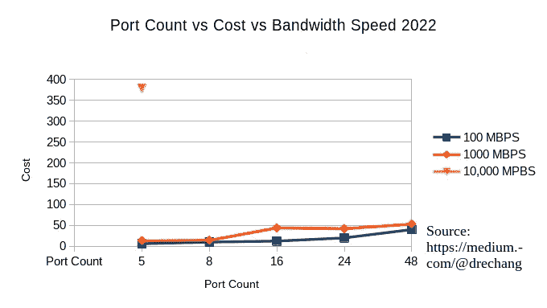

Figure 1 from Dre Chang

看看 InfiniBand 交换机，它是一种快速、廉价的网络设备。[大多数数据中心和学术超级计算机实验室不使用以太网交换机进行高性能计算](https://www.usgs.gov/advanced-research-computing/what-high-performance-computing)。你可以阅读[初学者如何分布计算的指南](/geekculture/distributed-computing-for-beginners-f4116adf609d)来理解理论。从那里你可以将这些理论应用到你的 ML 项目中。以下是所有 Infiniband 类型的规格。

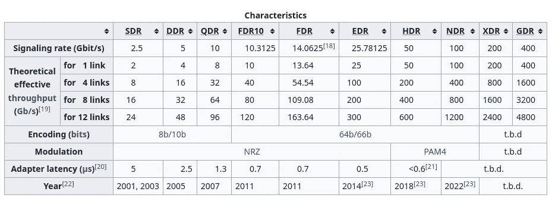

Photo 3 from wikipedia.org

这里是最便宜的 PCI 卡和网络交换机到 InfiniBand 类型的当前成本。

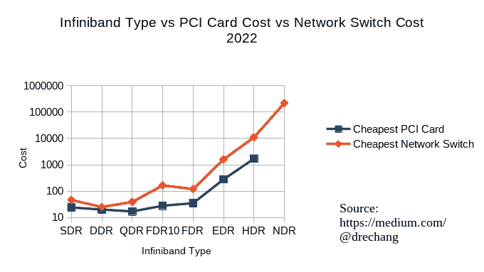

Figure 2 from Dre Chang

建议你买 FDR InfiniBand，作为那种平衡速度的代价。你还需要购买连接网络交换机和服务器的电线。这些电线可以在易贝上找到，但是，与以太网不同，你不能细分电缆。这意味着你买的电缆是固定长度的。您还需要购买正确的收发器模块。错误的一个意味着你将不能正确地插入收发器。

您可以阅读本产品指南，了解有关 InfiniBand 技术的更多信息。

Document 1 from mellanox.com

## 服务器外形

IT 设备有多种外形规格，可用于多种不同的使用情形。例如，您可以购买一个 Raspberry PI 农场，在 GPU 上为加密货币挖掘装备设置一个分布式挖掘装备。

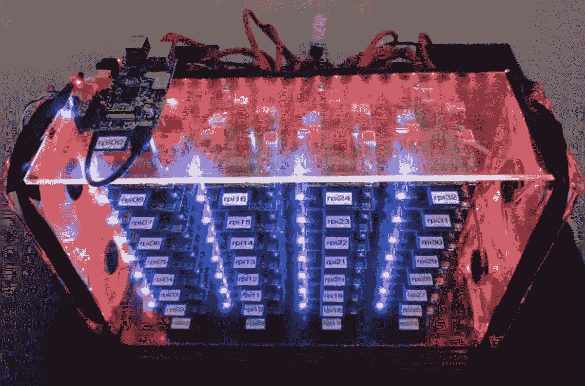

Photo 4 from [https://regmedia.co.uk/](https://regmedia.co.uk/)

或者，您可以购买机架式服务器，用于网络连接存储。因为对于机架式服务器来说，更容易切换出故障硬盘驱动器并添加更多硬盘驱动器。

Photo 5 from [https://tecinfo.net/](https://tecinfo.net/)

有许多服务器外形可供您使用。每一个都有利弊。您可以在此了解更多关于服务器外形的信息，以满足您的需求。

 [## 服务器外形:机架装配、刀片式服务器等指南

### 编者按预算限制、可靠性问题和不断变化的技术为新的……

www.techtarget.com](https://www.techtarget.com/searchdatacenter/guides/Understanding-server-form-factors-A-guide-to-rackmount-and-blade-servers) 

## **自行构建服务器指南**

自己构建对于自学服务器非常有用。您希望以最少的成本进行优化，同时获得最大的性能。

出于指南的目的，假设正在构建的服务器将安装在机架上。

**CPU**

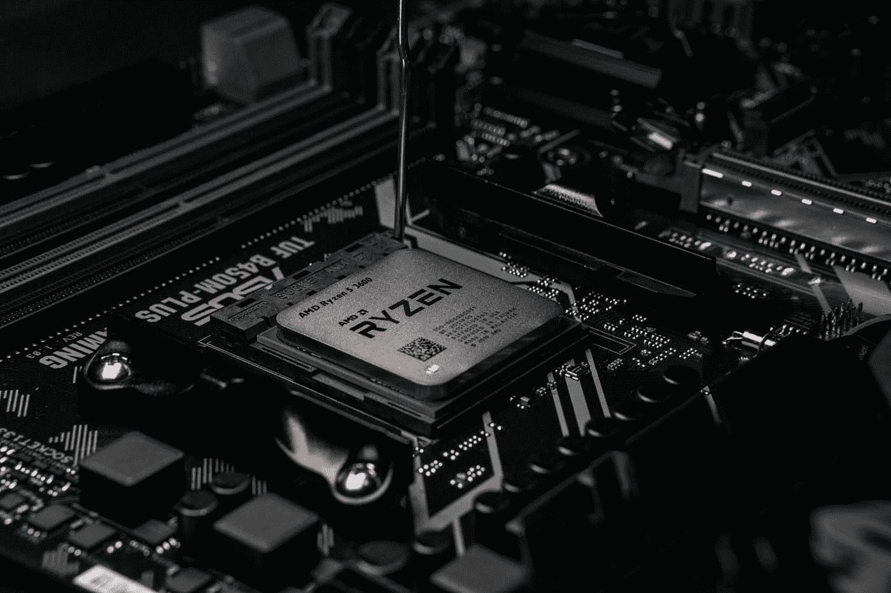

Photo 6 by [Luis Gonzalez](https://unsplash.com/@luchox23?utm_source=medium&utm_medium=referral) on [Unsplash](https://unsplash.com?utm_source=medium&utm_medium=referral)

CPU 价格取决于制造年份和层级列表。英特尔的服务器产品线是至强芯片。而对于 AMD 来说则是骁龙和 Epyc 芯片。根据您的服务器工作负载，您必须根据层级系统选择芯片。从 2010 年到 2015 年的生产日期，所生产的芯片的性能优化成本最低。

Figure 3 from the royalsocietypublishing.org

任何新的芯片都可能成倍地提高价格，但性能不会。[阅读《分布式计算指南》,了解穆雷斯定律衰退的含义。](/geekculture/distributed-computing-for-beginners-f4116adf609d)由于本教程的范围，我们将不比较数据点。但是，您可以在 GeekBench 上轻松获得性能。以及易贝的价格。以及制造商网站上的 BTU。

**GPU**

Photo 7 by [Nana Dua](https://unsplash.com/@nanadua11?utm_source=medium&utm_medium=referral) on [Unsplash](https://unsplash.com?utm_source=medium&utm_medium=referral)

你可能认为购买“企业级 GPU”是一个好主意。然而，这只是一个小小的大脑动作。原因是这些 GPU 厂商卖的是同一款产品的两份拷贝。一个面向消费者，另一个面向企业。尽管这些公司想让你相信所有的市场营销，但这两者之间实际上没有什么区别。

如果你有几分智商，你就会意识到这一点。GPU 制造商已经放置了 DRM 来防止消费者卡访问[企业功能，例如多个 GPU 直通](https://nvidia.custhelp.com/app/answers/detail/a_id/5173/~/geforce-gpu-passthrough-for-windows-virtual-machine-%28beta%29)。除非人们掏出更多的钱，否则他们不是唯一一家在产品上安装 DRM 来软件锁定硬件功能的公司。

 [## >特斯拉设置 DRM 人为限制他们汽车的行驶里程，直到 y...黑客新闻

### 他们看到了提供相同型号的不同系列电池的机会，但是生产两个的成本…

news.ycombinator.com](https://news.ycombinator.com/item?id=18304412)  [## 特斯拉在二手 Model S 售出后远程禁用了其自动驾驶功能

### 特斯拉在一辆二手 Model S 卖给客户 Jalopnik 后，远程禁用了它的驾驶辅助功能

www.theverge.com](https://www.theverge.com/2020/2/6/21127243/tesla-model-s-autopilot-disabled-remotely-used-car-update) 

幸运的是，如果你知道底层的 DRM 是如何工作的，你就不必处理消费者卡上的那些废话。

这是消费卡对比易贝最低价格对比性能评级。

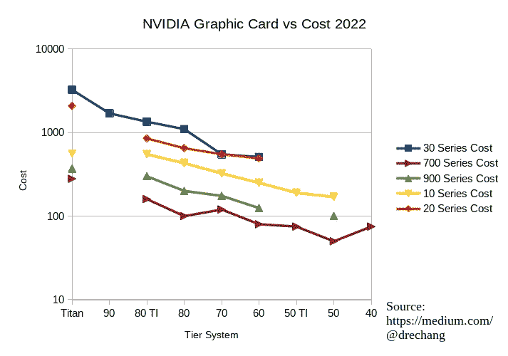

Figure 4 from Dre Chang

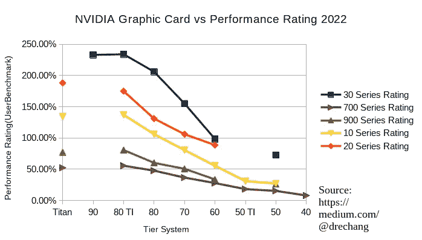

Figure 5 from Dre Chang

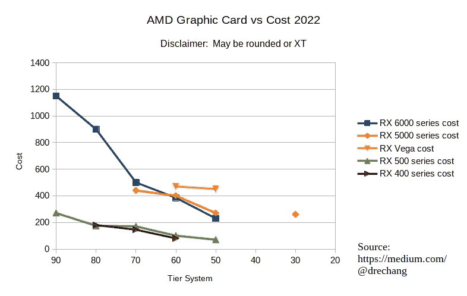

Figure 6 from Dre Chang

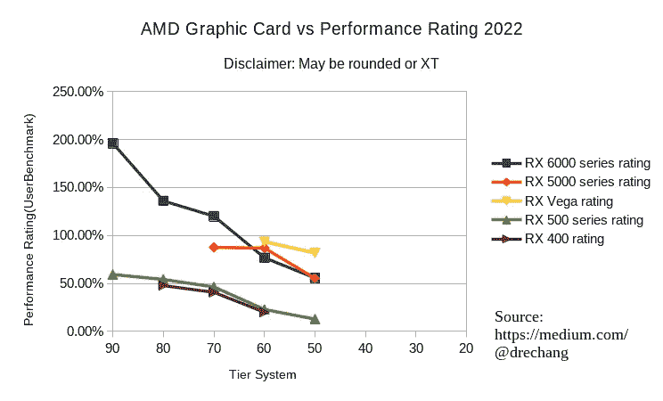

Figure 7 from Dre Chang

提供的数据是易贝二手 GPU 市场的数据。令人惊讶的是，与 AMD 显卡不同，NVIDIA 显卡的成本与性能不成线性关系。也许英伟达有一群粉丝愿意为他们的产品支付更多的钱。

由于黄牛正在狙击产品，目前获得一个新的 GPU 也非常昂贵。以两倍的零售价出售。不仅如此，供应链问题意味着进口产品已经够贵了。然而，如果你足够绝望，可以加入黄牛的军备竞赛，获得一个新的 GPU。

 [## 蜗牛机器人

### 家长、学生、忙碌的专业人士以及各行各业的人已经使用 SnailBot 一年多了…

snailbot.io](https://snailbot.io/) 

**主板**

Photo 8 by [Sven Finger](https://unsplash.com/@svenfinger?utm_source=medium&utm_medium=referral) on [Unsplash](https://unsplash.com?utm_source=medium&utm_medium=referral)

您的服务器将使用两种尺寸的主板。第一个是 ATX。第二个是扩展的 ATX。ATX 主板通常只有一个 CPU 插座。而扩展的 ATX 主板可以支持两个甚至四个 CPU 插槽。为了充分发挥每台服务器的性能，您需要选择一个扩展 ATX 主板和一个适合该主板的服务器机箱。

**公羊**

Photo 9 by [Luan Gjokaj](https://unsplash.com/@luangjokaj?utm_source=medium&utm_medium=referral) on [Unsplash](https://unsplash.com?utm_source=medium&utm_medium=referral)

有两种不同类型的内存。ECC ram 是一种错误代码纠正 ram。而非 ECC ram 则很漂亮。ECC ram 对于某些应用程序(如 NAS 服务器)非常重要。TrueNAS 等网络连接存储操作系统会将硬盘内容缓存在 RAM 中，以加快访问速度。通过使用非 ECC ram，您可能会损坏将保存回硬盘的内容。

此外，确保您购买的是正确的外形和带宽速度。确保您的 RAM 符合主板规格。

**服务器机箱**

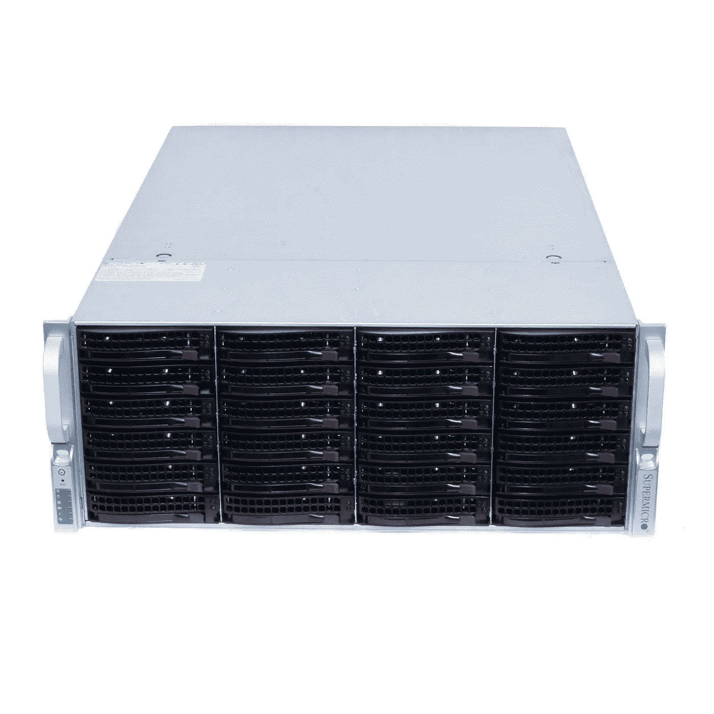

Photo 10 from ebay.com

服务器机箱品牌很多。但是，您希望选择支持标准尺寸主板的机箱。下面是一些推荐的机箱厂商。

*   [超微型](https://www.supermicro.com/en)
*   [罗斯威尔](https://www.rosewill.com/)
*   [伊斯塔鲁萨](https://www.istarusa.com/)

有不同的尺寸，如 1U、2U 和 4U。大小将决定机箱中可以容纳的硬盘数量。这是一个粗略的指南。1U 服务器机箱将允许您安装 12 个 3.5 英寸硬盘。2U 可容纳 24 个。4U 服务器机箱将允许您安装 48 个 3.5 英寸硬盘。

大多数服务器机箱将采用一种称为 SAS 驱动器的特殊类型的硬盘驱动器。使用 SAS 驱动器比使用 SATA 驱动器有一些好处。SAS 是 SATA 驱动器的企业版。硬件更耐用，持续时间更长。确保您的服务器带有 SAS 背板，否则您将不得不自己采购该部件。

此外，确保服务器带有 IPMI 接口。该接口允许您远程连接到系统，而无需使用 VGA 电缆。这是 2022 年的必备功能，人们期待通过以太网实现远程连接。登录后，您可以访问虚拟显示器。但是，有些 IPMI 要求您下载额外的软件来使用该功能。

**硬盘**

Photo 11 by [Denny Müller](https://unsplash.com/@redaquamedia?utm_source=medium&utm_medium=referral) on [Unsplash](https://unsplash.com?utm_source=medium&utm_medium=referral)

一些数据专家会告诉你买最贵的硬盘，因为这样可以确保数据的完整性。这个建议是在大多数软件存储解决方案都很糟糕的时候提出来的。购买坏的驱动器会导致数据完整性的丧失。然而，这种情况已经不复存在，因为大多数软件存储管理软件都相当不错。TrueNAS Scale 允许您在多台机器上复制数据，类似于 Google 服务器在一堆垃圾硬件上对数据进行奇偶校验。买一堆便宜的二手硬盘并在它们坏了的时候替换它们是更划算的。

好的软件仍然不是不遵循基本面的借口。确保您遵循 1–2–3 备份策略。

**供电单元**

Photo 12 by [Joseph Greve](https://unsplash.com/@lime517?utm_source=medium&utm_medium=referral) on [Unsplash](https://unsplash.com?utm_source=medium&utm_medium=referral)

每台服务器至少需要一个电源设备。但是，您购买的服务器机箱可能有一个用于两个电源的插槽。多个电源可确保服务器在电源出现故障时继续运行。

**粉丝**

Photo 13 by [Kvistholt Photography](https://unsplash.com/@freeche?utm_source=medium&utm_medium=referral) on [Unsplash](https://unsplash.com?utm_source=medium&utm_medium=referral)

声音水平也是服务器最重要的一点。大多数服务器机箱都配有风扇。然而，由于这些风扇的空气动力学和旋转速度，这些风扇会非常吵。这对于数据中心或服务器机柜来说很好。然而，安静的风扇对于办公室和家庭环境是必须的。这里有一个关于如何让服务器静音的指南。

 [## 让您的 Dell PowerEdge 服务器安静下来- SPX 实验室

### 太好了，现在你已经记下了这些粉丝的名字，我们可以在服务器上寻找更多的信息。注:“温度”是…

www.spxlabs.com](https://www.spxlabs.com/blog/2019/3/16/silence-your-dell-poweredge-server) 

## 外部备用电池

Photo 14 from bzbexpress.com

你需要一个外部备用电池，以防停电，你需要优雅地关闭你的服务器。你不想依赖一些廉价的中国备用电池模块玩具。买一个有断路器的知名品牌的。

不要购买新的备用电池备份模块。二手或翻新的备用电池模块会更便宜，但是电池可能会老化。你可以用万用表来测试电池的强度。强度可以通过匹配制造电压到放电曲线的电压来测试。

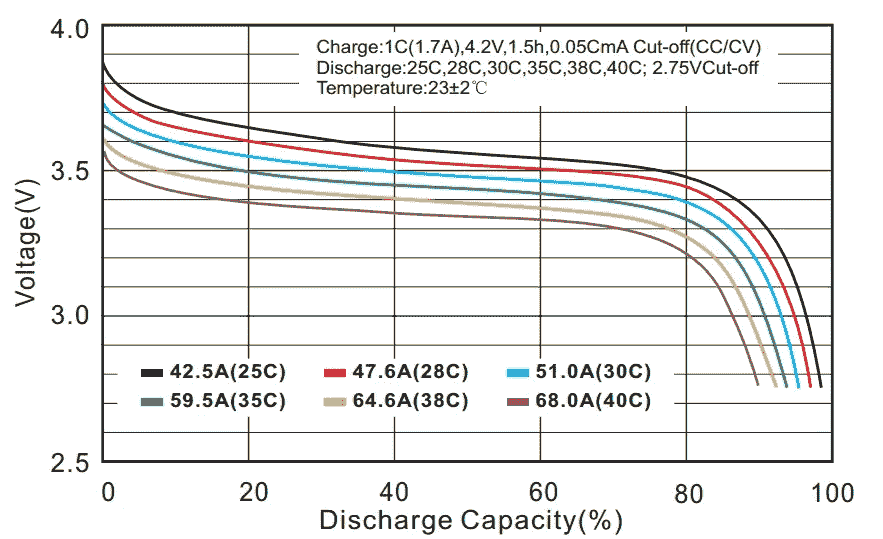

Figure 8 from learningrc.com

您必须每两三年更换一次电池，以确保电池不会失去电量。确保输入电压与服务器电池输入电压的规格相匹配，除非您想要损坏备用电池硬件。

## 服务器机架

有两种类型的服务器机架。开放式服务器机架周围没有盖子。

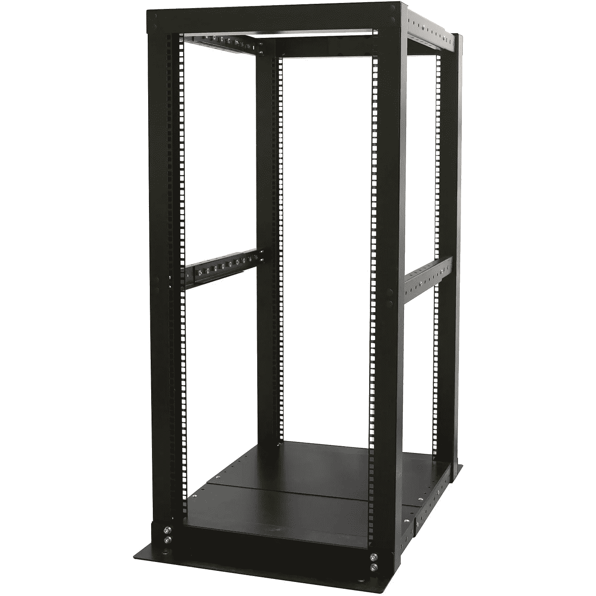

Photo 15 from walmartimages.com

第二种是封闭式服务器机架。出于安全原因，它们被装了起来。虽然大多数数据泄露是通过黑客攻击在线发生的，但一些泄露是通过内部团体妥协发生的。取出硬盘就是泄露数据的一个例子。另一个例子是将 USB 插入机器以加载自动启动脚本。自动启动脚本将运行可能危及网络安全的恶意代码。

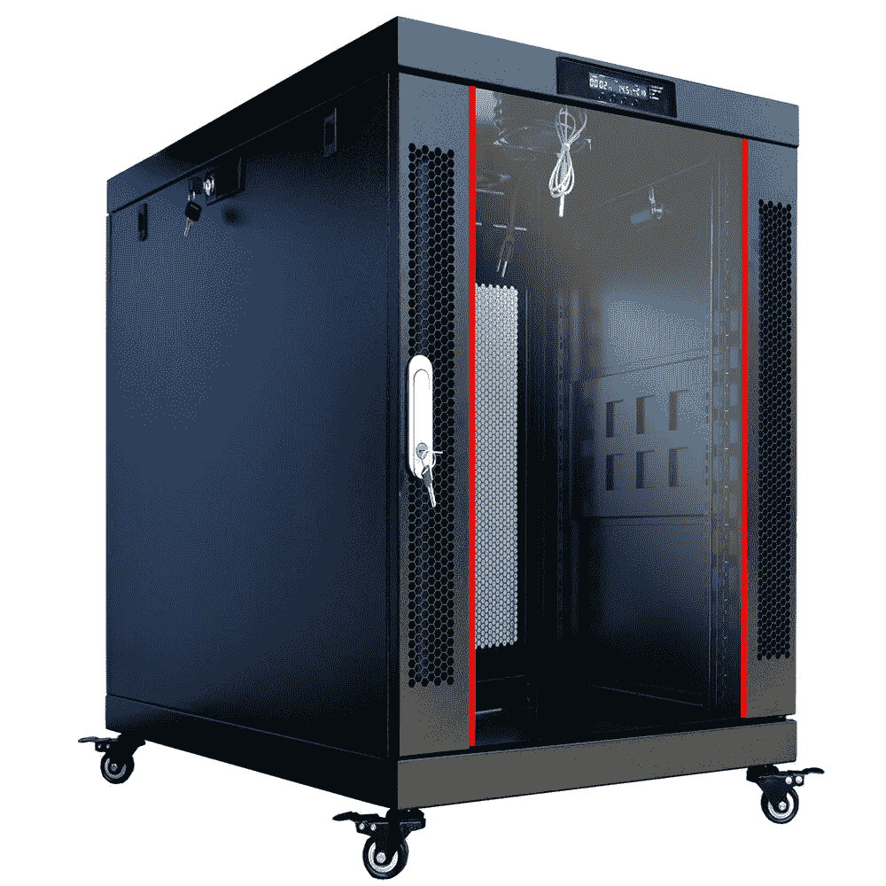

Figure 16 from ebay.com

一个封闭的服务器外壳保护了内容的完整性。小型企业和个人只需要开放式服务器机架。然而，一个拥有超过 50 名员工的组织应该在关键基础设施上有一定的安全级别。你需要购买服务器螺母和螺栓。

## 热量和能源使用考虑

任何通过一个区域的能量转移都会导致熵。熵以热的形式出现。计算机执行的工作量可以忽略不计，这意味着 100%的能量都变成了热能。你需要做的就是把 PSU 消耗的能量加起来。使用此公式确定 BTU。

 [## 将瓦特转换为 Btu(IT)/小时

### 用于瓦特到 Btu(IT)/小时转换的即时免费在线工具，反之亦然。瓦特[W]到 Btu(IT)/小时[Btu/h]…

www.unitconverters.net](https://www.unitconverters.net/power/watt-to-btu-it-hour.htm) 

有两种方法可以解决这个问题。你可以用空调从一个区域的总热量中移走热量来保持平衡。或者你可以用风扇将热量从一个区域转移到另一个区域。

交流电的问题很简单，因为你只需要买一个与隔离机柜系统内所有机器产生的热量单位相匹配的交流电。风扇解决方案可能有点棘手。因为你可能需要运行流体动力学模拟软件来数值求解微分方程。当然，您可能会通过添加更多风扇来接近近似值，直到温度达到最佳范围。

## 安全隐患

当然，对于大多数人来说，将一堆 IT 设备放在一个地方是一个安全隐患。

因为在一个地方密集放置大量电线对大多数人来说都有触电的危险。一根开路的电线可能会电击并杀死你。请确保服务器位于光线充足的区域，这样就不会碰到明线。服务器也是火灾隐患。您可能会犯一些错误，例如为随附的服务器机箱购买了错误的空调设备。有更多的能量进入封闭系统。导致一场能烧毁你房子的大火。

别傻了。在使用任何设备之前，请确保采取安全预防措施。如果你认为这些责任太难处理，那么就成为一名[大豆开发者](https://www.urbandictionary.com/define.php?term=Soydev)并在你的云中的小虚拟机上工作。

## 最后

IT 和工程领域是快速发展的领域。跟不上意味着你将被落在后面。跟上的最好方法是保持最新的新闻和教育内容。[订阅免费电子邮件列表，将你的职业生涯提升 10 倍。](/subscribe/@dretechtips)

**加入我们吧，因为 50 多位想要快速提升职业生涯和知识基础的人已经注册了。**

**相关内容:**

*   [在手机上使用谷歌的黑暗真相](/@drechang/the-dark-truth-about-using-google-on-your-phone-2aec68041dbf?source=user_profile---------23-------------------------------)
*   [你的密码管理器:储存密码最不安全的方式](/@drechang/your-password-manager-the-most-insecure-way-to-secure-your-passwords-c815d1903096)
*   [去谷歌化的完整指南](/@drechang/how-to-dismantle-the-google-empire-e652bff6d2)