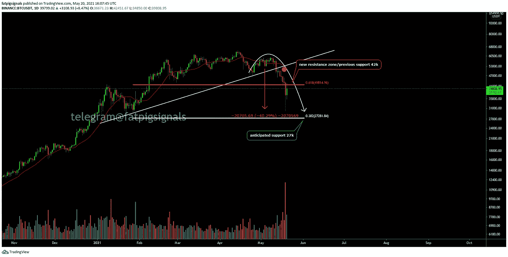

# 买盘还是熊市？加密货币将何去何从？

> 原文：<https://medium.com/geekculture/buy-the-dip-or-bear-market-where-are-cryptocurrencies-heading-f23485ec3a10?source=collection_archive---------30----------------------->

月初，加密世界仍然充满了兴奋。新的投资者涌入市场，主要的替代硬币创下新高，许多人预计以太坊将继续升值。然而，与此同时，这种兴奋已经消退——毕竟，市场在开始的几天内就调整了。