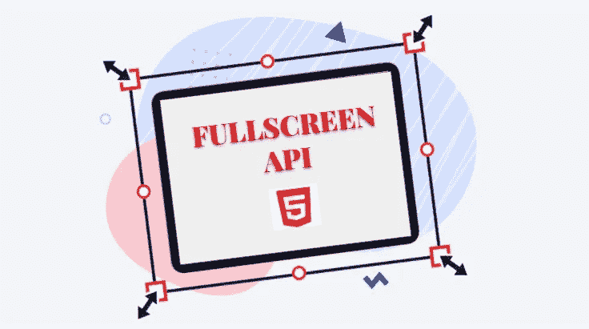
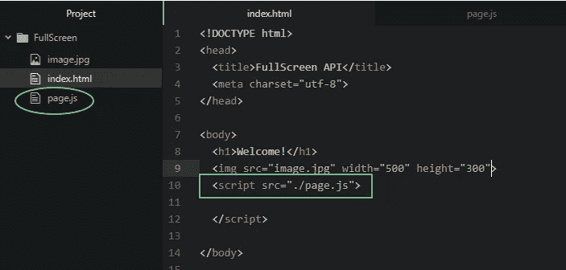
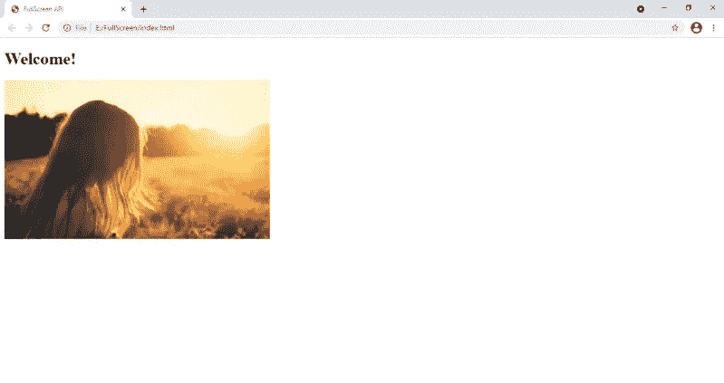
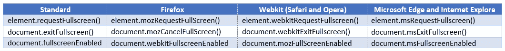

# 再见迷你屏幕

> 原文：<https://medium.com/geekculture/bye-bye-mini-screen-a6ceb2e2ce29?source=collection_archive---------23----------------------->

你是否曾经为网络应用程序中几乎看不见的微小图片而烦恼过？还是微小的网络游戏屏幕？


不要让**你的** web 应用的用户有同样的体验！

使用全屏 API！

本文为您带来了一个关于在基本 JS 环境中使用全屏 API 的小演示。

首先，让我给你简单介绍一下全屏 API 的重要方法和属性。



# 方法

全屏 API 允许您在*文档*和*元素*接口上添加方法。

1.  **element . request full screen()**—获取全屏
2.  **document . exit full screen()**—退出全屏

# 性能

1.  **document . full screen element**—获取当前全屏元素
2.  **document . full screen enabled**—获得全屏模式的可能性

现在让我们看看如何在 web 应用程序中的图像上使用这些方法和属性。

让我们从一个简单的 JS 项目开始。我用一个 HTML 文件和一个 Js 文件创建了一个简单的静态网页。我在这里解释的所有 Javascript 代码都将插入到 *page.js* 文件中。



Figure 1

图 2 显示了我们的 web 页面的初始外观。



Figure 2

在这篇文章中，我将向您展示我们如何

*   双击图像以全屏显示
*   使用当前全屏元素退出全屏模式
*   切换全屏
*   提高浏览器兼容性
*   识别全屏模式不可用的页面

首先，我们需要一个 **id** 用于我们的图像。在*index.html*文件中，编辑``标签，如下所示。

```

```

现在我们可以通过 id 调用 *page.js* 中的图片。

```
var image = document.getElementById(“img”)
```

# **1。双击图像进入全屏模式**

```
image.addEventListener(‘dblclick’, ()=>{
 image.requestFullscreen().catch(console.log);
});
```

为什么我们必须使用事件监听器？

全屏 API 只能通过**用户手势**启动。因此，我们需要一个事件列表器来捕获用户交互，如`click`、`dblclick` 等。

# 2.通过使用当前全屏元素退出全屏模式

如果文件不是全屏模式，`document.fullscreenElement`返回`null`。否则，它返回当前全屏元素。

```
image.addEventListener(‘dblclick’, ()=>{
if (**document.fullscreenElement**) {
     document.exitFullscreen();
 }
});
```

当双击图像时，如果输出不为空，该代码将执行`exitFullscreen()`方法。

注意`exitFullscreen()`只在文档对象上被调用。不需要传递元素。

# 3.切换全屏模式

我们现在可以将上面的两个代码块组合成一个 if-else 条件，并在双击图像时在全屏和正常屏幕之间切换。

```
image.addEventListener(‘dblclick’, ()=>{ if (document.fullscreenElement) {
     document.exitFullscreen();
 }
 else {
     image.requestFullscreen().catch(console.log);
 }});
```

# 4.提高浏览器兼容性

某些浏览器的某些旧版本有时不支持这些方法和属性。我们可以使用这些属性和方法来支持旧版本。



与多个方法和属性混淆？别担心。可以得到函数的使用。

```
function **getFullscreenElement()**{
   return document.fullscreenElement
          ||document.webkitFullscreenElement
          ||document.mozFullscreenElement
          ||document.msFullscreenElement}function **toggleFullscreen()**{
if (**getFullscreenElement()**) {
     document.exitFullscreen();
 }
 else {
     image.requestFullscreen().catch(console.log);
 }}image.addEventListener(‘dblclick’, ()=>{
 **toggleFullscreen();**});
```

# 5.识别全屏模式不可用的页面

有一种方法可以检查全屏模式是否适用于您的网页。如果页面在其任何文档中包含任何窗口插件，或者如果任何`<iframe>`元素不包含`allowfullscreen`属性集，则全屏模式对于该页面将不可用。

下面的代码块请求全屏**，前提是**全屏模式可用于您的页面。

```
function **requestFullScreen()** {
  if (**document.fullscreenEnabled**) {
    image.requestFullScreen();
  } 
  else {
    console.log('Full screen mode is not available');
  }
}image.addEventListener(‘dblclick’, ()=>{
 **requestFullScreen();**});
```

Fullscreeen API 是一个非常简单的 API，有一些方法、属性、事件和事件处理程序。您可以通过几行 Javascript 在您的网页中获得全屏模式的体验。