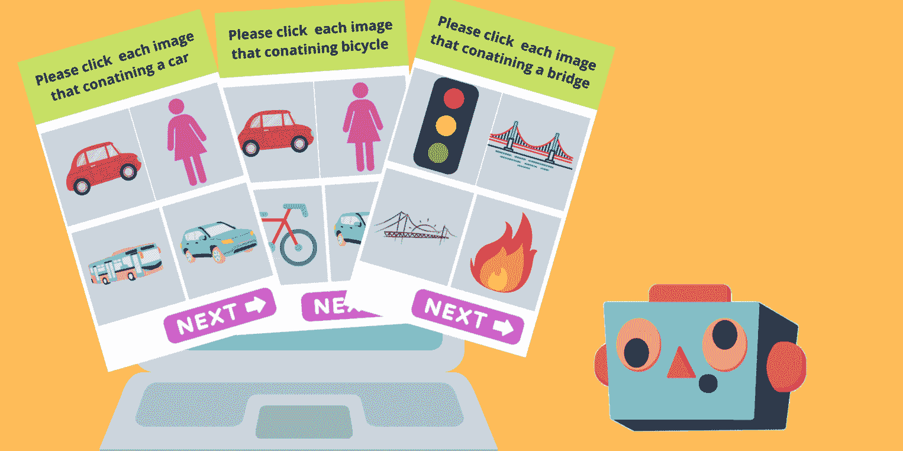

# 使用隐私保护网页扩展绕过验证码

> 原文：<https://medium.com/geekculture/bypass-captcha-using-privacy-pass-web-extension-f881ed1db2d9?source=collection_archive---------11----------------------->

## [JavaScript API 识别 Chrome 中的人类和机器人](https://blog.bitsrc.io/javascript-api-to-recognize-humans-vs-bots-in-chrome-db78f6a9963e)

## 对你访问的每个网站都要重复验证码感到恼火？了解如何通过 Chrome 或 Firefox 中的 Privacy Pass 绕过验证码挑战

