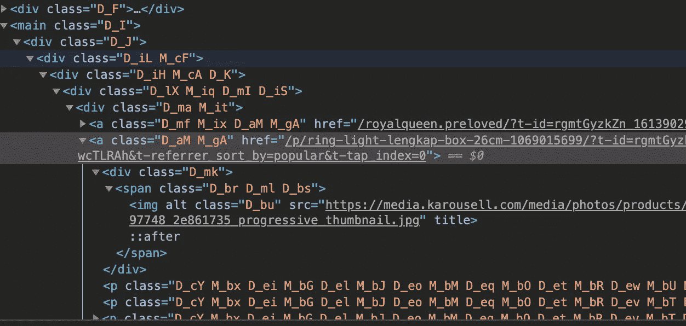
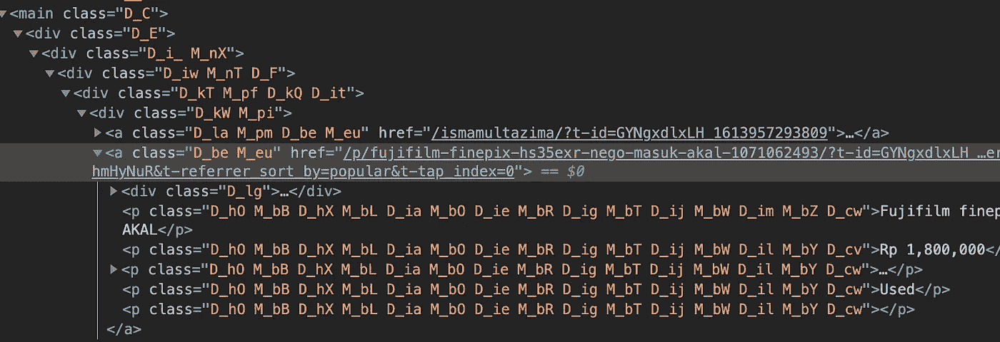
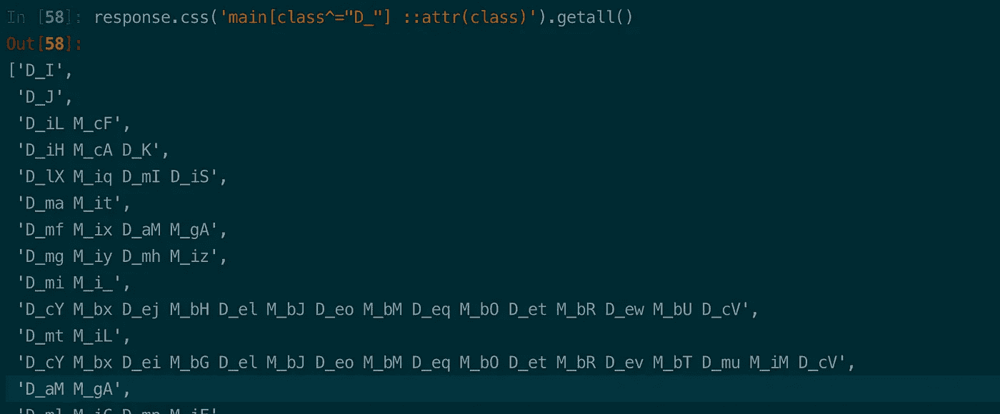
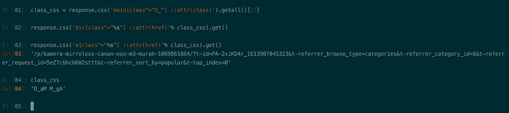
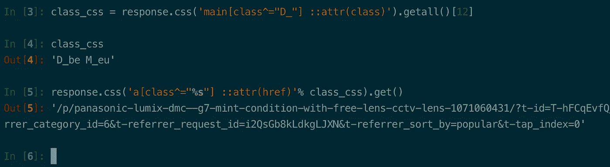

# 绕过和抓取 CSS 类名经常改变的网站

> 原文：<https://medium.com/geekculture/bypass-scraping-websites-that-has-css-class-names-change-frequently-d4877ecd6d8f?source=collection_archive---------1----------------------->

在现代，很多网站都是用 ReactJS，Vuejs，Angular 等等语言写的。这使得在 HTML 标记中拥有随机的类名和 id 成为可能。

这是防止网站被刮的策略之一。所以如果你在你的 scrapper 上静态地定义 CSS 类名，它们只会在短时间内起作用，因为这种网站经常改变它的 CSS 类名。

我们可以看看[https://id.carousell.com/categories/photography-6](https://id.carousell.com/categories/photography-6)
这是实施这种预防策略的网站之一。c[arousell.com](https://id.carousell.com/categories/photography-6)将它们的类名随机化，使得很难找出语义丰富的 CSS 选择器。



只需获取 CSS 类名 **D_aM** 和 **M_gA** 就可以轻松获得详细帖子的链接。但是，如果网站页面的动态 CSS 类名每天或每小时都在变化，该怎么办呢？我们不会浪费时间频繁地维护我们的 scraper 代码吗？

让我们看看[carousell.com](https://id.carousell.com/categories/photography-6)是否经常改变它的 CSS 类名。这张截图是在第一张截图的第二天拍的。



正如您所看到的，它们将主类名从 **D_I** 更改为 **D_C** 。详细帖子的 URL 的 CSS 类名已从 **D_aM** 和 **M_gA** 更改为 **D_be** **M_eu**

让我们试着打破这个挑战！

# 1.识别具有唯一值的标签

如果我们仔细观察，我们会发现有一个“ **<”主标记“**，我们可以用它作为我们的键来获取其中的所有数据。如果他们用 div 代替 main，我们的工作可能会更有挑战性。

# 2.使用 Scrapy shell 测试和探索各种可能性

在制作 script.py 之前，我们需要测试我们的假设是否正确。为了快速工作，我们不在文件中写代码，而是使用 Scrapy 解释器/shell，所以我们可以很容易地调试代码。

在你的终端上按照这个命令打开 Scrapy shell。

```
scrapy shell "[https://id.carousell.com/categories/photography-6](https://id.carousell.com/categories/photography-6)"
```

并添加以下代码

```
response.css('main[class^="D_"] ::attr(class)').getall()
```

您将看到如下输出:



代码将开始获取

<main tag="" html="" that="" has="" a="" class="" name="" begins="" with="">D_ 中的所有类名</main>

因此，从那里，我们可以检查哪个列表类索引有我们正在寻找的信息。可以用 index [number]一个一个查，也可以用 inspect elements 看网站。

我们知道我们想要获得这篇文章的详细 URL，当时它位于类名 **D_aM** 和 **M_gA** 处。和 **D_aM** 和 **M_gA** 都在索引[12]上

所以我们可以这样做。

```
class_css = response.css('main[class^="D_"] ::attr(class)').getall()[12]
response.css('a[class^="%s"] ::attr(href)'% class_css).get()
```



你好。我们可以得到详细的网址！

让我们用已经更改的 CSS 类名再测试一次。



成功了！这是完整的代码

正如我们所知，从一个拥有 CSS 类和属性的网站获取我们需要的信息是很简单的，这些 CSS 类和属性是在服务器端动态生成的，并且每次都是唯一的。

虽然我知道这在其他案子上并不总是有效。但你可能想考虑阅读这些伟大的文章[https://dev . to/scrape hunt/two-quick-hacks-for-web-scraping-pages-with-dynamic-CSS-class-names-j0b](https://dev.to/scrapehunt/two-quick-hacks-for-web-scraping-pages-with-dynamic-css-class-names-j0b)[https://www . plural sight . com/guides/advanced-web-scraping-tactics-python-playbook](https://www.pluralsight.com/guides/advanced-web-scraping-tactics-python-playbook)。

希望这有所帮助！