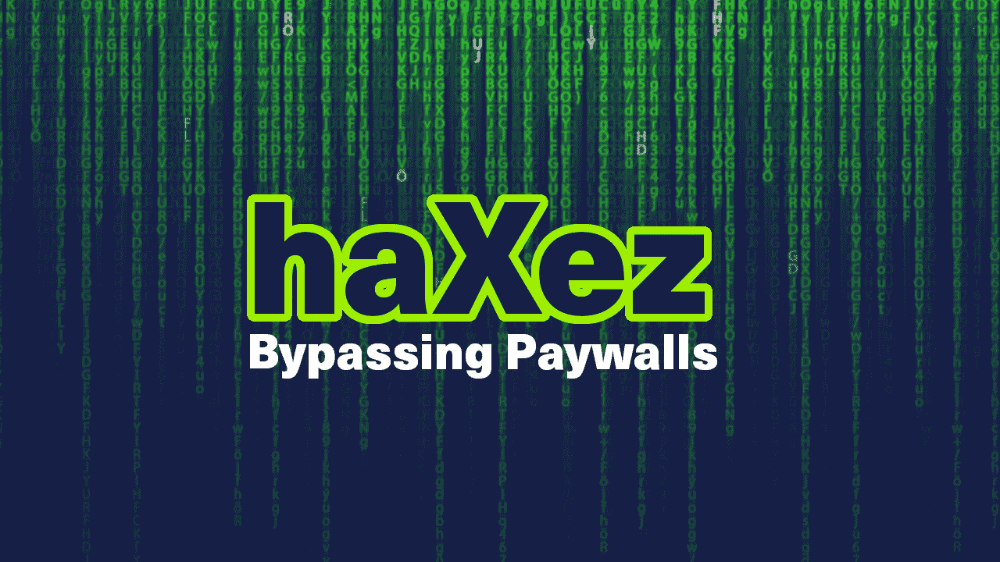
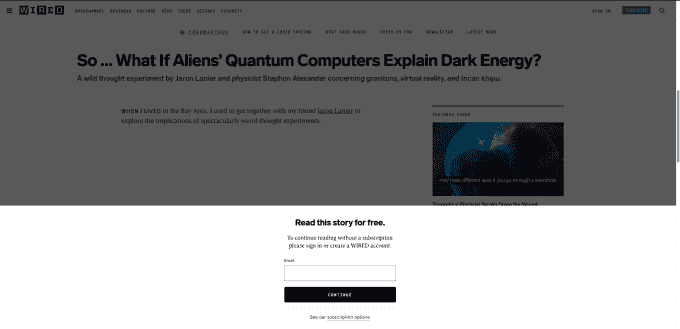
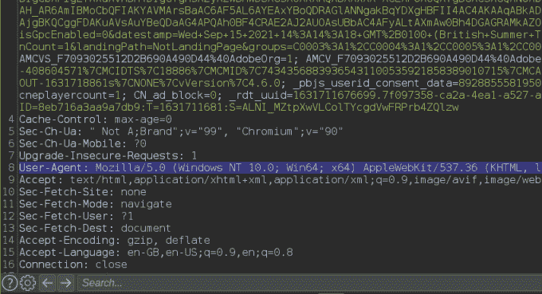
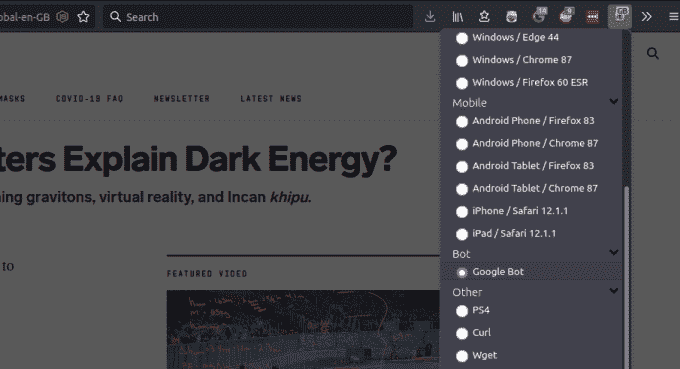
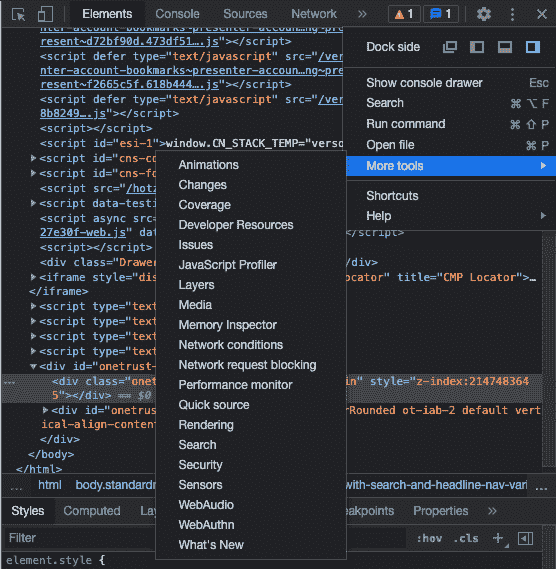
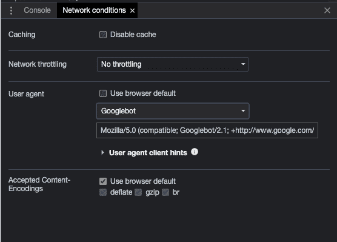
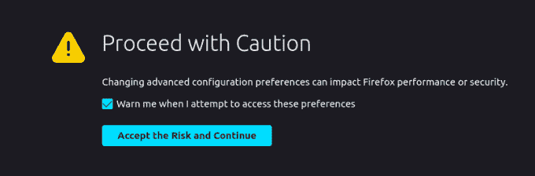
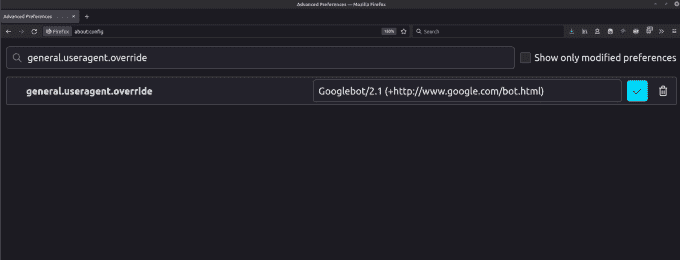

# 通过用户代理切换绕过 Web 应用付费墙

> 原文：<https://medium.com/geekculture/bypass-web-application-paywalls-with-user-agent-switching-f587f46903db?source=collection_archive---------16----------------------->

haXez Bypassing Paywalls

这篇文章是关于切换你的用户代理来绕过网络应用付费墙，虽然不是一个“黑客”,但这是一个有用的知识。今天在 Wired 上看到一篇很有意思的文章，想看看。这篇文章是关于外星人、量子计算机和暗能量的。我不会用细节来烦你，但读了一句话后，他们的付费墙弹出来，不让我继续读下去。显然，这让我很沮丧，因为我想知道为什么外星人在他们的量子计算机中使用暗能量。

《连线》有一个客户端付费墙，一旦用户达到免费文章的上限，它就会阻止用户阅读他们的内容。虽然从技术上来说这不是一个付费墙，但它需要你注册才能继续阅读这个网站。客户端付费墙是在初始内容加载之后加载的。它是在用户浏览器中运行的 JavaScript 中编码的，这意味着我们可以禁用 JavaScript，但这可能会影响其他功能。

Wired Application Paywall

这就是用户代理的用武之地。用户代理是随请求一起发送给 Web 应用程序的少量信息。本质上，当您请求一个 Web 页面时，对该页面的 GET 请求被发送到服务器。这个 GET 请求包含几个参数，比如主机、Cookies、安全头和许多其他参数。其中一个参数是用户代理，它告诉服务器您正在从哪种类型的客户机请求页面。这将允许服务器根据用户代理中的值来决定发送什么。例如，如果你的用户代理是移动电话专用的，那么服务器可以看到这一点，并把你请求的页面的移动版本发送给你。

Example GET request with User-Agent

好吧，那么这对付费墙有什么帮助呢？内容在搜索引擎上被索引。搜索引擎需要抓取(访问和阅读)内容。如果内容受到付费墙的保护，那么搜索引擎爬虫就不能正确地阅读或索引它们。这对于搜索引擎优化来说是很糟糕的，对于像 Wired 这样的大网站来说，SEO 很重要。解决方案是将搜索引擎爬虫的用户代理列入白名单。

# 用户代理切换器插件

我希望你能明白我的意思。谷歌的搜索引擎爬虫被称为 Googlebot，你可以放心地假设付费墙被配置为允许它读取内容。通过改变我们的用户代理来匹配谷歌，我们可以绕过付费墙。这可以在不同的浏览器中以几种不同的方式完成。最简单的方法是为你的浏览器安装一个插件。有很多，但我使用的一个叫做[用户代理切换器](https://chrome.google.com/webstore/detail/user-agent-switcher-for-c/djflhoibgkdhkhhcedjiklpkjnoahfmg)。随着插件的安装，你应该能够从插件设置中选择谷歌机器人。如果你刷新页面，你现在应该能够阅读文章。

User-Agent Switcher plugin

# Chrome 中的用户代理切换

在 Google Chrome 中，这可以通过右键单击页面并选择 inspect 选项来手动完成。检查窗口出现后，单击右上角的 3 个点，选择更多工具，然后选择网络条件。在“网络条件”窗口中，取消选中“使用浏览器默认值”复选框，然后从下拉菜单中选择“Googlebot”。用付费墙刷新页面，你现在应该可以访问它了。

Chrome Developer Tools

Chrome User-Agent

# Firefox 中的用户代理切换

在 Firefox 中，你需要在你的 URL 中指向 about:config。您将收到一条警告消息，但请单击“接受风险并继续”按钮。如果随后搜索 general.useragent.override，则选择 string 并单击+按钮，然后添加所需的用户代理。一旦设置了这个值，刷新你试图访问的页面，付费墙就应该消失了。

Firefox about:config

Firefox adding User-Agent override

Firefox User-Agent Googlebot

# 结论

和许多网络技术一样，很难在可用性和安全性之间取得完美的平衡。以 robots.txt 文件为例，该文件用于告诉网络爬虫不要在搜索引擎上索引某些页面。该文件可能包含敏感目录的位置，如登录页面。搜索引擎不会索引页面，但任何人都可以在浏览器中请求 robots.txt 文件，并查看隐藏的秘密。

我想说的是，网站需要被搜索引擎索引，以便用户找到它们。这些网站的内容需要对搜索引擎爬虫可见，并且这些爬虫的名称是公共知识。除非组织选择不将内容编入索引，而是通过其他营销平台分享内容，否则总会有办法绕过付费墙，尤其是在客户端。限制对内容的访问的更好的方法是基于请求源的 IP 地址允许对内容的访问。就我个人而言，我不喜欢将内容隐藏在付费墙后面的趋势。我知道广告屏蔽对网站广告产生的财务收入有负面影响。然而，有更好的方法来赚钱的内容，勇敢的浏览器是一个完美的例子。它为用户保留奖励内容提供商。

免责声明:我的同事阿奇指出，冒充谷歌机器人可能会导致网络应用程序的所有者禁止你的 IP 地址。有可能[验证一个真正的谷歌机器人](https://developers.google.com/search/docs/advanced/crawling/verifying-googlebot)，所以如果网站所有者检查你，他们可以阻止你的 IP 地址。然而，没有 VPN 你就不能上网，是吗？

我希望这篇文章对你有用，并且不要太啰嗦。感谢阅读，请继续查看我在 [haXez](https://haxez.org) 上的其他帖子。

*原载于 2021 年 9 月 15 日*[*【https://haxez.org】*](https://haxez.org/2021/09/bypass-web-application-paywalls-with-user-agent-switching/)*。*