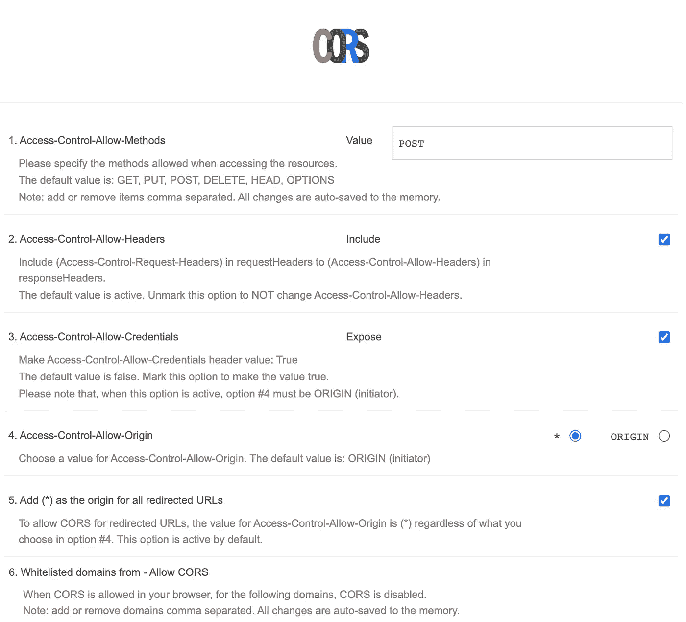

# 用谷歌 Chrome 扩展绕过 CORS

> 原文：<https://medium.com/geekculture/bypassing-cors-with-a-google-chrome-extension-7f95fd953612?source=collection_archive---------4----------------------->

我从未遇到过与 CORS 相关的问题，直到最近我在使用 JavaScript。话又说回来，总的来说，我和 CORS 打交道不多。

我对这个主题的唯一回忆是在过去的 Ruby 项目中探索 Gemfile。我想它是伴随着 Ruby on Rails API 的初始构建而来的，但是我现在还不能 100%确定。无论哪种方式，宝石都很容易添加。

只需将`[gem ‘rack-cors'](https://rubygems.org/gems/rack-cors/versions/0.4.0)`添加到 gem 文件中，并在命令行上运行一个`bundle install`。

## [跨产地资源共享(CORS)](https://developer.mozilla.org/en-US/docs/Web/HTTP/CORS)

“一种基于 HTTP 头的机制，允许服务器指示除其自身之外的任何其他来源(域、方案或端口)，浏览器应该允许从这些来源加载资源”-MDN

最常见的情况是当一个域/应用/网站向另一个域/应用/网站请求数据(通常是 JSON)时。

浏览器向托管跨来源资源的服务器发出“预检”请求，以检查服务器是否允许实际请求-MDN

这都是出于安全目的，比如防止恶意网站读取另一个网站的数据。它还阻止对“公共资源”的合法获取。

解决这个问题的方法是在请求的“头”和“体”中放置适当的信息，这些信息将决定在两个源之间交换什么数据。如果被批准，那么它就直接通过了。如果没有，那么你会得到一个错误信息。

## 我的第一条 CORS 错误消息

> 从原点' null '在['[https://some](https://some)-[api.com](http://api.com)获取的访问已被 CORS 策略阻止:对预检请求的响应未通过访问控制检查:请求的资源上不存在' Access-Control-Allow-Origin '标头。如果不透明响应满足您的需要，请将请求的模式设置为“no-cors ”,以便在禁用 cors 的情况下获取资源。

我还是不能 100%确定这一切意味着什么。这是否意味着 API 根本不允许请求？或者，我只需要在请求的标题中添加一些其他内容？

嗯，我把这个添加到我的获取请求头中…

```
Access-Control-Allow-Origin’:’*’
```

“*”意味着开放一切，基本上允许任何事情。如果我知道要指定什么，我会把它放在那里。

## 我的第二个 CORS 错误消息

> 在['[]https://some](https://some)-]从原点' null '获取的访问已被 CORS 策略阻止:对预检请求的响应未通过访问控制检查:' Access-Control-Allow-Origin '头包含无效值' null//undefined '。让服务器发送带有有效值的标头，或者，如果不透明响应满足您的需要，则将请求的模式设置为“no-cors ”,以便在禁用 cors 的情况下获取资源。

嗯，它不喜欢我的任何头迭代。

## 谷歌浏览器扩展

似乎有几个 CORS 扩展，但我选择了 [**允许 CORS:访问控制允许起源**](https://chrome.google.com/webstore/detail/allow-cors-access-control/lhobafahddgcelffkeicbaginigeejlf) 。

我尝试了选项页面上的设置，直到我得到一个不同的错误信息。因为，那是编程的一部分，对吧？



Allow CORS options page

将#4 从“原点”切换到“*”消除了之前的错误消息。但是，不是没有新的错误消息！

## 我的第三条错误消息

400 错误。因此，我认为它不会处理请求，因为客户端错误，如语法或请求路由。

## 结论

我花了一整天试图理解 CORS 并提出请求。这个谷歌 Chrome 扩展看起来非常方便，即使它没有完全解决我所有的问题。

我想我应该忘记 API，像 Postman 一样找到另一种方法来检查我的请求。

唉，改天吧。

## 来源

[](/ruby-daily/understanding-cors-when-using-ruby-on-rails-as-an-api-f086dc6ffc41) [## 将 Ruby on Rails 用作 API 时理解 CORS

### 如何处理跨产地资源共享错误，正确的方法

medium.com](/ruby-daily/understanding-cors-when-using-ruby-on-rails-as-an-api-f086dc6ffc41) [](https://web.dev/cross-origin-resource-sharing/) [## 跨产地资源共享(CORS)

### 浏览器的同源策略阻止从不同来源读取资源。这种机制可以阻止恶意的…

网络开发](https://web.dev/cross-origin-resource-sharing/)