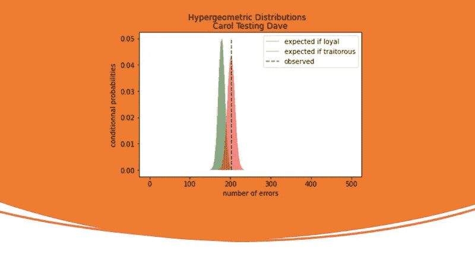
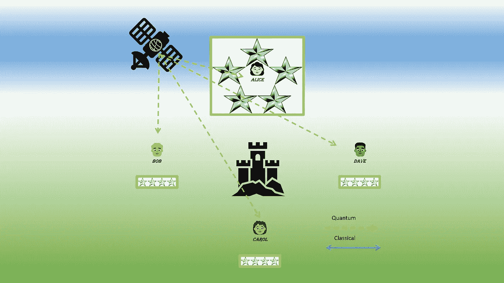
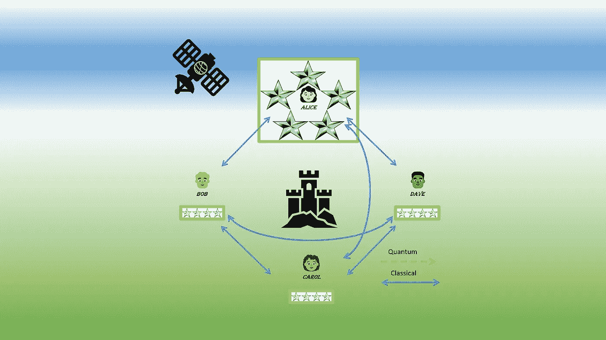
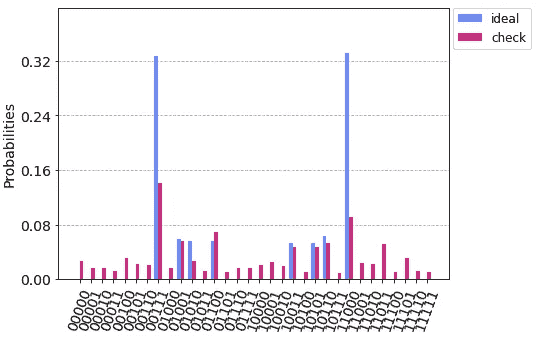
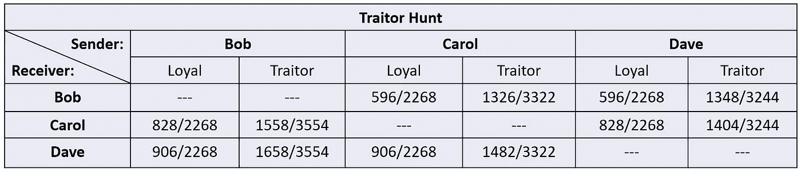
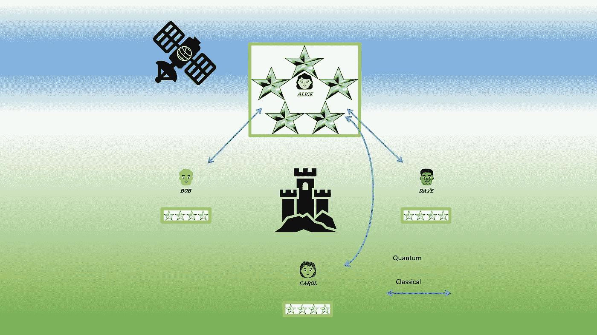
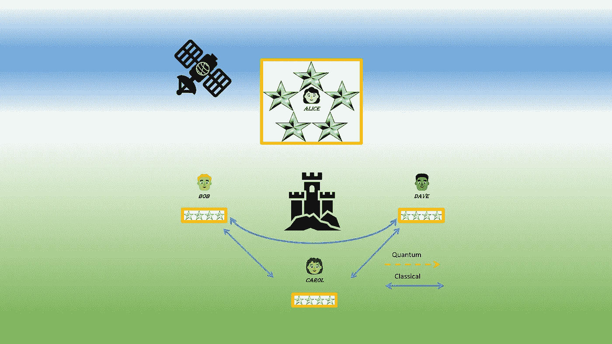
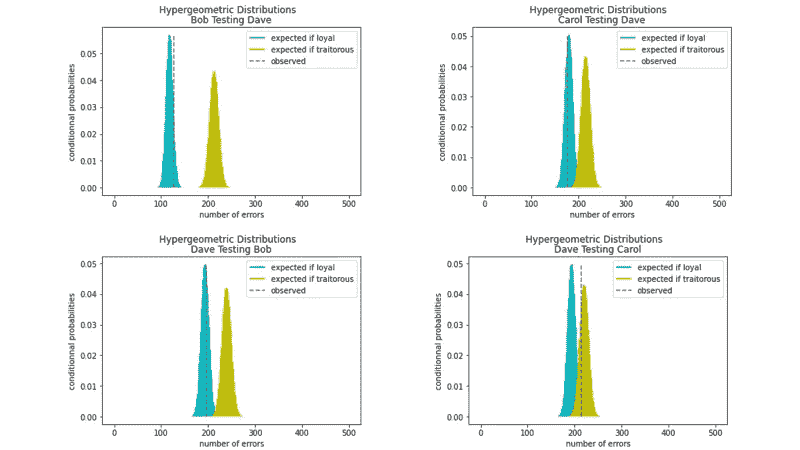
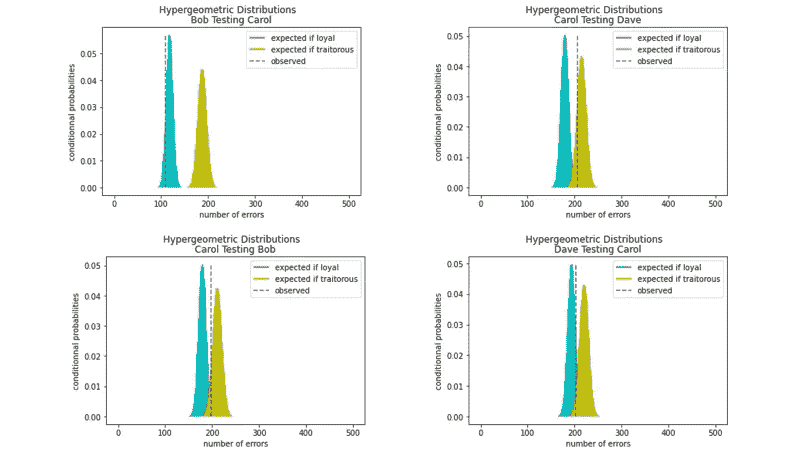

# 拜占庭将军求助于贝叶斯

> 原文：<https://medium.com/geekculture/byzantine-generals-turn-to-bayes-b76a695b124e?source=collection_archive---------7----------------------->

## 这一协议是从他们相互信任的程度中推断出来的。

Image by author.

在之前的一篇文章中，我描述了一个量子协议来解决四方的拜占庭将军的问题，能够揭露两个叛徒。

没有考虑到的一个事实是，双方可能对其他人的忠诚度有不同的看法。在分布式计算系统的协调问题中，远处的服务器可能比接收组件更频繁地出现故障。或者相反，服务器很少发生故障，而其他组件很容易出错。在另一个领域，区块链验证，各方可以选择基于工作证据或利害关系证据的先验信念。

在《拜占庭协议的量子解决方案》中，指挥官在发送信息的同时，提供了一个索引列表，供中尉们在追捕叛徒时使用。在理想的无噪声量子系统中，这些指数对应于各方拥有的完全相关的值。

然而，噪声在量子系统中是不可避免的(参见最近的这篇综述，[第一部分](https://learn.qiskit.org/summer-school/2021/lec3-1-noise-quantum-computers-1)和[第二部分](https://learn.qiskit.org/summer-school/2021/lec3-2-noise-quantum-computers-pt-2)，作者兹拉特科·米涅夫)。当一个高度纠缠态被重复测量时，观察到的经典结果的分布由量子态矢量控制，但受到噪声的影响。

对于一个假设的无噪声量子系统，事情很简单。在追捕叛徒的过程中，一个诚实的中尉从指挥官那里收到错误的命令，却没有犯任何错误。一个背信弃义的中尉一再犯错。随着噪音，一个忠诚的中尉开始犯错误，一个叛徒会犯更多的错误。随着噪音的增加，忠诚者和叛徒的区分变得越来越困难。解决这个问题的一个方法是使用贝叶斯推理，下面将会演示。还将展示贝叶斯定理的[扩展形式使得考虑中尉的先验信念成为可能。](https://en.wikipedia.org/wiki/Bayes'_theorem#Extended_form)

三将军拜占庭协议的量子解决方案，也被 Adán Cabello 创造为**[骗子检测问题](https://arxiv.org/pdf/quant-ph/0210079.pdf)，[已经在一个真实的光子量子系统](https://arxiv.org/pdf/0710.0290v2.pdf)上演示。最近，Zoltán Guba 等人[展示了其在噪声中等规模量子(NISQ)设备上的可行性](https://arxiv.org/pdf/2207.04939.pdf)。**

**这里是一个运行在 ibm-oslo 系统上的贝叶斯量子*四通用*解决方案的演示，该系统最近被添加到 [IBM 量子](https://www.ibm.com/quantum)计算资源中。拍摄数量(份数)为 8192。与我以前尝试的 5 量子位系统不同，7 量子位 ibm-oslo 允许在所有可能的情况下检测叛徒。主要软件是用于 Python 编程的开源 [Qiskit](https://qiskit.org/) 包。让我们快速回顾一下我在[上一篇文章](/geekculture/byzantine-generals-turn-to-quantum-ab81bd938cc2)中描述的不同阶段，强调最终贝叶斯拜占庭协议的要点。**

## **纠缠量子比特的分布**

****

**Image by author.**

**量子比特五元组是纠缠的，通过量子通道发送，局部测量。总司令收到两个量子位，每个中尉收到一个量子位。测量后，各方都有一个有序的位串列表。应用了“拜占庭缓解”。这减小了两个可能的爱丽丝订单的噪声水平的差异。它包括翻转列表中具有偶数索引的每个位串。**

**当然，我们可以摆脱所有这些量子的东西。结果的分发可以委托给一个独立的机构，它将通过安全的经典渠道发送等效的模拟完美列表。然而，窃听者可以截取和篡改数据。或者中情局内部的一个内奸会复制爱丽丝的名单并把它传给叛变的副手。**

**协议的量子部分避免了这种危险。付出的代价是噪音:对于一些五胞胎来说，预期的相关性没有达到。这就是贝叶斯方法显示其有效性的地方。**

## **检查缠结**

****

**Image by author.**

**请记住，在这个阶段，每个列表只有其所有者知道。爱丽丝的名单大约是' 00 '(撤退)的⅓，' 11 '(攻击)的⅓，' 01 '或' 10 '(陷阱)的⅓。一个中尉的名单大约由 50 个“1”(撤退)和“0”(攻击)组成。**

**双方将随机抽取的经典结果的一小部分用于核对。这构成了“试验数据集”。每一方对她/他剩余的“游戏数据集”保密，以备后用。**

**各方验证试验数据中的位串分布合理地接近假设的无噪声系统的理想分布。为此，一个可能的度量标准是经典的海灵格保真度。如果该检查失败，则协议中止。**

****

**Histogram of classical results obtained in ibm-oslo. Comparing the distribution of the trial data to the ideal distribution, the Hellinger fidelity is 49% …and it worked! Image by author.**

**此外，试验数据集允许估计在叛徒搜寻过程中预期的每交换次数的误差。双方模拟了每一种可能性。他们获得了一个关联表，该表定义了与每种情况相关联的超几何分布的参数。由于拜占庭式的缓解，可以将两个可能的 Alice 订单的值合并在一起。**

****

**Table: the number of errors per number of exchanges expected from an analysis of the trial data set. The samples come from a set of 4094 copies drawn from 8192 obtained on ibm_oslo. Image by author.**

## **发送订单**

****

**Image by author.**

**爱丽丝发出命令(进攻或撤退)，并附有一组匹配的索引*。按照惯例一套有长度 ***N*** ，有 ***N*** ≪的游戏数据套中的份数。如果爱丽丝是诚实的，她应该把同样的一套送给各方。如果她是一个叛徒，她会给一个副手发送一个不和谐的命令，以及与之匹配的集合。***

## ***贝叶斯拜占庭协议***

******

***Image by author.***

***中尉们互相交流他们声称收到的订单。两个声称相同的中尉不会在狩猎中面对面。相反，他们将轮流绘制和发送从 Alice 接收的列表的索引。如果两个列表中的某些索引不相同，则表示不一致，协议中止。***

***两个说法不一致的中尉参与了一个游戏，玩家轮流发送索引。一个拒绝比赛的中尉暴露了他在撒谎。***

***发送的索引必须在接收者列表中指向发送者声明的期望值。每个玩家计算对手在 ***N*** 回合中的错误次数 ***x*** 。***

***背叛者无法访问所做声明的正确索引集。他必须在更大的集合中画出**【ₐ】*，这个集合补充到*【sₗ】。否则，他就背叛了自己。叛徒排除了不良候选人，**中的指标与索赔不对应。然而，错误数 ***x*** 无论如何都将高于忠诚度:叛徒无法知道剩余的索引中的哪一个对应于原始 Alice 列表中的陷阱。*******

****在游戏结束时，玩家使用贝叶斯方法来解释结果。中尉最初的信任度包括统计上的几率 *oₐ* 支持指挥官是叛徒而不是面对的中尉。赔率为 *oₗ* 与 *oₗ ×* *oₐ =* 1。那么，关联的先验概率就是*p(a)*=*oₐ/*(*oₐ*+1)。面对的中尉是叛徒的先验概率是 *P( A)* = 1 - *P(A)* 。****

****现在让我们用 *P(B)* 来表示在 ***N*** 运行中观察到 ***x*** 错误的概率。从试验数据集中，这位忠诚的中尉从出错次数表中得到错误次数***【nₗ】********【nₐ】****(否则)分别为预期的*和 ***Mₐ*** 交往。观察到 ***x*** 错误后，这位中尉使用开放访问 [scipy stats 离散超几何模块](https://docs.scipy.org/doc/scipy/tutorial/stats/discrete_hypergeom.html)来估计条件概率:********

*   *****P(B|A) =* 超几何( ***Mₐ*** ， ***nₐ*** ， ***N*** )。PMF(**xT79)******
*   *****p(b | a*)= hypergeom(****mₗ***， ***nₗ*** ， ***N*** )。PMF(**xT99)。*******

****忠诚的中尉使用贝叶斯推理来计算后验概率:****

*****P(A | B)= P(B | A)×P(A)/{ P(B | A)×P(A)+P(B | A)×P(A)}*****

****一个忠诚的中尉断定对手是忠诚的为*【A | B】**>*还是叛徒为*【A | B】**<*。********

****下面是两个追捕叛徒的例子。你能暂停阅读，找出每个例子中有多少个叛徒和谁吗？假设所有游戏的赔率都是 1:1。解决方案将在下一节介绍。提示:你不必计算概率。遵循逻辑推理即可。****

********

****First example of a traitor hunt. Entanglement on ibm_oslo. Image by author.****

********

****Second example of a traitor hunt. Entanglement on ibm_oslo. Image by author.****

> ****剧透:这两个例子的解决方案都将揭晓！****

****在第一个例子中，Bob 和 Dave 互相测试，发现他们都很诚实。但是戴夫，测试卡罗尔，发现她是一个叛徒。卡罗尔关于戴夫诚实的结论与叛徒没有发言权的最终协议无关。Bob 和 Dave 会按照 Alice 发送的不同顺序吗？当然不是，因为他们知道她也是一个叛徒，因为相反的命令已经到达。但这里有一个四将军协议的优雅解决方案:要成为一个有效的叛徒，爱丽丝只需欺骗一个中尉，这里是鲍勃，因为骗子卡罗尔声称收到了与鲍勃相同的命令。因此，在戴夫的帮助下，鲍勃将遵循戴夫从爱丽丝那里收到的真正命令。****

****在第二个例子中，当卡罗尔测试鲍勃和戴夫时，她发现两人都是叛徒。当鲍勃和戴夫测试卡罗尔，他们发现她是诚实的(再次无关叛徒目击)。如果卡罗尔没有先入为主的想法，她会按照《拜占庭容错》中的要求，按照爱丽丝收到的顺序来做。****

****后一个例子中的另一个场景可以说明一个可能的问题。卡罗尔对鲍勃和戴夫过于自信。受两个同事的影响，她变得非常怀疑爱丽丝。让爱丽丝下令攻击。鲍勃和戴夫会设法通过对卡罗尔撒谎来救出爱丽丝。实际上，使用 P(A) ≫ P( A)的值，卡罗尔推断爱丽丝是叛徒。三名中尉开始撤退。这种情况可以很容易地通过改变我的 Jupyter 笔记本中的先验概率来模拟(注意，如果 Alice 是叛徒，而所有的中尉都是无辜的，那么这次会达成相同的协议并且是正确的)。****

****也有一些镜像案例，对指挥官的过度信任会给一个无辜的中尉带来厄运。****

****这些问题可以通过递归贝叶斯更新来避免，如果在分布式计算系统中应用这样的协议，则应该考虑递归贝叶斯更新。****

## ****结论****

****在一个概念验证中，使用七个量子位的 NISQ 系统成功实现了四将军拜占庭协议的贝叶斯量子解决方案。****

****这种解决方案考虑到了中尉们之间以及对指挥官的信任程度。当检查纠缠时，性能受益于详细的噪声分析和所有可能情况的模拟。在这一阶段，会绘制一个错误发生表，这将有助于检测叛徒。因此，噪声的影响被最小化，并且贝叶斯拜占庭协议可以更有把握地实现。****

****有两个以上中尉的协议的一个优点是当指挥官犯错时达成共识。即使中尉也有过失，也会发生这种情况。****

****我承认使用 IBM Quantum services 进行硬件测试。所表达的观点仅是作者的观点，并不反映 IBM 或 IBM Quantum 团队的官方政策或立场。****