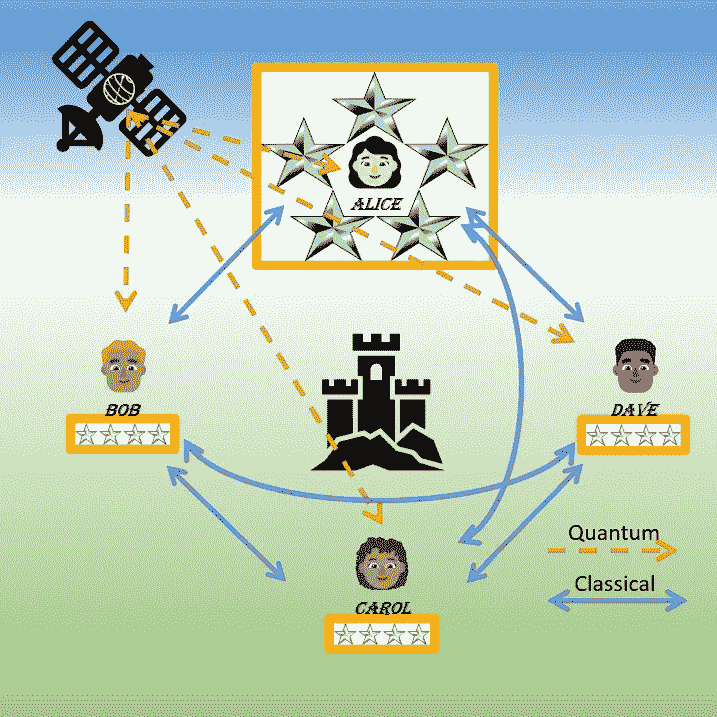
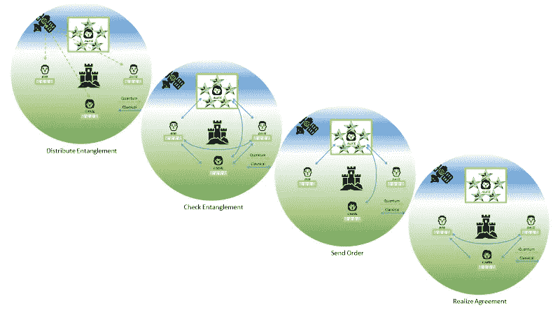
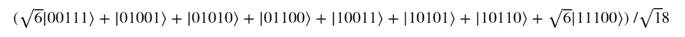
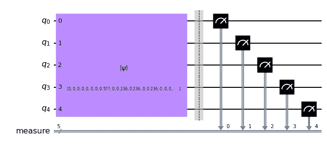
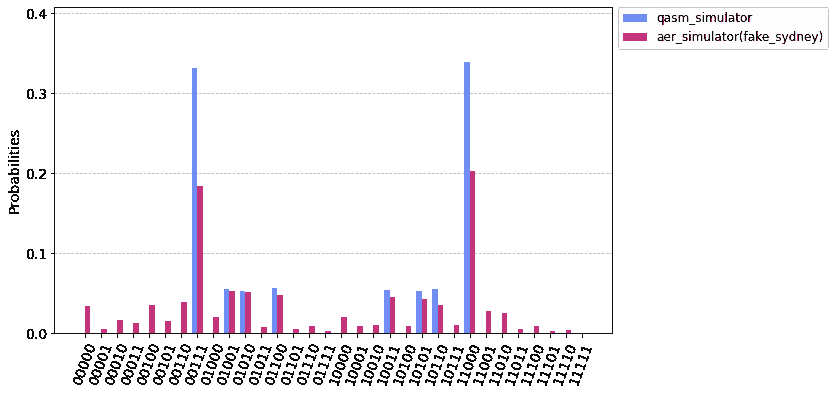
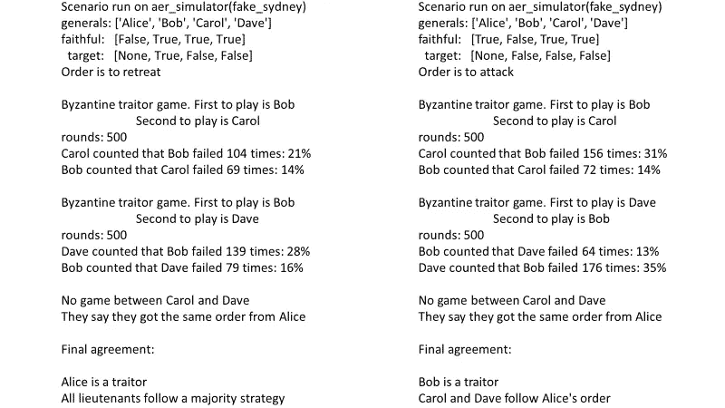
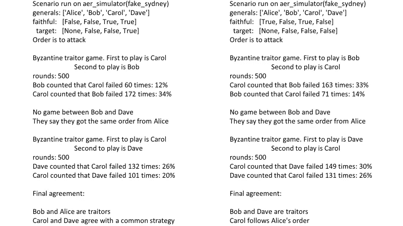
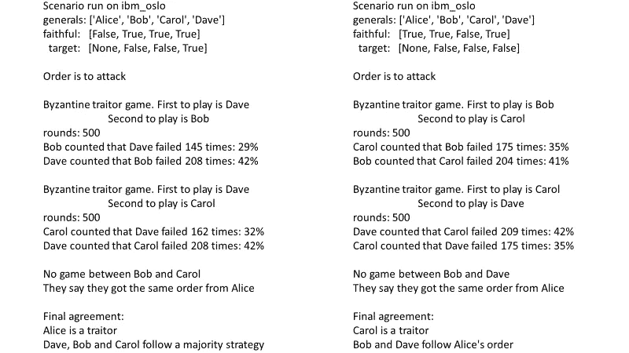
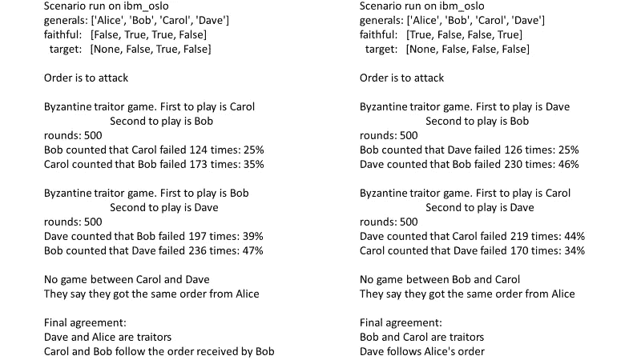

# 拜占庭将军转向量子

> 原文：<https://medium.com/geekculture/byzantine-generals-turn-to-quantum-ab81bd938cc2?source=collection_archive---------5----------------------->

## 四岁时，他们立刻揭露了其中的两个叛徒



Image by author

在谷歌搜索框中输入“拜占庭将军”，当我写这篇文章时，你会得到大约 27，000，000 个结果。你可以想象这些条目中的大部分都不是关于历史上的拜占庭军事人员。事实上，正如 1982 年在 Lamport 等人的开创性论文中提出的“拜占庭将军问题”在容错计算、分布式计算机系统、区块链、金融和加密货币等领域有着广泛的应用。

莱斯利·兰波特这样定义这个问题:

> 我们想象拜占庭军队的几个师驻扎在敌人的城外，每个师都由自己的将军指挥。将军们只能通过信使相互交流。观察敌人后，他们必须决定一个共同的行动计划。然而，一些将军可能是叛徒，试图阻止忠诚的将军达成协议。

在这个拜占庭协议中，*广播是在决策过程结束时满足两个条件时实现的:*

> 1.所有忠诚的将军都同意一个共同的行动计划。
> 
> 2.如果统帅是忠诚的，那么所有忠诚的
> 将军都会同意统帅的计划。

一个重要的结论是，少于 3 个将军的经典解决方案无法对付 m 个叛徒。

对于三个将军，没有经典解，而对于四个将军，经典解只允许检测一个叛徒。

最近 Fitzi，Gisin，Maurer 发表的一个基于 qutrit 的量子[协议，在三个将军对付一个叛徒的情况下，解决了这个问题。这是可能的，因为量子物理的怪异性质。在量子计算中，一个信息单位，量子位或更奇特的量子位，永远不能被克隆，不像经典计算中的对等物，比特或量子位，可以无限制地复制。相反，](https://arxiv.org/pdf/quant-ph/0107127v1.pdf)[隐形传态](https://en.wikipedia.org/wiki/Quantum_teleportation)允许量子信息的远程传输，最终通过[空间尺度的量子实验](https://en.wikipedia.org/wiki/Quantum_Experiments_at_Space_Scale)展示了安全的密钥分配。

拜占庭协议的量子解决方案和[量子密钥分发](https://en.wikipedia.org/wiki/Quantum_key_distribution) (QKD)之间有着明显的相似之处，后者是一种已经处于商业状态的安全加密技术。这在 Fitzi、Gisin 和 Maurer 的文章中有明确的表述:

> 首先，量子态“仅”用于将经典私有随机变量分配给 3 个玩家(每个玩家一个 trit，每个 trit 具有不同的值，所有组合具有相同的概率)。这类似于量子密码术，其中量子力学“仅”提供密钥分发。

基于物理量子[的量子计算系统在今天已经很少见了。然而，使用物理量子比特来模拟量子比特是可能的。一个 f](/rigetti/beyond-qubits-unlocking-the-third-state-in-quantum-processors-12d2f84133c4) [our-qubit 单态](https://arxiv.org/pdf/quant-ph/0210079.pdf)是由 Adán Cabello 提出的，并使用四光子纠缠进行了[实验验证](https://arxiv.org/pdf/0710.0290v2.pdf)。Zoltán Guba 等人在 [IBM Q 和 IonQ 设备](https://arxiv.org/pdf/2207.04939.pdf)上演示了该协议。

可以想象类似的解决方案，有四个不同纠缠态的参与方。这种扩展到四名将军的好处是，当指挥官是唯一的叛徒时，协议现在是由三名中将之间的*多数共识*达成的。

> 在模拟器和 IBM Quantum online 系统上进行测试后，这里给出了一个五量子位的解决方案，可以处理多达两个叛徒。

# 量子解的协议

让我们详细介绍四个阶段:



From upper left to lower right: 1\. Entangled qubits are distributed through quantum channels. 2\. The parties use classical bidirectional channels to check if the entanglement has not been corrupted. 3\. The commanding general sends orders and corresponding verification lists to the lieutenants through classical unidirectional channels. 4\. The lieutenants use classical bidirectional channels to realize an agreement. Image by author.

## 1.分布式纠缠量子位

量子比特的纠缠可以留给任何一方或者外部代理。这就避免了不公平裁判或内部臭名昭著的敌人的问题。这是可行的，因为纠缠在下一阶段被所有各方验证，这是 QKD 验证的对等物。

产生了数量为 **M** 的量子位五元组。量子位处于以下量子状态:



对于每个五胞胎，前两个量子位(从等式左边数起)被分配给指挥官爱丽丝将军，剩下的三个量子位分配给中将鲍勃、卡罗尔和戴夫。将军们在泡利-Z 基础上测量量子位。它们不共享任何结果，而是各自获得一个有序的位串列表。

在理想的无噪声量子系统中，四个列表相互关联，使得对于给定的指数:

*   当爱丽丝持有‘00’时，所有中尉都持有‘1’。
*   当爱丽丝持有‘11’时，所有中尉都持有‘0’。
*   当爱丽丝持有‘01’时，随机一个中尉持有‘1’，另外两个中尉持有‘0’。
*   当爱丽丝拿着' 10 '时，随机有一个中尉拿着' 0 '，其他两个都拿着' 1 '。

## 2.检查缠结

双方证实纠缠是正确的。为此，它们通过传统的双向通道进行通信。

然后，每一方从商定的范围中选择一个任意整数。它们相互传递这些整数。在本地，他们从他们的列表中抽取 **M-N** 位串，使用四个整数的和作为种子。他们将这些测试列表放在一个公共寄存器中。

四方检查测试列表是否与纠缠一致相关。

如果是这样的话，他们估计量子系统在未来游戏中的预期错误率，如果它是嘈杂的。这些比率特定于每对可能的中尉。对于给定的中尉，如果她/他是叛徒，他们会更高。

最后，由测试后剩余的位串组成的列表被转换成长度为 **N** 的整数列表:

*   在爱丽丝的列表中，‘00’变成了 0(‘撤退’)，而‘11’变成了 1(‘进攻’)。位串“01”和“10”变成 2(“陷阱”)。
*   在中尉列表中，“1”变成 1，“0”变成 0。

正如卡贝罗提出的[三总协议](https://arxiv.org/pdf/quant-ph/0210079.pdf)中一样，这四个列表中的每一个都是随机的，与其他三个列表相关，并且每一方只知道她/他的列表。量子独有的，协议基础上的纠缠向每个将军保证它确实如此。

## 3.发送订单

从这里，再见量子世界。

爱丽丝单独地秘密地给中尉们发送一个命令，要么是“撤退”(0)，要么是“进攻”(1)，以及一个相应的索引列表。命令是一样的，除非爱丽丝是叛徒。

每个中尉为每个索引确定该条目是否错误地匹配订单。如果他们看到许多匹配，他们会认为 Alice 的订单不一致，而不采取任何行动:这违反了协议，没有达成协议。请注意，当任何中尉收到一个长度没有合理限制在 **N/3** 左右的列表时，该协议也会被放弃。

## 4.达成一致

中尉们互相通报收到的命令。他们检查它们是否都相同。如果是这样，它们就执行爱丽丝的命令，广播就完成了。

否则，将军中至少有一个叛徒。当两个中尉报告不同的命令时，每个人都必须证明她/他所说的。为此，他们都开始了回合制游戏。玩两个游戏是因为所有的游戏场景都包括两对向彼此发出不同指令的游戏。

每场比赛，玩家抽签决定谁先开始。他们轮流发送一个索引，其在对手列表中的对应条目必须与他们所说的收到的顺序相反。每个玩家计算错误。没有索引被使用两次。当玩家发出一个停止标志，表示她/他的匹配索引列表用尽时，游戏结束。并且在预先约定的回合数之后仍然结束(这证明了轮流而不是在一次移动中交换列表是合理的)。

这个叛徒追捕的细节可以在我的解释性 [Jupyter 笔记本](https://github.com/pdc-quantum/byzantine-generals-in-qiskit/blob/main/game-scenarios-byzantine-agreement.ipynb)中找到，还有 [Python 代码](https://github.com/pdc-quantum/byzantine-generals-in-qiskit/blob/main/byzantine-agreement.ipynb)收集了三个和四个将军的解决方案。

每个场景都实现了广播。

## 噪声量子系统的更现实情况呢？

在一场比赛结束时，每个中尉将对手犯下的错误数 ***x*** 与期望值进行比较。知道了回合数 ***r*** ，他们使用[超几何分布](https://docs.scipy.org/doc/scipy/tutorial/stats/discrete_hypergeom.html)来计算观察到 ***x*** 对手是否是叛徒的概率。或者，他们可以使用****x/r***和两个期望值之间的距离(平方欧几里得距离和詹森-香农距离是用于此目的的良好候选)。*

*因此，在噪声系统中也能实现广播。然而，需要更长的清单。*

# *在 Qiskit 中测试协议:*

## *建立量子电路*

*使用开源的 Qiskit 包是轻而易举的事情！在下面的片段中，首先定义了对应于纠缠的状态向量。根据这个向量，五个量子位的电路被初始化。泡利-Z 基中的测量结果在五个经典寄存器中给出。*

**

*Image by author.*

## *模拟器测试:*

*[设备后端噪声模型模拟](https://qiskit.org/documentation/tutorials/simulators/2_device_noise_simulation.html)是 Qiskit 的一大特色，用于测试该解决方案是否能在 IBM Quantum 中任何可在线访问的设备上工作。该协议在所有可能的场景中都通过了 FakeSydney 上的测试。*

**

*Distribution of the measurements obtained on a noise-free simulator and FakeSydney with 8192 shots in the case of four generals. Image by author.*

*模拟器上有一个叛徒的场景:*

**

*Image by author.*

*模拟器上有两个叛徒的场景:*

**

*Image by author.*

## *硬件测试*

*(2022 年 7 月 7 日编辑)*

*该协议首先在 5 量子位在线系统上进行测试，在某些情况下检测到不正确的叛徒:由于缺少辅助量子位，量子电路的深度增加了。七量子位 ibm-oslo 系统的接入解决了这个问题，该系统于 2022 年年中加入了 [IBM Quantum](https://www.ibm.com/quantum) 计算资源。*

**

*Distribution of the measurements obtained on a noise-free simulator and ibm-oslo with 8192 shots in the case of four generals. Image by author.*

*硬件上有一个叛徒的场景:*

**

*Image by author.*

*硬件上有两个叛徒的场景:*

**

*Image by author.*

# *前景*

*量子计算在硬件和软件方面的不断进步让人们有希望在具体情况下使用该协议。人们可以想象更有效的专用系统，包括足够数量的量子位，包括辅助设备，以及具有明智连接的布局。*

*然而，通往现实世界应用的道路需要解决一些问题和测试选项。讨论原因和方法超出了本文的范围。[应考虑采用缓解](https://arxiv.org/pdf/2110.05389.pdf)的方法来纠正噪声设备的结果。例如，在这里测试的协议中，用偶数索引翻转列表中的每个位串可以有效地平衡错误率。另一个要点是在整个过程中保持安全传输。*

# *结论*

*Qiskit 中对该协议的演示超出了简单的思想实验。测试是在经典计算机和在线量子系统上使用模拟进行的。然而，现实生活中的应用程序的实现将是一个重大的技术挑战。*

*这个四将军拜占庭协议的量子解决方案告诉我们，除了抵御窃听者 Eve 之外，基于量子的方法可以帮助我们所有人，Alice，Bob，Carol，Dave 和其他人，验证信息，同时保持安全，免受内部可能的敌人的攻击。在一个信息共享日益分散的世界，这种量子方法可能是有价值的，比如在与区块链的担保交易中。*

*我承认使用 IBM Quantum services 进行硬件测试。所表达的观点仅是作者的观点，并不反映 IBM 或 IBM Quantum 团队的官方政策或立场。*

```
*In a [following article](/geekculture/byzantine-generals-turn-to-bayes-b76a695b124e), a Bayesian solution is presented which takes into account the degree of confidence of the lieutenants between themselves and towards the commanding general.*
```