# C# 8.0 默认接口实现:虚拟扩展方法视角

> 原文：<https://medium.com/geekculture/c-8-0-default-interface-implementations-virtual-extension-methods-perspective-55832075c59a?source=collection_archive---------19----------------------->

# 界面传记

众所周知，接口是编程语言结构，它赋予了创建松耦合软件应用程序的模型以力量。我们认为接口是类之间的契约，这实际上意味着它们提供了“即插即用”的可维护、可测试和可扩展的架构。考虑到指纹的相似性，我们可以同意这些语言结构根本不支持或提供任何类型的多重继承。一些开发人员仍然有一个很大的误解，认为这个概念是多重继承的基础。事实上，这是一个编程神话和根本的误解。接口不包括实现，所以没有代码逻辑可以继承。

但是，纵观 C# 8.0 语言版本的上下文，默认的接口实现正在路上。请继续阅读，找出关键要点和其他实用解释。

# 现实生活中的常见用法

接口目前最常见的用法是提供多态行为，定义面向对象范例的概念支柱之一——多态。我们还可以认识到众所周知的架构设计和开发现代软件应用程序的原则所带来的好处。考虑以领域为中心的架构和使用接口后的关注点分离。因此，很容易理解我们在谈论只由方法签名组成的接口。让我们简化这个故事，分离出一点。

从复杂的应用程序架构中提取一个接口意味着我们有一个或一组刚刚定义的方法。没有实现，完全没有逻辑。因此，遵循 OOP 的规则，我们有很多具体的类来实现这个接口。实现是自描述的；我们提供合同设计后的实施。此外，架构的这一部分，或者更好地说，应用程序的这一层，可以被其他应用程序或库使用。一切都正常工作，一切都正常运行。太好了！但是，当在某个后期阶段我们需要在接口中再添加一个方法签名时，会发生什么呢？没什么大不了的，我们添加了方法名和参数，但是现在编译器说我们需要在每个实现接口的类中实现。没什么大不了的，我们实现了新添加的方法，但是当我们有一个不需要这个方法实现的类时会发生什么呢？如果其他开发人员正在实现接口，但是没有理由为这个额外的方法编写额外的逻辑，该怎么办？这是一个突破性变化的迹象，这不是好的编程消息。

# C# 8.0 默认实现正在运行

C# 8.0 通过引入默认接口实现的概念来解决这种情况。等等，什么？接口内的方法实现，没错。使用**微软 Visual Studio 社区 2019 IDE 版本 16.1.2** 和**。NET Core 3.0 SDK** 与 **C# 8.0** 版本我们将通过一些用例来展示该功能的强大之处，它实际上正在改变我们当前的编码例程。为了简单起见，我们将使用日志记录器案例场景。

首先，让我们考虑如何设计日志活动，或者更准确地说，如何在应用程序中隔离一组活动。通常，我们可以设计日志机制来跟踪控制台和数据库中的流。与此同时，我们正在关注灵活性、使用依赖注入的概念和未来的位置、可测试性等等。在这种情况下，我们将写下两个不同的接口，定义如下:

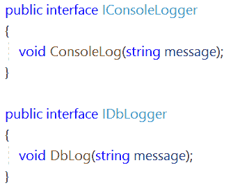

当然，设计这样的实现还有其他方法，例如，只创建一个 ILogger 接口进行建模。但是，让我们把重点放在这个简化的分段上，这意味着我们将避免额外的不同方法定义，这些方法定义对特定的日志记录方式进行建模。让我们分别创建实现接口和提供业务逻辑的 Logger 类。

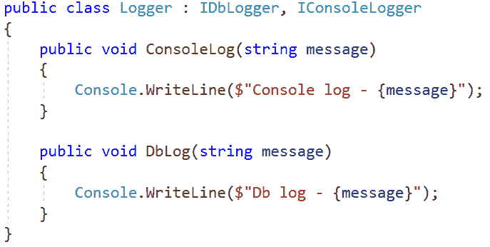

到目前为止，一切顺利。请记住，为了简单起见，Db 日志记录是在控制台上实现的。我们现在不深究逻辑目的。重点是别的。

现在，如果我们想用一个额外的方法来扩展 IConsoleLogger，以便用指定的颜色记录 INFO 消息，该怎么办呢？但是并不是所有的用户都希望仅仅为了颜色而实现额外的逻辑。我们刚刚决定，即使在已经创建的 Logger 类中，我们也不需要显式实现。C# 8.0 使这成为可能。利用默认接口实现的优势，我们现在可以执行以下操作:

等在那里，直接在接口中代码体？是的，没错。所以现在，如果 Logger 类没有显式实现新添加的更改，就不会出现编译时错误。实现该接口的所有类都没有编译错误。我们可以用默认实现来实现方法的逻辑，但我们不是“被迫”这样做的。这意味着在代码层次结构中不会有突破性的变化。

这里重要的一点是，如果我们决定不实现一些默认的接口实现，那么这个方法就不能通过具体类的对象实例来访问。

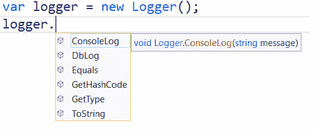

因此，ConsoleLogInfo 方法不是 VS intellisense 提供的建议。**访问默认接口代码块实现的唯一方法是将类对象转换成接口类型**。

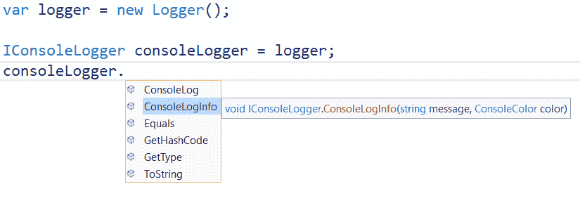

此外，我们可以使用默认逻辑，例如，如果我们有一个输入参数被定义为接口类型的方法。一个简单的类比如下:

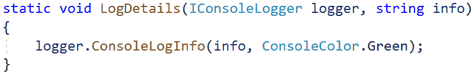

现在，让我们让事情变得更令人兴奋。想象一下，我们在两个接口中都定义了新的 LogTimeStamp 方法。除了消息之外，这个方法还会记录当前的日期和时间。尽管签名是相同的，但是我们有一个清晰的场景，因为方法被隔离在不同的接口范围内。

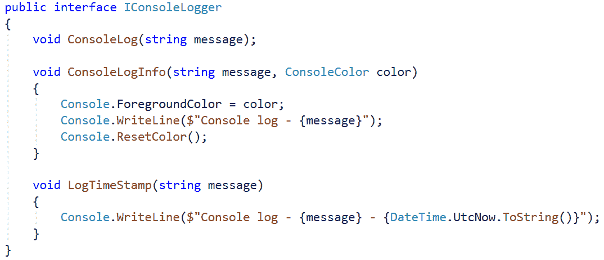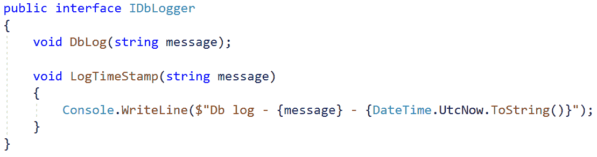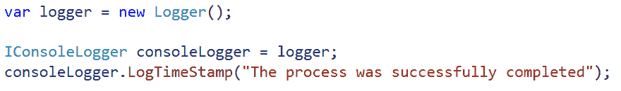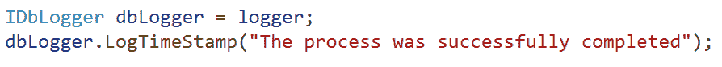

# 应对多重继承和钻石问题的挑战

但是我们可以同意，这个简单的方法可以随着实现另一个接口的需要而发展，该接口将继承现有接口的方法。而且，我想你们中的一些人已经在考虑用 IConsoleLogger 和 IDbLogger 中已经存在的相同签名来定义和实现一个方法的可能性。

例如，IMonitoringLogger 定义如下:

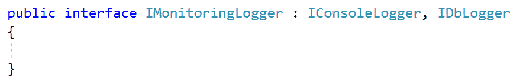

让我们继续代码实现，并创建另一个实现该接口的 MonitoringLogger 类。

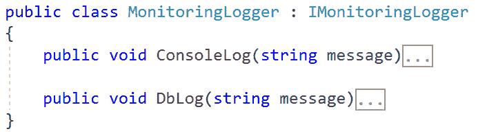

现在，如果我们试图创建 MonitoringLogger 对象并根据上下文将其转换为 IMonitoringLogger，我们可能会陷入一个**‘可能有问题’**的场景，不知道是否可以调用 LogTimeStamp 方法。

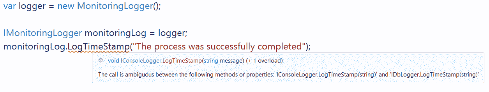

即使在这种情况下，我们也将面临编译器给出错误的防御机制，该机制阻止了这种不明确的流程。

通过对众所周知的**钻石问题**或**致命死亡钻石**的解释，可以发现另一种有趣的思维方式。这与多重继承的概念密切相关，事实上 C#编程语言不支持多重继承。因此，让我们创建另一个 ISimpleLogger 接口，并设计默认的日志记录功能。

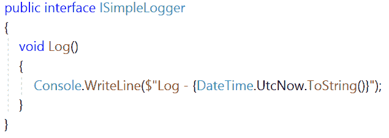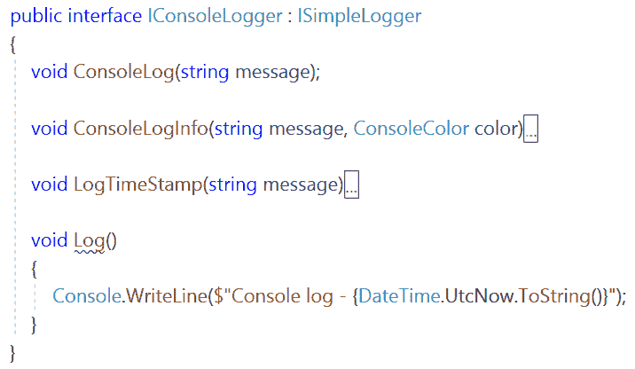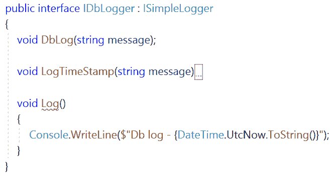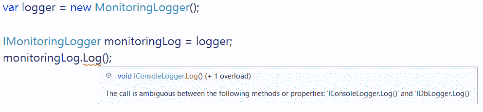

同样，我们正在处理编译时错误，这意味着编译器将防止由于潜在的菱形问题导致的不可预测的后果。我们当然可以通过简单地在 IMonitoringLogger 接口中提供 Log 方法的实现来解决这个问题。在这种情况下，我们不再面临编译时错误。 **C# 8 强制最具体的覆盖规则**。

# 最后的话

一般来说，提供这一特性的主要原因实际上是接口扩展的可能性，而不会破坏现有的遗留代码逻辑和结构。默认实现被认为是设计我们现有解决方案的新“时代”,因为它们提供了向我们的代码库注入方法和逻辑的另一种方式。但是，与此同时，这一特征被认为是“热门话题”和讨论点。有不同的看法和解释。

与抽象类的概念相比，这里我们有可能在多个接口中实现逻辑，这些接口将由一些具体的类来实现。在抽象类的情况下，由于 C#中不支持多重继承的规则，我们只限于该类。所以，我认为我们有选择和灵活性。我个人认为，在复杂的遗留代码基础上设计和扩展现有的功能是可行的，在遗留代码基础上有许多引用和互补关系。一个标准的做法是将接口分成更小的方法签名块。但是，在这之后，最常见的场景是允许在另一个接口中继承一些方法签名。因此，使用这种语言的虚拟扩展视角可以解决设计挑战的一部分。

还有另一个角度。甚至在 8.0 版本之前，IL 也支持这个特性吗？实用实验和 IL 观点可以在 [Gunnar Peipman 的博文](https://gunnarpeipman.com/csharp/interface-default-implementations/)中找到。

随着官方[微软文档教程](https://docs.microsoft.com/en-us/dotnet/csharp/tutorials/default-interface-members-versions)的发布，事情逐渐明朗。

**最后，理解这个特性的目的的最好方法是什么？它是扩展现有功能应用程序模块的一种新的强大方式，还是未来进一步发展的另一个候选方式？**

考虑到上一次[微软构建大会](https://www.microsoft.com/en-us/build)上展示的所有新闻、想法和计划，我们应该同意许多有趣和令人兴奋的 C#观点即将到来。

— — — — — — — — — — — —

感谢您阅读我的文章。

期待你下面的想法。请随意分享你对这个话题的看法。

*最初发表于*[*https://www.linkedin.com*](https://www.linkedin.com/pulse/c-80-default-interface-implementations-virtual-extension-cekikj/)*。*