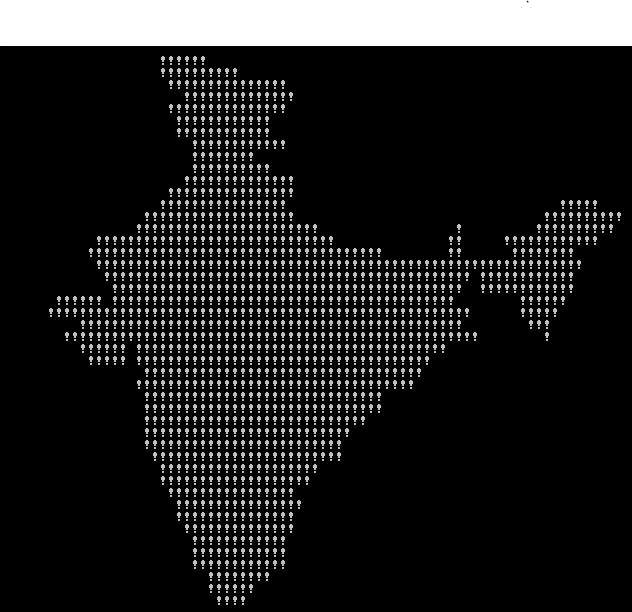

# 绘制印度地图的 C++代码(也可能是其他国家)

> 原文：<https://medium.com/geekculture/c-code-to-draw-an-india-map-and-maybe-other-countries-too-9b0236f76d40?source=collection_archive---------27----------------------->



嘿，读者，尽管疫情给了我们“坐在家里无所事事，后悔你的人生决定”的想法，希望你过得好。

今天的帖子很小，但是很有趣。希望你很兴奋，那就开始吧！

先决条件:在你的设备上复制粘贴功能，或者你也可以重新编写整个代码

**注:我不拥有这个代码，只是在互联网上找到它，并想分享它。**

试着运行代码，它看起来很漂亮！

以下代码在执行时会生成印度地图:

```
#include <stdio.h>int main(){ int a,b,c;
    int count = 1; for ( b=c=10 ; a=”- FIGURE?, UMKC,XYZHello Folks,\TFy!QJu ROo
    TNn(ROo)SLq SLq ULo+\UHs UJq TNn*RPn/QPbEWS_JSWQAIJO^\
  NBELPeHBFHT}TnALVlBLOFAkHFOuFETp\HCStHAUFAgcEAelclcn^r^r\\tZvYxXy\
    T|S~Pn SPm SOn TNn ULo0ULo#ULo-W\Hq!WFs XDt!” [b+++21] ; ){ for(; a → 64 ; ){//This loop draws individual characters, and a newline whenever it reaches the end of line putchar ( ++c==’Z’ ? c = c/ 9:33^b&1);
        } 
    }
    return 0;
}
```

有点复杂，对吧？

注意编码字符串末尾的[b+++21]。由于 b++ + 21 等效于(b+++21 ),其计算结果为 31 (10 + 21 ),因此该字符串的前 31 个字符将被忽略，不会产生任何影响。剩余的编码字符串包含绘制地图的指令。单个字符决定了要连续绘制多少个空格或感叹号。

好了，让我们来看看稍微简单一点的代码:

```
#include <iostream>
**using** **namespace** std;
**int** main(){ **int** a = 10, b = 0, c = 10; // The encoded string after removing first 31 characters **char*** str = "TFy!QJu ROo TNn(ROo)SLq SLq ULo+UHs UJq "
    "TNn*RPn/QPbEWS_JSWQAIJO^NBELPeHBFHT}TnALVlBL"
    "OFAkHFOuFETpHCStHAUFAgcEAelclcn^r^r\\tZvYxXyT|S~Pn SPm "
    "SOn TNn ULo0ULo#ULo-WHq!WFs XDt!"; // string's individual characters determine how many spaces or exclamation marks to draw consecutively. **while** (a != 0){

        a = str[b++];

        **while** (a-- > 64){    
            **if** (++c == 90) {
                c = 10;       
                **putchar**('\n');
            }
            **else**{
                **if** (b % 2 == 0)
                    **putchar**('!');
                **else
                    putchar**(' ');
            }
        }
    }
    **return** 0;
}
```

现在，你也许能理解循环，但不能理解字符串。

基本上，这个字符串是印度地图的一个[游程编码](https://en.wikipedia.org/wiki/Run-length_encoding)。这意味着相同的数据值可能出现在数据元素中，并且它被存储为单个数据值。
在字符串中交替存储字符画多少次空格，以及连续画多少次感叹号。

我不知道如何为其他国家做这件事。这应该是可能的，因为对于印度地图来说这是可能的，但只有在一些严肃的思考和工作投入之后。

参考:[https://stack overflow . com/questions/3533348/how-this-code-generate-the-map-of-India](https://stackoverflow.com/questions/3533348/how-does-this-code-generate-the-map-of-india)

我已经完成了更好版本的[我编写了一个脚本从 Google Drive](https://javascript.plainenglish.io/how-i-coded-a-script-to-download-the-download-restricted-files-of-google-drive-718e74c55a68?source=your_stories_page-------------------------------------) 下载“下载受限”文件。所以，下一篇文章可能会讨论这个问题。

今天就到这里，下次再见。在评论区分享你的想法。再见！
**附:迟到的印度独立日快乐！**

你可以看看我其他的一些帖子:

[只需点击](https://python.plainenglish.io/play-youtube-videos-in-vlc-with-just-1-click-2baca84c03f3)
[“转换您的”,即可在 VLC 播放 YouTube 视频。py '到 a '。exe '文件，只需两个命令](https://python.plainenglish.io/convert-your-py-to-exe-with-just-2-commands-4c6cefe9af4c)
[关于 JavaScript 中的“获取 API”你需要知道的一切](https://javascript.plainenglish.io/all-you-need-to-know-about-the-fetch-api-6929930572a8)
[我编写了一个脚本来从 Google Drive 下载“下载受限”文件](https://javascript.plainenglish.io/how-i-coded-a-script-to-download-the-download-restricted-files-of-google-drive-718e74c55a68?source=your_stories_page-------------------------------------)

如果还有其他疑问，你可以在 mohithguptak@gmail.com 上联系我，或者在推特上找到我。