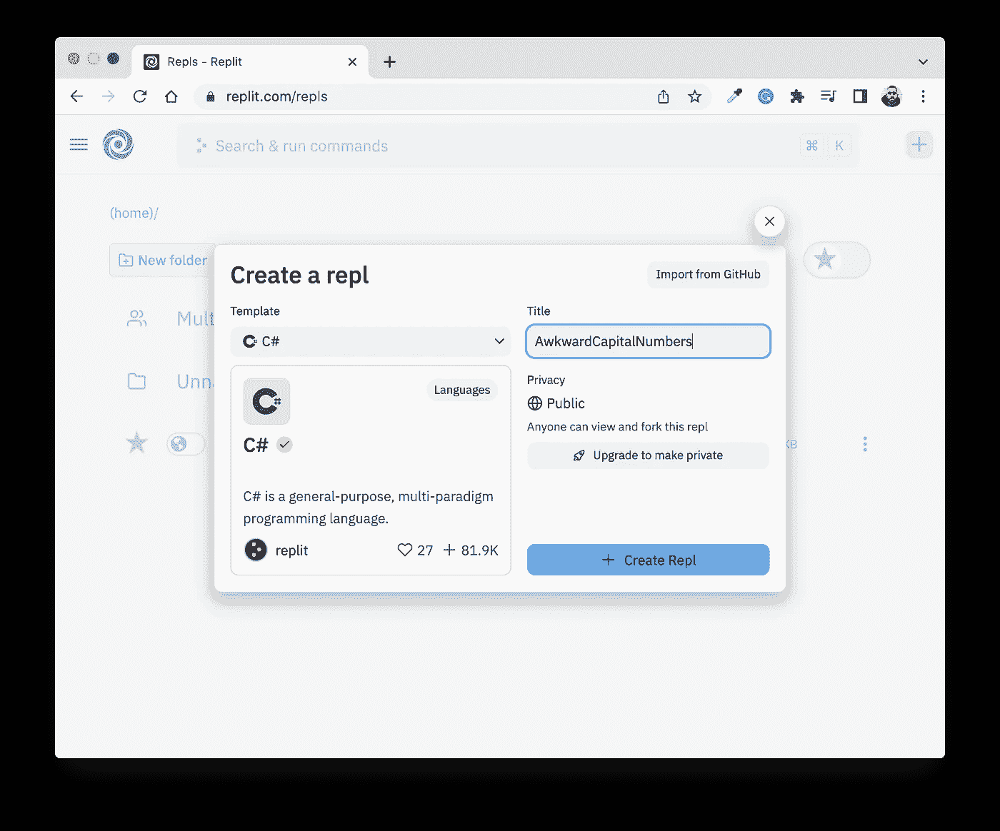

# 面试准备的 C#练习

> 原文：<https://medium.com/geekculture/c-drills-for-interview-preparation-156a1aad8c2a?source=collection_archive---------9----------------------->

## 必须知道的 C#数据结构和重要操作之旅


Photo by [Steve Johnson](https://unsplash.com/@steve_j?utm_source=unsplash&utm_medium=referral&utm_content=creditCopyText) on [Unsplash](https://unsplash.com/s/photos/abstract-art?utm_source=unsplash&utm_medium=referral&utm_content=creditCopyText)

# 介绍

如果**您已经熟悉 C#** 并且您需要:

1.  准备面试，或者
2.  离开 C#一段时间后，重新熟悉这门语言，例如从 Angular 和 TypeScript 的前端开发转向后端项目。

每个部分都由一个“演练”组成，探究一些常见的 C#数据结构的重要操作。

变量和方法的名称有意保持简短，以尽量减少完成代码练习所需的输入量。

# 这篇文章不是什么

这篇文章是关于“边做边学”的，并没有对所使用的操作提供全面的解释。您可以在自己的时间里，在 [C#文档](https://docs.microsoft.com/en-us/dotnet/csharp/)页面中更详细地探索这些操作。

# 设置

打开一个新的 [Replit](https://replit.com/) C#环境(或者创建一个 Visual Studio 控制台项目):



为了帮助您更快地完成这个练习，我创建了一个方法“o ”,它获取一个对象并打印出它的字符串表示，如下所示:


点击顶部的*运行*按钮，输出被写入右侧的控制台。

现在，您已经准备好开始 C#练习了！

# 用线串

这部分重复使用以下字符串:

```
string s1 = "ab";
string s2 = "ab";
string s3 = "b";
```

## 钻头

**注意:**每当看到🔥，这意味着抛出了异常。

```
o(string.**Compare**(s1,s2));           // 0
o(string.**Compare**(s1,s3));           // -1

o(s1.**CompareTo**(s2));                // 0
o(s1.**CompareTo**(s3));                // -1o(string.**Concat**(s1,s3));            // "abb"o(s1.**Contains**(s3));                 // True o(s1.**StartsWith**(s3));               // False
o(s1.**EndsWith**(s3));                 // Trueo(s1.**Equals**(s2));                   // True
o(s1.**Equals**(s3));                   // Falsevar e = s1.**GetEnumerator**();
while (e.MoveNext()) 
   o(e.Current);                    // "a"
                                    // "b"o(s1.**GetHashCode**());                // -184055581o(s1.**IndexOf**("a"));                 // 0
o(s1.**IndexOf**("z"));                 // -1o(s1.**Insert**(1, "-"));               // "a-b"
o(s1.**Insert**(3, "-"));               🔥o(string.**IsNullOrEmpty**(s1));        // False
o(string.**IsNullOrEmpty**(""));        // True
o(string.**IsNullOrEmpty**(" "));       // False
o(string.**IsNullOrWhiteSpace**(" "));  // Truestring[] s4 = { s2, s3 };
o(string.**Join**("-", s4));            // "ab-b"o(s2.**Remove**(1));                    // "a"
o(s2.**Remove**(0,1));                  // "b"
o(s2.**Remove**(2,3));                  🔥o(s1.**Replace**("a","c"));             // "cb"
o(s1.**Replace**("z","c"));             // "ab"
o((s1 + s2).**Replace**("a","c"));      // "cbcb"var s5 = "a-b";
foreach (var s in s5.**Split**('-')) 
   o(s);                            // "a"
                                    // "b"foreach (var s in s5.**Split**('+'))  
   o(s);                            // "a-b"o(s1.**Substring**(0));                 // "ab"
o(s1.**Substring**(1));                 // "b"
o(s1.**Substring**(2));                 // ""
o(s1.**Substring**(0,1));               // "a"
o(s1.**Substring**(2,3));               🔥foreach(var s in s1.**ToCharArray**()) 
   o(s);                            // "a"
                                    // "b"var s6 = s1.**ToUpper**();
o(s6);                              // "AB"
o(s6.**ToLower**());                    // "ab"var s7 = " ab ";
o(s7.**Trim**());                       // "ab"
o(s7.**TrimStart**());                  // "ab "
o(s7.**TrimEnd**());                    // " ab"
```

# 排列

这一部分分别重用以下字符串数组和 2D 整数数组:

```
var h = new string[2] {"a","b"};var i = new int[3,2]{
   {1,2},
   {3,4},
   {5,6}
};
```

## 钻头

```
h[0] = "c";
o(h[0]);                            // "c"

h[2] = "d";                         🔥**Array.Sort**(h);**for** (var j = 0; j < h.Length; j++)
   o(h[j]);                         // "b"
                                    // "c"**Array.Reverse**(h);**foreach**(var j in h)
   o(j);                            // "c"
                                    // "b"
i**[**0**,**0**]** = 10;
o(i[0,0]);                          // 10
o(i[0,1]);                          // 2
o(i[1,0]);                          // 3
o(i[1,1]);                          // 4
o(i[2,0]);                          // 5
o(i[2,1]);                          // 6for (int j = 0; j < i.**GetUpperBound**(0); j++)
{
   var s1 = **i[j, 0]**;
   var s2 = **i[j, 1]**;
   o($"{s1} {s2}");                 // 10 2
                                    // 3 4
}
```

# StringBuilder

导入以下命名空间:

```
using System.Text;
```

创建一个重载的控制台打印方法来使用 StringBuilder:

```
private static void o(**StringBuilder** sb)
{
   Console.WriteLine(**sb.ToString()**);
}
```

## 钻头

```
var sb1 = new **StringBuilder**("a");sb1.**Append**('b',2);
o(sb1);                             // "abb"sb1.**Insert**(1,"c");
o(sb1);                             // "acbb"sb1.**Remove**(1,1);
o(sb1);                             // "abb"sb1.**Replace**("b", "d");
o(sb1);                             // "add"
```

# 堆

导入以下命名空间:

```
using System.Collections.Generic;
```

## 钻头

```
var s = new **Stack<int>**();
s.**Push**(10);
s.**Push**(20);
s.**Push**(30);**foreach** (var i in s)
   o(i);                            // 30
                                    // 20
                                    // 10o(s.**Contains**(30));                  // True
o(s.**Pop**());                         // 30
o(s.**Contains**(30));                  // False
o(s.**Peek**());                        // 20
s.**Clear**();                     
o(s.**Count**);                         // 0
```

# 长队

同样，此练习需要以下名称空间:

```
using System.Collections.Generic;
```

## 钻头

```
var q = new **Queue<int>**();
q.**Enqueue**(10);
q.**Enqueue**(20);
q.**Enqueue**(30);o(q.**Contains**(10));                         // True
o(q.**Contains**(40));                         // Falsevar a = new int[q.Count];
q.**CopyTo**(a, 0); **for** (var i = 0; i < a.Length; i++)
   o(a[i]);                                // 10
                                           // 20
                                           // 30**for** (var i = a.Length - 1; i >= 0; i--)
   o(a[i]);                                // 30
                                           // 20
                                           // 10o(q.**Dequeue**());                            // 10
o(q.**Peek**());                               // 20
q.**Clear**();                                 //
o(q.**Count**);                                // 0
```

# 词典

同样，此练习需要以下名称空间:

```
using System.Collections.Generic;
```

## 钻头

```
var d = new **Dictionary<int, string>**();d.**Add**(1, "a");                             
d.**Add**(2, "b");
d.**Add**(3, "c");o(**d[**1**]**);                                   // "a"
o(d.**ContainsKey**(1));                       // True
o(d.**ContainsValue**("d"));                   // Falsed.**Remove**(1); **foreach** (var i in d.**Keys**)
   o(i);                                   // 2
                                           // 3**foreach** (var i in d.**Values**)
   o(i);                                   // "b"
                                           // "c"**foreach** (var i in d)
   o($"{i.**Key**} {i.**Value**}");                // "2 b"
                                           // "3 c"d.**Clear**();
o(d.**Count**);                                // 0
```

# 目录

同样，此练习需要以下名称空间:

```
using System.Collections.Generic;
```

## 钻头

```
var l = new **List<int>**()
{
   10, 20
};var l2 = new List<int> { 30 };l.**AddRange**(l2);**foreach** (var i in l)
   o(i);                                   // 10
                                           // 20
                                           // 30o(**l[**0**]**);                                   // 10l.**Insert**(1, 100);
o(l[1]);                                   // 100l.**Remove**(100);
o(l[1]);                                   // 20o(l.**Contains**(10));                         // True
o(l.**IndexOf**(30));                          // 2l.**Clear**();                         
o(l.**Count**);                                // 0
```

感谢阅读！请在下面的评论区告诉我你的想法，别忘了订阅哦👍