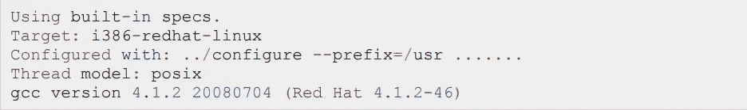

# c 开始编码指南(第 1 部分)。

> 原文：<https://medium.com/geekculture/c-guide-to-start-coding-part-1-8abcce72ee94?source=collection_archive---------20----------------------->

## 新程序员教程。

## ***C 语言概述***

> 本章描述了 C 编程语言的基本细节，它是如何出现的，C 的优势是什么，以及为什么我们应该使用 C。

C 编程语言是一种通用的中高级语言，最初由 Dennis M. Ritchie 开发，用于在贝尔实验室开发 UNIX 操作系统。c 最初于 1972 年在 DEC PDP-11 计算机上实现。1978 年，Brian Kernighan 和 Dennis Ritchie 提出了第一个公开的 C 语言描述，现在被称为 K&R 标准。UNIX 操作系统、C 编译器以及基本上所有的 UNIX 应用程序都是用 C 语言编写的。由于各种原因，C 语言现在已经成为一种广泛使用的专业语言。

1.简单易学

2.结构化语言

3.它产生高效的程序。

4.它可以处理低级活动。

5.它可以在各种计算机平台上编译。

## **为什么要用 C？**

c 用于系统开发工作，特别是组成操作系统的程序。使用 C 的一些例子可能是:

-操作系统

语言编译器

-文本编辑器

-打印假脱机程序

-网络驱动程序

现代计划

数据库

公用事业

## **如何设置你的电脑开始编码**

## C 编译器

写在源文件中的源代码是你的程序可读的源代码。它需要被“编译”，变成机器语言，这样你的 CPU 就可以按照给定的指令执行程序。这个 C 编程语言编译器将被用来把你的源代码编译成最终的可执行程序。最常用和免费的编译器是 GNU C/C++编译器，另外一个很棒的是 CodeBlocks。Codeblocks 非常适合使用 C/C++的新程序员。下一节将指导你如何在不同的操作系统上安装 GNU C/C++编译器和代码块。我提到 C/C++是因为 GNU gcc 编译器和代码块对 C 和 C++编程语言都有效。

## **在 UNIX/Linux 上安装**

如果您使用的是 Linux 或 UNIX，那么通过从命令行输入以下命令来检查 GCC 是否安装在您的系统上:

如果您的机器上安装了 GNU 编译器，那么它应该会输出如下消息:

## 在 Mac OS 上安装

如果您使用 Mac OS X，获得 GCC 的最简单方法是从 Apple 的网站下载 Xcode 开发环境，并按照简单的安装说明进行操作。一旦你安装了 Xcode，你就可以使用 C/C++的 GNU 编译器了。Xcode 目前在 developer.apple.com/technologies/tools/.有售

## 在 Windows 上安装

**GNU 编译器**

要在 Windows 上安装 GCC，你需要安装 MinGW。要安装 MinGW，请访问 MinGW 主页、[www.mingw.org、](http://www.mingw.org,)，然后点击链接进入 MinGW 下载页面。下载最新版本的 MinGW 安装程序，它应该被命名为 MinGW- .exe。在安装 MinWG 时，您必须至少安装 gcc-core、gcc-g++、binutils 和 MinGW 运行时，但您可能希望安装更多。将 MinGW 安装的 bin 子目录添加到 PATH 环境变量中，这样就可以在命令行中通过简单的名称来指定这些工具。安装完成后，您将能够从 Windows 命令行运行 gcc、g++、ar、ranlib、dlltool 和其他几个 GNU 工具。

## 代码块

要在 Windows 上安装 Codeblocks，你需要进入 [Codeblocks](https://www.codeblocks.org/downloads/) 网站，点击“[下载二进制版本](https://www.codeblocks.org/downloads/binaries)，然后选择 Windows XP / Vista / 7 / 8.x / 10

这是你开始用 C 语言编码所需要的一切！

## 如果你想让我写一个成功快速学习的完整 C 语言指南，请告诉我。