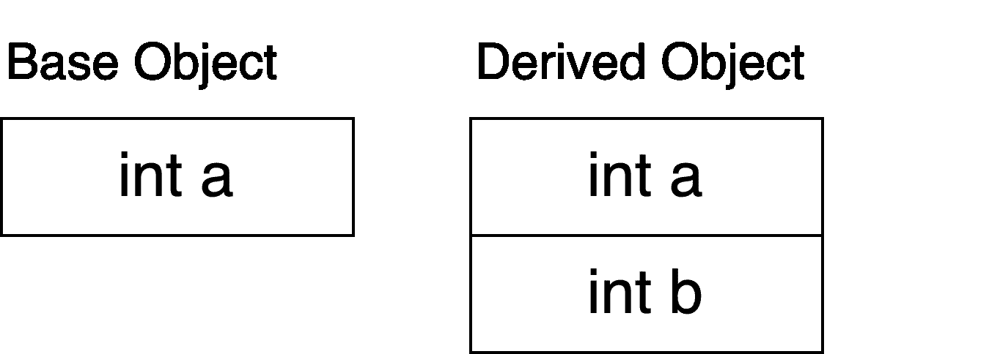
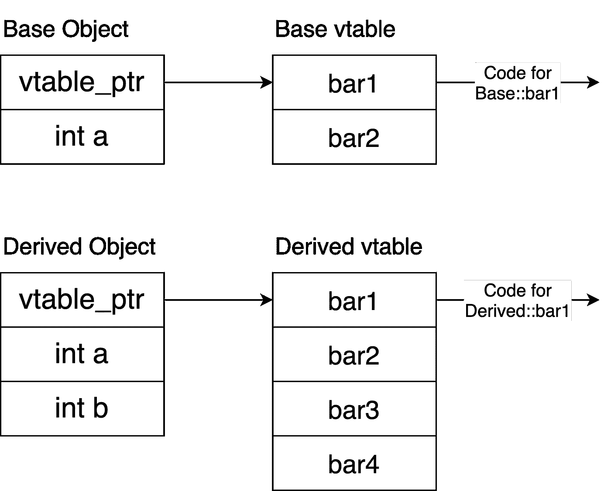
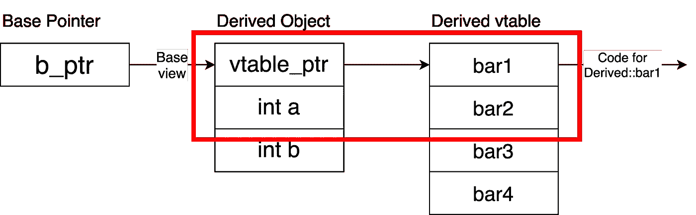
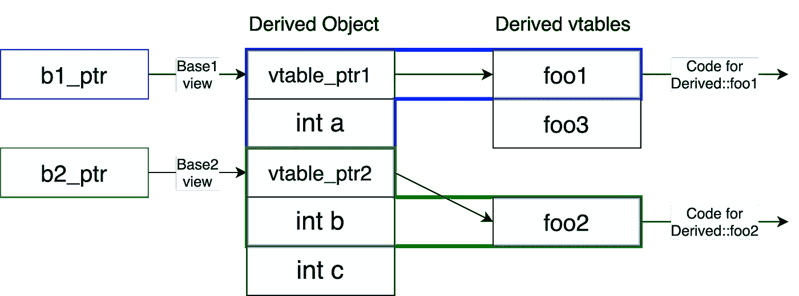

# C++继承内存模型

> 原文：<https://medium.com/geekculture/c-inheritance-memory-model-eac9eb9c56b5?source=collection_archive---------12----------------------->

在本文中，我们将深入探讨 C++继承在内存中的样子以及多态在幕后是如何工作的。这不是一篇关于继承的最佳实践和动机的文章，而是关于 C++如何制造如此强大和快速的继承工具。

先说单继承。

派生类继承了 Base 的所有成员变量和函数，对象内存如下所示

开始时，派生对象看起来与内存中的基本对象相似，但是后来有了一些额外的东西，如`int b`。

你可能还想知道所有的函数都存储在内存的什么地方。所有的函数指令都一次性存储在内存中的一个特殊位置，而不是针对每个对象。当东西被编译时，那些函数调用会指向函数指令的位置。

## 如何覆盖一个函数

继承的下一个重要部分是派生类重写基类中定义的函数的能力。为此，C++让我们将函数虚拟化。当一个函数是虚拟的，它就在虚拟表上(vtable)。vtable 存储所有虚函数的函数指针。每个类都有一个 vtable，该类的所有对象都有一个指向它的 vtable 指针。

基类的函数指针的顺序与派生类的顺序相同。但是，基本虚拟表的`bar1`函数指针指向`Base::bar1`，派生虚拟表的`bar1`函数指针指向`Derived::bar1`。在基类的虚函数之后，派生的 vtable 还将包含它创建的所有其他虚函数。

对像`d_ptr->bar()`这样的虚函数的调用相当于`*((d_ptr->vtable_ptr)[0])(d_ptr)`。您实际上没有访问 vtable_ptr 的权限，所以这种等价是理论上的。

1.  `d_ptr->vtable_ptr`获取指向函数指针数组的 vtable_ptr。
2.  `(d_ptr->vtable_ptr)[0]`是派生 vtable 的第一个元素，它为我们提供了一个指向`Derived::bar1`的函数指针。
3.  `*((d_ptr->vtable_ptr)[0])`是解引用的函数指针。
4.  `*((d_ptr->vtable_ptr)[0])(d_ptr)`正在调用`Derived::bar1`并传入对调用它的对象的引用。编译器总是隐式地将“this”指针传递给成员函数。

虚函数在运行时在对象的 vtable 上查找。因此，与编译时标记的常规函数不同，虚函数将在运行时在 vtable 上查找函数，并运行 vtable 条目指向的任何函数。这是 C++中支持多态性的强大工具。**多态性**是指你在运行时决定某些东西的功能。可以有一个指向对象调用`bar1`的指针，但是实际调用的`bar1`版本取决于对象。这就是为什么功能只在运行时确定。

## 怎么可以设置 b_ptr = &d？

为什么基指针可以指向派生对象？让我们首先回答为什么这应该是真的，然后我们将得到如何 C++内存对齐允许这一点。

所有派生对象都是基对象，但不是所有基对象都是派生对象。所以如果你有一个基指针，你只需要调用在基类中声明的函数。因为 Derived 从 Base 继承了所有的函数和变量，所以派生的对象可以访问 Base 调用的所有函数，所以这是一个需要的特性。

为了实现这一点，虚函数和变量的顺序需要在基本对象和派生对象中保持一致。当一个基址指针指向一个派生的对象时，它只看到它的基址部分。

红框表示基指针从派生对象中看到的内容。`b_ptr`见*底座*视图*视图*。派生的对象看起来和上面的 Base 一样，然后它在下面创建了更多的东西，但是这些对`b_ptr`来说无关紧要，因为它没有查看 Base 视图。

记住`b_ptr->bar1()`翻译成`*((b_ptr->vtable_ptr)[0])(d_ptr)`，它调用 vtable 上的第一个函数指针。不管底层对象是派生的还是基的，vtable 上的第一个条目都是某个版本的`bar1`。因为变量和函数指针的内存布局对于 Base 和 Derived 的开始是相同的，`b_ptr`能够毫无问题地指向一个派生对象并调用虚函数`bar1`。

## 多重遗传

当你有一个继承自多个基类的派生类时，内存就变得有点棘手了。

我们需要对内存进行布局，以便`b1_ptr`只能访问 Base1 接口，而`b2_ptr`只能访问 Base2 接口。为此，我们拆分了虚拟表。

第一个 vtable 包括 Base1 的虚函数和 Derived 的虚函数。派生对象中的下一个东西是 Base1 的所有字段。接下来是 vtable_ptr2，它指向 Base2 中的所有虚函数。然后是所有 Base2 字段，后面是派生字段。

我们拆分 vtables 的原因是为了让`b1_ptr`可以有一个合适的 Base1 视图，而`b2_ptr`可以有一个合适的 Base2 视图。我们不能将 Base2 的虚函数放在第一个虚拟表中，因为`foo2`需要是虚拟表中的第一个东西才能获得有效的 Base2 视图，但是`foo1`已经是第一个虚拟表中的第一个东西了。因此，我们需要两个虚拟表来支持这两种视图。

有趣的是，`b2_ptr`指向的地址实际上比`b1_ptr`指向的地址更大。其实，`b1_ptr+sizeof(Base1)` = `b2_ptr`。编译器会为你处理指针调整，所以不用担心。`d_ptr` = `b2_ptr`也一样，但是`d_ptr`拥有整个派生对象的视图。

## 表演

虚函数比常规函数稍微贵一点，所以如果你想做一个超低延迟的程序，这一节很重要。调用一个虚函数需要解引用 vtable 指针，这是一个常规函数不需要做的额外查找。

另一件事是，像内联这样的编译器优化不能在虚函数上运行。内联是指将函数代码复制并粘贴到调用函数的地方，这样可以避免创建堆栈框架、将参数压入堆栈等。这不能用虚函数来实现，因为正在运行的函数只能在运行时确定。这些都是非常小的性能冲击，但值得了解。