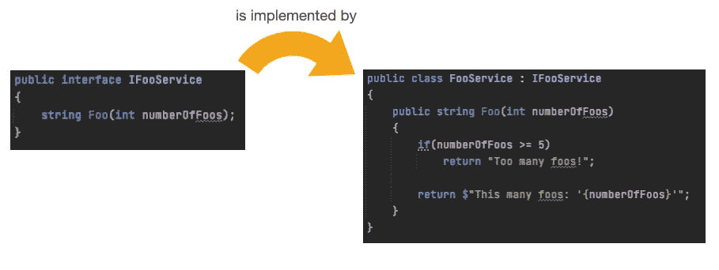
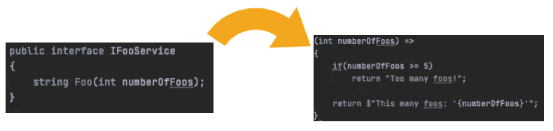
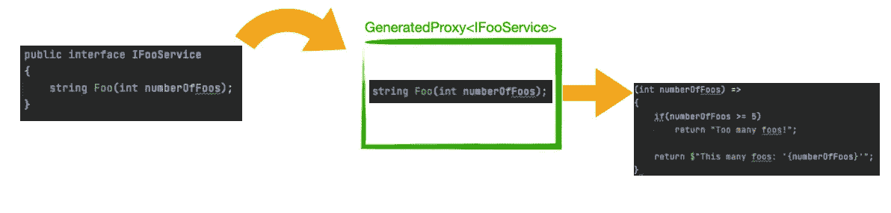
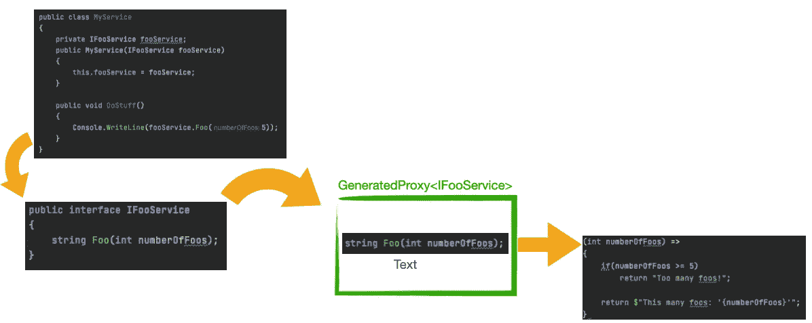
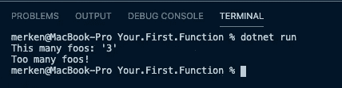

# C#:函数接口，使用 FuncR

> 原文：<https://medium.com/geekculture/c-interfaces-to-functions-with-funcr-e7ea897ce39?source=collection_archive---------3----------------------->

我发现自己经常需要将某个方法提取到一个全新的服务中。这个新的服务现在有了**的唯一目的**来容纳那个方法。

当处理与**基础设施**(日志、文件、网络、API)进行通信的代码时，通常就是这种情况。这段代码大部分是静态的，不需要全新的服务实现。但是，仍然需要创建一个新的类来保持这个功能。

我开始寻找**最简洁的形式**来编写功能，**不需要**引入一个新的服务实现类，**一个函数的接口，**可以这么说…

这项工作的成果已经打包到一个名为 [**FuncR**](https://github.com/merken/FuncR) 的小库中，请允许我详细说明…


FuncR 是一个小的。NET 标准库，使您能够在 C#中针对**接口**注册**函数**。

*简而言之，它让你从这个:*



*变成这样:*



**FuncR** 使用 **DispatchProxy** 生成一个**代理类**，它在运行时实例化接口，并且**将**注册的**函数**挂接到**接口方法。**



这允许你**将接口**注入到你的服务中，并像**你的域中的任何其他服务**一样使用它。



让我们将所有这些放在一个. NET 控制台应用程序中！

创建新的控制台应用程序(在中)。网络核心 2、3 或。净 5):

```
mkdir Your.First.Function
cd Your.First.Function
dotnet new console
```

添加 FuncR 包:

```
dotnet add package FuncR
```

编写实现:

运行实现:

```
dotnet run
```



dotnet run output

## 示例的详细信息

[第 8 行](https://gist.github.com/merken/a3b9ba335a8b3b99e410580d3ba28e1b#file-program-cs-L8)为我们的服务接口搭建了舞台。

[第 19 行](https://gist.github.com/merken/a3b9ba335a8b3b99e410580d3ba28e1b#file-program-cs-L19)为 **IFooService** 注册**代理**

[第 20 行](https://gist.github.com/merken/a3b9ba335a8b3b99e410580d3ba28e1b#file-program-cs-L20)为代理上的名字 **Foo** 注册**函数指针**

[第 22-28 行](https://gist.github.com/merken/a3b9ba335a8b3b99e410580d3ba28e1b#file-program-cs-L22-L28)以 **< TParameter1Type，TReturnType >** 的形式为代理注册了函数的**实际实现**，如同任何 [C# Func](https://docs.microsoft.com/en-us/dotnet/api/system.func-2?view=net-5.0)

第 30 行从依赖注入容器中解析我们注册的服务。

[第 34 行和第 36 行](https://gist.github.com/merken/a3b9ba335a8b3b99e410580d3ba28e1b#file-program-cs-L34-L36)调用代理，代理将查找注册的函数并调用它。

# 📚证明文件

FuncR 附带了[广泛的文档](https://merken.github.io/FuncR/#/)和示例项目来帮助您开始！

这包括:**通过依赖注入的服务解析**，**异步函数**和**嵌套函数**。