# Unity 中的 C#单元测试简介

> 原文：<https://medium.com/geekculture/c-unit-testing-in-unity-80d8bbfc62bb?source=collection_archive---------33----------------------->

## 创建可靠的、可重用的测试来帮助快速开发

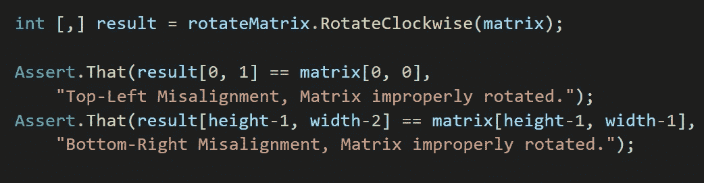

Be assertive!

最近我完成了一项挑战，将一个矩阵的元素顺时针或逆时针旋转 45 度。换句话说，我需要能够制作这个:

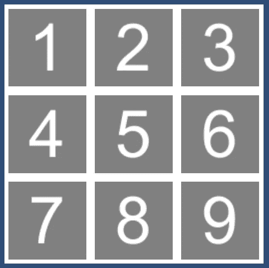

变成这样:

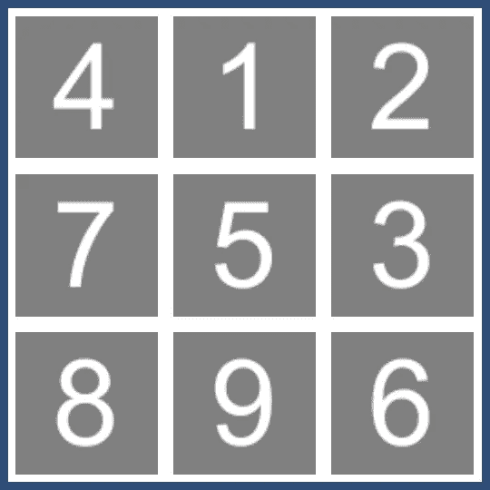

或者这个:

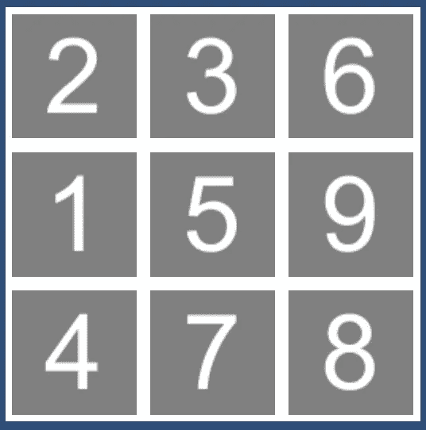

这里有一个场景，在我写之前，我确切地知道我需要从方法中得到什么样的输出——这使它成为单元测试的完美候选。

单元测试就像它听起来的那样。这是一个验证代码单元操作的测试。你可能熟悉使用 Unity 的 *Debug。Log()* 方法在开发过程中验证代码的运行。这是相似的，但是有几个额外的优点。

*   单元测试发生在方法本身之外。如果你改变方法，测试仍然有效，因为它不依赖于方法的内容。它只关心代码的输入/输出(如果有的话)或行为。
*   单元测试可以在播放模式之外进行，不需要用户的任何输入。这使得快速到达您想要测试的点，并且反馈是即时的。
*   您可以将您的测试组织成在同一游戏系统上运行的类似测试套件。如果其中一个失败，整个套件都会失败。

让我们看看如何使用 Unity 的 Test Runner 模块来创建和组织我们的单元测试。

**试跑者**

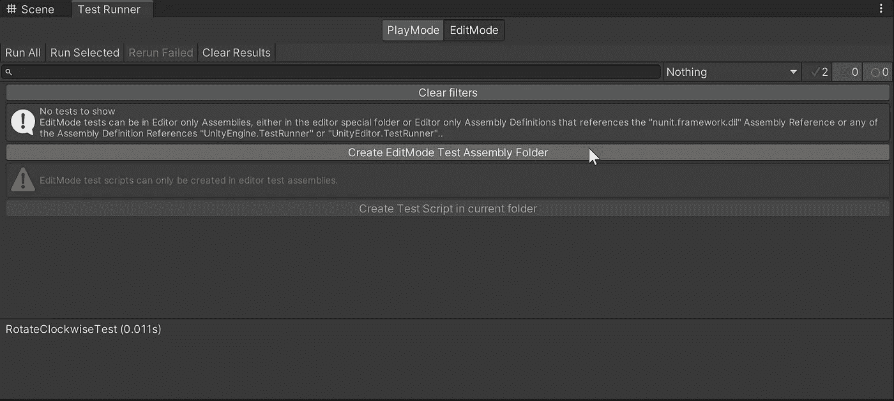

当你第一次打开*窗口>常规>测试运行器*时，你会看到类似上面的屏幕。有两个选项卡—一个用于播放模式测试，一个用于编辑模式。我将关注编辑模式，因为我想在不运行游戏的情况下运行我的测试。

首先，点击**创建编辑模式测试组件文件夹**。这将创建一个新文件夹*和*一个装配定义资产(。asmdef)文件。该文件跟踪对存储要测试的脚本的文件夹的引用。在我们开始之前，让我们点击**在当前文件夹**中创建测试脚本。以包含您想要测试的方法的类来命名这个脚本是一个很好的做法。因此，在我的例子中，我称它为 RotateMatrixTests 脚本。

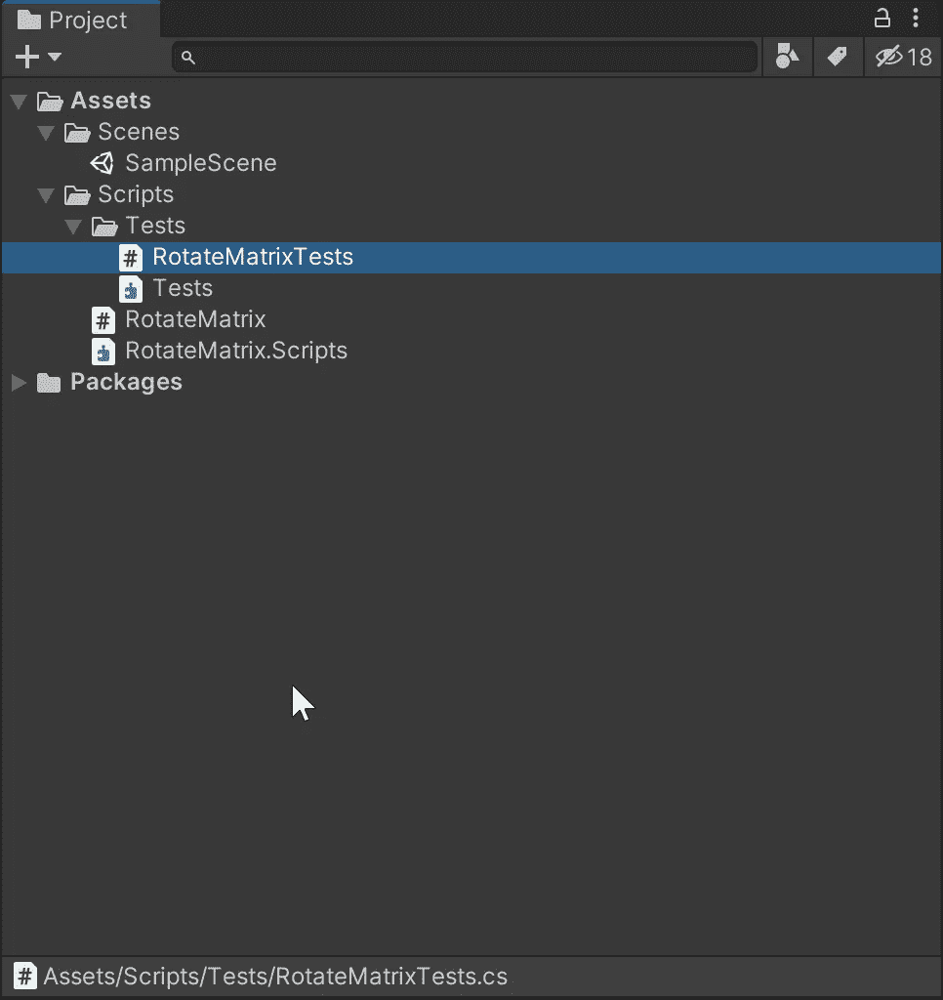

我们还需要在 RotateMatrix 测试所在的文件夹中创建一个组装定义资产。为此，右击脚本文件夹并选择*创建>装配定义*。

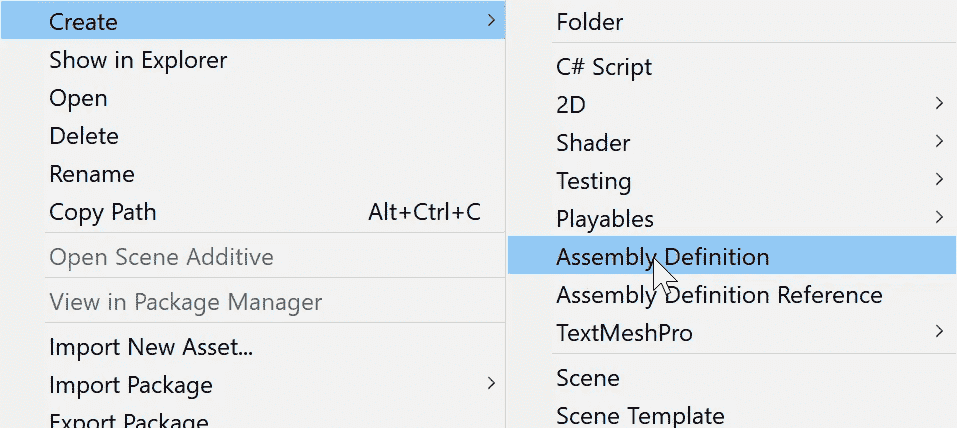

正如你在上面看到的，我将我的命名为 RotateMatrix.Scripts。

> [项目名称]。[树中的第一个文件夹(不包括资产)]。[…根据需要在树中添加其他文件夹]

在我的例子中，项目标题是 Rotate Matrix，我测试的脚本在 *Assets/Scripts/* 中。因此，我为该文件夹定义的程序集的名称是“RotateMatrix”。脚本"

一旦创建了组装定义资产，返回到 *Scripts/Tests/* 文件夹中的 Tests.asmdef 文件，并在检查器中查看它。在 Assembly Definition References 下，单击+号，并将刚刚在*脚本/* 文件夹中创建的 asmdef 文件拖到插槽中。

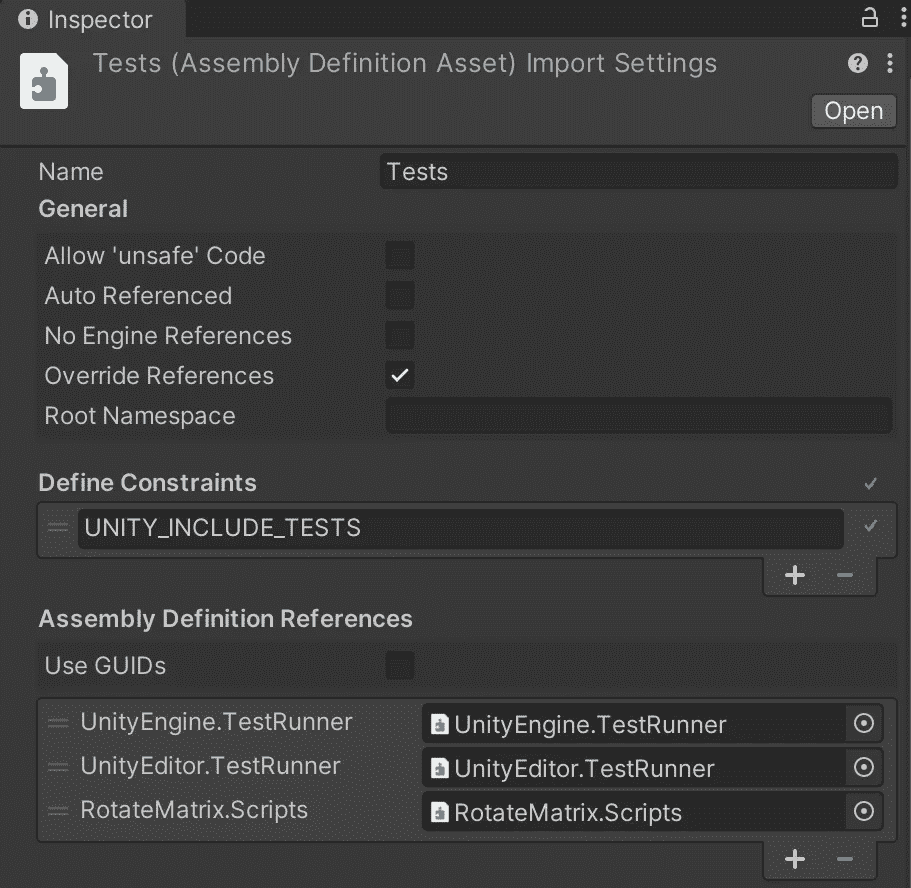

现在，如果您遵循了所有这些步骤，您应该准备好打开 RotateMatrixTests 脚本并开始测试了！清除默认的测试方法，并创建一个以您想要测试的方法命名的新方法。我正在测试我的 *RotateClockwise(int[，] matrix)* 和 *RotateCounterClockwise(int[，] matrix)* 方法，所以我将调用这些 *RotateClockwiseTest()* 和*RotateCounterClockwiseTest()*:

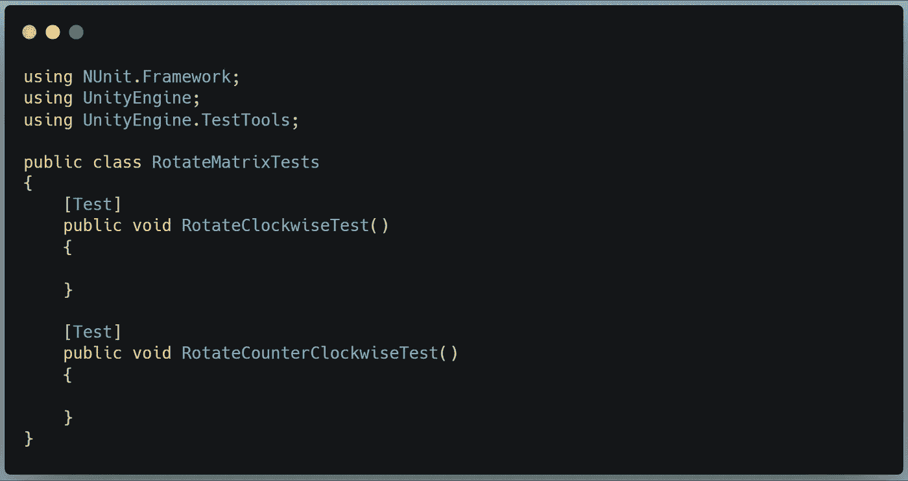

请注意，每个都有[Test]属性。这告诉 Unity 在 Test Runner 窗口中显示这些测试。

现在，为了运行顺时针旋转方法，我们需要为它提供一个 2D 数组来摆弄。所以我们首先需要定义这样一个数组。

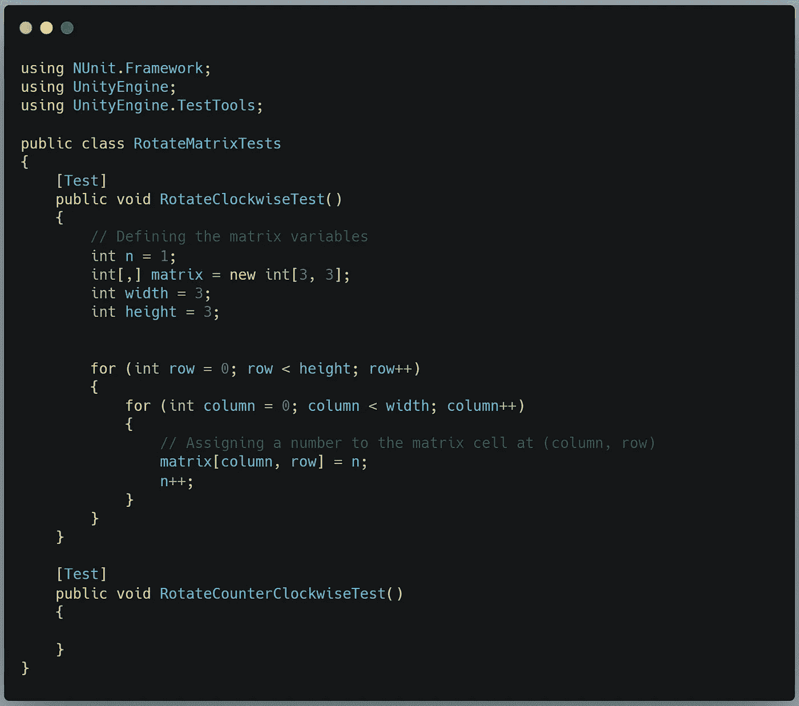

现在，*矩阵*变量定义如下:

接下来，我们需要获取场景中 RotateMatrix 脚本实例的引用，以便我们可以访问要测试的方法:

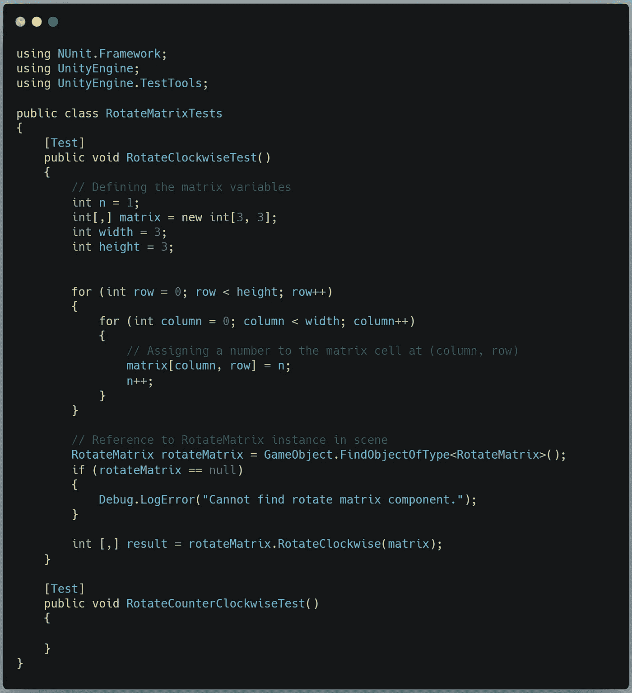

最后一个要素是调用 *Assert()* 类。这是保存检查输出的逻辑的类。我们期望什么样的产出？嗯，我们可以检查原始矩阵的两个角，并将它们与旋转后的矩阵中相应的目标点进行比较。如果值已经移动到我们期望的位置，那么旋转就成功了。

因此，最初包含在*矩阵[0，0]* 中的值应该等于*结果[0，1] —* 的值，也就是说，从它开始的地方向右一列。同样，原始矩阵在两个轴的最大值处的值应该等于结果矩阵在 x 轴的最大值处的值和 y 轴的最大值减去 y 轴的最大值——比开始时高一行。这里有一种编写断言来测试这些条件的方法:

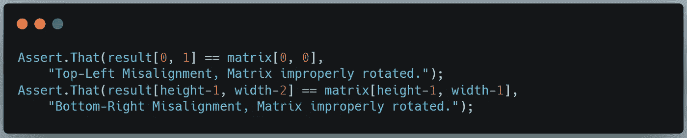

如果这些条件中的任何一个失败，我们将在调试日志中得到哪个角不匹配的解释。

我现在准备尝试用我的 RotateClockwise 方法解决这个问题。我可以尝试任何数量的方法，并立即测试该方法，看看它是否给出了预期的输出。迭代这个问题变得 1000%容易。

如果你好奇，这是我最后想到的方法:

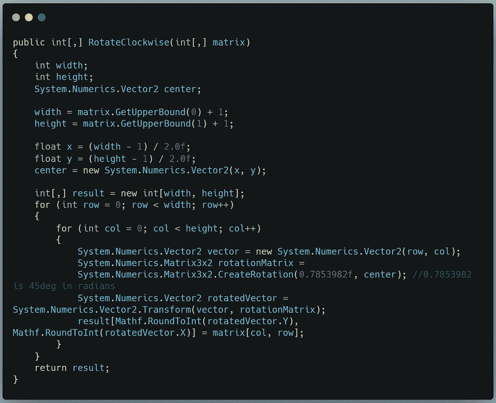

The 3x2 Rotation Matrix can rotate Vector2 data around a center coordinate — perfect for rotating the indices of 2D arrays around the center of the array.

当您准备好测试您的方法时，您需要做的就是在测试运行器中双击您想要运行的测试或测试套件(或者单击“Run All”来测试所有测试套件中的所有内容)。

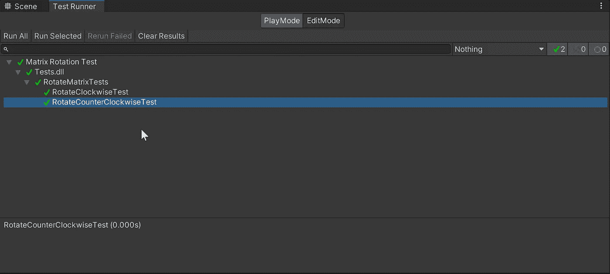

Hey, look! It works!

正如您所看到的，单元测试是充分利用您的键盘时间的有效方法。我希望这个单元测试的简要介绍对你有用！