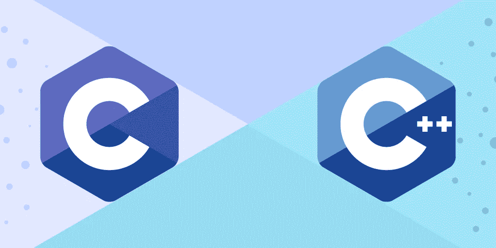

# C 与 C++:核心语言差异解释

> 原文：<https://medium.com/geekculture/c-vs-c-core-language-differences-explained-f301994ec7b3?source=collection_archive---------1----------------------->



C 和 C++都是现存的最古老的编程语言。虽然 C++是从 C 语言派生出来的，但众所周知它效率更高，并且提供了现代化的工具。当然，两种语言都有各自的优缺点。

在这篇文章中，我们将回顾这两种语言的简史，然后是它们的相似之处和不同之处，以及您应该首先开始学习哪种语言。

# 什么是 C？

c 语言是由 Dennis Ritchie 在 1972 年开发的，目的是使实用程序能够在 Unix 上运行。c 是一种系统编程语言，这意味着它在最底层的抽象中工作。它是一种低级的过程语言。c 程序速度很快，所以它们让开发人员手动操作计算机硬件。

C 编程语言的优势在于性能，并且能够用于多种平台**的编码。它通常用于操作系统、解释器、编译器和微控制器。**

如今，我们有许多专门的编程语言可供选择，但 C 在早年曾无可匹敌。

```
#include<stdio.h>
int main() {
    printf("Hello World\n");
    return 0;
}
```

> *输出:Hello World*

# 什么是 C++？

C++是比雅尼·斯特劳斯特鲁普于 1979 年在贝尔实验室工作时开发的。他想要一个既灵活又高效的 C 扩展。C++是面向对象的，但是像 C 一样，它可以在各种平台上进行开发。它还支持手动内存管理。C++非常适合网络、服务器端和游戏应用。

这种编程语言是轻量级的、编译过的，并且可以用于广泛的平台。事实上，C++编程语言几乎拥有 C 语言的一切，但是它扩展了它的功能。

C++影响了 C#和 Java 的创造。如果你懂 Java，你很容易读懂 C++。

```
#include <iostream>
using namespace std;int main() {
  cout << "Hello World";
  return 0;
}
```

> *输出:Hello World*

# C 和 C++的相似之处

既然我们对这两种语言都有所了解，我们现在就来看看两者之间的相似之处。C++是 C 的超集，所以两种语言有相似的语法、代码结构和编译。几乎所有 C 语言的**关键字**和**运算符**都在 C++中使用，做同样的事情。

C 和 C++都使用**自顶向下的执行流程**，并且允许过程化和函数式编程。两种语言都使用`;`作为语句结束符。它们也有相同的堆栈、堆、文件范围和静态变量的概念。

以下是两种语言通用的关键字:

*   `auto`
*   `break`
*   `case`
*   `char`
*   `const`
*   `continue`
*   `default`
*   `do`
*   `double`
*   `else`
*   `enum`
*   `extern`
*   `float`
*   `for`
*   `goto`
*   `if`
*   `int`
*   `long`
*   `register`
*   `return`
*   `short`
*   `signed`
*   `sizeof`
*   `static`
*   `struct`
*   `switch`
*   `typedef`
*   `union`
*   `unsigned`
*   `void`
*   `volatile`
*   `while`

# C 和 C++的区别

在这一节中，我们将看看这两种语言之间最重要的区别。

## 定义

c 是一种结构化编程语言，所以一切都被分解成完成工作的函数。c 不支持对象和类。

然而，C++支持过程化和[面向对象编程](https://www.educative.io/blog/object-oriented-programming)范例。它着重于使用对象和类。

## 异常处理

c 使用函数进行错误处理。C++有设计良好的 try-catch 块，使调试变得容易得多。

## 文件扩展名

所有 C 程序都以`.c`扩展名保存。C++使用了`.cpp`扩展。

## 和睦相处

C++与大多数其他编程语言兼容，但 C 不是。

## 变量

在 C 中，需要在函数块的开头声明所有变量。在 C++中，变量可以在任何地方声明，只要它们是在代码中使用之前声明的。

## 数据类型

c 只支持原始和内置数据类型。另一方面，C++也支持用户定义的数据类型。C++用户定义的数据类型包括:

```
// Classes
class <classname>
{
private:
Data_members;
Member_functions;
public:
Data_members;
Member_functions;
};// Structures 
struct stud_id
{
char name[20];
int class;
int roll_number;
char address[30];
};// Unions
union employee
{
int id;
double salary;
char name[20];
}// Enumerations 
enum week_days{sun, mon, tues, wed, thur, fri, sat};
int main()
{
enum week_days d;
d = mon;
cout << d;
return 0;
}//Typedef
typedef <type> <newname>;
typedef float balance;
```

## 用线串

c 使用`char[]`表示字符串文字。在 C++中，字符串是类 string 的对象，在头文件`<string>`中定义。这是字符串在 C 语言中的表示方式:

```
char s1[20]; 
char s2[20] = { 'h', 'e', 'l', 'l', 'o', '\0' }; 
char s3[20] = "hello"; 
char s4[20] = "";
```

在 C++中，字符串表示如下:

```
string s1; 
string s2("hello"); 
string s3 = "hello"; 
string s4(s2); 
string s5 = s2;
```

## 多线程操作

在 C #中，本机不支持多线程。为了实现多线程，它在 Linux 上使用了 POSIX 线程等操作系统。

对于 C++，多线程是在 C+11 中引入的，它使用了`std::thread`。 [C++多线程](https://www.educative.io/blog/modern-multithreading-and-concurrency-in-cpp)涉及到创建和使用线程对象来执行子任务。

## 函数重载

函数重载是一种多态形式，它允许为不同的目的定义同名函数。重载函数名称相同，但参数不同。C **不支持**函数重载，但 C++支持。

在下面的 C++例子中，我们有相同的函数名，但是不同的数据类型。

```
int add(int x, int y) // first definition
{
cout<< x+y << endl;

return 0;
}

float add(float a, float b)
{
cout << a+b << endl;
return 0;
}

double add(double x, double y)
{
cout << x+y << endl;
return 0;
}return 0;
}float add(float a, float b)
{
cout << a+b << endl;
return 0;
} double add(double x, double y)
{
cout << x+y << endl;
return 0;
}
```

## 运算符重载

运算符重载允许您为用户定义的函数更改运算符的工作方式。虽然 C 不支持这一点，但 C++支持。

## `main()`功能

c 只允许通过代码中使用的其他函数调用`main()`函数。C++不允许通过其他函数调用`main()`函数。

## 数据安全和封装

封装有助于对用户隐藏信息，是 OOP 的关键特性。c 不支持封装。C++使用类将数据和操作这些数据的函数捆绑成一个单元。

## 输入输出操作

c 使用`printf`和`scanf`分别作为输入和输出。C++使用`cin`和`cout`。

## 内存管理

如上所述，C 和 C++都需要手动内存管理，区别在于它们是如何做到的。c 使用`calloc()`和`malloc()`函数进行动态内存分配。

C++使用`new`操作符和`free()`进行内存分配，使用`delete`操作符进行内存释放。

# 先学哪个？

这个问题的答案取决于你的职业和编程目标。学习 C++似乎是更好的选择，因为它提供了比 C 更多的东西，但事实并非总是如此。

如果你是一个*初学程序员，建议从 c 开始，它作为编程的**扎实入门**，给你学习和成长的空间。事实上，对于初学者来说，C++可能很复杂，让人不知所措。如果你对系统级编程感兴趣，你可能想学 c。*

*一旦你熟悉了 C 语言的过程化编程，你就可以转向其他语言，比如 C++或者 Java。*

*对于已经了解 OOP 的 ***高级程序员*** 来说，先学习 C++可以是一个不错的选择。C++在大部分行业也比较常见，在任何编码面试中都是公认的语言。如果你想学习一些可以在工作中立即使用的**，从 C++开始吧。***

***同样，对于已经掌握了一些 C#或 Java 知识的程序员来说，建议先学习 C++。***

# ***接下来学什么***

*****可以从 C 中的以下内容开始:*****

*   ***决策***
*   ***环***
*   ***功能***
*   ***数组和指针***
*   ***文件输入输出***
*   ***内存管理***

*****在 C++中，您可以从以下内容开始:*****

*   ***类别和对象***
*   ***遗产***
*   ***多态性***
*   ***抽象***
*   ***包装***
*   ***接口***

****快乐学习！****