# 用 Python 实现 PCA

> 原文：<https://medium.com/geekculture/ca-pca-implementation-in-python-151fe466a4b4?source=collection_archive---------1----------------------->

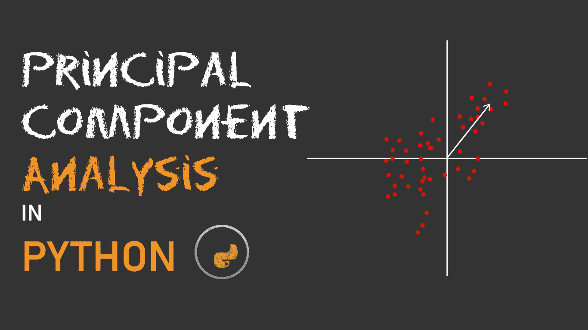

PCA 或*主成分分析*是一种古老的机器学习算法，它的主要用途是用于*维度缩减。* PCA 是一种数学技术，允许您从给定的数据集中设计新的要素，使新的要素在尺寸上更小，但能够表示原始要素，因此这些减少的要素(新的要素)可以传递给机器学习模型，并仍然可以获得合理的结果，同时大大降低复杂性。

在第一段中有很多大的术语，如果你现在不太明白，不要担心，因为我们将一步一步地看到 PCA 的作用。

## 什么是 PCA？

让我们来分解术语本身；

***本金*** *:反映重要性*

***成分*** *:某物*的一部分

***分析*** *:分析某事*

所以合起来就是**寻找或分析某个实体最重要的部分**。在机器学习中，实体是数据，PCA 的工作是从数据中提取最重要的特征。

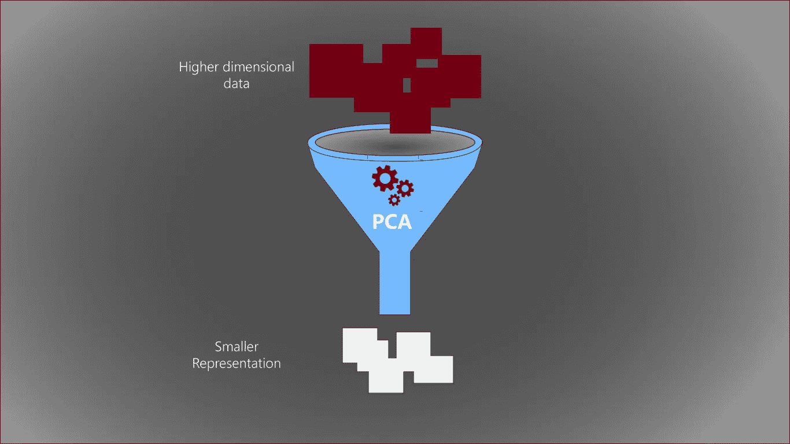

这里需要澄清一点，PCA 并没有像大多数人错误认为的那样丢弃任何数据，它创建了给定数据的线性组合，使得结果数据非常接近(*如果不是精确的*)原始数据的表示。

## 机器学习为什么需要 PCA？

PCA 用于对抗高维数据出现的问题——也称为 [*高维诅咒*](https://en.wikipedia.org/wiki/Curse_of_dimensionality) *。* **维度**指数据集中每个示例中的要素数量。以下面的虚拟数据为例。

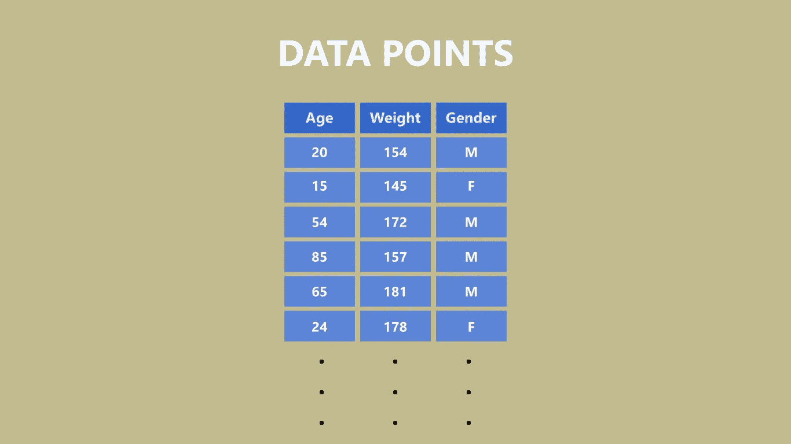

3-dimensional data

列**年龄、体重、性别**是数据的输入特征。这意味着我们的数据有 3 个输入要素。现在假设我们有 100 个人的数据，那么我们的总输入数据点就变成了 *100* x *3 = 300。*现在，假设我们向数据集添加了另一个特征，**练习**。现在我们的总数据点增加到 *100* x *4 = 400。*我们刚刚通过添加一个功能将数据集增加了 100 个点。当数据集增加到数千个时，这就成了一个真正的问题。

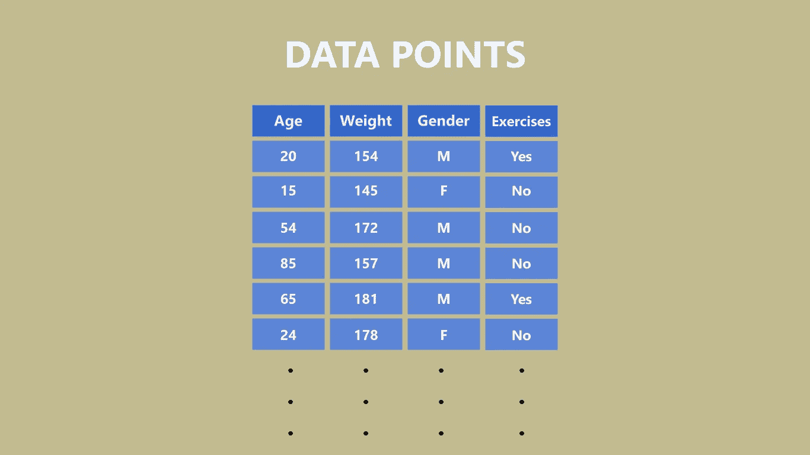

4-dimensional data

这不仅增加了对该数据的训练时间，而且降低了数据覆盖真实世界的所有可能组合的概率。

使用主成分分析，我们可以降低数据的维数，同时保留完整数据集描述的信息。

## **PCA 实施(一步一步)**

为了从给定的数据集中找到主成分，执行以下步骤:

*   **归一化**原始数据集
*   计算**归一化数据点**之间的**协方差矩阵**。
*   计算**协方差矩阵的**特征值**和**特征向量**。**
*   根据**特征值选择**前 N 个特征向量**作为你的**主成分**。**
*   使用**特征向量**将原始数据转换到一个新的(l **低维**空间。

让我们在真实数据集上进行 Python 实现。

使用的数据集可以在 [Kaggle 这里](https://www.kaggle.com/kukuroo3/body-performance-data)找到。

为数据分析加载最重要的库。

```
import pandas as pd
import numpy as np
```

…现在加载数据集。

```
data = pd.read_csv("archive/bodyPerformance.csv")
data.head()
```

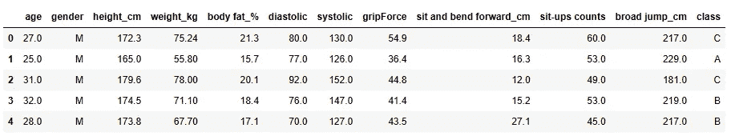

Complete Dataset to be use for PCA calculation

我们只需要输入变量和数值变量，因此我们将删除输出' **class** 和分类变量' **Age** '。

```
data.drop(columns = ["gender", "class"], inplace = True)
data.head()
```

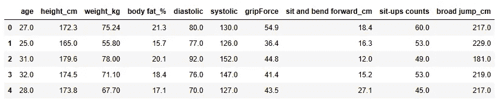

dataset with only numerical variables

现在进行第一步

## *数据标准化*

**

*数据标准化是将数据的平均值降低到 0 并将标准偏差降低到 1 的过程。将对数据中的每个特征(列)执行这两个步骤。*

*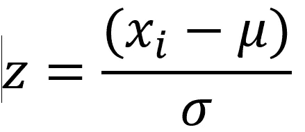*

*Data Normalization formula*

```
*def data_normalisation(scaled_data):
    for col in scaled_data.columns: #iterate over each column
        scaled_data[col] = (scaled_data[col]-scaled_data[col].mean())/scaled_data[col].std() #data normalisation 

    return scaled_data*
```

*这将返回一个缩放数据集，如下所示。*

```
*scaled_data = data_normalisation(data)
print(scaled_data)*
```

*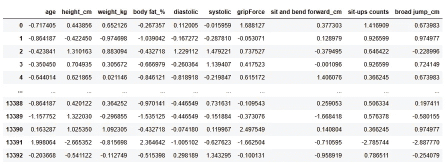*

*Normalized data*

## *协方差计算*

*协方差是一个变量相对于另一个变量的变化的度量。例如，如果我们有两个变量 X 和 Y，那么这两个变量之间的协方差会告诉我们一个变量相对于另一个变量如何变化。协方差是一个可以取任何值(负的或正的)的整数。重要的不是整数，而是符号。*

*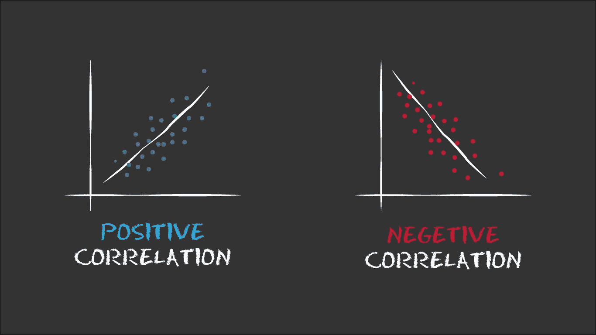*

*Data correlation*

*   ***负协方差**意味着两个变量的移动方向相反，即它们成反比。*
*   ***正协方差**意味着它们向同一方向移动，即它们彼此成正比*

*我们有下面的公式来计算协方差。*

*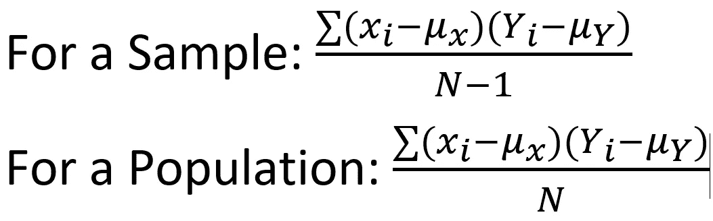*

*Covariance formula for 2 variables X and Y*

*这是我们用 python 编写的代码。*

```
*def covariance_calculation(mean_subtracted):
    #calcualte covariance amongst scaled values
    for col in mean_subtracted.columns:
        mean_subtracted[col] = mean_subtracted[col]-mean_subtracted[col].mean()

    return np.dot(mean_subtracted.T,mean_subtracted)/(len(mean_subtracted) - 1)cov_calc **=** covariance_calculation(scaled_data) #calling the above function*
```

> *注意，我们已经使用**矢量化**来计算上面返回语句中的协方差矩阵。这是 python pro 的一个技巧，当你必须对大量数字执行数学运算时，总是分析你是否可以通过**向量/矩阵运算**来完成，这比使用循环要快得多，也更节省内存。*

## *特征向量计算*

*特征值和特征向量是微积分中非常重要的一部分，但是解释它们是什么以及它们是如何工作的远远超出了本文的范围。如果你想深入了解它们，你可以在网上找到一些有用的资源。*

*[](https://writersbyte.com/programming/data-visualization-in-python-using-matplotlib/?swcfpc=1) [## 使用 MatPlotLib - WritersByte 在 Python 中进行数据可视化和分析

### 人们经常提出的一个问题是“数据科学 vs 数据分析”。我们已经在许多其他方面讨论了数据科学…

writersbyte.com](https://writersbyte.com/programming/data-visualization-in-python-using-matplotlib/?swcfpc=1) 

对本征向量最简单的解释是，它是 N 维空间中的一个向量，使得一个特定的矩阵变换(比如说*)***不会引起这个特定向量的任何旋转。*** 这个**特征向量**是，特别是对于变换 ***A，*** 如果还有另一个变换 ***B*** 它在同一个 N 维空间中会有不同的特征向量与之对应。*

*即使没有发生旋转，该特征向量也会按某个因子进行缩放，该因子被称为该向量的 ***特征值*** 。*

*正如我之前提到的，特征向量和特征值背后的深入概念超出了本文的范围，因此我们将使用 ***eig*** 模块来计算这两个实体。*

```
*from numpy.linalg import eigw,v=eig(cov_calc)*
```

****w*** 包含特征值 ***v*** 包含相应的特征向量。*

*每个特征向量的重要性由其对应的特征值来描述。更高的特征值意味着由特征向量描述的数据分布更广，这正是我们想要的，所以让我们绘制并查看特征值的趋势。*

```
*import matplotlib.pyplot as pltplt.bar(["e" + str(i+1) for i in range(len(w))], w)
plt.title("Eigenvalues")
plt.xlabel("Magnitude of the eigenvalue")*
```

*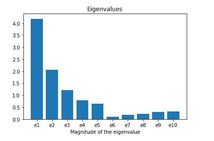*

*Plot of the eigenvalues calculated*

*看起来前 4 或 5 个特征向量(e1 到 e5)应该足够给我们一个数据的表示了。*

**

*现在我们可以用它把我们的原始数据转换到一个 5 维的空间(基本上降低到 5 维)。我们可以简单地通过计算数据集和这些特征向量之间的点积来实现。*

```
*useful_pc = v[:,:5] #keeping only the first 5 eigenvectorsprinciple_data = np.dot(data.values, useful_pc)#dot product of the two termsprint(priciple_data)
print("Shape of the New data is:", principle_data.shape)*
```

*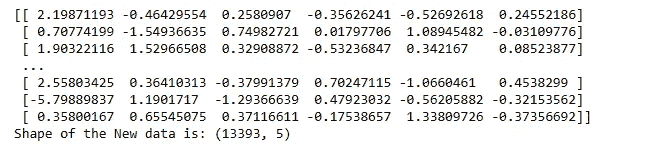*

*Original data transformed into a 5-dimensional space*

*搞定了。！*

*这就是我们如何将原始数据集(包含 10 个要素)转换为更小的数据集，但仍然表示原始数据。**