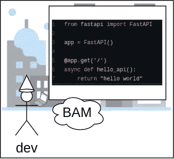
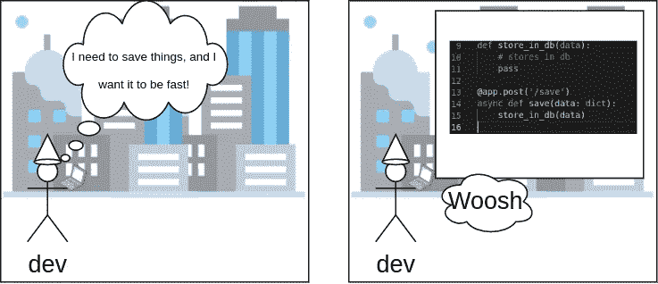
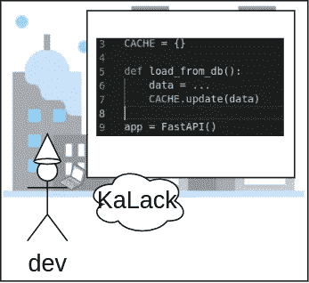
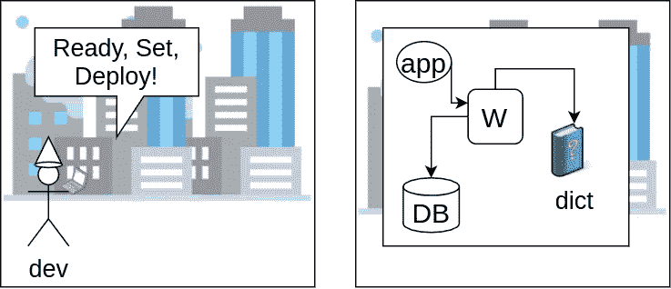
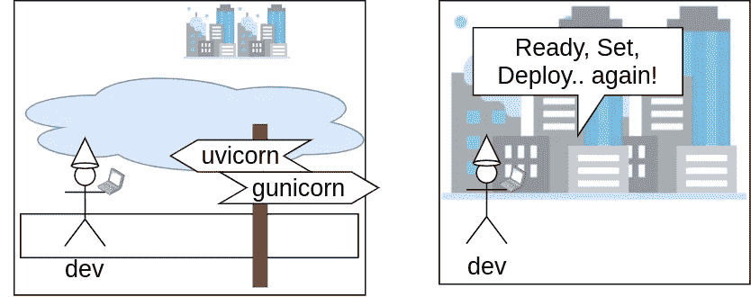
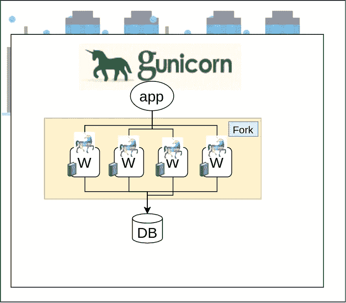
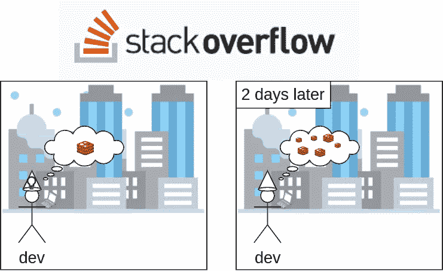
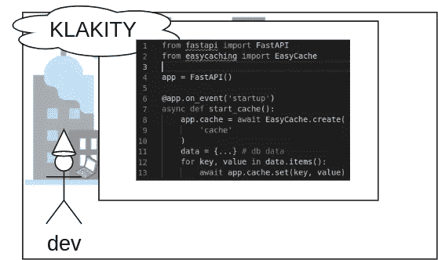
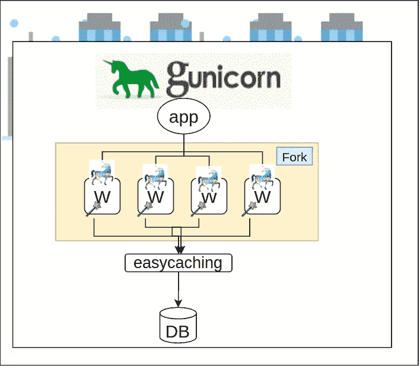

# 缓存——开发者意想不到的旅程

> 原文：<https://medium.com/geekculture/caching-a-developers-unexpected-journey-2b49c7fa2826?source=collection_archive---------60----------------------->

我们的故事开始于不久前，我们的英雄“开发者”有了一个好主意。


我们的英雄用代码的力量将一个想法转化为现实！



我们的英雄想到了更多的主意，以改进最初的想法。



本地缓存似乎是提高性能的一个好方法，所以我们的英雄添加了一个 python 字典，它提供了一种在内存中存储和检索数据的简单方法。



随着我们的英雄的目标从思想转移到代码中，最终是时候部署到世界上了。



我们的英雄渴望收获所有工作的回报，事情似乎进展顺利。


英雄的应用变得非常受欢迎，需求不断上升。但是当我们的英雄最意想不到的时候，灾难降临了。


我们的英雄不明白为什么这样的问题以前没有降临到应用程序上，并去寻找答案。



英雄旅行到独角兽的土地，并且发现了来自 Gunicorn 的工人监视的力量，与独角兽工人的联合力量。

```
gunicorn main:app -w 4 -k uvicorn.workers.UvicornWorker
```



带着新的信心，英雄准备再次部署。


现在我们的英雄面临新的挑战。这款应用已经不像英雄之旅之前那样好用了。这个应用程序可以运行，但是它的用户无法使用它的魔力。

经过长时间的大量故障排除和调试，主人公发现了是什么拯救了应用程序免于崩溃，也是什么阻止了大部分的魔法。

我们英雄的应用程序中的每个分支现在都将在一个字典中包含自己的缓存版本。字典充当缓存，但是被隔离到它们的所有者工作进程，而不是共享。



在向长者寻求帮助后，英雄发现了一条可以解决所有应用程序问题的途径。雷迪斯。

但是英雄没有准备好重新设计应用程序来使用 Redis 的复杂性，最重要的是，使其内容无效。


英雄从无所不知中寻找答案。


主人公偶然发现了一个无需重新设计就能解决应用程序问题的解决方案。 [EasyCaching](https://github.com/codemation/easycaching)



EasyCaching 为我们的英雄提供了面向所有应用工作人员的共享和持久缓存。



凭借新的信心和可伸缩性，hero 重新部署了应用程序。


**开发商参考:**

[FastAPI](https://fastapi.tiangolo.com/)

[轻松缓存](https://github.com/codemation/easycaching)