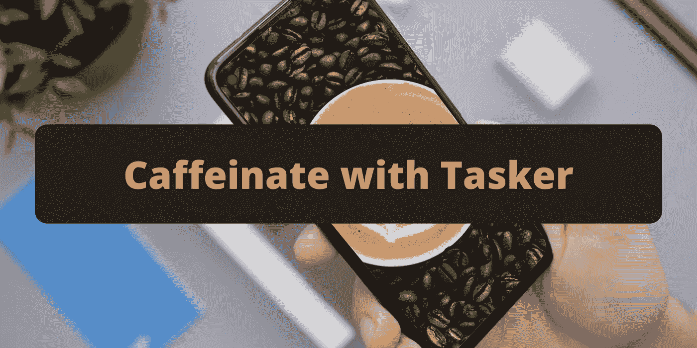
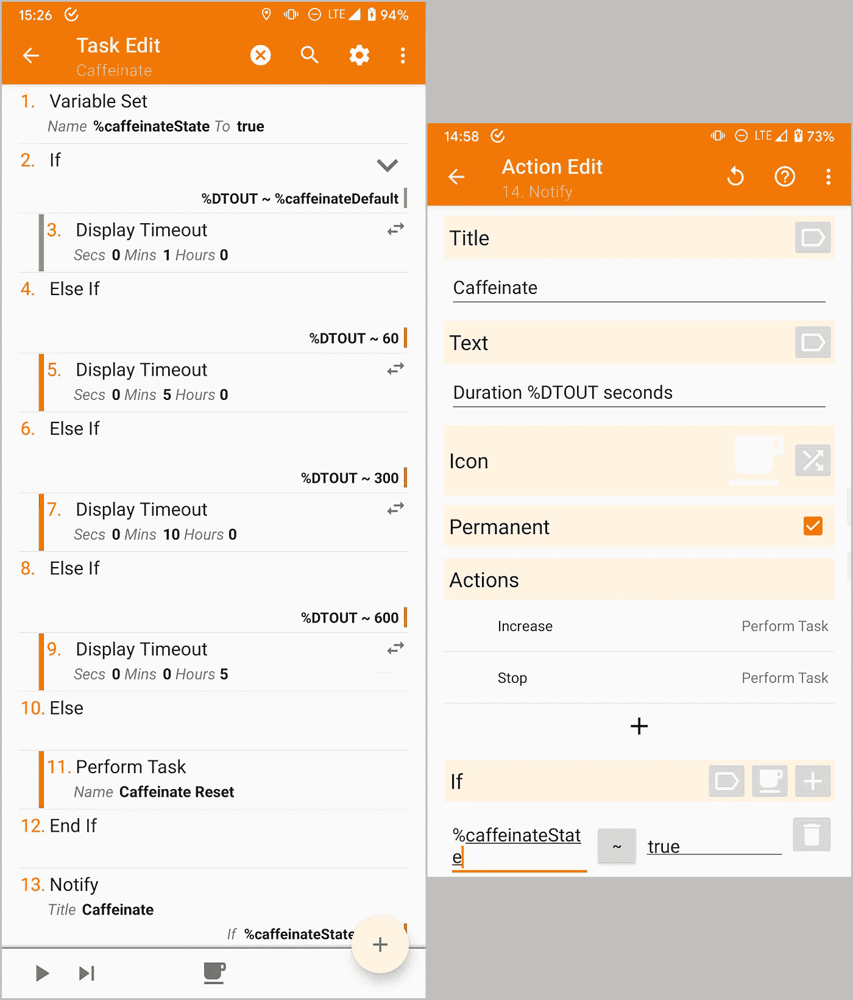
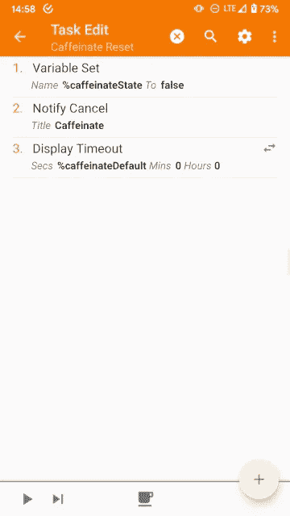
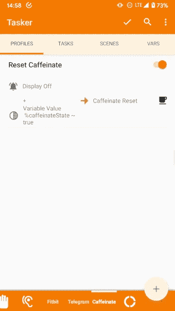
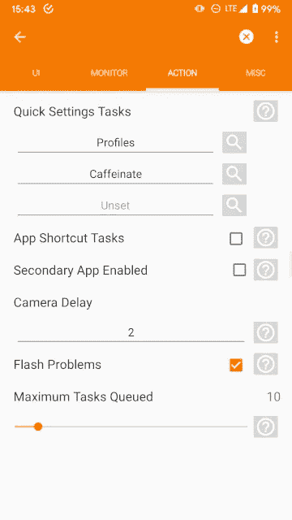

# Tasker 的咖啡因

> 原文：<https://medium.com/geekculture/caffeinate-with-tasker-301bed100e60?source=collection_archive---------18----------------------->

Photos by [Daniel Romero](https://unsplash.com/@rmrdnl?utm_source=unsplash&utm_medium=referral&utm_content=creditCopyText) and [Nathan Dumlao](https://unsplash.com/@nate_dumlao?utm_source=unsplash&utm_medium=referral&utm_content=creditCopyText) on [Unsplash](https://unsplash.com/s/photos/android?utm_source=unsplash&utm_medium=referral&utm_content=creditCopyText)

我把手机的超时设置为 30 秒。通常，这足够了，但有时我需要让我的屏幕开得更久。

Play Store 上有几个名为 [Caffeinate](https://play.google.com/store/apps/details?id=xyz.omnicron.caffeinate) 的应用程序可以做到这一点。不幸的是，自从 Android 11 以来，我使用的那个已经不再适合我了，所以我用 Tasker 做了一个替代方案。今天，我将展示我是如何做到这一点的。

# 行为

应用程序通常保持屏幕打开一段时间，这段时间由计时器定义。时间到后，屏幕关闭。第一次点击快速设置图标会启动计时器，随后的点击会增加计时器。

对于 Tasker，我更喜欢不同的方法。每点击一次快速设置图块，显示超时就会增加。默认超时是 30 秒，其他步骤是:

*   第一次轻拍:1 分钟。
*   第二次敲击:5 分钟。
*   第三次敲击:10 分钟。
*   第四拍:5 小时。
*   第五次点击:默认超时。

**更新:**你可以在[这个故事](https://pirasalbe.medium.com/caffeinate-with-tasker-improved-version-f7f20c918b05)中找到一个可以随任务个性化的改进版本的下载链接。它允许定制默认超时和每一步。

**原文:**这里可以下载项目[。您可以根据需要随意调整步骤和默认超时。](https://taskernet.com/shares/?user=AS35m8nzU8Z2OxB1WGqHbYHDLajdlq0DG%2B8k8f7L2XfQM3eHbHEAthA2xNvalA2%2FZaJvRZj2roE7ow%3D%3D&id=Project%3ACaffeinate)

# 第一步。任务

该项目有以下两项任务。

## 咖啡因

此任务会增加显示超时。它使用以下变量:

*   **%caffeinateState** :定义功能是否激活。它的值或者是**真**或者是**假**。
*   **%caffeinateDefault** :默认显示超时。这是我手动定义的。
*   **%DTOUT** :以秒为单位的[显示超时](https://tasker.joaoapps.com/userguide/en/variables.html)值。

它执行以下操作:

1.  **变量设置**:将 *%caffeinateState* 变量设置为**真**。
2.  **If** :检查变量 *%DTOUT* 是否等于 *%caffeinateDefault* 。
3.  **显示超时**:设置显示超时为 1 分钟。
4.  **否则如果**:检查 *%DTOUT* 变量是否等于 60。
5.  **显示超时**:设置显示超时为 5 分钟。
6.  **否则如果**:检查 *%DTOUT* 变量是否等于 300。
7.  **显示超时**:设置显示超时为 10 分钟。
8.  **否则如果**:检查 *%DTOUT* 变量是否等于 600。
9.  **显示超时**:设置显示超时为 5 小时。
10.  **否则**:如果不满足前面的条件。
11.  **执行任务**:运行**咖啡因重置**任务，恢复显示超时。
12.  **如果**结束:关闭条件。
13.  **通知**:显示显示超时信息的持续通知。

该通知允许用户:

*   **增加**:用*执行任务*动作调用任务**咖啡因**增加超时。
*   **停止**:通过*执行任务*动作调用任务**咖啡因复位**恢复显示超时。

## 咖啡因重置

此任务恢复显示超时，重置变量，并删除通知。

它执行以下操作:

1.  **变量设置**:将 *%caffeinateState* 变量设置为 **false** 。
2.  **通知取消**:删除通知。
3.  **显示超时**:设置显示超时为 *%caffeinateDefault* 秒。

# 第二步。轮廓

当屏幕关闭时，此配置文件会将显示超时重置为默认值。

它在以下条件下触发并运行**咖啡因重置**任务。

*   **显示器关闭事件:**这发生在显示器关闭时。
*   **变量值**:检查*%咖啡因状态*变量是否为**真**。

# 第三步。快速凝固瓷砖

可以将**咖啡因**任务设置为*快速设置*图块，方法是将其添加到 Tasker 首选项中*动作*选项卡下的**快速设置任务**中。

然后您可以将它添加到您的*快速设置*中并使用它。