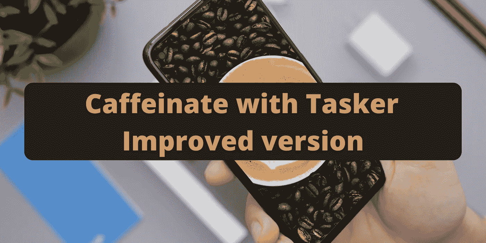
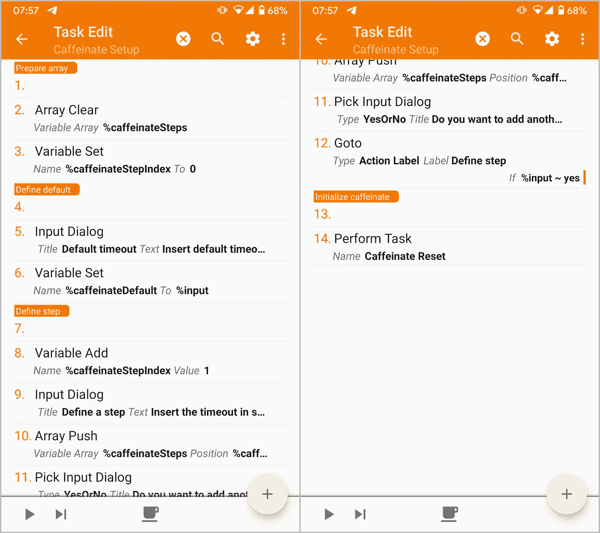
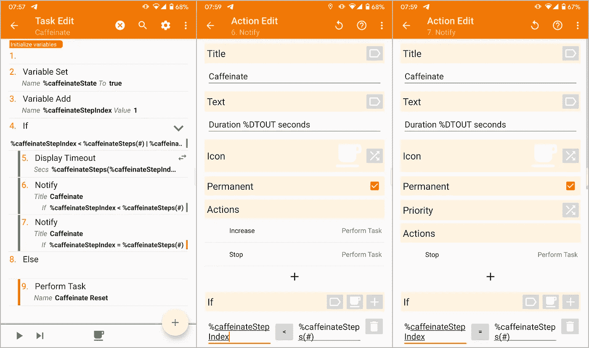
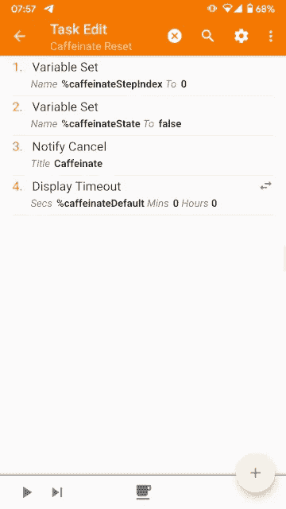

# 含 Tasker 的咖啡因——改良版

> 原文：<https://medium.com/geekculture/caffeinate-with-tasker-improved-version-f7f20c918b05?source=collection_archive---------9----------------------->

Photos by [Daniel Romero](https://unsplash.com/@rmrdnl?utm_source=unsplash&utm_medium=referral&utm_content=creditCopyText) and [Nathan Dumlao](https://unsplash.com/@nate_dumlao?utm_source=unsplash&utm_medium=referral&utm_content=creditCopyText) on [Unsplash](https://unsplash.com/s/photos/android?utm_source=unsplash&utm_medium=referral&utm_content=creditCopyText)

在这篇[文章](/geekculture/caffeinate-with-tasker-301bed100e60)中，我描述了一个 Tasker 项目来增加任务的显示超时。

这个版本的问题是超时步骤是硬编码的，使得*咖啡因*任务错综复杂，重复，难以编辑。

我决定投入一些时间，改进如下。

# 项目描述

项目现在使用以下变量工作:

1.  *%咖啡因状态*:任务活动时**为真**；**假**否则。
2.  *%caffeinateDefault* :以秒为单位定义默认超时。
3.  *%caffeinateSteps* :这个数组包含了任务使用的所有超时步骤。
4.  *%caffeinateStepIndex* :标记 *%caffeinateSteps* 数组中哪个步骤是活动的。

它包含以下任务:

*   **咖啡因设置**:询问用户默认超时以及*咖啡因*任务需要的各个步骤。它在导入此项目时运行。
*   **咖啡因**:循环执行各个步骤，当执行到最后一个步骤时，它会将超时时间重置为默认值。它会显示一个通知，要求转到下一步或将超时重置为默认值。
*   **咖啡因复位**:恢复默认超时。
*   **咖啡因老**:原任务从故事开始。

还有一个名为**咖啡因重置**的配置文件，它在用户关闭显示器时运行同音异义任务。你可以在 [*第二步了解更多。简介*](/geekculture/caffeinate-with-tasker-301bed100e60#caee) 来自原文章。

你可以在这里下载项目[。](https://taskernet.com/shares/?user=AS35m8nzU8Z2OxB1WGqHbYHDLajdlq0DG%2B8k8f7L2XfQM3eHbHEAthA2xNvalA2%2FZaJvRZj2roE7ow%3D%3D&id=Project%3ACaffeinate)

# 改进的任务概述

在下面的段落中，我将解释前面介绍的任务。

## **咖啡因的设置**

它执行以下操作:

1.  **锚**:定义一个“准备数组”标签。
2.  **数组清零**:清零 *%caffeinateSteps* 数组的值。
3.  **变量集**:将 *%caffeinateStepIndex* 变量的值设置为 **0** 。
4.  **锚**:定义一个“定义默认”标签。
5.  **输入对话框**:要求用户以秒为单位输入默认显示超时，并保存在*%输入*变量中。它接受一个数字。
6.  **变量集**:将 *%caffeinateStepIndex* 变量的值设置为 *%input* 。
7.  **锚**:定义一个“定义步骤”标签。
8.  **变量增加**:将*% caffeinatesteindex*变量增加 **1** 。
9.  **输入对话框**:要求用户以秒为单位显示超时的步长，并保存在 *%input* 变量中。它接受一个数字。
10.  **数组推送**:将*%输入*添加到 *%caffeinateSteps* 数组的 *%caffeinateStepIndex* 位置。
11.  **选择输入对话框**:要求用户添加另一个步骤并保存在 *%input* 变量中。这是一个是/否对话框。
12.  **转到**:如果*%输入*变量的值为**是**，返回到带有“定义步骤”标签的*锚*。
13.  **锚**:定义一个“初始化咖啡因”标签。
14.  **执行任务**:运行**咖啡因重置**任务，恢复显示超时和变量值。

## 咖啡因

On the left, the Caffeinate task. On the center and the right, the configurations of respectively Action 6 and 7.

它执行以下操作:

1.  **锚**:定义一个“初始化变量”标签。
2.  **变量集**:将 *%caffeinateState* 变量的值设置为**真**。
3.  **变量增加**:将*% caffeinatesteindex*变量增加 **1** 。
4.  **If** :变量 *%caffeinateStepIndex* 小于或等于 *%caffeinateSteps* 数组大小时运行的执行分支。
5.  **显示超时**:在 *%caffeinateStepIndex* 处将显示超时设置为 *%caffeinateSteps* 的值。
6.  **通知**:显示如下说明的通知。只有当 *%caffeinateStepIndex* 小于 *%caffeinateSteps* 数组大小时，它才会运行这个操作。它显示了下面描述的两个按钮。
7.  **通知**:显示如下说明的通知。只有当 *%caffeinateStepIndex* 等于 *%caffeinateSteps* 数组大小时，它才会运行这个操作。它仅显示下述*停止*按钮。
8.  **否则**:如果*动作 4* 条件为**假**时运行的执行分支。
9.  **执行任务**:运行**咖啡因重置**任务，恢复显示超时和变量值。

动作 6 和 7 显示了一个带有显示超时信息的持久通知。它有以下按钮:

*   **增加**:用*执行任务*动作调用**咖啡因**任务，增加超时。只有当有其他步骤可用时，此按钮才会出现。
*   **停止**:通过*执行任务*动作调用**咖啡因重置**任务，恢复显示超时。

## 咖啡因重置

它执行以下操作:

1.  **变量集**:将 *%caffeinateStepIndex* 变量的值设置为 **0** 。
2.  **变量设置**:将 *%caffeinateState* 变量的值设置为 **false** 。
3.  **通知取消**:删除*咖啡因任务*显示的通知。
4.  **显示超时**:将显示超时设置为 *%caffeinateDefault* 变量的值。

## **含咖啡因的老**

可以参考 [*步骤 1。任务>咖啡因*来自原文章](/geekculture/caffeinate-with-tasker-301bed100e60#25b6)对其的描述。

# 使用

可以参考 [*第三步。快速设置瓷砖*和](/geekculture/caffeinate-with-tasker-301bed100e60#f444)的使用方法见原文章*快速设置瓷砖*。