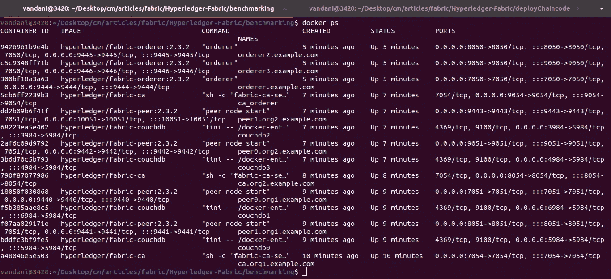
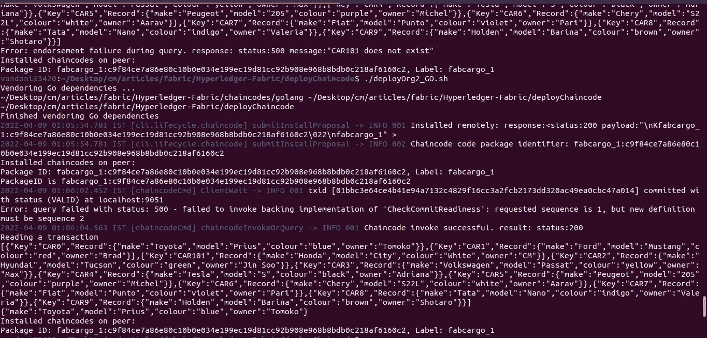
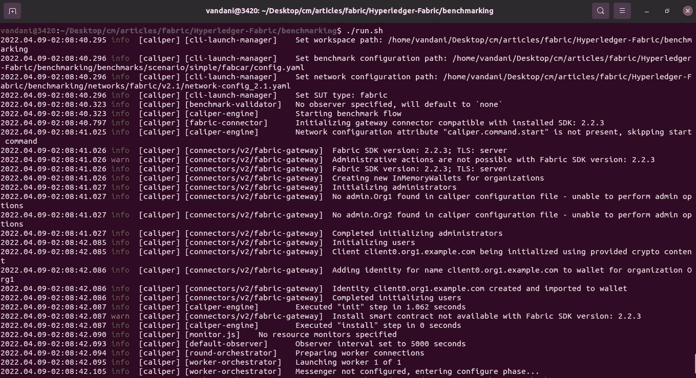
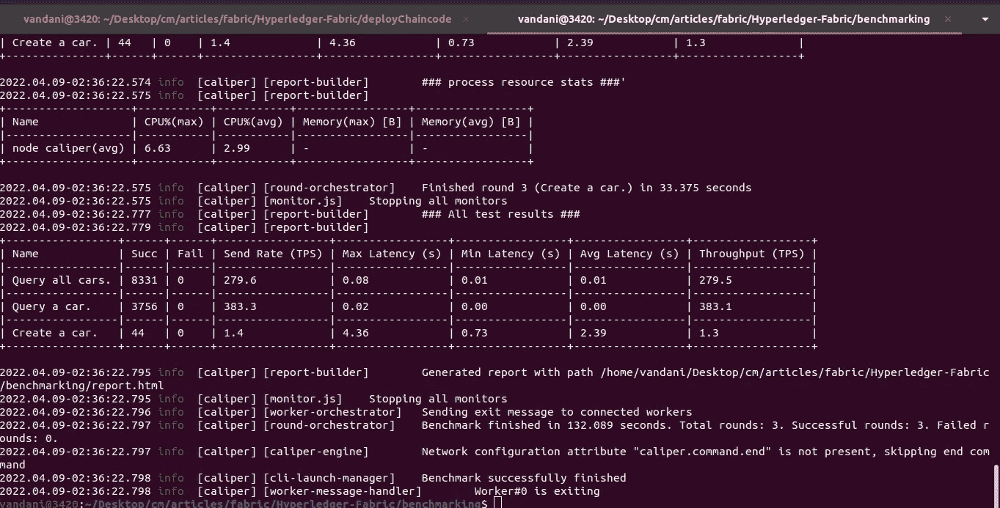
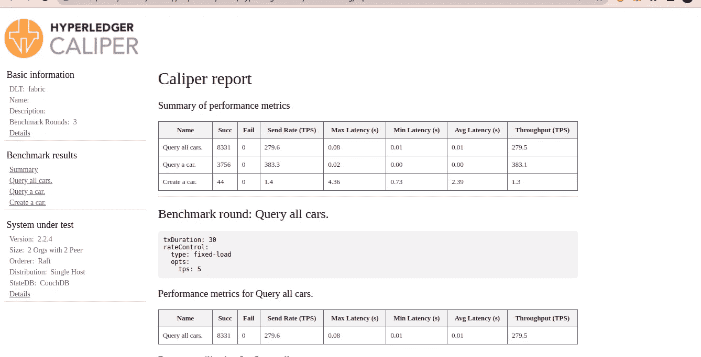
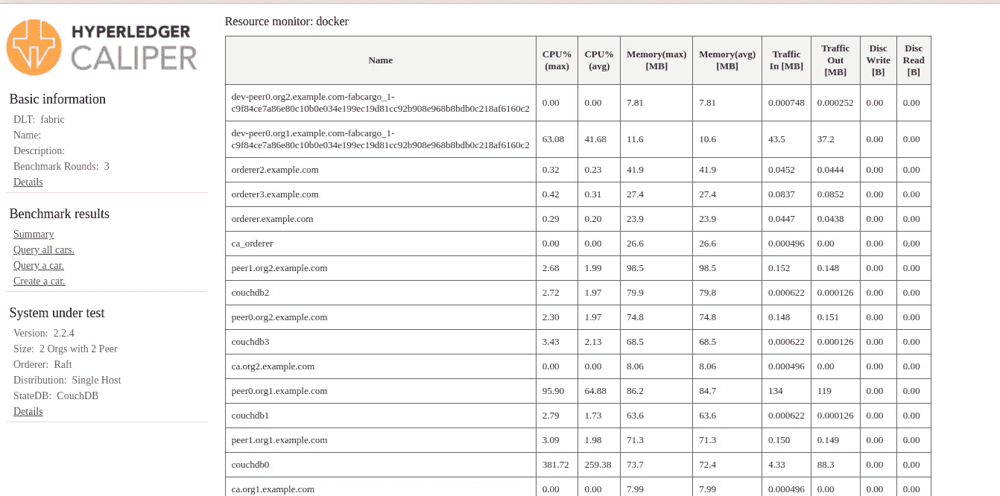

# Hyperledger Fabric 区块链中的 Hyperledger 卡尺集成

> 原文：<https://medium.com/geekculture/caliper-integration-in-hyperledger-fabric-blockchain-5762c1e8b241?source=collection_archive---------0----------------------->


Hyperledger Caliper

# 介绍

在本文中，我们将集成 **Hyperledger Caliper 的**最新版本 v 0 . 4 . 2 .**Hyperledger Caliper 是区块链的基准测试平台。**

# 观众

Hyperledger 结构操作员，管理员。这是一篇将**卡尺**集成到 HLF 网络运行中的实用动手文章。对于初学者，我想建议请通过一些基本概念的超帐织物。

> *注意:本文仅关注卡尺集成，而非完整的基准测试。*

# 先决条件

1.  基本了解 **Hyperledger Fabric 区块链**。
2.  对链码和调用、查询功能有基本的了解。
3.  基本的外壳命令、外壳脚本等。

# 系统需求

1.  Docker —版本 17.06.2 或更高版本
2.  Docker Compose —版本 1.28.5 或更高版本
3.  去
4.  节点版本 12.22.10
5.  NPM 版本**6 . 14 . 16**

# 设置步骤

*   结构区块链网络设置(如果您有正在运行的网络，请跳过)
*   链码部署。
*   卡钳的安装。
*   Caliper 与现有区块链网络的集成。
*   测试 Fabcar APIs。
*   总结。

# 文件夹结构

*   让我们克隆源代码。

```
git clone [https://github.com/cmjagtap/Hyperledger-Fabric](https://github.com/cmjagtap/Hyperledger-Fabric)
```

# 结构区块链设置

如果您的结构网络已经在运行，那么您可以跳过这一步。

让我们创建一个结构网络，并执行以下命令。

```
**export PATH=${PWD}/bin:$PATH
sudo service docker start
 cd org1
./1_enrollOrg1AdminAndUsers.sh
./2_generateMSPOrg1.shcd ../org2** ./**1_enrollOrg2AdminAndUsers.sh** ./**2_generateMSPOrg2.sh 

 cd ../orderer** ./**1_enrollAdminAndMSP.sh
./2_artifact.sh

 cd ../org1**
.**/3_createChannel.sh

 cd ../org2**
.**/3_joinChannel.sh**
```

Hyperledger fabric 2.3 区块链已准备就绪，您应该会看到所有处于运行模式的容器，如下所示。



Docker containers

# 链码部署

在目录结构中，导航到***deploy chain code***目录，执行下面的脚本，它们将部署 fabcar chaincode。

```
**./deployOrg1_GO.sh
./deployOrg2_GO.sh**
```



Chaincode Deployment

*   成功部署 chaincode 后，将会看到与上图相同的输出。

# 卡钳的安装

在这里，我们正在安装一个本地版本的卡尺使用 NPM。

**卡钳安装**

```
npm install -g --only=prod @hyperledger/caliper-cli@0.4.2 
```

**卡钳芯。**

```
npm install @hyperledger/caliper-core 
```

**卡尺绑定 HLF SDK。**

```
caliper bind --caliper-bind-sut fabric:2.2 --caliper-bind-cwd ./ — caliper-bind-args=”-g”
```

> 如果你在安装中面临权限问题，那么添加标志- **unsafe-perm**

# 综合

*   在 ***benchmark*** 目录中，有一些编写工作负载模块和配置基准测试模块的样例。
*   在 ***网络目录下*** 将不得不写一个连接配置文件。这将在区块链和卡尺之间建立一个连接。
*   使用您的结构网络证书更改此文件中的证书路径。
*   连接配置文件与我们编写的集成 REST SDK 或 Explorer 相同。
*   有两个环境变量用于卡尺。
*   1)卡尺基准配置文件。
*   2)网络连接配置文件
*   然后执行 **run.sh** 脚本来启动 Caliper。



Benchmarking init

*   成功进行基准测试后，将在控制台上看到如下详细输出。



Benchmarking Result

*   卡尺在**report.html**文件中生成一个报告。
*   在浏览器中打开此报告文件，查看详细的基准测试报告。



*   此外，我们可以看到每个区块链组件的完整资源利用率，如下所示。



Benchmarking Resource utilization

*   我们已经完成了 caliper 与 Hyperledger Fabric Blockchain 的集成。

# 打扫

执行以下脚本来清理所有 docker 容器和加密证书。

```
.**/clean.sh**
```

# 摘要

我们已经了解了如何将 hyperledger caliper 集成到运行结构网络中。我们学习了如何对区块链织物进行基准测试。在中，下一篇文章将会看到如何编写配置模型。