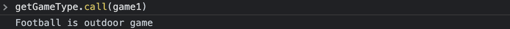
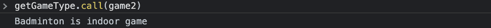
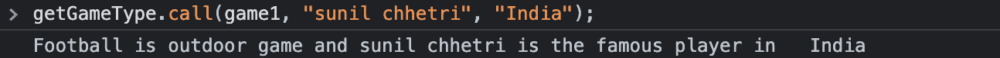
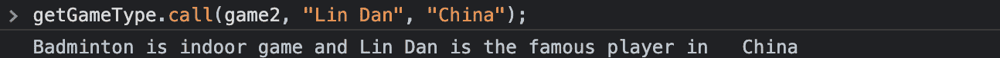
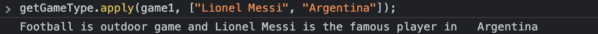
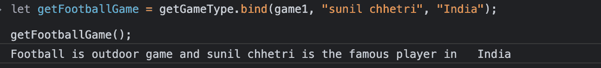

# 在 JavaScript 中调用、应用和绑定

> 原文：<https://medium.com/geekculture/call-apply-and-bind-in-javascript-609c10eb13b7?source=collection_archive---------12----------------------->


image credit: [https://unsplash.com/photos/aTt_rNa3gmM?utm_source=unsplash&utm_medium=referral&utm_content=creditShareLin](https://unsplash.com/photos/aTt_rNa3gmM?utm_source=unsplash&utm_medium=referral&utm_content=creditShareLink)k

本文解释了在 Javascript 中何时以及为什么应该使用 call、apply 和 bind 方法。

Javascript 提供了各种各样的内置方法来帮助实现可重用的代码，然而为了方便起见，我们往往会忽略它们。call、apply 和 bind 方法是我们仅在概念上记住的一些方法。

本文有助于理解调用、应用和绑定方法的实际用法。

在深入研究这些方法之前，让我们先了解一下它会对我们有所帮助的用例。

假设我们有两个属性很少的对象，包括一个方法:

```
let game1 = { name: "Football", type: "outdoor", getGameType: function() { console.log(`${this.name} is ${this.type} game`); }
  };let game2 = { name: "Badminton", type: "indoor", getGameType: function() { console.log(`${this.name} is ${this.type} game`);
     }
  }
```

game1 和 game2 对象具有不同值的公共属性。当我们像下面这样调用它们时，getGameType 属性在两个对象中打印游戏的名称和类型:


现在不用在游戏 1 和游戏 2 中都添加 *getGameType* 属性，我们只需在游戏 1 中添加并在游戏 2 中借用它。我们如何做到这一点？下面是*呼叫*和*运用*方法进行营救。

让我们从 game2 对象中移除 getGameType。现在游戏 2 的物体看起来如下:

```
let game2 = { name: "Badminton", type: "indoor"
  }
```

现在让我们借用 game1 的 getGameType 属性来打印 game2 对象的值:


这个概念也被称为函数借用。

我们通过使用 call 关键字从 game1 借用 getGameType 方法来调用 game2 的这个方法。

这里【getGameType 方法中的这个关键字指的是它被调用的当前对象。这就是为什么当我们在 call 方法中传递 game2 对象作为第一个参数时，this.name 和 this.type 指的是 game2 对象的名称和类型属性。

我们知道如何从一个对象借用一个方法，并使用其他对象的数据调用它。现在让我们重构 game1 对象，将 getGameType 方法分离出来作为独立的函数。

```
let getGameType = function() { console.log(`${this.name} is ${this.type} game`); }; let game1 = { name: "Football", type: "outdoor", }; let game2 = { name: "Badminton", type: "indoor"
  };
```

现在我们可以打印游戏和游戏 1 和游戏 2 对象类型，如下所示:



简单不是吗。现在我们有了一个独立的函数 *getGameType* ，我们可以通过传递参数将它用于广泛的用例。让我们看看我们能做些什么。

```
let getGameType = function(famousPlayer, country) { console.log(`${this.name} is ${this.type} game and ${famousPlayer} is the famous player in ${country}`);};
```

我们在 getGameType 函数中添加了两个新参数，这样它可以输出更多有价值的信息。现在让我们看看如何在通过*调用*方法调用时将这些参数传递给 getGameType 函数:



很简单，不是吗？我们可以向调用方法的*传递进一步的*逗号*分隔的参数，该方法又可以在 getGameType 函数中访问。*

注意:*调用*方法的第一个参数应该始终是从中访问值的对象。然后我们可以传递任意数量的参数，这些参数可以被 getGameType 函数直接访问。

我们了解了如何以及何时可以使用*调用*方法，现在让我们看看如何使用*应用*方法。



*apply* 方法与 *call* 方法的工作完全相同，唯一的区别是使用它们的方式不同。在*中应用*方法我们以数组的形式传递参数。因此，第一个参数是上下文对象，第二个参数是函数 *getGameType* 可以直接访问的参数数组。

现在我们来谈谈 bind 方法。

*bind* 方法看起来和 call 方法完全一样，但是唯一的区别是没有立即调用 *getGameType* 函数 *bind* 方法将 *getGameType* 方法与我们作为第一个参数传递的对象绑定，并返回该方法的副本。



如你所见，我们没有像在 *call* method 中那样立即调用方法，而是将返回方法存储在一个变量中，我们可以在代码的后面部分调用它。

让我们回忆一下我们对调用、应用和绑定的理解:

1.  call 方法调用函数，第一个参数作为上下文对象，其他参数用逗号分隔，函数可以直接使用。
2.  apply 与 call 方法完全相同，唯一的区别是它将第二个参数作为参数的数组列表。
3.  bind 方法类似于 call 方法，但是它不调用函数，而是给你一个完全相同的函数的副本，以后可以调用。

— —

Chidanandan(如果全名很难发音，就叫他 Chidu)是劳氏公司的一名软件开发工程师，在那里他帮助开发技术和解决方案，为劳氏公司及其各种业务提供动力。