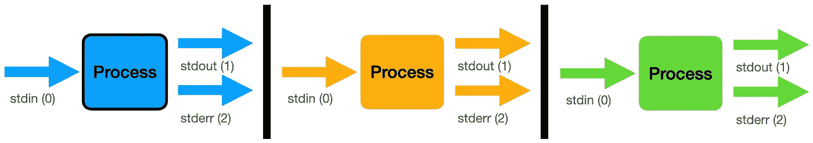
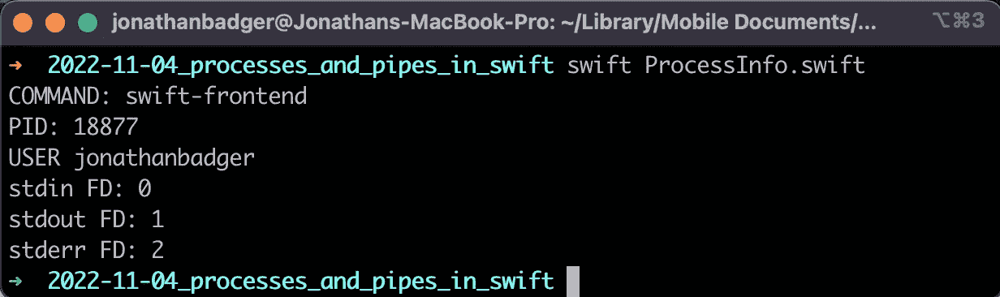
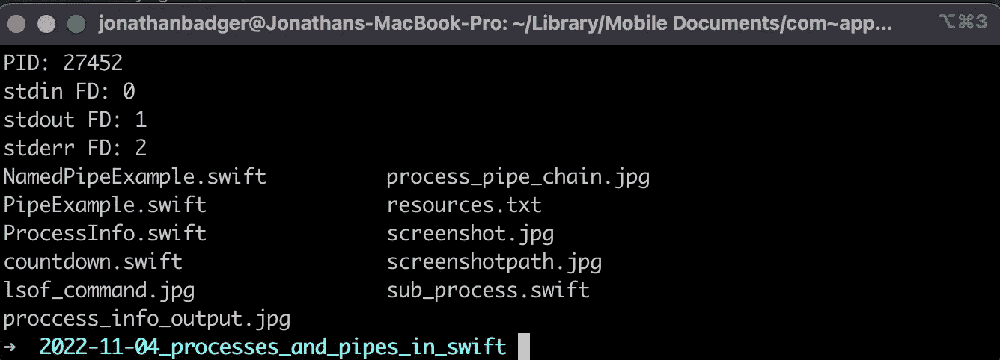
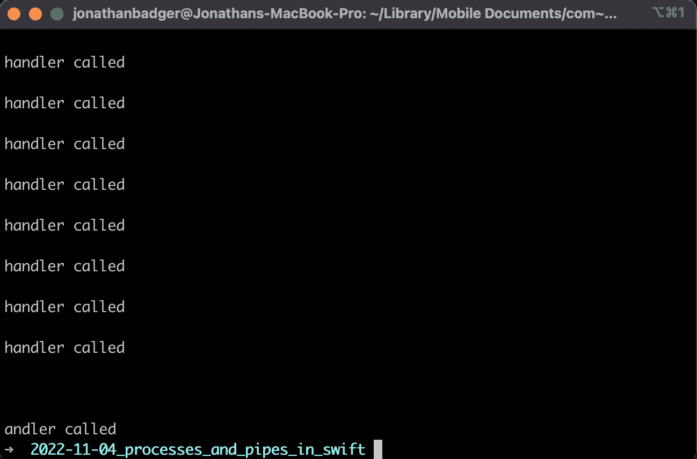
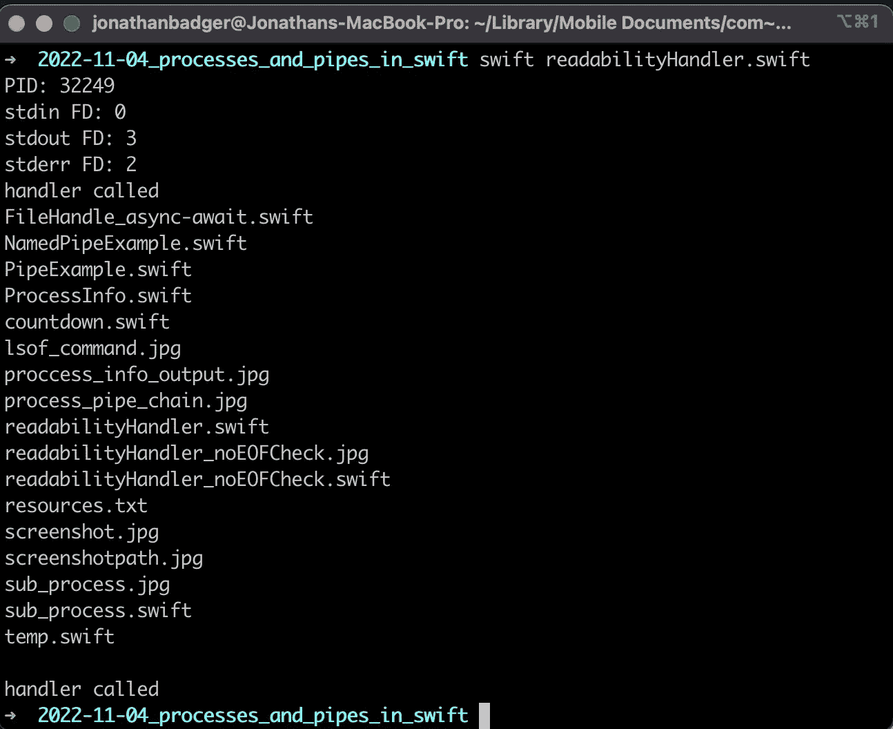
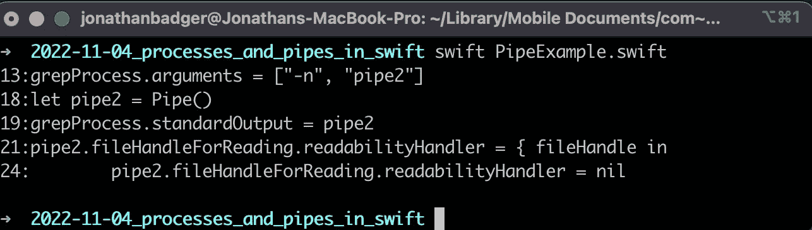
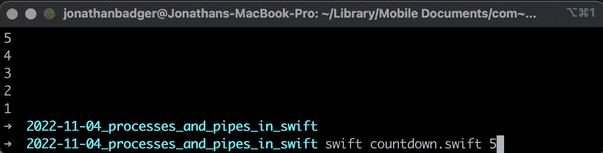
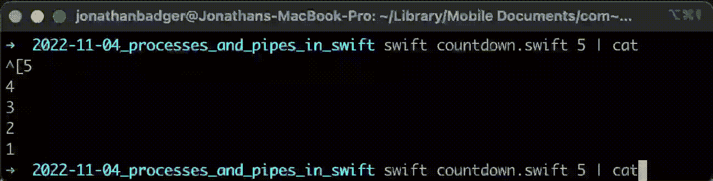
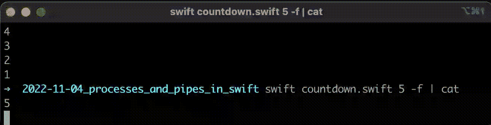

# 从 Swift 调用 Unix 命令

> 原文：<https://medium.com/geekculture/calling-unix-commands-from-swift-37730b5d3cef?source=collection_archive---------9----------------------->

## 在 Swift 中与流程和管道打交道的考验和磨难

Photo by [Lukas](https://unsplash.com/@lukash?utm_source=unsplash&utm_medium=referral&utm_content=creditCopyText) on [Unsplash](https://unsplash.com/s/photos/computer-terminal?utm_source=unsplash&utm_medium=referral&utm_content=creditCopyText)

Unix 操作系统(MacOS、Ubuntu 等。)提供了一组强大的内置命令，可以使用管道将这些命令优雅地连接在一起，以相对较少的努力完成真正令人惊叹的事情。你知道有哪些 Unix 向导可以通过混合使用诸如`awk`、`sed`和`grep`这样的命令来变出一行程序，从而在你的大量日志文件中找到你想要的东西吗？也许那就是你，即使不是，呼唤这些来自 Swift 的无价之宝仍然会很有帮助。今天，我想介绍一些在 Swift 中处理流程和管道的工具和技术。在这个过程中，我会指出一些你可能会遇到的非常重要的陷阱，以及一些解决方法。

## TLDR

如果你只需要简单地调用终端命令并收集输出/错误，我强烈推荐你去看看约翰·桑德尔的 [ShellOut](https://github.com/JohnSundell/ShellOut) 包。对于那些想使用管道或在更亲密的基础上与进程交互的人，请继续阅读:)

## 介绍

首先，让我们简单回顾一下 Unix 系统上的进程是如何工作的。计算机上运行的每个程序都称为一个进程。每个进程都有一个名称、唯一标识符(缩写为 PID)和一个[文件描述符表](https://en.wikipedia.org/wiki/File_descriptor#file_descriptor_table)，该表存储关于打开文件、流、管道和网络套接字的信息。文件描述符表中的前三个索引(0、1 和 2)是特殊的。它们对应于标准输入、标准输出和标准错误流，可以通过管道在进程之间建立单向通信通道。

这是 Unix 系统所有灵活性和功能的来源。将一个命令的输出(stdout)用作下一个命令的输入(stdin)。尽管该系统的设计简单而优雅，但有一些微妙的复杂性需要注意…当您开始与 Swift 的终端命令交互时，其中一些很容易成为棘手问题。在接下来的章节中，我将尝试指出其中的一些。

## Swift 中的流程和标准流程

在 Swift 中访问流程和流信息的机制有所不同，这取决于您是对程序的当前流程感兴趣，还是对您创建的子流程感兴趣。让我们通过查看下面的示例脚本来开始访问关于您的应用程序的信息:

当我在我的机器上运行这个程序时，我得到如下结果:

在这里，`[ProcessInfo](https://developer.apple.com/documentation/foundation/processinfo)`类用于获取进程的名称(swift-frontend)、ID (18877)和运行它的用户(我)。您还可以从`ProcessInfo`获得许多其他信息，比如环境变量、命令行参数、操作系统信息，甚至物理硬件规格。在我看来，这有点像大杂烩。所有进程的标准流在最低层连接到文件描述符表。您使用 Swift 中的`FileHandle`类与它们进行交互。要访问主流程的标准流，可以在`FileHandle`类中使用恰当命名的静态变量(就像我在上面的脚本中所做的那样)。

您创建的子流程略有不同。标准流作为`Process`对象的属性包含在内。创建您自己的流程的示例可能如下所示:

运行这个命令会得到以下输出:

这个小片段展示了在 Swift 中运行流程的一些事情。要设置想要运行的可执行命令，可以使用`.executableURL`属性。

> 注意:分配给`.executableURL` **的 URL 必须**是文件 URL！

这里，我们的可执行 URL 运行 bash 的另一个实例，并将`*ls*`命令作为一个简单演示的参数传递。要开始运行您的子流程，您需要调用`*.run()*`。您还可以暂停、恢复和终止命令，就像在命令行上使用键盘一样。在我们继续之前，有几个关于子流程的要点。

1.  未指定时，子进程继承父进程的许多属性。在上面的例子中，我创建的进程的标准流与主程序的 stdin、stdout 和 stderr 是相同的。传递给程序的任何环境变量也是如此。
2.  当程序退出时，您创建的进程不会自动终止！您可以使用`.isRunning`属性来检查一个进程是否还活着，并且在结束程序执行之前，应该在您的任何活动进程上调用`.terminate()`。如果不这样做，可能会导致恶意进程在后台运行。

## 使用命令输出

从您创建的流程的输出和错误流中访问数据有同步和异步两种方式。由于您通常无法知道子流程何时完成或有数据可用，异步调用几乎总是可行的。使用  `[FileHandle](https://developer.apple.com/documentation/foundation/filehandle)`异步访问数据有三个选项:

1.  使用通知和相关功能，如`.readInBackgroundAndNotify()`
2.  使用文件句柄的`.bytes.lines`属性和 for-try-await 语法

3.将代码块分配给`.readabilityHandler`

可悲的是，所有这些方法都有缺点，而且比它应该的要复杂得多。在苹果的论坛上有一个来自奎恩“爱斯基摩人”的极好的[帖子](https://developer.apple.com/forums/thread/690382)描述挑战，如果你想要一些深入的讨论。现在，让我们修改一下`ls`演示脚本(从上面开始),让您开始使用代码示例。

*   注意:我跳过选项 1。使用通知要求观察者(您创建的某个对象)从 NSObject 继承。这对我来说是一个交易破坏者。

## 使用 async-await 从文件句柄中读取

选项 2 使用 Swift 中一些较新的 async-await 特性从 FileHandle 中读取。让我们来看看一些稍加修改的演示代码:

有几个要点需要讨论一下。首先，我们将 standardOutput 重新分配给一个输出管道，而不是让我们的进程从我们的程序继承标准输出。如果将“for try await”循环添加到标准输出中，如下所示:

您将创建一个无法退出的死循环，并且您的下游代码将永远不会被调用。第二，你也要确保在进入‘for try await’循环之前`.run()`被调用。否则你的程序执行将会停滞不前，等待永远不会出现的数据。

## 使用可读性处理程序读取文件句柄

现在让我们看看选项三，可读性处理程序。可读性处理程序将您提供的任何代码块粘贴到一个私有的串行队列中，当数据可用时将调用该队列。一个主要的症结是处理程序没有检查你的文件句柄是否已经关闭(即进程已经完成)。相反，您的代码块会被无限期调用。下面是演示脚本，其中的可读性处理程序演示了这种不良行为:

输出是:

呸。长话短说，确保您添加了空数据检查。当`.availableData`为空时，意味着你的 FileHandle 已经到达文件的末尾(EOF ), readability handler 应该被设置为 nil(参见这个 StackOverflow [post](https://stackoverflow.com/questions/52335435/how-can-i-tell-when-a-filehandle-has-nothing-left-to-be-read) )。下面是对空数据进行检查的相同代码:

输出是:

看起来不错。现在我们只有两个对文件句柄的调用。一个是当我们的`ls`命令结束时，另一个是当我们发现已经到达文件末尾时。

## 使用管道

现在让我们看一个如何使用管道将多个进程链接在一起的例子。

我们对这个脚本的输出是:

让我们检查一下重要的部分。在本例中，我们有两个流程。第一个进程`catProcess`使用`cat`命令打印文件 PipeExample.swift 的内容。第二个进程`grepProcess`使用`cat`命令的输出来搜索‘pipe 2’的所有实例，并打印出每个匹配的行和相应的行号。花点时间看看代码。变量`pipe1`用于将管道分配给`catProcess`的 stdout 和`grepProcess`的 stdin，从而将两个进程连接在一起。第二个管道`pipe2`用于收集最终输出并将其打印到屏幕上。我们在每个进程上连续调用`.run()`,并告诉最后一个进程暂停执行，直到它完成。

这就是了。Swift 中管道连接在一起的命令行流程。您可以使用相同的技术将其他命令链接在一起。引导 stderr 也是同样的方式。事实上，您可以将 stdout 和 stderr 分配给同一个管道，就像在命令行中使用|&如果您愿意的话。

## 标准流通常被缓冲

随着您继续使用管道和流程，您可能会遇到这样的情况:数据似乎已经停止流动，或者以意想不到的时间间隔更新。为了演示这种行为，让我们看看另一个名为 countdown.swift 的小型 Swift 脚本:

这个小脚本接受一个参数，一个整数，并在每个数字之间暂停一秒钟进行倒计时。

但是请注意，如果我将这个输出传输到`cat`，会发生什么。

我们在五秒钟内没有任何输出，然后我们立刻得到所有的输出。这是怎么回事？这实际上是 Unix 的预期行为。倒计时过程的输出缓冲区中的数据不会被传递到下游，直到它满了(在大多数系统上是 4k)或者直到过程完成。如果你再看一下倒计时脚本，有一个选项会在打印后在标准输出上调用`fflush`。这将获取缓冲区中的所有数据，并将其传递给下游流程。

维奥拉。管道畅通。

## 包裹

如果你能做到这一步，非常感谢你的阅读！如果你觉得这篇文章有趣和/或有用，请鼓掌并跟随我进行更快的冒险！