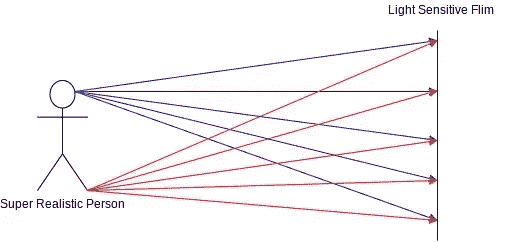
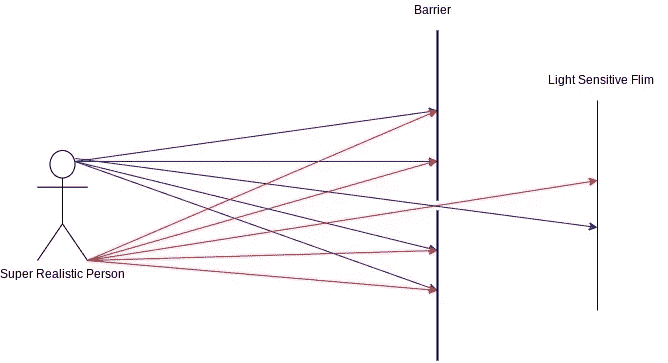
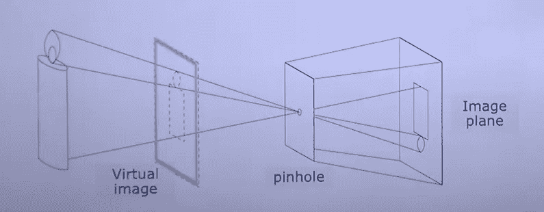
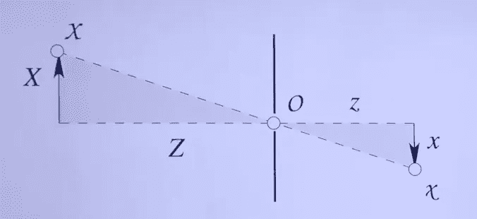

# 相机成像

> 原文：<https://medium.com/geekculture/camera-image-formation-3d5929afa4e7?source=collection_archive---------14----------------------->

## 从天真到针孔到基于镜头的相机模型

你知道什么是数码相机，数码相机的各种组件是什么。如果你没有，你应该浏览一下[这个很棒的博客](https://vipin-sharma.medium.com/understanding-a-modern-digital-camera-89ca2ee3e2da)。

现在你想知道相机是如何捕捉图像的。

理解数码相机如何准确地捕捉图像并不简单，因为你必须从基础知识开始，了解当前的数码相机，我们必须充分理解为什么相机的各种组件是必要的。

# 图像形成

假设你有一个真实世界的 3D 物体(如图 1 中的一个超级逼真的人)，你想用相机捕捉它。

你假设要做的是拿一个感光胶片(相机传感器)来捕捉物体，你就完成了，你有一个图像。

**没有！**

将感光膜直接暴露于物体的问题是，多条光线会从物体的同一点向不同方向反射，从而在感光膜上产生多次投影。

在这种情况下，我们的胶片/芯片捕捉的是所考虑的物体的平均亮度值。我们最终会得到一个没有任何结构的斑点。

Figure 1: How light rays are projected from an object to a light-sensitive film (Figure by Author)

# 针孔摄像机模型:直觉

为了获得一些有意义的结构，我们需要限制感光胶片捕捉到的单个点的反射次数。

限制被捕捉的反射数量的最简单的方法是限制被传递到感光胶片上用于捕捉的反射数量。

为了达到这个目的，我们在物体和光敏薄膜之间加了一道屏障，如图 2 所示。屏障中允许光线通过的开口的尺寸非常小。这个开口被称为照相机的光圈。

Figure-2: Adding barrier before the light-sensitive film (PinHole camera model, simplified)

添加屏障减少了模糊，这有助于捕捉对象的适当结构。

还有一点需要注意的是，胶片捕捉到的图像是上下颠倒的。

# 针孔照相机模型

好了，现在我们知道我们需要一个屏障，在被捕捉的物体和感光胶片之间有一个小开口，这样才能真正获得图像。

这就是针孔相机模型。针孔相机是一种没有镜头但有一个微小光圈(屏障上的开口)的相机，它可以捕捉图像平面上的目标。捕获的图像上下颠倒(如图 3 所示)。

Figure-3: Pinhole camera model ([Source](https://www.ipb.uni-bonn.de/html/teaching/photo12-2021/2021-pho1-02-camera.pptx.pdf))

为了从数学上描述针孔摄像机模型，我们将使用图-4。

Figure-4: Pinhole camera model mathematics ([Source](https://www.ipb.uni-bonn.de/html/teaching/photo12-2021/2021-pho1-02-camera.pptx.pdf))

在图 4 中，垂直线是屏障，左边的一切是 3D 真实世界，右边的一切是 2D 图像世界。

由于图像平面与障碍物的距离 z 相同，因此在将 3D 对象投影到图像的过程中，深度尺寸会丢失。

# 薄镜头照相机

## 针孔摄像机模型的问题

现在我们有了可以捕捉图像的相机模型，那么为什么现代数码相机要使用镜头呢？

针孔摄像机模型的问题是，为了获得清晰的图像，屏障中使用的针孔应该非常小。

由于针孔非常小，所以需要等待很长时间才能让足够的光通过针孔来捕捉图像。这是不切实际的，因为被摄像机捕捉的物体几乎总是在移动。

为了解决这个问题，我们可以尝试增加针孔的大小，但这将导致物体同一点的多条光线通过针孔并映射到感光膜的不同位置。
这会导致图像模糊。

## 解决方案:使用镜头

不是在栅栏上开一个很小的孔(针孔)，而是在栅栏上开一个很大的孔，并使用透镜。

镜头从物体的同一点获取多条光线，并将它们映射到感光胶片中的同一点。

当使用镜头时，我们可以在栅栏上开一个更大的孔(减少曝光时间)，我们仍然可以得到清晰的图像。

有一点应该注意的是，薄镜头相机只是针孔相机模型的近似，它有自己的问题。

# 总结和结论

现在我们知道了相机如何捕捉图像背后的理论，针孔相机的模型是什么，镜头的需求是什么。

深入研究镜头理论以及各种相机使用的不同类型的镜头是留给读者去探索的。

应该注意的是，大多数计算机视觉任务(如 3D 场景重建)使用针孔相机模型，即使相机有镜头。
这个针孔摄像头可以很好地完成大多数计算机视觉任务。

# 参考

1.  [Cyrill stach niss 的摄影测量学课程讲座](https://www.youtube.com/watch?v=2KR-b2Fmjxk)
2.  [摄影测量学课程讲义](https://www.ipb.uni-bonn.de/html/teaching/photo12-2021/2021-pho1-02-camera.pptx.pdf)