# Raspberry Pi 4 上的摄像头设置

> 原文：<https://medium.com/geekculture/camera-setup-on-raspberry-pi-4-912e7d415cdf?source=collection_archive---------1----------------------->

## 无线摄像机设置

作者:[爱德华多·帕德隆](https://fullmakeralchemist.medium.com/)

Raspberry 中最常用的应用之一是使用相机，使用 Tensorflow 并赋予它检测对象的能力。既然 Raspberry Pi 已经足够快来执行机器 learning🧠，那么在项目中添加这些功能就更容易了。

本指南将向您展示如何连接 Raspberry Pi 相机模块、拍摄照片、录制视频和应用格式更改的步骤。了解相机模块很重要📷在开始创建我们的应用程序之前。

让我们开始吧。

# 1.你需要什么

有多个选项，但在本指南中，我会给你两个选项来选择，在树莓 Pi 的一部分有两个相机模块，我稍后会谈到它们。

*   笔记本电脑
*   树莓 Pi 4
*   电源(如果你没有太多经验的话，最好和你的覆盆子一起购买官方电源以免出现问题 [USB-C 电源](https://www.raspberrypi.org/products/type-c-power-supply/)。
*   具有移动热点功能的智能手机
*   微型 SD 卡
*   [Raspberry Pi 高品质相机](https://www.adafruit.com/product/4561)(这是我将在本指南中使用的相机，但你可以使用 [Raspberry Pi 相机板 v2](https://www.adafruit.com/product/3099) 这是更老更便宜的版本。)
*   [6mm 3MP 广角镜头，用于 Raspberry Pi HQ 相机 3MP](https://www.adafruit.com/product/4563)(HQ 相机模块允许我们使用镜头，在使用第二个相机选项的情况下，此元素是可选的)。
*   [Raspberry Pi 摄像头排线](https://www.adafruit.com/product/2087)(通常包含在 Raspberry Pi 摄像头模块的购买中)。
*   相机三脚架(**注:仅在使用 HQ 模块且您认为有必要时使用**)。HQ 模块的优势在于它有一个标准的 1/4”-20 三脚架，这是目前大多数三脚架都有的，我给你留了一个在[亚马逊](https://www.amazon.com/JOBY-GorillaPod-Magnetic-Mini-Smartphones/dp/B074WFVQKM/ref=as_li_ss_tl?dchild=1&keywords=joby+tripod&qid=1606086337&s=electronics&sr=1-16&linkCode=sl1&tag=mmjjg-20&linkId=ef1e9b5d641d78641b1fd25e0b683232&language=en_US)上购买选项的链接。

可选:

*   [Raspberry Pi HQ 相机外壳](https://learn.adafruit.com/raspberry-pi-hq-camera-case/3d-printing)(如果你有 3D 打印机或者可以进行 3D 打印，我会给你留下一个链接，这样你就可以打印一个相机形状的外壳，稍后我会给你它的样子)。
*   如果您使用该案例，您将需要定制螺钉 [M2.5](https://www.adafruit.com/product/3299) ，我们将需要 12 毫米和 8 毫米长，尽管为了利用您可以购买一些 10 毫米和 5 毫米长的螺钉，它们可能对其他项目有用，您可以在亚马逊或专业电子商店购买它们。

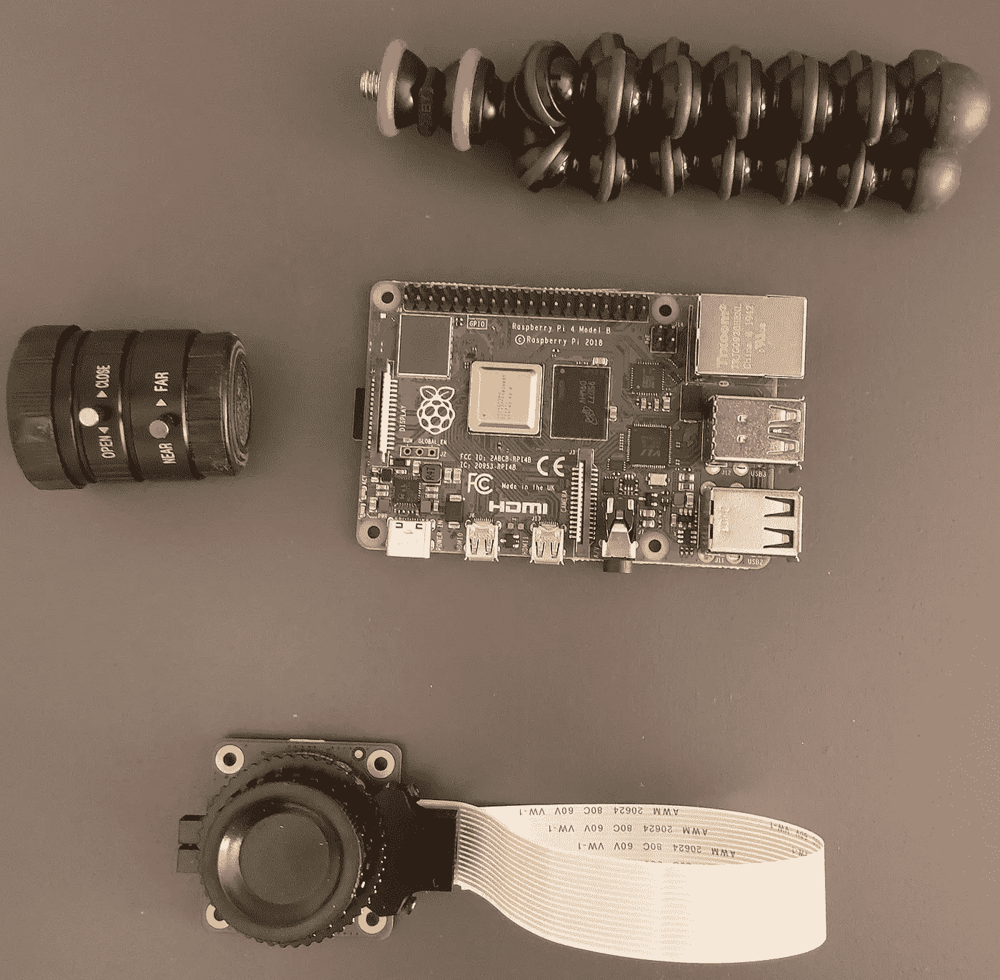

Image by [Eduardo Padron](https://fullmakeralchemist.medium.com/)

如果你要使用 3D 模型的情况下，这里你有一个什么样子的图像，这是惊人的，你不觉得吗？

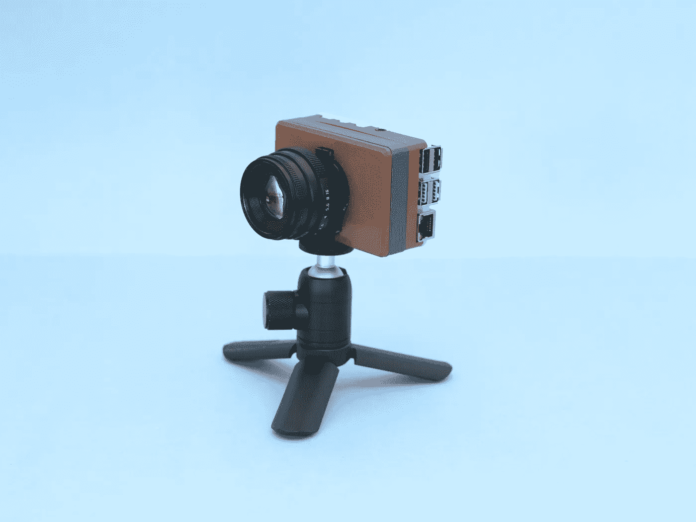

Image by Adafruit [3D Case Raspberry Pi](https://cdn-learn.adafruit.com/assets/assets/000/091/673/medium640/raspberry_pi_hero-camera.jpg?1591047793)

现在我们将讨论我提到的两个模块。

## 1.1 总部摄像头模块

这个模块是最新的树莓 Pi 相机配件。与现有的 v2 相机模块相比，它提供了更高的分辨率(1200 万像素，而以前为 800 万像素)和灵敏度(每像素面积增加约 50%，以提高在弱光条件下的性能)，并且设计用于可互换的 C 和 CS 安装镜头。使用适配器可以使用其他镜头。

6mm CS 转接环镜头和带 C 转接环的 [16 mm](https://www.adafruit.com/product/4562) 镜头是所有兼容镜头的例子。高品质摄像机为摄像机模块 v2 提供了另一种选择。

适用于要求最高视觉保真度和/或集成专业光学器件的工业和消费应用，包括安全摄像机。它兼容所有树莓 Pi 型号，最新版本的软件。

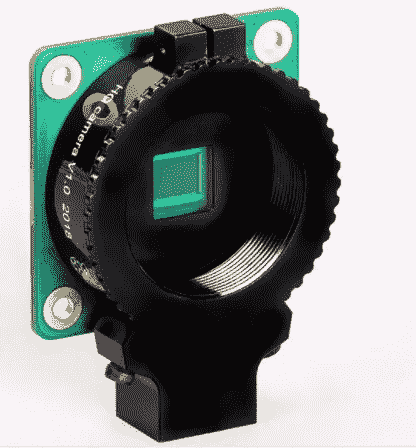

Image by [Raspberry Pi](https://www.raspberrypi.org/homepage-9df4b/static/ee30c4f49820a9787a203666ccd64c37/adf0e/03b5b033-5aca-40a7-ae4a-1592a9403890_CAM%2BHERO%2BALT%2B2.jpg)

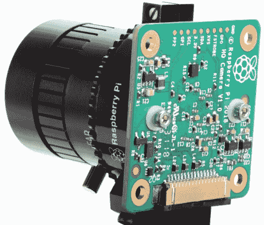

Image by [Raspberry Pi](https://www.raspberrypi.org/homepage-9df4b/static/0c55b8f99763f65ef3d7c2553fa6c23c/adf0e/5b702dd6-20bd-41ba-9655-dc3c9e73c048_CAMEAR%2BBACK.jpg)

## 1.2 Raspberry Pi 摄像头板 v2 (8 Mp)

这个 8 Mp 摄像头模块能够捕捉 1080 px 的视频和图像，它可以连接到所有的 Raspberry Pi 型号。即插即用，非常适合膝上型摄影、视频录制或用于安全和运动检测应用。只需将随附的电缆连接到 Raspberry Pi 的 CSI 端口。

该模块尺寸很小，为 25 mm x 23 mm x 9 mm，重量为 3 克，非常适合重量非常重要的移动应用或其他应用。

该传感器的分辨率为 800 万像素，并有一个对焦镜头。至于图像，该相机能够拍摄高达 3280 x 2464 像素的静态图像和 1830p30 视频。

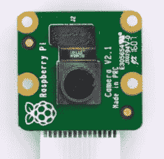

Image by [Raspberry Pi](https://www.raspberrypi.org/homepage-9df4b/static/621b26de7977c5b8d765b3003b341a49/8924f/68fe7e4cb53767ad6c033bf3b46da3452188a24a_pi-camera-front-1-1426x1080.jpg)

# 2.摄像机设置

## 2.1 连接

目前所有的 Raspberry Pi 型号都有一个连接摄像头模块的端口。

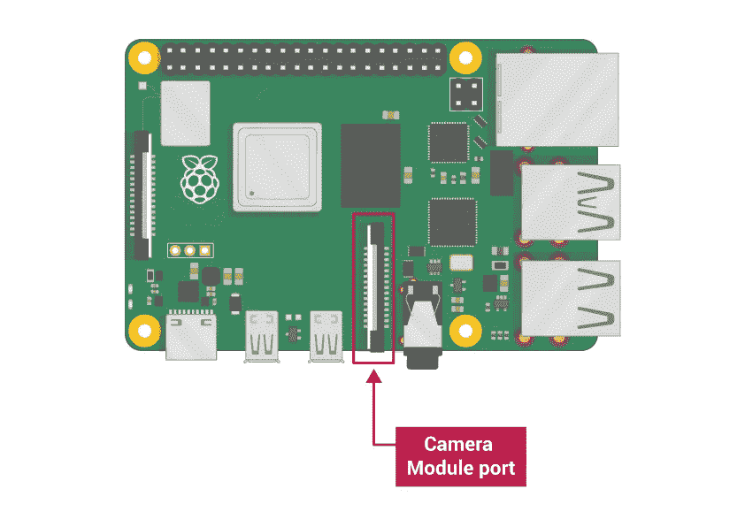

Image by [Raspberry Pi](https://projects-static.raspberrypi.org/projects/getting-started-with-picamera/e700e884354667bc3db3dddc19e20931a787c9a7/en/images/pi4-camera-port.png)

**注:如果您想使用 Raspberry Pi Zero，您需要一根摄像头模块电缆，它可以插入 Raspberry Pi Zero 的较小摄像头模块端口。**

连接摄像头模块。确保你的树莓酱已经关闭。

1.找到摄像头模块端口

2.轻轻拉起塑料端口夹的边缘

3.插入相机模块的扁平电缆(**注:确保电缆方向正确。电缆的蓝色一侧朝向插孔连接器和 USB 端口**

4.将塑料夹放回原位。


Gig by [Raspbery Pi](https://projects-static.raspberrypi.org/projects/getting-started-with-picamera/e700e884354667bc3db3dddc19e20931a787c9a7/en/images/connect-camera.gif)

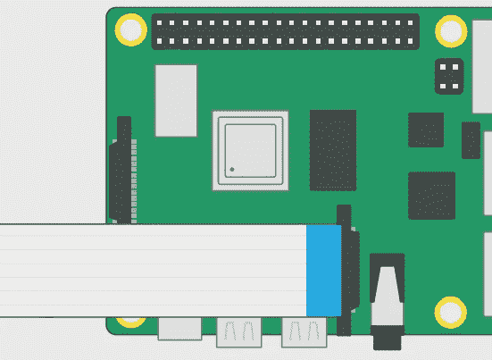

Image by [Raspberry Pi](https://magpi.raspberrypi.org/books/camera-guide)

在我的例子中，连接 HQ 模块如下所示:

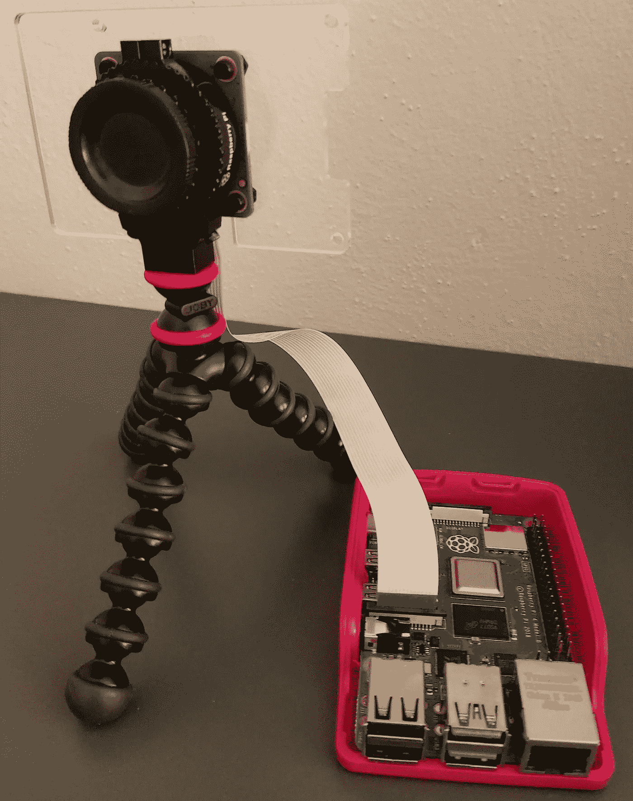

Image by [Eduardo Padron](https://fullmakeralchemist.medium.com/)

我选择只使用带有树莓的 3D 模型的相机支架，所以我将向你展示一些如何使用螺丝和最终结果。

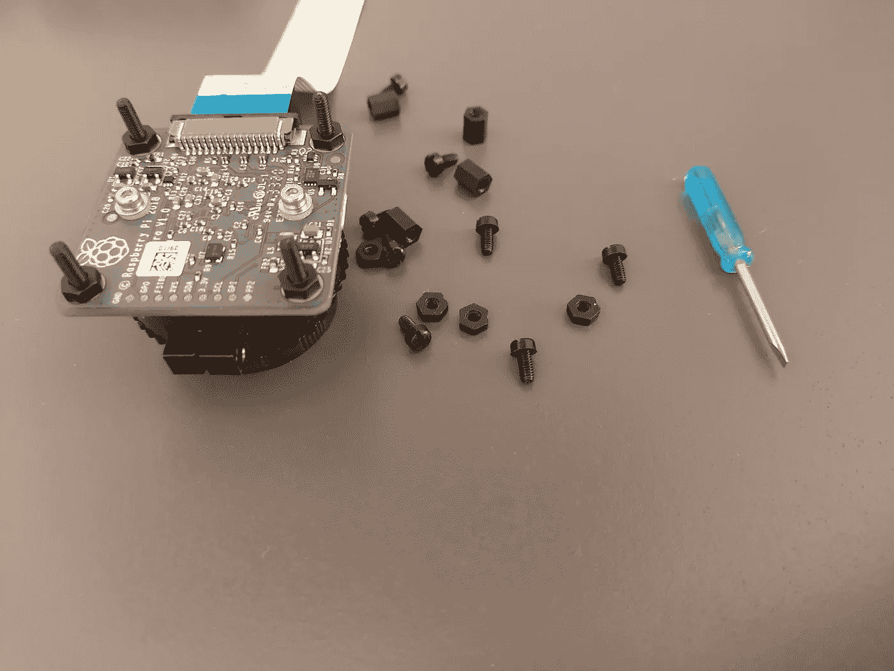

Image by [Eduardo Padron](https://fullmakeralchemist.medium.com/)

现在我只需要连接镜头，这一次我用的是 6mm 的镜头，如果你用的是 8 Mp V2 选项，你可以跳过这一部分，直接用 2.2。


Image by [Raspberry Pi](https://magpi.raspberrypi.org/books/camera-guide)

我们必须移除 6mm 镜头的防尘盖和 C-CS 适配器，如下所示:


Image by [Raspberry Pi](https://www.raspberrypi.org/homepage-9df4b/static/ee30c4f49820a9787a203666ccd64c37/adf0e/03b5b033-5aca-40a7-ae4a-1592a9403890_CAM%2BHERO%2BALT%2B2.jpg)

镜头配有两个盖子，一个在镜头侧面，另一个用于连接模块的输入。

## 安装透镜

6 毫米镜头是 CS 安装，所以你不需要 C-CS 适配器环。如果安装了适配器，它将无法正确对焦，因此如果有必要，请将其移除。

然后一直顺时针转动镜头，使其与后焦距调节环连接。**不要太用力挤压，因为你可能会损坏镜头或模块，只要保持紧固即可。**

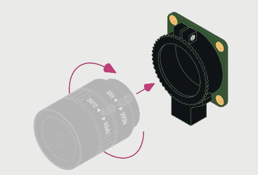

Image by [Raspberry Pi](https://magpi.raspberrypi.org/books/camera-guide)

## 2.1.2 后焦点调节环和锁紧螺钉

后焦距调节环应该完全拧紧，以获得尽可能短的后焦距。使用后焦距锁定螺钉，确保在调整光圈或焦距时，它不会从这个位置移动(购买 HQ 模块时，它包括一个尺寸正好能够操作锁定螺钉的螺丝刀)。

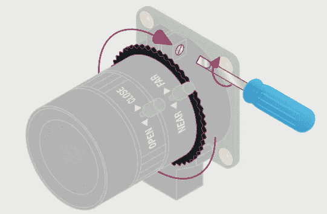

Image by [Raspberry Pi](https://magpi.raspberrypi.org/books/camera-guide)

一旦准备好并安装好，我们的镜头看起来会像下面这样。

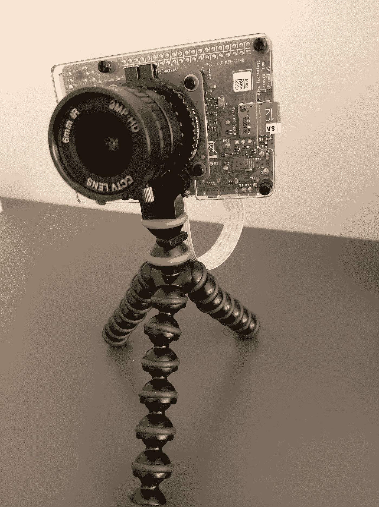

Image by [Eduardo Padron](https://fullmakeralchemist.medium.com/)

一旦镜头安装完毕，模块连接到我们的 Raspberry，我们就可以在打开和通过 VNC 进入时继续配置。

## 2.2 树莓 Pi 配置。

1.  打开你的树莓派。
2.  通过 VNC 从你的电脑进入你的覆盆子。
3.  进入主菜单，打开**树莓派配置**。

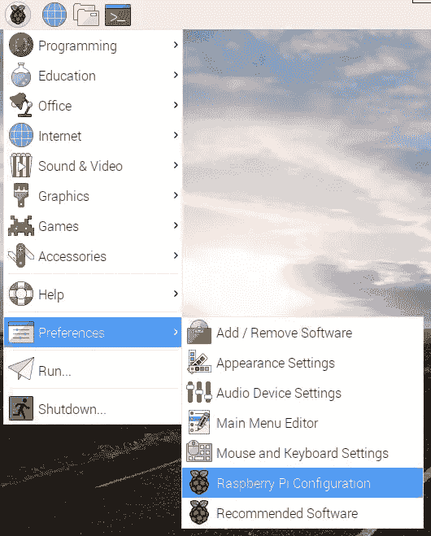

Screenshot by [Eduardo Padron](https://fullmakeralchemist.medium.com/)

选择选项卡**接口**并确保摄像机**已启用**。

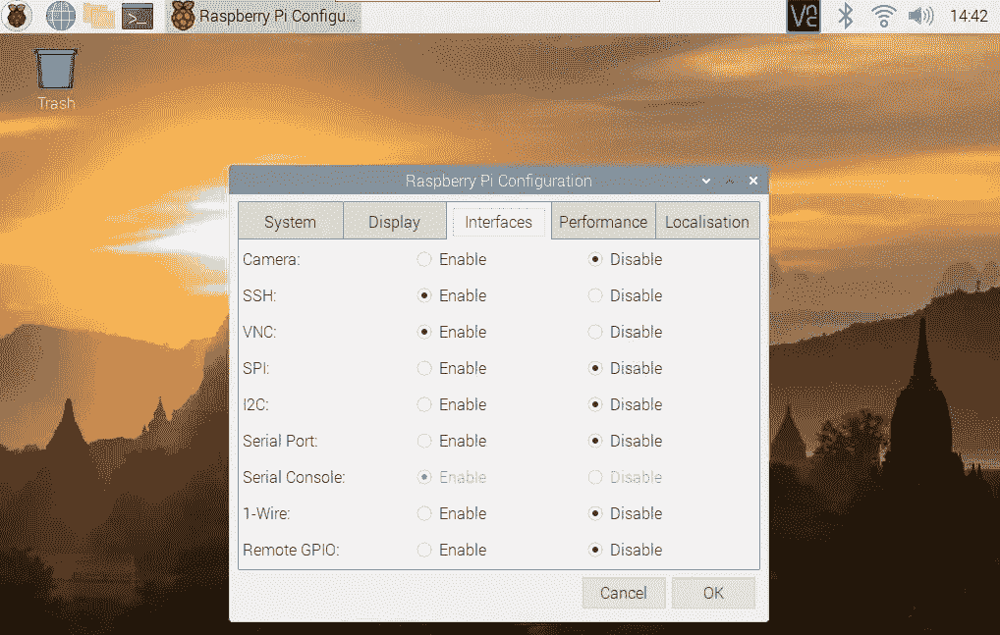

Screenshot by [Eduardo Padron](https://fullmakeralchemist.medium.com/)

重启你的覆盆子。

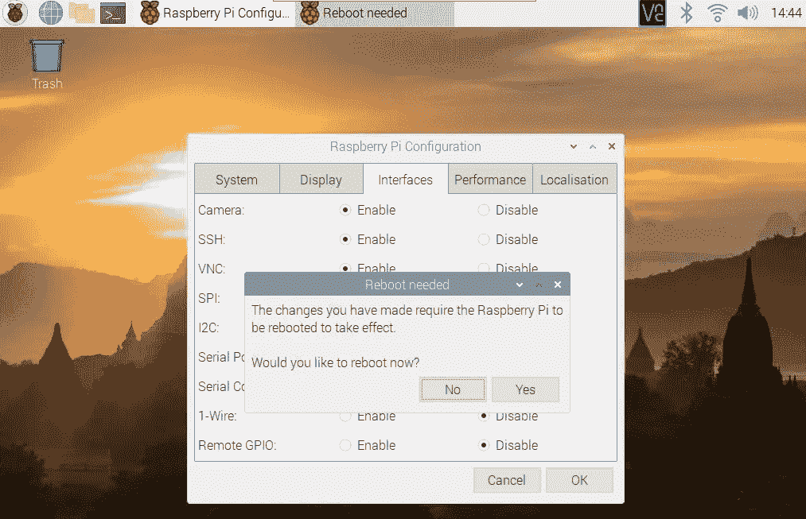

Screenshot by [Eduardo Padron](https://fullmakeralchemist.medium.com/)

一旦重新启动，我们将在 VNC 树莓桌面内进行一些更改，当执行一些命令时，它会向我们展示它将在 VNC 捕获的预览。除非我们进行这些更改，否则这是不可能的。第一件事是去 VNC 图标并点击。

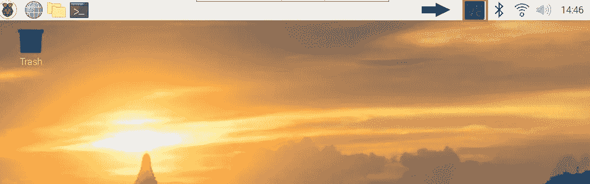

Screenshot by [Eduardo Padron](https://fullmakeralchemist.medium.com/)

下面的窗口将会打开，我们会在右边找到一个框，我们将点击。

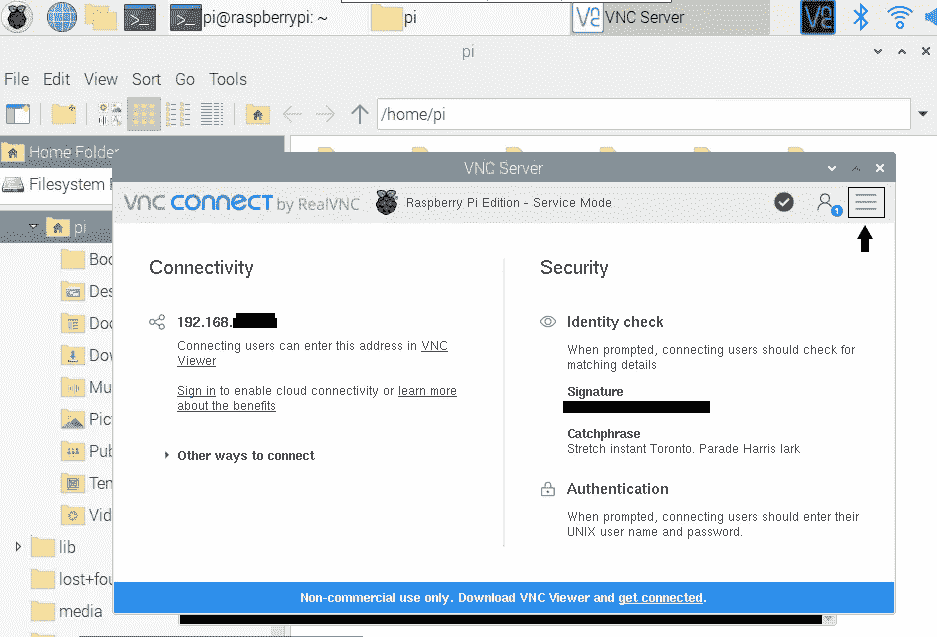

Screenshot by [Eduardo Padron](https://fullmakeralchemist.medium.com/)

我们将点击“选项”。

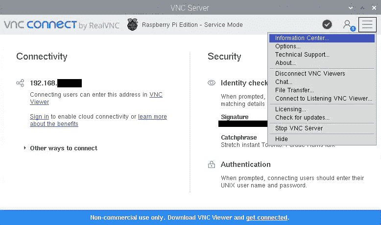

Screenshot by [Eduardo Padron](https://fullmakeralchemist.medium.com/)

我们将转到“故障排除”选项卡。

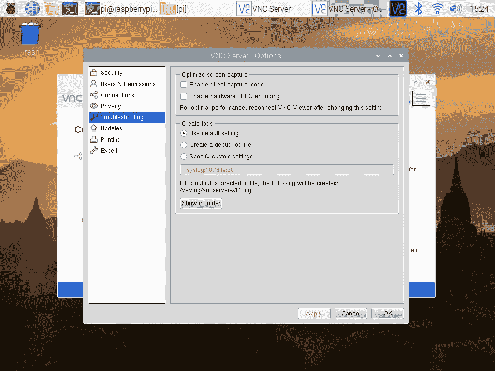

Screenshot by [Eduardo Padron](https://fullmakeralchemist.medium.com/)

我们将单击“启用直接捕获模式”框，然后单击“应用”。这将允许我们看到我们的相机模块正在捕捉的预览。它将进入黑屏几秒钟，当它恢复图像时，它将准备好，这是不必要的，但你可以重新启动树莓开始下一步。

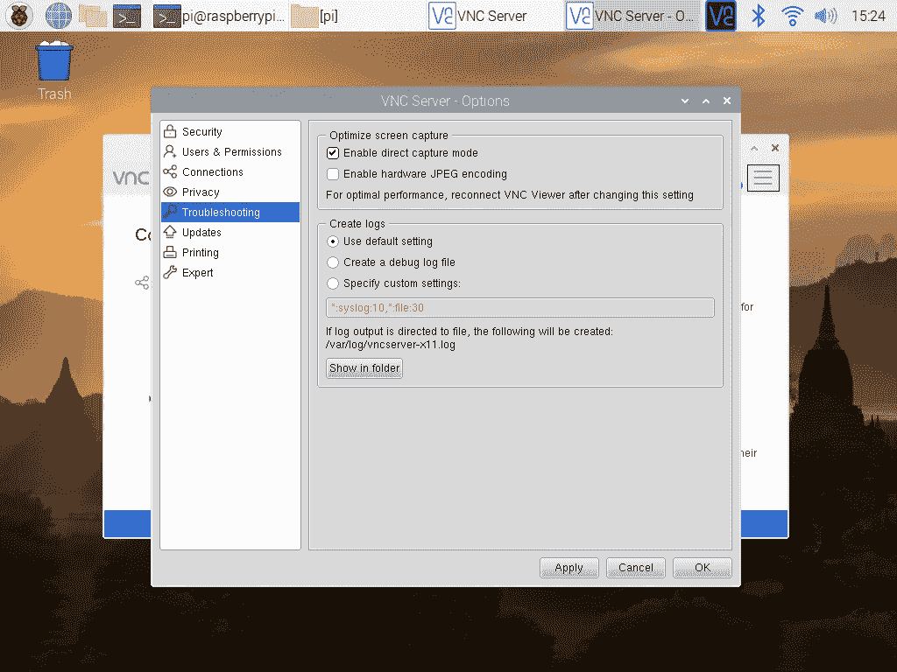

Screenshot by [Eduardo Padron](https://fullmakeralchemist.medium.com/)

此刻，摄像机没有对准焦点，所以我们需要运行一个命令来访问视图。所以我们打开树莓终端吧。

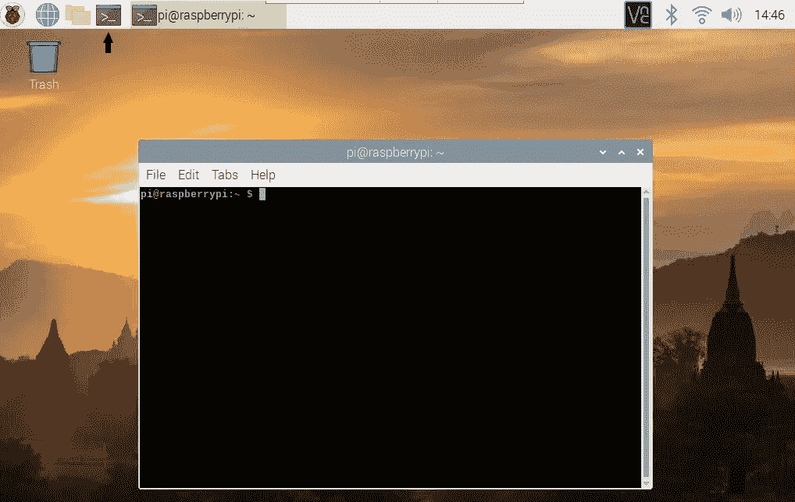

Screenshot by [Eduardo Padron](https://fullmakeralchemist.medium.com/)

raspistill 是用于从相机捕捉图像的命令工具。要验证相机安装是否正确，并仅将相机用作取景器，而不保存照片，请输入以下命令:

```
raspistill -t 0
```

它会给我们一个模糊的图像，当然，对于 V2 模块的 HQ 模块来说，这不会有什么大问题。

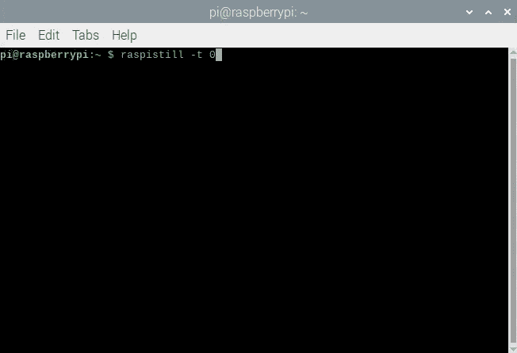

Screenshot by [Eduardo Padron](https://fullmakeralchemist.medium.com/)

现在我们将看到用镜头聚焦模块的步骤。

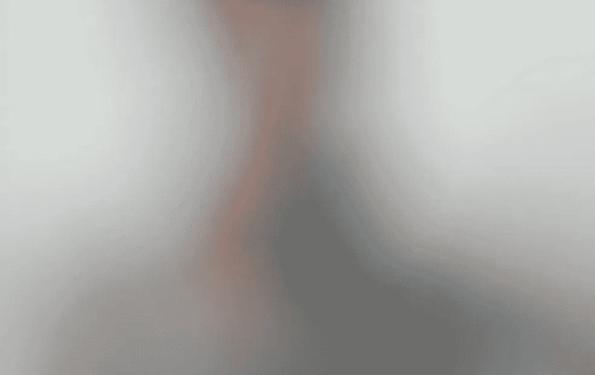

Screenshot by [Eduardo Padron](https://fullmakeralchemist.medium.com/)

## 孔径

要解决这个问题，你必须调整光圈，让镜头远离你的相机。
旋转中环，同时握住离相机最远的外环，保持稳定。顺时针移动以关闭光圈并降低图像亮度。逆时针转动打开开口。一旦你对光线水平感到满意，拧紧镜头侧面的螺丝以锁定光圈。

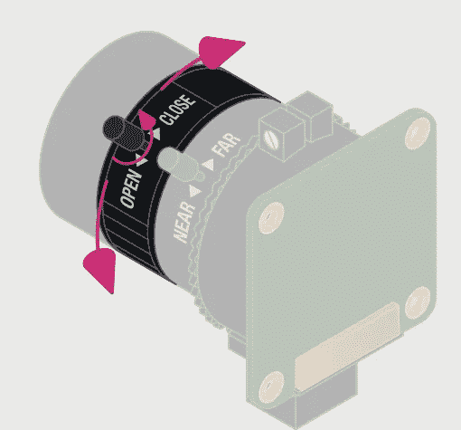

Image by [Raspberry Pi](https://magpi.raspberrypi.org/books/camera-guide)

## 重点

首先，锁定内对焦环，贴上标签。

“近远”，通过拧紧螺丝定位。现在拿着相机，镜头背对着你。握住镜头的两个外环，顺时针转动。

直到图像聚焦，需要四到五圈。要调整焦距，顺时针转动两个外环，聚焦在附近的物体上。逆时针旋转以聚焦于远处的物体，之后每次取下和安装镜头时，您很可能需要再次调整光圈。

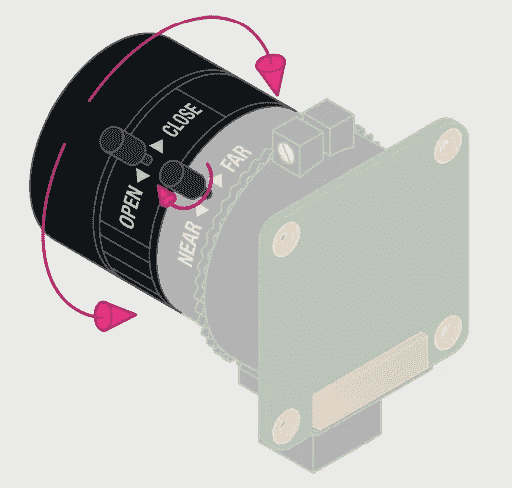

Image by [Raspberry Pi](https://magpi.raspberrypi.org/books/camera-guide)

聚焦后，我们将不得不关闭窗口，也许我们不能，因为图像非常大，关闭图标没有出现，在这种情况下，我们将不得不通过 SSH 访问并使用命令:

```
sudo reboot
```

能够通过 VNC 再次访问。

## 测试 image.jpg

现在，您应该可以看到清晰的图像，并且可以通过输入以下命令来拍摄测试照片:

```
raspistill -o test.jpg
```

当您按下回车键时，将出现实时预览图像，在预定的五秒钟后，相机将拍摄一张静态图像。这将存储在您的个人文件夹中，并命名为“test.jpg”。

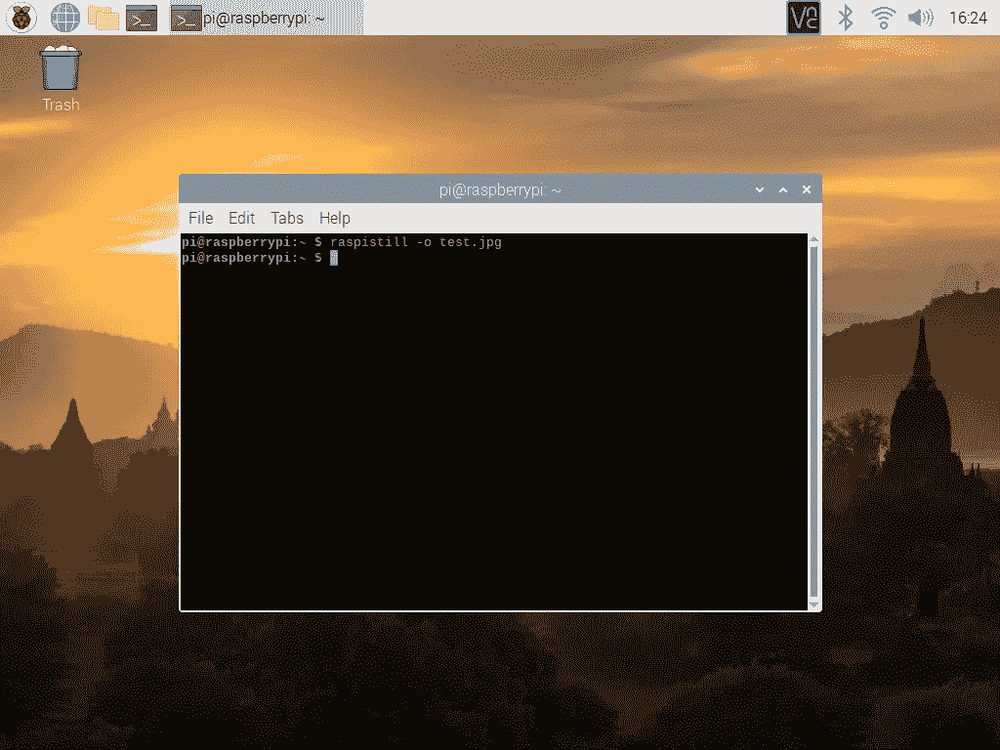

Screenshot by [Eduardo Padron](https://fullmakeralchemist.medium.com/)

这是我用这个命令拍摄的图像:

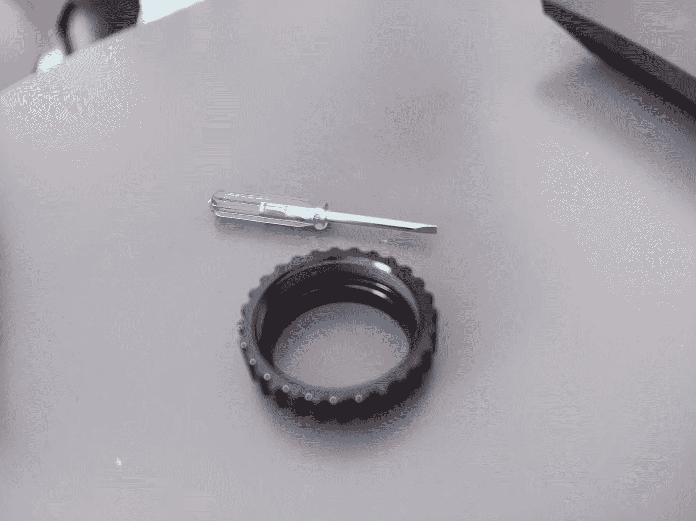

Image by [Eduardo Padron](https://fullmakeralchemist.medium.com/)

## 视频测试

要录制视频，raspivid 就是你需要的。尝试使用以下终端命令:

-t 10000 是录制视频的时间，10000 毫秒是 10 秒钟的录制时间。h264 是在 vlc 中播放的视频格式，VLC 是一个包含 Raspberry Pi 操作系统的播放器，如果你想将格式更改为 MP4，这是一种更常见和友好的编辑格式，在最后我会给你留下一些命令和链接。

```
raspivid -t 10000 -o testvideo.h264
```

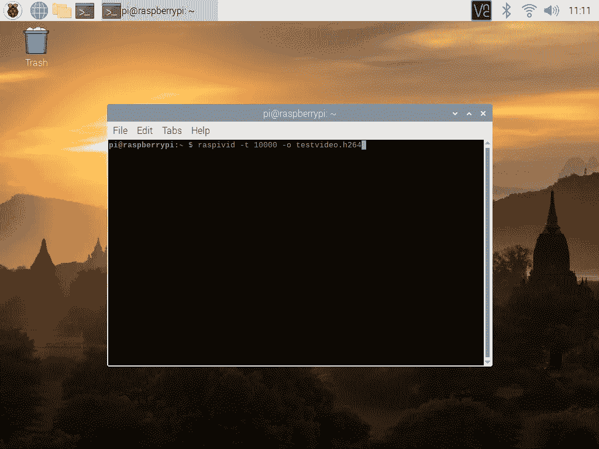

Screenshot by [Eduardo Padron](https://fullmakeralchemist.medium.com/)

我们可以看到文件的预览，然后在 Raspberry Pi 文件夹中，我们将找到能够再现它的文件。

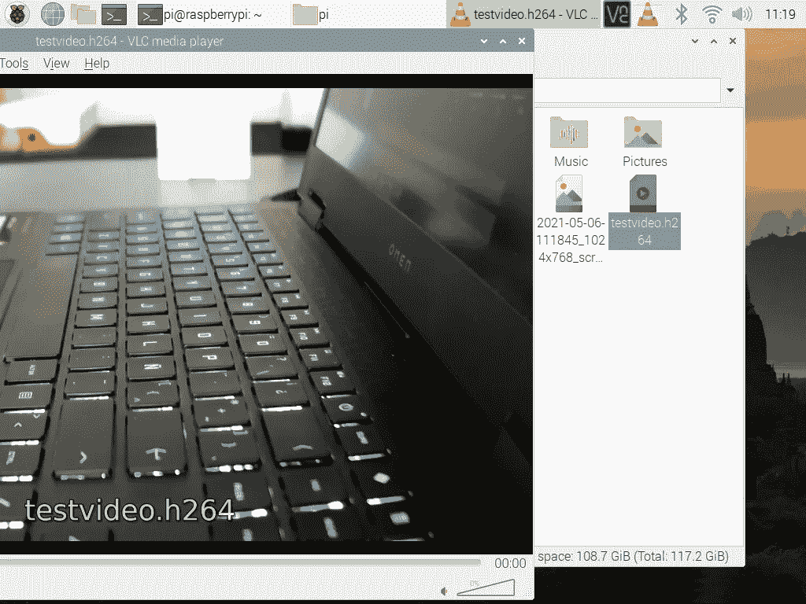

Screenshot by [Eduardo Padron](https://fullmakeralchemist.medium.com/)

# 3.用 Python 代码控制摄像头模块

## 3.1 预览

Python 库 **picamera** 允许你控制你的相机模块并创建令人惊叹的项目。

打开一个 Python 3 编辑器，比如 Thonny Python IDE 或者利用之前的教程【Raspberry Pi 上的 VS 代码】(https: //)我们可以使用 VS 代码，我们将在桌面上创建一个名为 camera 或 camera 的文件夹，我们将右键单击打开选项，我们将选择“在终端中打开当前文件夹”，以直接打开文件夹和终端，您也可以在终端中使用 cd 命令来定位我们在 camera 文件夹中的位置。

一旦位于文件夹中的终端内，我们将使用命令:

```
code .
```

这样，我们将直接打开将要使用的文件夹中的 VS 代码。

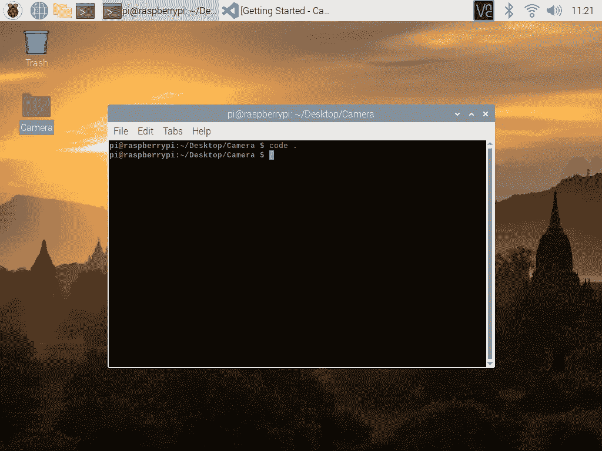

Screenshot by [Eduardo Padron](https://fullmakeralchemist.medium.com/)

打开一个新文件，保存为 camera.py。

**注意:千万不要将文件保存为 pica mera . py。**

在 VS 代码中，我们可以找到创建新文件的图标。

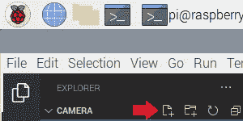

Screenshot by [Eduardo Padron](https://fullmakeralchemist.medium.com/)

现在，我们将单击“CTRL + S”进行保存，将出现以下窗口。我们输入我们的文件名，以便能够输入代码。

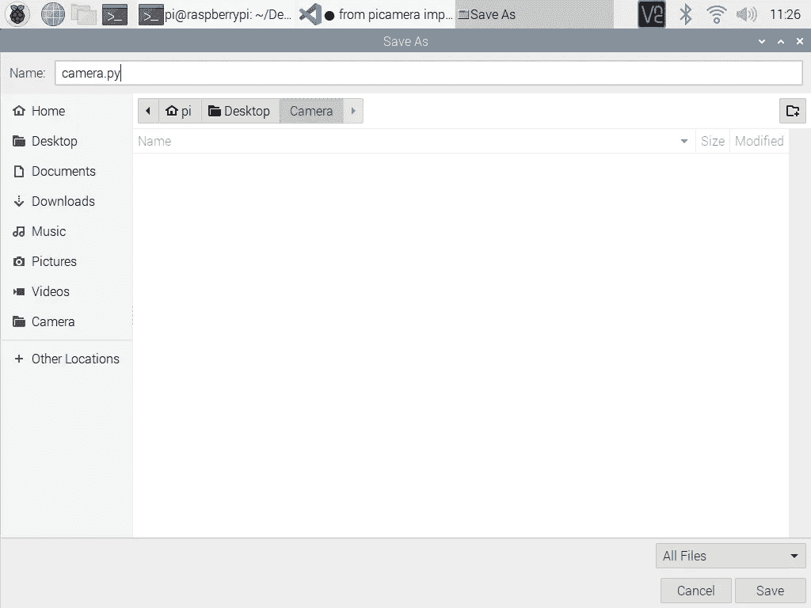

Screenshot by [Eduardo Padron](https://fullmakeralchemist.medium.com/)

在输入代码之前，我们必须确保已经安装了用于 VS 代码的 Python 工具。使用映像验证您已经安装了我们将使用的映像。

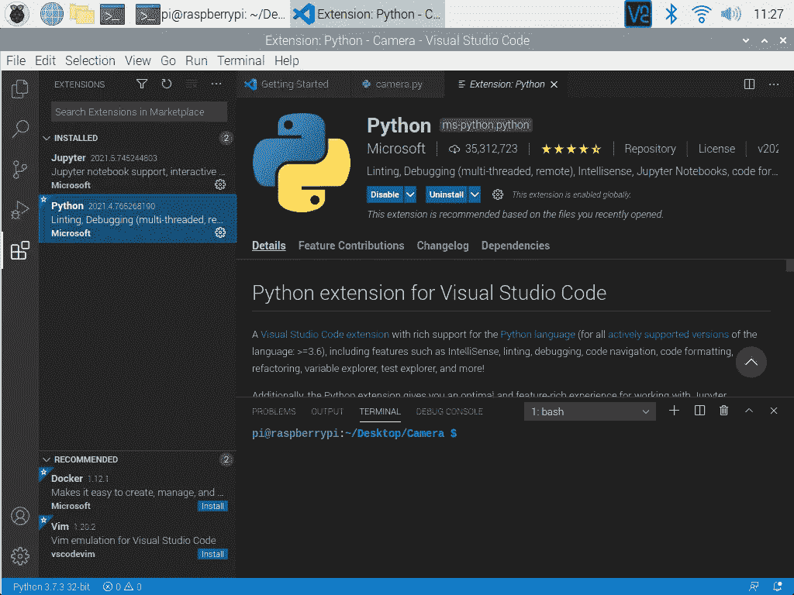

Screenshot by [Eduardo Padron](https://fullmakeralchemist.medium.com/)

输入下面的代码，这将允许我们做同样的功能，给我们一个预览图像，以验证我们的镜头在焦点上。如果您已经完成了此步骤，并且没有断开摄像机，您可以跳过此步骤，转到以下代码:

Code by [Eduardo Padron](https://github.com/fullmakeralchemist)

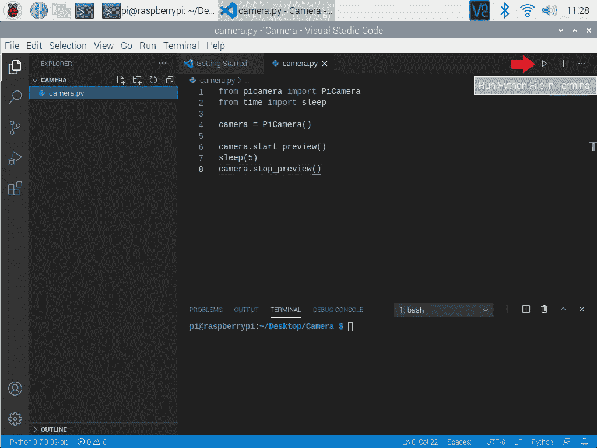

Screenshot by [Eduardo Padron](https://fullmakeralchemist.medium.com/)

我们使用“CRTL + S”来保存，现在我们将为这个项目在 VS 代码中打开一个终端。

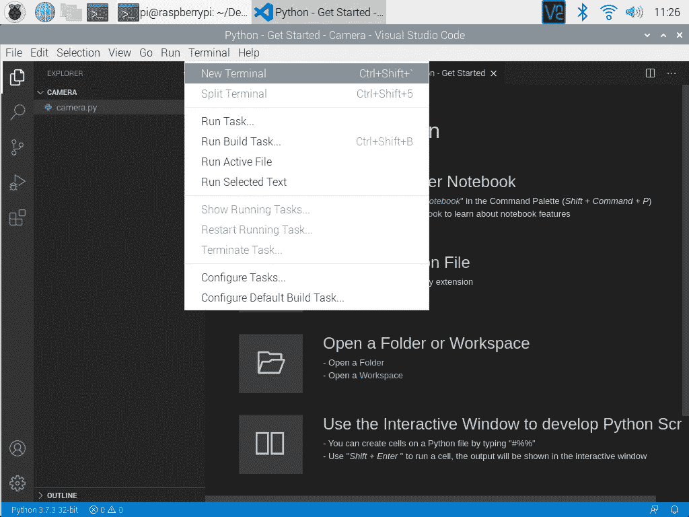

Screenshot by [Eduardo Padron](https://fullmakeralchemist.medium.com/)

现在我们可以在下半部分看到终端，我们只需要运行右上方有 VS 代码的按钮的代码行。您也可以从终端以传统方式执行此操作，并使用以下命令:

```
sudo python3 camera.py
```


Screenshot by [Eduardo Padron](https://fullmakeralchemist.medium.com/)

您可以在底部看到命令的执行。

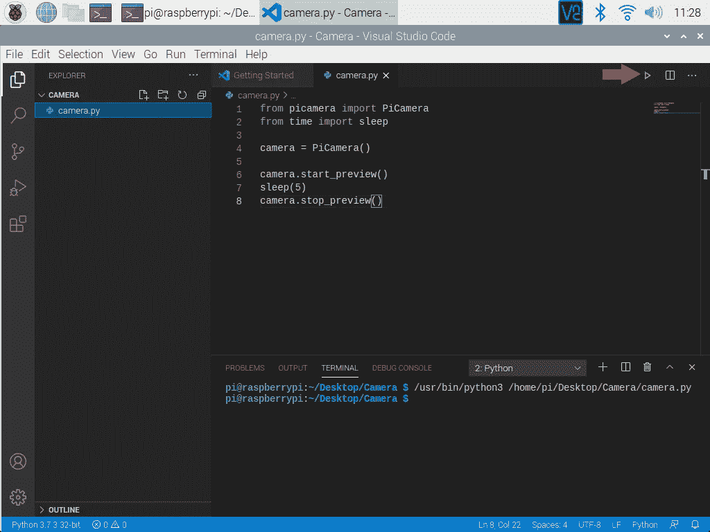

Screenshot by [Eduardo Padron](https://fullmakeralchemist.medium.com/)

当执行时，它将打开一个非常大的窗口，该窗口将在 5 秒钟后关闭，正如我们在 sleep (5)中所定义的，我们必须定义一个时间，如果窗口不会像在 raspistill -t 0 中那样保持打开，那么我们将必须使用 SSH 来输入 sudo 命令 reboot，以便再次进入并继续执行下一个代码。

## 3.2 照片

现在，要拍摄一些照片，您可以创建第二个文件(在我的例子中称为 cameratake.py ),修改您的代码以添加 camera.capture()行:

Code by [Eduardo Padron](https://github.com/fullmakeralchemist)

**注意:在拍摄图像之前至少要有两秒钟的睡眠时间，这很重要，因为这给了相机传感器时间来检测光线水平。**

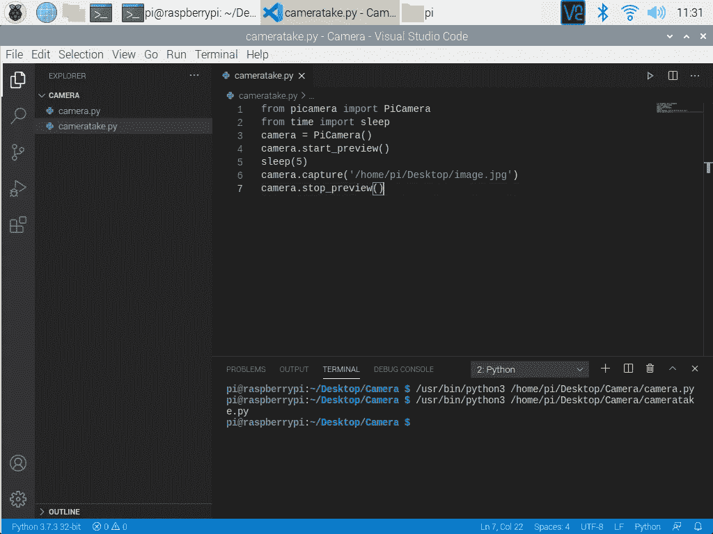

Screenshot by [Eduardo Padron](https://fullmakeralchemist.medium.com/)

您应该看到打开的相机预览五秒钟，然后应该捕捉到一个静态图像。拍摄图像时，您可以观看调整到不同分辨率的预览。您的新图像应该保存到桌面上。

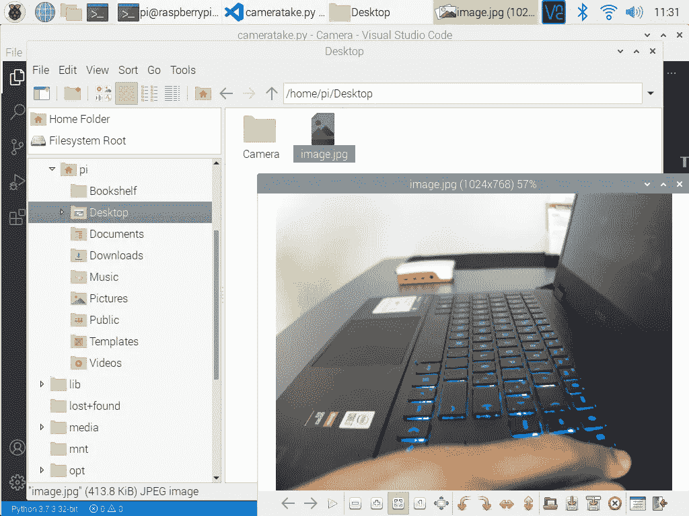

Screenshot by [Eduardo Padron](https://fullmakeralchemist.medium.com/)

代码拍摄的图像:

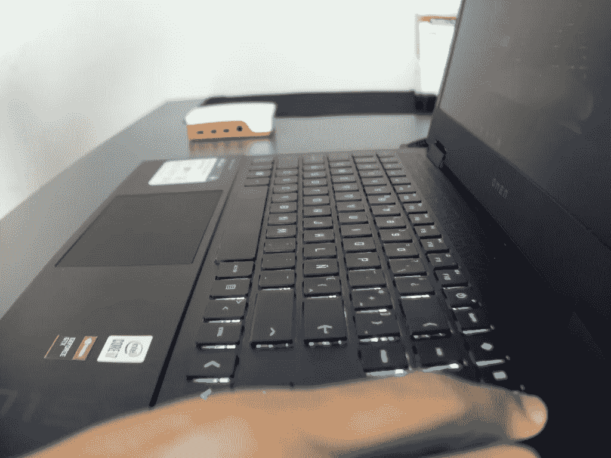

Image by [Eduardo Padron](https://fullmakeralchemist.medium.com/)

## 3.3 视频

现在拍个视频！

修改您的代码以移除 capture()并改为添加 start_recording()和 stop_recording()来开始和停止记录。您的代码现在应该是这样的:

Code by [Eduardo Padron](https://github.com/fullmakeralchemist)

运行代码。您的 Raspberry Pi 应该会打开一个预览，录制 10 秒钟的视频，然后关闭预览。

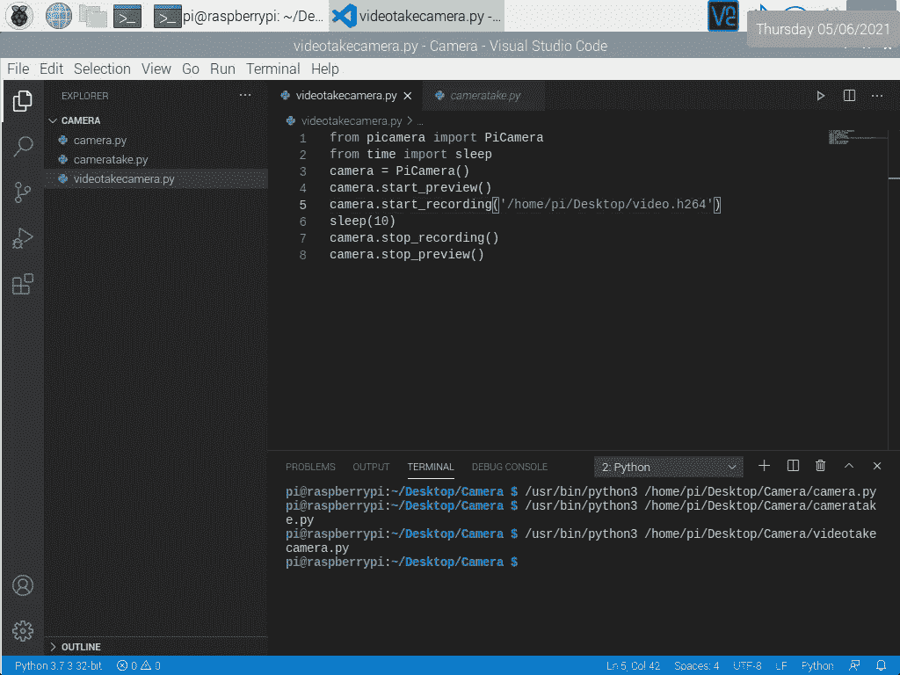

Screenshot by [Eduardo Padron](https://fullmakeralchemist.medium.com/)

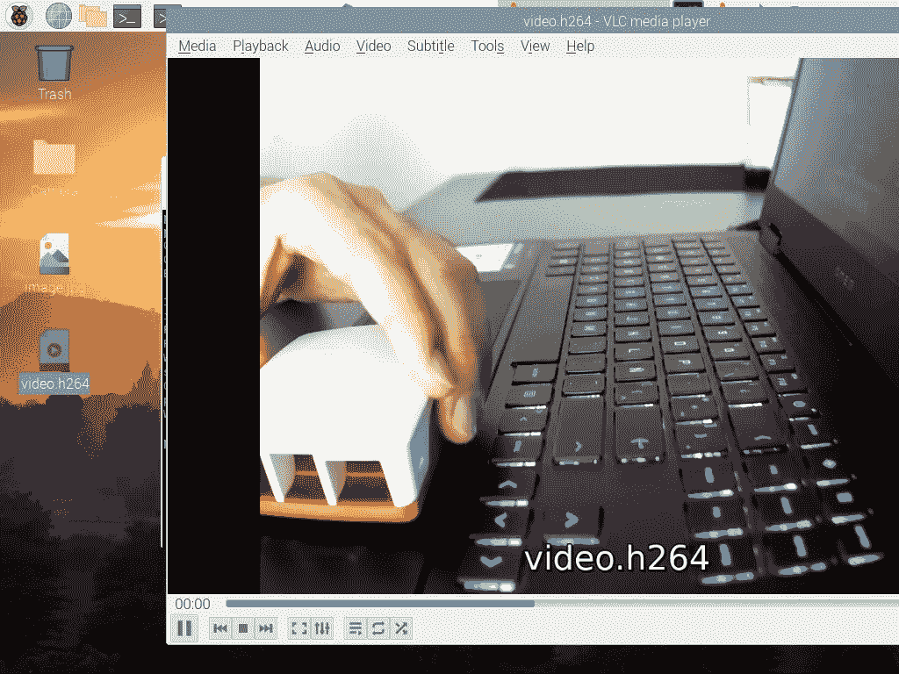

Screenshot by [Eduardo Padron](https://fullmakeralchemist.medium.com/)

# 4.临时演员

## 4.1 视频格式 MP4

Raspberry Pi 以原始 H264 视频格式捕获视频。许多媒体播放器将拒绝播放它，或者以错误的速度播放它，除非它被“包装”在像 MP4 这样的合适的容器格式中。使用 raspivid 命令获取 MP4 文件的最简单方法是使用 MP4Box。使用以下命令安装 MP4Box:

```
sudo apt install -y gpac
```

使用 raspivid 从终端捕获原始视频，并将其包装在 MP4 容器中，如下所示:

Code by [Eduardo Padron](https://github.com/fullmakeralchemist)

或者，将 MP4 格式包装在现有的 raspivid 输出中，使用:

```
MP4Box -add video.h264 video.mp4
```

本指南到此结束，你可以练习用 Python 编写代码，让你的视频保持 MP4 格式，将学到的知识付诸实践，在 Raspberry 访问 [raspivid](https://www.raspberrypi.org/documentation/usage/camera/raspicam/raspivid.md) 查看更多关于 MP4 格式的信息。

您可以利用 Git 和 VS 代码指南将这些代码上传到您的 Github。

如果你想了解更多关于树莓派和相机的使用，请访问[相机树莓派](https://projects.raspberrypi.org/en/projects/getting-started-with-picamera/6)..

在 [Github](https://github.com/fullmakeralchemist/raspberrycamerasetup) 上访问我的知识库。