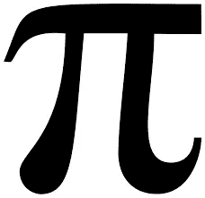
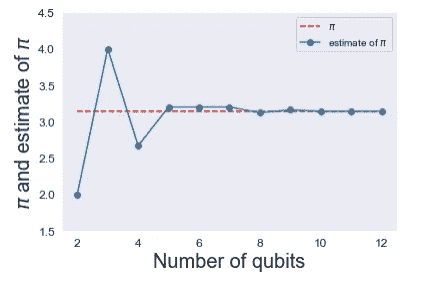

# 量子计算机可以计算圆周率吗？

> 原文：<https://medium.com/geekculture/can-a-quantum-computer-calculate-pi-2d6179232219?source=collection_archive---------0----------------------->

## 3 . 1 4 1 5 9 2 6 5 3 5 8 9 7 9 3 2 3 8 4 6 2 6 4 3 3 8 3 2 7 9 5 0 2 8 8 4 1 9 7 1 6 9 3 9 9 3 7 5 1 0 5 8 2 0 9 7 4 9 4 4 5 9 2 3 0 7 8 1 6 4 0 6 2 8 6 2 0 8 9 9 8 6 2 8 0 3 4 8 2 5 3 4 2 1 1 7 0 6 7 9 8 2 1 4 8 0 8 6 5 1 3 2 8 2 3 0 6 6 4 7 0 9 3 8 4 4 6 0 9 5 5 0 5 8 2 2 3 1 7 2 5 3 5 9 4 0 8 1 2 8

Source: Quartz

# 圆周率是什么？

常数圆周率是最常用和公认的数学常数之一。我们大多数人在小学时第一次接触到它，并最终在一生中使用它。圆周率是圆的周长与其直径的比值。

几千年来，圆周率一直是阿基米德、斐波那契、牛顿和高斯等数学家的兴趣所在。他们都试图尽可能多地计算圆周率的位数，并应用于不同的数学领域。

> 也许数学中没有任何一个符号能像圆周率这样引起如此多的神秘、浪漫、误解和人类的兴趣。—林子幸·沙夫

pi 的一些应用包括…

*   圆周
*   圆的面积
*   部门
*   弧度

在过去的 60 年里，许多技术进步使得我们能够比以往更深入地探索这个著名的数字！

# 量子计算

最重要的技术进步之一是**量子计算。**

量子计算利用叠加和纠缠等量子现象来执行计算，速度比经典计算机快得多。

他们有能力解决一些世界上最复杂的问题和算法。量子计算机也有可能加快药物发现，甚至更快地探索空间，因为它们在未来几十年中变得更加高效。

在这种情况下，我们可以使用量子计算机来精确估计圆周率的值。

# 量子相位估计算法

量子相位估计算法是一种量子算法。它在许多复杂的量子算法中扮演着重要的角色，比如 Schor 算法。

QPE 算法用于估计酉算子中的特征向量。

在更多的数学术语中，给定一个酉矩阵和一个量子态，QPE 算法在加性误差内以高概率估计一个值。

# 使用 Qiskit 估计圆周率

使用 QPE 算法，我们可以估计圆周率的值！以下是我从 [Qiskit 教材](https://qiskit.org/textbook/ch-demos/piday-code.html)中使用的步骤。

## 1.为算法导入必要的工具

## 2.编码量子傅立叶逆变换

## 3.为量子相位估计准备初始状态

## 4.运行量子电路

## 5.创建估算圆周率的函数

## 6.使用不同数量的量子位估计圆周率

## 7.绘制要分析的结果

# 使用 matplotlib 可视化的结果

你可以清楚地看到，随着量子比特数的增加，量子计算机对圆周率的估计越来越接近圆周率的真实值。

**来源:** [Qiskit](https://qiskit.org/textbook/ch-demos/piday-code.html) ， [PiDay](https://www.piday.org/learn-about-pi/) ，[维基](https://en.wikipedia.org/wiki/Quantum_computing)，