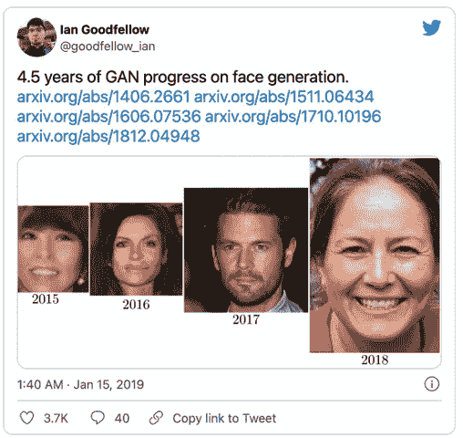
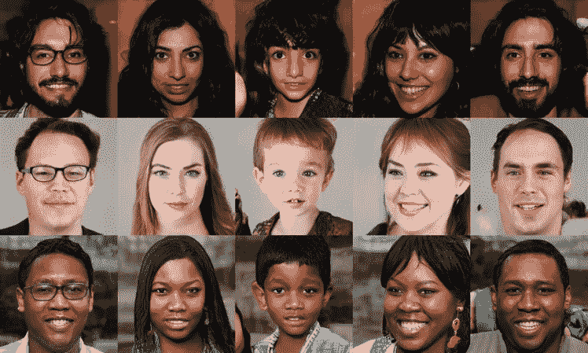
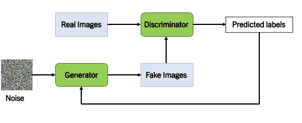
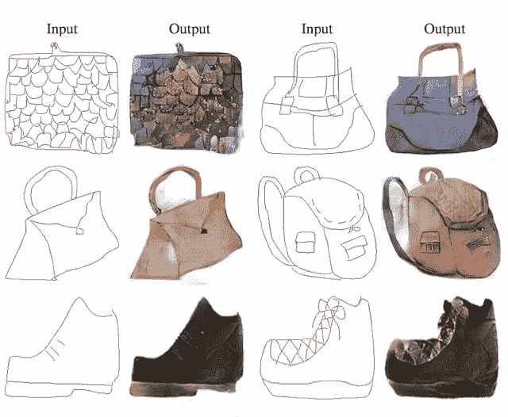
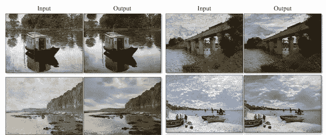
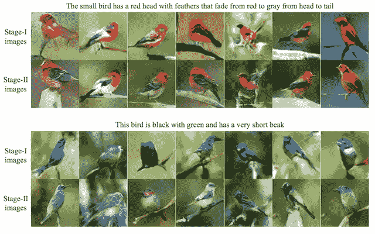
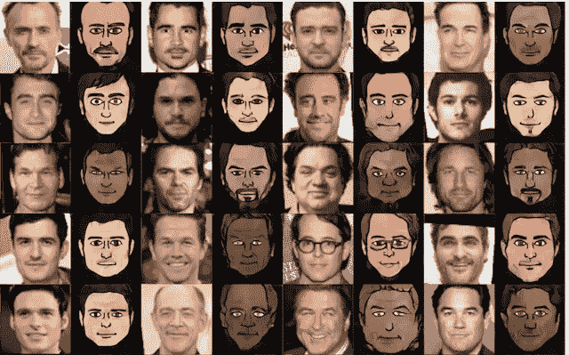
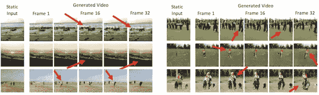
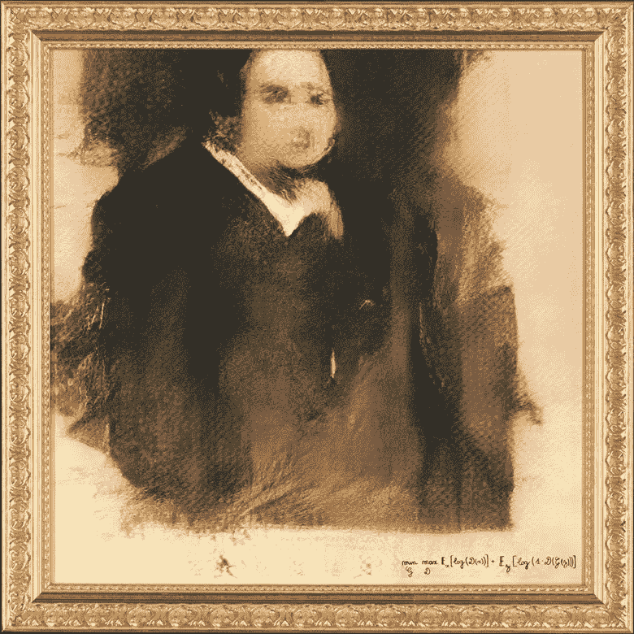
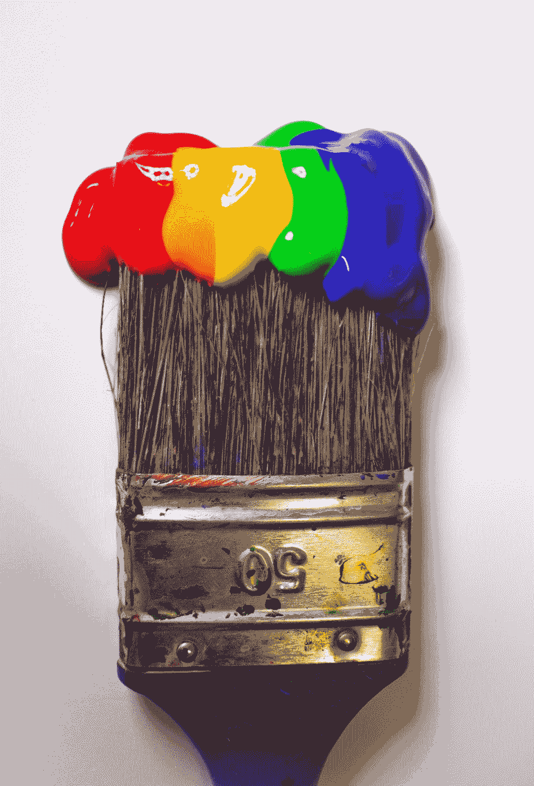

# 人工智能能创造出比人类更好的艺术吗？

> 原文：<https://medium.com/geekculture/can-artificial-intelligence-create-better-art-than-humans-f1517323bfc0?source=collection_archive---------44----------------------->

> “我认为那些不了解技术的人是最脆弱的，如果你不了解它，你可能会上当。”—菲利普·王

先说什么是生成性对抗网络。生成对抗网络(GANs)是一种机器学习模型，能够生成逼真的图像、文本、语音和视频。GANs 是一项令人兴奋的最新发明。2014 年，伊恩·古德菲勒(Ian Goodfellow)去了蒙特利尔的一家酒吧，与其他博士生一起庆祝。他的同事请求帮助他们正在进行的一个项目，让计算机创建逼真的照片。伊恩·古德费勒的想法是用两个神经网络来对抗对方。第一个神经网络是一个鉴别网络，其任务是将图像分类为假的或真实的。第二个神经网络是一个生成网络，其任务是生成逼真的图像。Goodfellow 从酒吧回来后，他编写了第一个例子，令人惊讶的是，第一次尝试就成功了。

Tweet of Ian Goodfellow Jan 15, 2019

# **此人不存在**

2019 年，人工智能网站[这个人并不存在](https://thispersondoesnotexist.com/)迅速走红。每次刷新页面，都会出现一个人的脸。这些人都不存在。Nvidia 的研究人员开发了一种软件 StyleGAN。优步工程师 Philip Wang 用 StyleGan 创造了[这个人并不存在](https://thispersondoesnotexist.com/)。这个想法是为了引起人们对人工智能日益增强的呈现逼真人工图像的能力的关注。在我们的社会中，图像和图片是证据的替代品。知道一台机器能创造什么，并失去识别什么是真实的或不真实的能力，这可能是很可怕的。

> “我认为那些不了解技术的人是最脆弱的，如果你不了解它，你可能会上当。”—菲利普·王

These people are not real — they were produced by Nvidia / StyleGAN

在[这个不存在的人](https://thispersondoesnotexist.com/)走红后，瑞安·胡佛创造了[这只不存在的猫](https://thiscatdoesnotexist.com/)。克里斯托弗·施密特推出了这个不存在的租赁网站。房间的图像、描述和位置看起来都很真实。可能是在 Airbnb 上租的。要查看更多此不存在的例子，请检查:[此 X 不存在](https://thisxdoesnotexist.com/)。

# 怎么可能用 GANs 从无到有创造出东西？

如前所述，GAN 确实有两个相互竞争的神经网络。神经网络被称为鉴别器和生成器。在 GANs 的体系结构中，如下面的体系结构所述。生成器需要输入来创建假图像，就像一本书需要纸张才能成为一本书一样。它被称为噪声、随机噪声或噪声阵列。鉴别器有两个输入:真实图像和虚假图像。需要训练鉴别器来识别什么是真的什么是假的。最终，鉴别者会将这些图像标记为真或假。发电机作为一个伪造者运行，他正在印刷假美元，而鉴别者是警察，他正在试图追踪假美元。每次伪钞制造者带着假钞被抓的时候。他改进了他的印刷技术，直到警察不能识别真伪。

Generative Adversarial Network Architecture

上面的架构具有最小最大损失。所以，生成敌对网络有一个博弈论的方法。

# **生成对抗网络的应用**

让您对 GANs 令人印象深刻的应用有一个良好的直觉。即将推出的应用分为以下几个方面(*这些只是几个例子*):

*   图像到图像的翻译
*   文本到图像的翻译
*   照片到表情符号
*   视频预测

## 图像到图像的翻译

图像到图像转换将输入图像转换成合成图像，或者将输入图像映射到期望的输出图像。

Sketches to Color Images

Photographs of Daytime Cities to Nighttime

Paintings to photographs

## 文本到图像的翻译

文本到图像的翻译将文本转换成图像。

Text to images of bird

## 照片到表情符号

照片到表情符号的翻译将照片转换成表情符号。

Celebrity Photographs to GAN generated Emojis

# 视频预测

视频是帧的集合。视频预测试图预测到未来的帧。

Video Frames Generated With a GAN

# 人工智能创作的 432.500 美元画作售出

2018 年在[佳士得今日](https://www.christies.com/lot/lot-edmond-de-belamy-from-la-famille-6166184/?)，一幅由人工智能创作的画作被出售。这幅画是第一件在大型拍卖行出售的人工智能艺术品。估计价格在 7，000 美元到 10，000 美元之间。搞笑的是看到甘的损失函数而不是艺人名字。

Painting by Artificial Intelligence

一个由 14 世纪到 20 世纪间的 15000 幅绘画组成的数据集被用来训练 GAN。推特上有一个关于这幅画原创性的讨论。这是由于用于训练过程的数据集。

> “人工智能只是将对未来艺术市场产生影响的几种技术之一——尽管现在预测这些变化可能是什么还为时过早，”组织此次拍卖的佳士得专家理查德·劳埃德(Richard Lloyd)说。

# 为什么生成式对抗性网络如此令人印象深刻？

2018 年[《福布斯》将“生殖对抗网络”列为过去三年最佳技术创新之一](https://www.forbes.com/sites/forbestechcouncil/2018/05/25/the-best-tech-innovations-of-the-last-three-years/?sh=7fafe04e25a4)。

> “过去 10 年机器学习中最有趣的想法”——Yann le Cun

Yann LeCun 被称为深度学习之父之一。当然，在生成对抗网络中一定有很高的潜力——当它来自深度学习领域的这样一位荣誉研究员时。

Source:UnSplash

自从 2014 年 Goodfellow 的发明以来，这种应用正在快速增长。尤其是在时尚、艺术和广告领域，在天文学、医学和电子游戏领域也是如此。例如，生成对立网络可以创建想象的时装模特。在天文学上，甘可以改善天文图像。甘有能力[从零开始创造分子](https://pubs.acs.org/doi/10.1021/acs.molpharmaceut.7b01134)。

此外，GAN 能够创建代表原始数据的新数据。在涉及敏感数据的情况下，生成的数据将是分析的更好选择。这同样适用于缺少数据分析的情况。对于丢失的数据，创建新数据可以解决这个问题。

据我们目前所知，未来我们会看到更多的 GANs 的应用。

# 人工智能能创造出比人类更好的艺术吗？

要回答这个问题，我们需要知道:**什么是艺术？**

Source:Unsplash

根据牛津词典，艺术被定义为:

> 人类创造性技能和想象力的表达或应用，通常以绘画或雕塑等视觉形式，创作出主要因其美丽或情感力量而被欣赏的作品

很难给艺术下定义；有一个哲学领域致力于艺术和美的研究。也使这个问题难以回答的是，人工智能从人类艺术中学习。我们可以说，人工智能与人类的创造力有关。

> [“艺人不要慌。”](https://www.vox.com/2019/5/10/18529009/ai-art-marcus-du-sautoy-math-music-painting-literature) —马库斯·杜·索托伊牛津数学家

这就是为什么我没有回答这个问题，希望你能用所有这些信息来回答它。在评论中分享你的答案，让我们知道，它如何让你感受到人工智能已经具备的能力。

**我的推荐:**

 [## 用 Keras 编写你的第一个生成性对抗网络。

### 用 Keras 和 Tensorflow 写 gan 的简单介绍。

towardsdatascience.com](https://towardsdatascience.com/writing-your-first-generative-adversarial-network-with-keras-2d16fd8d4889)  [## GANs(生成对抗网络)背后的数学

### 详细了解原始 GANs 背后的数学原理，包括其局限性

towardsdatascience.com](https://towardsdatascience.com/the-math-behind-gans-generative-adversarial-networks-3828f3469d9c) 

Ian Goodfellow’s paper about Generative Adversarial Nets