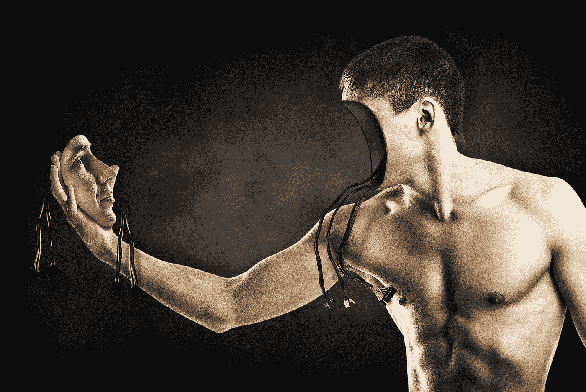

# 人工智能能展现道德代理吗？

> 原文：<https://medium.com/geekculture/can-artificial-intelligence-exhibit-moral-agency-1617b751ff65?source=collection_archive---------48----------------------->

## 将科学与虚构分开…

Image from [Pixabay.com](https://pixabay.com/illustrations/man-face-surreal-imagination-845847/)

我想回答这篇文章标题中提出的问题。不幸的是，我今天无法提供详尽的答复。此外，我最近发布了几十篇关于人工智能的博客；我要说，即使不是全部，也是大部分人间接地提出了质疑。所以我也不是没有解决过…