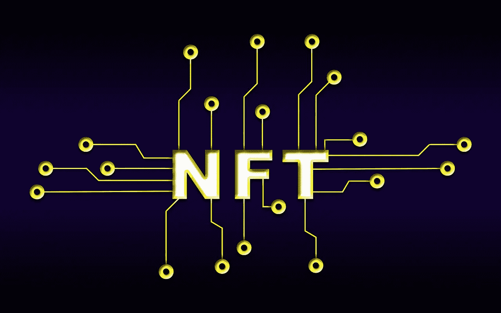

# 比特格特(BRISE)能从密码工程中赚钱吗？—市场疯人院

> 原文：<https://medium.com/geekculture/can-bitgert-brise-make-money-from-crypto-engineering-market-mad-house-1bf40336b437?source=collection_archive---------5----------------------->

Bitgert (BRISE) 是一个利用密码工程赚钱的项目。Bitgert 是一个[的加密工程组织](https://bitgert.com/)，建立大规模区块链解决方案。

其中一个解决方案是 **Bitgert (BRISE)** 代币，奖励持有者[币安美元(BUSD)](https://marketmadhouse.com/what-value-does-binance-usd-busd-have/) 稳定币。他们声称 Bitgert (BRISE) 为赌博提供 BUSD 身份奖励。

