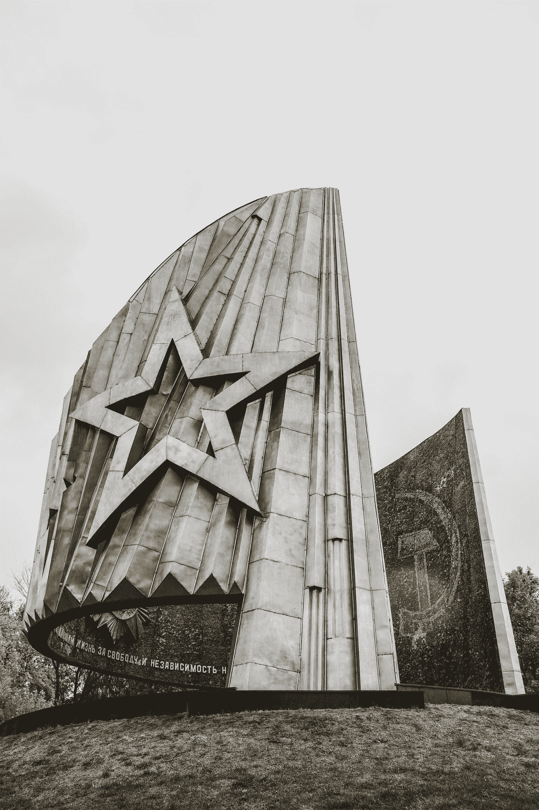

# 区块链能否带来一个公正公平的后稀缺乌托邦？

> 原文：<https://medium.com/geekculture/can-blockchain-deliver-a-just-and-fair-post-scarcity-utopia-680370ed2829?source=collection_archive---------6----------------------->

## 社会与技术

## 在“代码即法律”的原则下，这一次情况真的会有所不同吗？

Photo by [Pavel Neznanov](https://unsplash.com/@npi?utm_source=medium&utm_medium=referral) on [Unsplash](https://unsplash.com?utm_source=medium&utm_medium=referral)

破碎的苏联帝国的纪念碑是对其悲惨遗产挥之不去的提醒。一些 20 世纪最大胆和最理想的乌托邦主义者成功地推翻了一个…