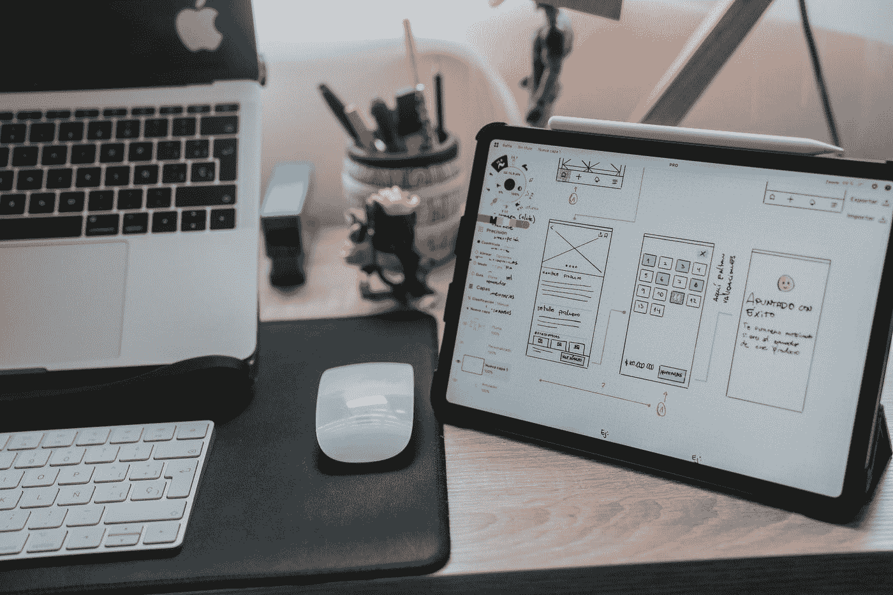

# 开发者的可以学设计吗？

> 原文：<https://medium.com/geekculture/can-developers-learn-design-b0d446139da0?source=collection_archive---------21----------------------->

Photo by [Alvaro Reyes](https://unsplash.com/@alvarordesign?utm_source=medium&utm_medium=referral) on [Unsplash](https://unsplash.com?utm_source=medium&utm_medium=referral)

如今，学习如何设计是一项很有价值的技能，因为你可以快速原型化并测试你的想法。你可以学习任何你选择的设计软件。

作为一名开发人员，我想在*上尝试应用程序设计，下面是我的做法。*

*第一步是学习 ***figma*** 的基础知识你可以在 youtube 上看几个视频，也可以自己尝试一些设计。当你认为你准备好了，你就可以开始构思你想要的原型了。*

*对我来说，这是一个小型的个人预算应用程序，我想原型。*

*下面是最终结果。*