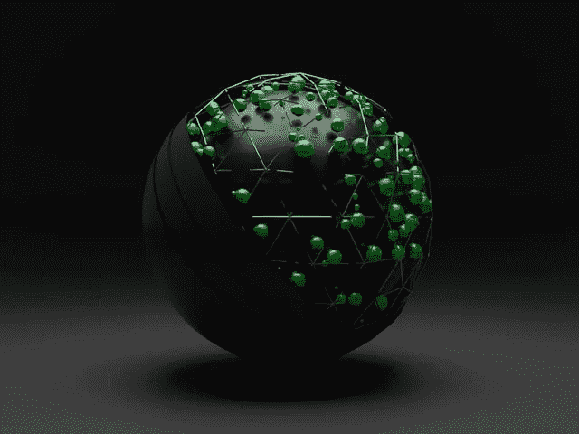

# 地球基金会能拯救世界吗？—市场疯人院

> 原文：<https://medium.com/geekculture/can-earthfund-1earth-save-the-world-market-mad-house-8f1309a1a255?source=collection_archive---------17----------------------->

地球基金(1EARTH) 表明你可以通过声称做好事来吸引注意力。地球基金是一个分散的自治组织(DAO ),承诺将全球变化的力量交到其成员手中。

2022 年 4 月 6 日，CoinMarketCap 将 1EARTH 评为第三大最受欢迎的加密货币。然而，CoinMarketCap 在 2022 年 4 月 12 日给了地球一个 30.54₵硬币的价格。

