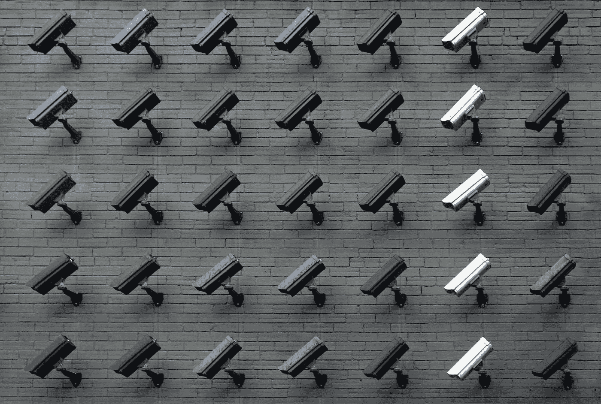

# 《秘密》中的自由和隐私能战胜审查吗？

> 原文：<https://medium.com/geekculture/can-freedom-and-privacy-win-over-censorship-in-crypto-6d7e25ccd0e?source=collection_archive---------13----------------------->

*Image courtesy of Unsplash*

隐私、央行数字货币和加密货币监管是今天讨论的前沿话题。

他们上了新闻，也在立法机构中被讨论，所以这不再只是为了好玩。这些对话的结果可能会影响加密货币领域和未来几十年的世界。