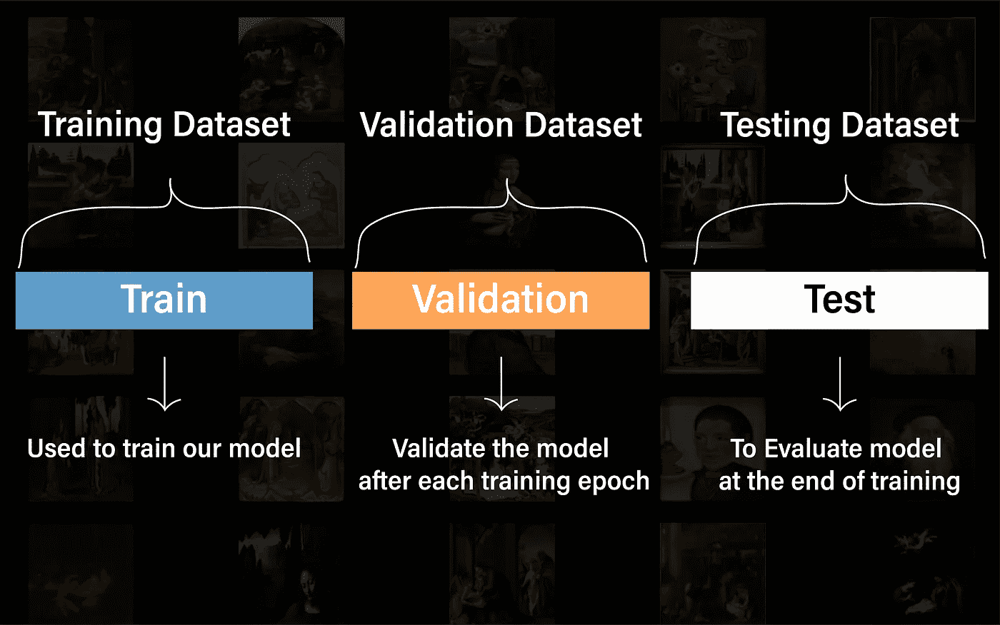
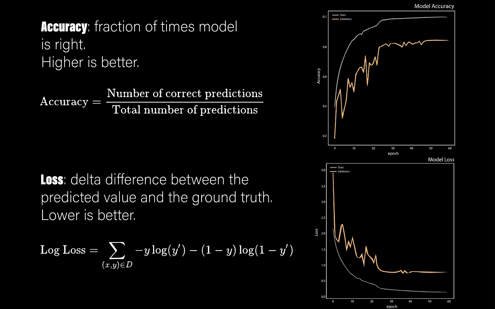
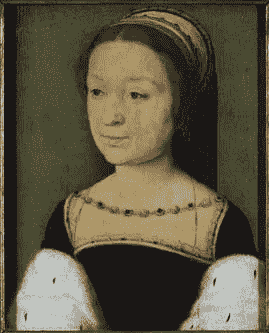
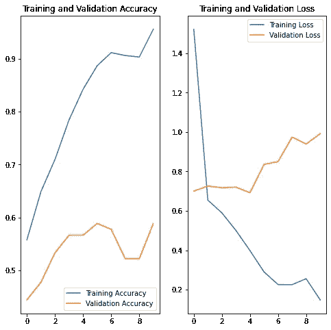
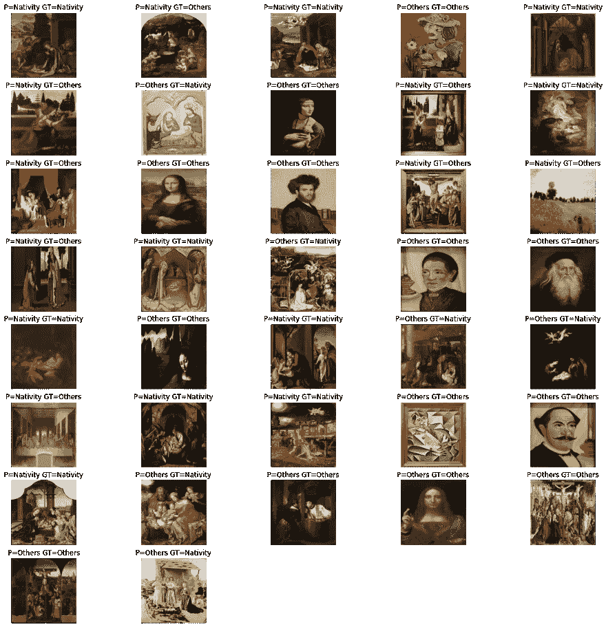
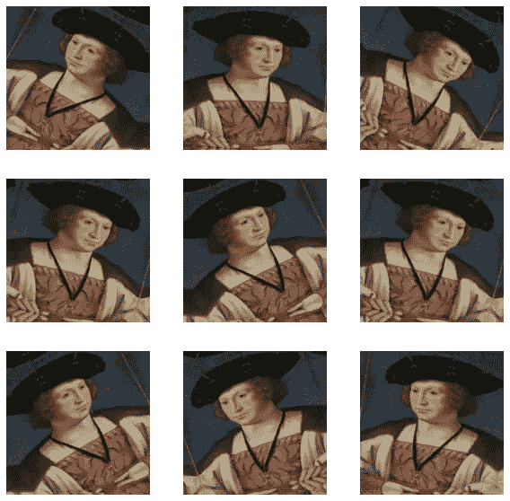
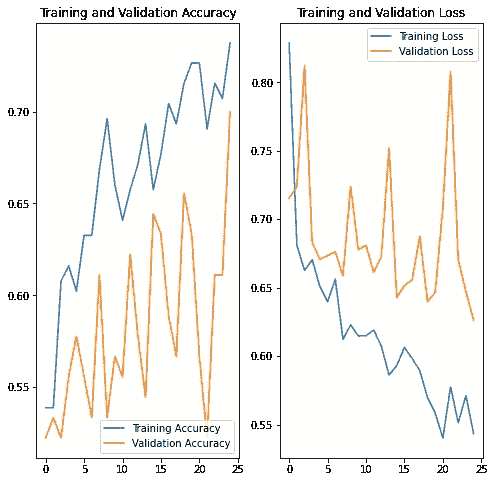
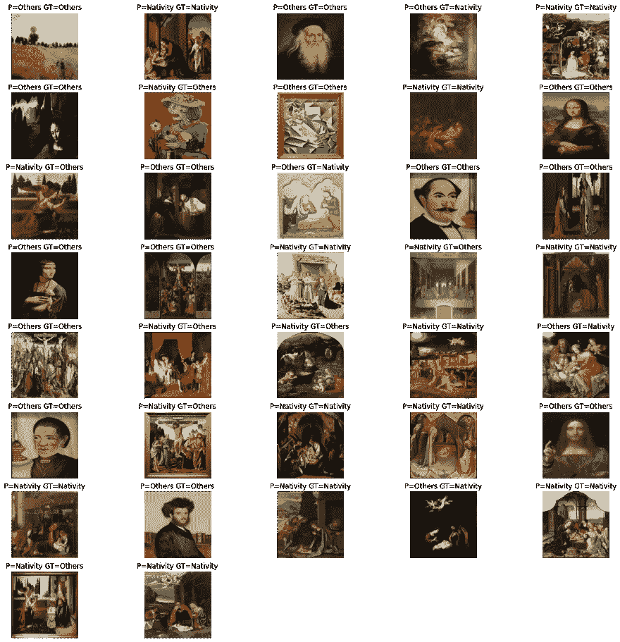
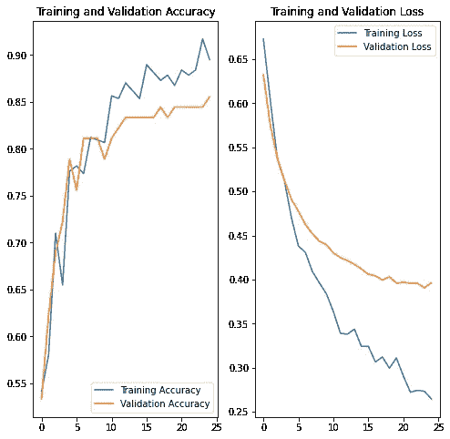
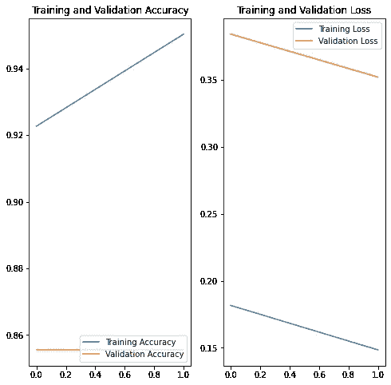

# 我可以使用 Tensorflow 创建一个图像分类器来识别一幅画的主题吗？

> 原文：<https://medium.com/geekculture/can-i-create-an-image-classifier-using-tensorflow-to-identify-the-theme-of-a-painting-46d78ee1db13?source=collection_archive---------2----------------------->


[https://upload.wikimedia.org/wikipedia/commons/e/e4/Leonardo_Da_Vinci_-_Vergine_delle_Rocce_%28Louvre%29.jpg](https://upload.wikimedia.org/wikipedia/commons/e/e4/Leonardo_Da_Vinci_-_Vergine_delle_Rocce_%28Louvre%29.jpg)

我可以教一个使用 Tensorflow 物体检测 API 的 AI 模型，如何识别一幅画的主题吗？

这就是我想用这个项目回答的一般问题。

但是，出于实际原因，我将进一步缩小我的问题。

我想辨别一幅画是否是关于**耶稣诞生**的。这是一个更简单的二进制分类问题。

但首先，让我解释一下什么是耶稣诞生画。一幅**耶稣诞生画**是一幅以耶稣基督诞生为主题的画，在基督教中非常受尊敬。在过去的两千年里，许多著名的艺术家，如达芬奇、米开朗基罗、卡拉瓦乔都被委托为教堂创作画作，所以应该有很多关于**耶稣诞生**的画作可供挑选。


[https://upload.wikimedia.org/wikipedia/commons/9/9d/Botticelli_-_Adoration_of_the_Magi_%28Zanobi_Altar%29_-_Uffizi.jpg](https://upload.wikimedia.org/wikipedia/commons/9/9d/Botticelli_-_Adoration_of_the_Magi_%28Zanobi_Altar%29_-_Uffizi.jpg)

# 开始前

我用 [**Tensorflow 关于图像分类的教程**](https://www.tensorflow.org/tutorials/images/classification) 中的一些代码创建了这个笔记本。您可以在下面的链接中找到原始教程:

[https://www.tensorflow.org/tutorials/images/classification](https://www.tensorflow.org/tutorials/images/classification)

# 导入 TensorFlow 和其他库

```
import matplotlib.pyplot as plt 
import PIL
import tensorflow as tf
import os
from tensorflow import keras
from tensorflow.keras import layers
from tensorflow.keras.models import Sequentialimport pandas as pd
import requests # to get image from the web
import shutil # to save it locally
import time
import numpy as np
```

# 下载训练、验证和测试图像数据集

为了训练一个图像分类器，我们需要一个**训练**图像数据集、**验证**数据集和**测试**数据集。



因为我们正在训练二进制图像分类器，所以我们将有两个不同类别的图像:

*   出生
*   其他人

在模型的训练过程中，我们将使用训练数据集来教模型如何对一幅画进行分类:要么是**耶稣降生**画，要么不是(**其他**)。

在每个训练周期(时期)结束时，我们将使用验证数据集，通过计算**精确度**和**损失**来评估模型的表现。准确性衡量我们的模型得到正确答案的次数。**越高**越好。**损失**测量差值，即预测值和实际值之间的差值。**越低**越好。



重要的是，**验证**数据集与**训练**数据集**分开**，因为 AI 模型非常擅长偷工减料(即作弊)。如果你不把这两者分开，模型将简单地记住答案，而不是学习我们试图教给它的内在特征。

在培训的最后，我们还将使用来自**培训**和**验证**数据集的单独的**测试**数据集，对模型性能进行独立的基准测试。

您会注意到我们正在下载三个文件:

*   nativity _ dataset.csv 包含所有耶稣诞生绘画
*   other _ dataset.csv 包含许多绘画，但耶稣诞生绘画除外
*   test _ dataset.csv 包含带标签的绘画

等一下！我刚才不是说过训练数据集应该与验证数据集分开吗，那么为什么要把它保存在同一个文件中呢？

可以，但是因为我们做的是数据探索，有一定的灵活性是好事。通常建议您拥有 80%的训练数据和 20%的验证数据。但是，这不是一个硬性规定。作为实验的一部分，我们可能想改变这些百分比，看看什么能给我们带来更好的结果。这也被称为**超参数调整**。另一方面，测试数据集应该是固定的，因此我们可以用一致的方式比较不同架构的不同模型。

我们在下面定义了一些实用函数来帮助从我们的图像数据集中下载图像。请注意， **getFileNameFromUrl()** 对 Url 中的**文件名**进行一些非常基本的**清理**和**提取**。

```
def getFileNameFromUrl(url):
  firstpos=url.rindex("/")
  lastpos=len(url)
  filename=url[firstpos+1:lastpos]
  print(f"url={url} firstpos={firstpos} lastpos={lastpos} filename={filename}")
  return filenamedef downloadImage(imageUrl, destinationFolder):
  filename = getFileNameFromUrl(imageUrl)
  # Open the url image, set stream to True, this will return the stream content.
  r = requests.get(imageUrl, stream = True) # Check if the image was retrieved successfully
  if r.status_code == 200:
      # Set decode_content value to True, otherwise the downloaded image file's size will be zero.
      r.raw.decode_content = True # Open a local file with wb ( write binary ) permission.
      filePath = os.path.join(destinationFolder, filename)
      if not os.path.exists(filePath):
        with open(filePath,'wb') as f:
            shutil.copyfileobj(r.raw, f)
        print('Image sucessfully Downloaded: ',filename)
        print("Sleeping for 1 seconds before attempting next download")
        time.sleep(1)
      else:
        print(f'Skipping image {filename} as it is already Downloaded: ') else:
      print(f'Image url={imageUrl} and filename={filename} Couldn't be retreived. HTTP Status={r.status_code}')df = pd.read_csv("nativity_dataset.csv")# create directory to which we download if it doesn't exist
destinationFolder = "/content/dataset/nativity"
os.makedirs(destinationFolder, exist_ok=True)for i, row in df.iterrows():
  print(f"Index: {i}")
  print(f"{row['Image URL']}n") downloadImage(row["Image URL"], destinationFolder)
```

出局:

```
Index: 0
https://d3d00swyhr67nd.cloudfront.net/w1200h1200/collection/LSE/CUMU/LSE_CUMU_TN07034-001.jpgurl=https://d3d00swyhr67nd.cloudfront.net/w1200h1200/collection/LSE/CUMU/LSE_CUMU_TN07034-001.jpg firstpos=68 lastpos=93 filename=LSE_CUMU_TN07034-001.jpg
Image sucessfully Downloaded:  LSE_CUMU_TN07034-001.jpg
Sleeping for 1 seconds before attempting next download
Index: 1
https://d3d00swyhr67nd.cloudfront.net/w1200h1200/collection/GMIII/MCAG/GMIII_MCAG_1947_188-001.jpg
```

# 将所有图像的大小调整为不超过 90000 像素(宽 x 高)

我们数据集中的一些图像大小超过 80MB。如果我们尝试直接从 Python 中调整这些图像的大小，它会尝试将图像加载到内存中。不是个好主意。因此，我们将使用 Imagemick 以超快的速度完成这项工作。

```
!apt install imagemagickReading package lists... Done
Building dependency tree       
Reading state information... Done
imagemagick is already the newest version (8:6.9.7.4+dfsg-16ubuntu6.9).
0 upgraded, 0 newly installed, 0 to remove and 17 not upgraded.
```

现在我们定义实用函数 **resizeImages** 来调整图像大小，并从 **sourceFolder** 复制到 **destinationFolder** 。

```
def resizeImages(sourceFolder, destinationFolder, maxPixels=1048576):
  os.makedirs(destinationFolder, exist_ok=True)
  for path, subdirs, files in os.walk(sourceFolder):
      relativeDir=path.replace(sourceFolder, "")
      destinationFolderPath = destinationFolder + relativeDir
      os.makedirs(destinationFolderPath,exist_ok=True)
      for fileName in files:
          sourceFilepath=os.path.join(path,fileName)
          destinationFilepath=os.path.join(destinationFolderPath, fileName)
          print(f"sourceFilepath={sourceFilepath} destinationFilepath={destinationFilepath}")
          os.system(f"convert {sourceFilepath} -resize {maxPixels}@> {destinationFilepath}")# resize training images
sourceFolder="/content/dataset"
destinationFolder = "/content/resized/dataset"
resizeImages(sourceFolder, destinationFolder, maxPixels=90000)# resize testing images
sourceFolder="/content/test_dataset"
destinationFolder = "/content/resized/test_dataset"
resizeImages(sourceFolder, destinationFolder, maxPixels=90000)sourceFilepath=/content/dataset/others/Quentin_Massys-The_Adoration_of_the_Magi-1526%2CMetropolitan_Museum_of_Art%2CNew_York.jpg destinationFilepath=/content/resized/dataset/others/Quentin_Massys-The_Adoration_of_the_Magi-1526%2CMetropolitan_Museum_of_Art%2CNew_York.jpg
...
```

# 将图像标签映射到数值

我们使用二进制交叉熵进行分类，因此我们需要确保我们的标签是 0 或 1。Nativity = 1，Others = 0

我们将文件夹重命名为 0 和 1，因为这是**TF . keras . preprocessing . image _ dataset _ from _ directory**用来为数据集创建标签的。

```
 !mv /content/resized/dataset/nativity /content/resized/dataset/1
!mv /content/resized/dataset/others /content/resized/dataset/0!mv /content/resized/test_dataset/nativity /content/resized/test_dataset/1
!mv /content/resized/test_dataset/others /content/resized/test_dataset/0
```

下载后，我们现在应该有一个可用的数据集副本。总共有 429 幅图像:

```
import pathlib
data_dir = pathlib.Path("/content/resized/dataset")
test_data_dir = pathlib.Path("/content/resized/test_dataset")image_count = len(list(data_dir.glob('*/*')))
print(image_count)454
```

这里有一些耶稣诞生的画:

```
nativity_label="1"
nativity = list(data_dir.glob(f'{nativity_label}/*'))PIL.Image.open(str(nativity[0]))
```


```
PIL.Image.open(str(nativity[1]))
```


还有一些非耶稣诞生的画:

```
others_label="0"
others = list(data_dir.glob(f'{others_label}/*'))
PIL.Image.open(str(others[1]))
```


`PIL.Image.open(str(others[2]))`



# 使用 keras .预处理加载

Keras 提供了一系列非常方便的功能，让我们在使用 Tensorflow 时更加轻松。**TF . keras . preprocessing . image _ dataset _ from _ directory**就是其中之一。它将图像从文件加载到 **tf.data.DataSet** 格式。

```
batch_size = 32
img_height = 300
img_width = 300
```

一般来说，建议使用 80% 20%的拆分将数据分为训练数据和验证数据。请记住，这不是一个硬性规定。

```
train_ds = tf.keras.preprocessing.image_dataset_from_directory(
  data_dir,
  validation_split=0.2,
  subset="training",
  seed=123,
  image_size=(img_height, img_width),
  batch_size=batch_size, label_mode='binary')Found 452 files belonging to 2 classes.
Using 362 files for training.val_ds = tf.keras.preprocessing.image_dataset_from_directory(
  data_dir,
  validation_split=0.2,
  subset="validation",
  seed=123,
  image_size=(img_height, img_width),
  batch_size=batch_size,label_mode='binary')Found 452 files belonging to 2 classes.
Using 90 files for validation.#Retrieve a batch of images from the test set
test_data_dir = pathlib.Path("/content/resized/test_dataset")
test_batch_size=37
test_ds = tf.keras.preprocessing.image_dataset_from_directory(
  test_data_dir,
  seed=200,
  image_size=(img_height, img_width),
  batch_size=test_batch_size,label_mode='binary')Found 37 files belonging to 2 classes.
```

您可以在这些数据集的 class_names 属性中找到类名。这些对应于按字母顺序排列的目录名。

```
class_names = train_ds.class_names
print(class_names)['0', '1']
```

# 将数据可视化

这是训练数据集中的前 9 幅图像。

```
import matplotlib.pyplot as pltplt.figure(figsize=(10, 10))
for images, labels in train_ds.take(1):
  for i in range(9):
    ax = plt.subplot(3, 3, i + 1)
    plt.imshow(images[i].numpy().astype("uint8"))
    if labels[i] == 1.0:
      title = "Nativity"
    else:
      title = "Others" plt.title(title)
    plt.axis("off")
```


我们检查 image_batch 和 labels_batch 变量。

image_batch 是形状的张量(32，300，300，3)。这是一批 32 个形状为 300x300x3 的图像(最后一个维度是指颜色通道 RGB)。label_batch 是形状(32)的张量，这些是 32 个图像的对应标签。

你可以打电话。numpy()将它们转换为 numpy.ndarray。

```
for image_batch, labels_batch in train_ds:
  print(image_batch.shape)
  print(labels_batch.shape)
  break(32, 300, 300, 3)
(32, 1)
```

# 配置数据集以提高性能

这段代码直接摘自 [Tensorflow 教程](https://www.tensorflow.org/tutorials/images/classification)，它旨在帮助提高性能，因此我们不必总是从磁盘获取图像。

```
AUTOTUNE = tf.data.AUTOTUNEtrain_ds = train_ds.cache().shuffle(1000).prefetch(buffer_size=AUTOTUNE)
val_ds = val_ds.cache().prefetch(buffer_size=AUTOTUNE)
```

我们定义了一个效用函数来衡量测试数据集的性能

```
labelMappings={"0":"Others","1":"Nativity",
               0.0:"Others",1.0 :"Nativity"}def predictWithTestDataset(model):
  image_batch, label_batch = test_ds.as_numpy_iterator().next()
  predictions = model.predict_on_batch(image_batch).flatten() predictions = tf.where(predictions < 0.5, 0, 1) #print('Predictions:n', predictions.numpy())
  #print('Labels:n', label_batch)
  correctPredictions=0
  plt.figure(figsize=(20, 20))
  print(f"number predictions={len(predictions)}")
  for i in range(len(predictions)):
    ax = plt.subplot(8, 5, i +1)
    plt.imshow(image_batch[i].astype("uint8"))
    prediction = class_names[predictions[i]]
    predictionLabel = labelMappings[prediction]
    gtLabel = labelMappings[label_batch[i][0]]
    if gtLabel == predictionLabel:
      correctPredictions += 1
    plt.title(f"P={predictionLabel} GT={gtLabel}")
    plt.axis("off") accuracy = correctPredictions/len(predictions)
  print(f"Accuracy:{accuracy}")
```

# 使数据标准化

RGB 在[0，255]范围内。我们将这些值归一化到[0，1]之间，这是神经网络的首选方式

```
normalization_layer = layers.experimental.preprocessing.Rescaling(1./255)
```

这个规范化层将在稍后的模型定义中使用。

# 创建模型

我们基于 **Tensorflow 图像分类模型**中的架构，为我们的模型定义了一个初始架构。

```
model = Sequential([
  layers.experimental.preprocessing.Rescaling(1./255, input_shape=(img_height, img_width, 3)),
  layers.Conv2D(16, 3, padding='same', activation='relu'),
  layers.MaxPooling2D(),
  layers.Conv2D(32, 3, padding='same', activation='relu'),
  layers.MaxPooling2D(),
  layers.Conv2D(64, 3, padding='same', activation='relu'),
  layers.MaxPooling2D(),
  layers.Flatten(),
  layers.Dense(128, activation='relu'),
  layers.Dense(1, activation='sigmoid')
])
```

# 编译模型

对于本教程，我们选择优化器。亚当优化器和损失。`BinaryCrossentropy`损失函数。为了查看每个训练时期的训练和验证准确性，我们传递了 metrics 参数。

```
model.compile(optimizer='adam', loss=keras.losses.BinaryCrossentropy(from_logits=True), metrics=[keras.metrics.BinaryAccuracy()])
```

# 模型摘要

使用模型的汇总方法查看网络的所有层:

```
model.summary()Model: "sequential_31"
_________________________________________________________________
Layer (type)                 Output Shape              Param #   
=================================================================
rescaling_27 (Rescaling)     (None, 300, 300, 3)       0         
_________________________________________________________________
conv2d_108 (Conv2D)          (None, 300, 300, 16)      448       
_________________________________________________________________
max_pooling2d_60 (MaxPooling (None, 150, 150, 16)      0         
_________________________________________________________________
conv2d_109 (Conv2D)          (None, 150, 150, 32)      4640      
_________________________________________________________________
max_pooling2d_61 (MaxPooling (None, 75, 75, 32)        0         
_________________________________________________________________
conv2d_110 (Conv2D)          (None, 75, 75, 64)        18496     
_________________________________________________________________
max_pooling2d_62 (MaxPooling (None, 37, 37, 64)        0         
_________________________________________________________________
flatten_20 (Flatten)         (None, 87616)             0         
_________________________________________________________________
dense_52 (Dense)             (None, 128)               11214976  
_________________________________________________________________
dense_53 (Dense)             (None, 1)                 129       
=================================================================
Total params: 11,238,689
Trainable params: 11,238,689
Non-trainable params: 0
_________________________________________________________________
```

# 训练模型

```
epochs=10
history = model.fit(
  train_ds,
  validation_data=val_ds,
  epochs=epochs
)Epoch 1/10
12/12 [==============================] - 1s 85ms/step - loss: 1.9371 - binary_accuracy: 0.5107 - val_loss: 0.7001 - val_binary_accuracy: 0.4444
Epoch 2/10
12/12 [==============================] - 1s 49ms/step - loss: 0.6491 - binary_accuracy: 0.6737 - val_loss: 0.7258 - val_binary_accuracy: 0.4778
Epoch 3/10
12/12 [==============================] - 1s 49ms/step - loss: 0.5943 - binary_accuracy: 0.6958 - val_loss: 0.7169 - val_binary_accuracy: 0.5333
Epoch 4/10
12/12 [==============================] - 1s 49ms/step - loss: 0.5111 - binary_accuracy: 0.7762 - val_loss: 0.7201 - val_binary_accuracy: 0.5667
Epoch 5/10
12/12 [==============================] - 1s 49ms/step - loss: 0.4013 - binary_accuracy: 0.8427 - val_loss: 0.6920 - val_binary_accuracy: 0.5667
Epoch 6/10
12/12 [==============================] - 1s 49ms/step - loss: 0.3027 - binary_accuracy: 0.8921 - val_loss: 0.8354 - val_binary_accuracy: 0.5889
Epoch 7/10
12/12 [==============================] - 1s 50ms/step - loss: 0.2438 - binary_accuracy: 0.9049 - val_loss: 0.8499 - val_binary_accuracy: 0.5778
Epoch 8/10
12/12 [==============================] - 1s 49ms/step - loss: 0.1725 - binary_accuracy: 0.9292 - val_loss: 0.9742 - val_binary_accuracy: 0.5222
Epoch 9/10
12/12 [==============================] - 1s 50ms/step - loss: 0.2792 - binary_accuracy: 0.8878 - val_loss: 0.9390 - val_binary_accuracy: 0.5222
Epoch 10/10
12/12 [==============================] - 1s 50ms/step - loss: 0.1347 - binary_accuracy: 0.9658 - val_loss: 0.9914 - val_binary_accuracy: 0.5889
```

# 可视化培训结果

```
print(history.history)
acc = history.history['binary_accuracy']
val_acc = history.history['val_binary_accuracy']
# acc = history.history['accuracy']
# val_acc = history.history['val_accuracy']loss = history.history['loss']
val_loss = history.history['val_loss']epochs_range = range(epochs)plt.figure(figsize=(8, 8))
plt.subplot(1, 2, 1)
plt.plot(epochs_range, acc, label='Training Accuracy')
plt.plot(epochs_range, val_acc, label='Validation Accuracy')
plt.legend(loc='lower right')
plt.title('Training and Validation Accuracy')plt.subplot(1, 2, 2)
plt.plot(epochs_range, loss, label='Training Loss')
plt.plot(epochs_range, val_loss, label='Validation Loss')
plt.legend(loc='upper right')
plt.title('Training and Validation Loss')
plt.show(){'loss': [1.5215493440628052, 0.6543726325035095, 0.5897634625434875, 0.5006453990936279, 0.39839598536491394, 0.2903604209423065, 0.22604547441005707, 0.22543807327747345, 0.2558016777038574, 0.14820142090320587], 'binary_accuracy': [0.5580110549926758, 0.6491712927818298, 0.7099447250366211, 0.7845304012298584, 0.8425414562225342, 0.8867403268814087, 0.9116021990776062, 0.9060773253440857, 0.9033148884773254, 0.9558011293411255], 'val_loss': [0.7000985741615295, 0.7257931232452393, 0.7169376611709595, 0.7200638055801392, 0.6920430660247803, 0.8354127407073975, 0.8498525619506836, 0.9741556644439697, 0.9390344619750977, 0.9914490580558777], 'val_binary_accuracy': [0.4444444477558136, 0.47777777910232544, 0.5333333611488342, 0.5666666626930237, 0.5666666626930237, 0.5888888835906982, 0.5777778029441833, 0.5222222208976746, 0.5222222208976746, 0.5888888835906982]}
```



观察这些图，我们看到了**过度拟合**的典型迹象。**过度拟合**发生在模型与训练数据过于吻合，但与**验证**数据不吻合的时候。注意**精度**随着训练精度的**时期**而增加，但是对于验证数据，精度没有增加，在这种情况下，损失增加。

```
predictWithTestDataset(model)number predictions=37
Accuracy:0.6216216216216216
```



# 数据扩充

过度拟合通常发生在训练样本数量较少的时候。这并不奇怪，因为我们在两个类中总共只有 455 张图片。因此，我们需要找到一种方法来生成更多的训练数据。

Keras 有一些真正易于使用的图像数据增强转换功能，实际上产生非常体面的图像。

图像增强的想法，一种正则化的形式，是为了使模型更难过度拟合。当数据非常少时，很容易发生过拟合。我们引入了可变性，希望它能帮助模型更好地概括。

用于图像增强的 keras 函数可在**TF . keras . layers . experimental . preparatory .**下获得

我们用图像增强变换创建一个层，并且我们可以在模型的创建中包括它，就像任何其他层一样。

对于图像放大，我们做一个随机的水平翻转和一个简单的旋转。

```
data_augmentation = keras.Sequential(
  [
    layers.experimental.preprocessing.RandomFlip("horizontal", 
                                                 input_shape=(img_height, 
                                                              img_width,
                                                              3)),
    layers.experimental.preprocessing.RandomRotation(0.1)     ])
```

让我们通过对同一幅图像多次应用数据增强来想象几个增强示例的样子:

```
plt.figure(figsize=(10, 10))
for images, _ in train_ds.take(1):
  for i in range(9):
    augmented_images = data_augmentation(images)
    ax = plt.subplot(3, 3, i + 1)
    plt.imshow(augmented_images[0].numpy().astype("uint8"))
    plt.axis("off")
```



我们将使用数据增强来训练一个模型。

# 拒绝传统社会的人

另一种减少过拟合的技术是在网络中引入漏失，这是一种正则化的形式。你可以把它想象成在训练过程中随机挑选神经网络中的神经元。我们希望防止模型只依赖于一个特征。每一层的剔除都基于一个分数(0.2)，我们将这个分数作为参数传递给 **Dropout** 函数。

让我们使用层创建一个新的神经网络。辍学，然后使用增强图像训练它。

```
model = Sequential([
  data_augmentation,
  layers.experimental.preprocessing.Rescaling(1./255, input_shape=(img_height, img_width, 3)),
  layers.Conv2D(16, 3, padding='same', activation='relu'),
  layers.MaxPooling2D(),
  layers.Conv2D(32, 3, padding='same', activation='relu'),
  layers.MaxPooling2D(),
  layers.Conv2D(64, 3, padding='same', activation='relu'),
  layers.MaxPooling2D(),
  layers.Dropout(0.2),
  layers.Flatten(),
  layers.Dense(128, activation='relu'),
  layers.Dense(1, activation='sigmoid')
])
```

# 编译和训练模型

```
from tensorflow import optimizers
model.compile(loss=keras.losses.BinaryCrossentropy(from_logits=True),
              optimizer=optimizers.RMSprop(lr=1e-4),
                  metrics=[keras.metrics.BinaryAccuracy()])model.summary()Model: "sequential_34"
_________________________________________________________________
Layer (type)                 Output Shape              Param #   
=================================================================
sequential_32 (Sequential)   (None, 300, 300, 3)       0         
_________________________________________________________________
rescaling_29 (Rescaling)     (None, 300, 300, 3)       0         
_________________________________________________________________
conv2d_114 (Conv2D)          (None, 300, 300, 16)      448       
_________________________________________________________________
max_pooling2d_66 (MaxPooling (None, 150, 150, 16)      0         
_________________________________________________________________
conv2d_115 (Conv2D)          (None, 150, 150, 32)      4640      
_________________________________________________________________
max_pooling2d_67 (MaxPooling (None, 75, 75, 32)        0         
_________________________________________________________________
conv2d_116 (Conv2D)          (None, 75, 75, 64)        18496     
_________________________________________________________________
max_pooling2d_68 (MaxPooling (None, 37, 37, 64)        0         
_________________________________________________________________
dropout_26 (Dropout)         (None, 37, 37, 64)        0         
_________________________________________________________________
flatten_22 (Flatten)         (None, 87616)             0         
_________________________________________________________________
dense_56 (Dense)             (None, 128)               11214976  
_________________________________________________________________
dense_57 (Dense)             (None, 1)                 129       
=================================================================
Total params: 11,238,689
Trainable params: 11,238,689
Non-trainable params: 0
_________________________________________________________________epochs = 25
history = model.fit(
  train_ds,
  validation_data=val_ds,
  epochs=epochs
)Epoch 1/25
12/12 [==============================] - 2s 76ms/step - loss: 0.9417 - binary_accuracy: 0.5580 - val_loss: 0.7153 - val_binary_accuracy: 0.5222
Epoch 2/25
12/12 [==============================] - 1s 61ms/step - loss: 0.6869 - binary_accuracy: 0.5338 - val_loss: 0.7236 - val_binary_accuracy: 0.5333
Epoch 3/25
12/12 [==============================] - 1s 61ms/step - loss: 0.6557 - binary_accuracy: 0.5985 - val_loss: 0.8124 - val_binary_accuracy: 0.5222
Epoch 4/25
12/12 [==============================] - 1s 61ms/step - loss: 0.6447 - binary_accuracy: 0.6315 - val_loss: 0.6829 - val_binary_accuracy: 0.5556
Epoch 5/25
12/12 [==============================] - 1s 65ms/step - loss: 0.6482 - binary_accuracy: 0.6273 - val_loss: 0.6708 - val_binary_accuracy: 0.5778
Epoch 6/25
12/12 [==============================] - 1s 61ms/step - loss: 0.6482 - binary_accuracy: 0.6348 - val_loss: 0.6733 - val_binary_accuracy: 0.5556
Epoch 7/25
12/12 [==============================] - 1s 61ms/step - loss: 0.6325 - binary_accuracy: 0.6592 - val_loss: 0.6762 - val_binary_accuracy: 0.5333
Epoch 8/25
12/12 [==============================] - 1s 62ms/step - loss: 0.5994 - binary_accuracy: 0.6680 - val_loss: 0.6587 - val_binary_accuracy: 0.6111
Epoch 9/25
12/12 [==============================] - 1s 61ms/step - loss: 0.6204 - binary_accuracy: 0.6904 - val_loss: 0.7240 - val_binary_accuracy: 0.5333
Epoch 10/25
12/12 [==============================] - 1s 62ms/step - loss: 0.6343 - binary_accuracy: 0.6480 - val_loss: 0.6776 - val_binary_accuracy: 0.5667
Epoch 11/25
12/12 [==============================] - 1s 62ms/step - loss: 0.6439 - binary_accuracy: 0.6107 - val_loss: 0.6811 - val_binary_accuracy: 0.5556
Epoch 12/25
12/12 [==============================] - 1s 62ms/step - loss: 0.6361 - binary_accuracy: 0.6301 - val_loss: 0.6612 - val_binary_accuracy: 0.6222
Epoch 13/25
12/12 [==============================] - 1s 62ms/step - loss: 0.6025 - binary_accuracy: 0.6949 - val_loss: 0.6725 - val_binary_accuracy: 0.5778
Epoch 14/25
12/12 [==============================] - 1s 61ms/step - loss: 0.5977 - binary_accuracy: 0.6868 - val_loss: 0.7521 - val_binary_accuracy: 0.5444
Epoch 15/25
12/12 [==============================] - 1s 62ms/step - loss: 0.5713 - binary_accuracy: 0.6833 - val_loss: 0.6427 - val_binary_accuracy: 0.6444
Epoch 16/25
12/12 [==============================] - 1s 62ms/step - loss: 0.5918 - binary_accuracy: 0.6939 - val_loss: 0.6515 - val_binary_accuracy: 0.6333
Epoch 17/25
12/12 [==============================] - 1s 61ms/step - loss: 0.5831 - binary_accuracy: 0.7253 - val_loss: 0.6556 - val_binary_accuracy: 0.5889
Epoch 18/25
12/12 [==============================] - 1s 62ms/step - loss: 0.5626 - binary_accuracy: 0.7121 - val_loss: 0.6877 - val_binary_accuracy: 0.5667
Epoch 19/25
12/12 [==============================] - 1s 62ms/step - loss: 0.5476 - binary_accuracy: 0.7327 - val_loss: 0.6398 - val_binary_accuracy: 0.6556
Epoch 20/25
12/12 [==============================] - 1s 62ms/step - loss: 0.5551 - binary_accuracy: 0.7283 - val_loss: 0.6465 - val_binary_accuracy: 0.6333
Epoch 21/25
12/12 [==============================] - 1s 62ms/step - loss: 0.5436 - binary_accuracy: 0.7312 - val_loss: 0.7083 - val_binary_accuracy: 0.5667
Epoch 22/25
12/12 [==============================] - 1s 65ms/step - loss: 0.5987 - binary_accuracy: 0.6781 - val_loss: 0.8078 - val_binary_accuracy: 0.5222
Epoch 23/25
12/12 [==============================] - 1s 62ms/step - loss: 0.5534 - binary_accuracy: 0.7139 - val_loss: 0.6705 - val_binary_accuracy: 0.6111
Epoch 24/25
12/12 [==============================] - 1s 85ms/step - loss: 0.5617 - binary_accuracy: 0.7406 - val_loss: 0.6471 - val_binary_accuracy: 0.6111
Epoch 25/25
12/12 [==============================] - 1s 62ms/step - loss: 0.5541 - binary_accuracy: 0.7303 - val_loss: 0.6263 - val_binary_accuracy: 0.7000
```

# 可视化培训结果

在应用数据增加和减少后，过度拟合比以前少了，并且训练和验证准确性非常一致。

```
print(history.history)
acc = history.history['binary_accuracy']
val_acc = history.history['val_binary_accuracy']loss = history.history['loss']
val_loss = history.history['val_loss']epochs_range = range(epochs)plt.figure(figsize=(8, 8))
plt.subplot(1, 2, 1)
plt.plot(epochs_range, acc, label='Training Accuracy')
plt.plot(epochs_range, val_acc, label='Validation Accuracy')
plt.legend(loc='lower right')
plt.title('Training and Validation Accuracy')plt.subplot(1, 2, 2)
plt.plot(epochs_range, loss, label='Training Loss')
plt.plot(epochs_range, val_loss, label='Validation Loss')
plt.legend(loc='upper right')
plt.title('Training and Validation Loss')
plt.show(){'loss': [0.8289327025413513, 0.6810811758041382, 0.6626855731010437, 0.6704213619232178, 0.650795042514801, 0.6398268938064575, 0.6561762690544128, 0.6122907400131226, 0.6228107810020447, 0.6147234439849854, 0.6149318814277649, 0.6190508604049683, 0.607336699962616, 0.5861756801605225, 0.593088686466217, 0.6063793301582336, 0.5983501672744751, 0.5894269347190857, 0.5698645114898682, 0.5585014224052429, 0.5401753783226013, 0.5774908065795898, 0.5512883067131042, 0.5710932016372681, 0.5434897541999817], 'binary_accuracy': [0.5386740565299988, 0.5386740565299988, 0.6077347993850708, 0.6160221099853516, 0.6022099256515503, 0.6325966715812683, 0.6325966715812683, 0.6685082912445068, 0.6961326003074646, 0.6602209806442261, 0.6408839821815491, 0.6574585437774658, 0.6712707281112671, 0.6933701634407043, 0.6574585437774658, 0.6767956018447876, 0.7044199109077454, 0.6933701634407043, 0.7154695987701416, 0.7265193462371826, 0.7265193462371826, 0.6906077265739441, 0.7154695987701416, 0.7071823477745056, 0.7375690340995789], 'val_loss': [0.7153488993644714, 0.7235575318336487, 0.8124216794967651, 0.6829271912574768, 0.6708189249038696, 0.673344612121582, 0.676236629486084, 0.6586815714836121, 0.7239749431610107, 0.677582323551178, 0.6810950636863708, 0.6611502170562744, 0.6725294589996338, 0.7520950436592102, 0.642659068107605, 0.6514749526977539, 0.6556094884872437, 0.687703013420105, 0.639808714389801, 0.6464514136314392, 0.7082778811454773, 0.8077911138534546, 0.670492947101593, 0.6470986008644104, 0.6263118386268616], 'val_binary_accuracy': [0.5222222208976746, 0.5333333611488342, 0.5222222208976746, 0.5555555820465088, 0.5777778029441833, 0.5555555820465088, 0.5333333611488342, 0.6111111044883728, 0.5333333611488342, 0.5666666626930237, 0.5555555820465088, 0.6222222447395325, 0.5777778029441833, 0.5444444417953491, 0.644444465637207, 0.6333333253860474, 0.5888888835906982, 0.5666666626930237, 0.6555555462837219, 0.6333333253860474, 0.5666666626930237, 0.5222222208976746, 0.6111111044883728, 0.6111111044883728, 0.699999988079071]}
```



# 根据新数据进行预测

最后，让我们使用我们的模型对测试数据集上未包含在训练集或验证集中的图像进行分类。

```
predictWithTestDataset(model)number predictions=37
Accuracy:0.7027027027027027
```



# 迁移学习

我们已经使用图像增强来尝试从我们的模型中获得更好的结果，我不得不说结果一点也不差。我们能够在验证数据集上得到一个准确率接近 70%的模型。当然，我们可以做得更好，如果我们能够为我们的训练和验证数据集多收集数百张，也许数千张图像。

我们当然可以这样做，但还有另一种方法，不涉及收集更多训练数据的繁琐和昂贵的过程:**迁移学习**。

通过迁移学习，我们可以借用一个已经针对成千上万张图像训练过的模型，并针对我们的用例重新训练它，但使用的图像比我们从头开始训练模型时可能使用的图像要少得多。

为此，我们可以使用 Keras 下载一个预训练模型，该模型具有已经在 **Imagenet** 上训练过的 Xception 架构。

要执行迁移学习，我们需要冻结基本模型的权重，并像平常一样执行训练。你会注意到，我们仍然做图像放大和正则化。

```
base_model = keras.applications.Xception(
    weights="imagenet",  # Load weights pre-trained on ImageNet.
    input_shape=(img_height, img_width, 3),
    include_top=False,
)  # Do not include the ImageNet classifier at the top.# Freeze the base_model
base_model.trainable = False# Create new model on top
inputs = keras.Input(shape=(img_height, img_width, 3))
x = data_augmentation(inputs)  # Apply random data augmentation# Pre-trained Xception weights requires that input be normalized
# from (0, 255) to a range (-1., +1.), the normalization layer
# does the following, outputs = (inputs - mean) / sqrt(var)
norm_layer = keras.layers.experimental.preprocessing.Normalization()
mean = np.array([127.5] * 3)
var = mean ** 2
# Scale inputs to [-1, +1]
x = norm_layer(x)
norm_layer.set_weights([mean, var])# The base model contains batchnorm layers. We want to keep them in inference mode
# when we unfreeze the base model for fine-tuning, so we make sure that the
# base_model is running in inference mode here.
x = base_model(x, training=False)
x = keras.layers.GlobalAveragePooling2D()(x)
x = keras.layers.Dropout(0.2)(x)  # Regularize with dropout
outputs = keras.layers.Dense(1, activation="sigmoid")(x)
model = keras.Model(inputs, outputs)model.summary()Model: "model_13"
_________________________________________________________________
Layer (type)                 Output Shape              Param #   
=================================================================
input_28 (InputLayer)        [(None, 300, 300, 3)]     0         
_________________________________________________________________
sequential_32 (Sequential)   (None, 300, 300, 3)       0         
_________________________________________________________________
normalization_13 (Normalizat (None, 300, 300, 3)       7         
_________________________________________________________________
xception (Functional)        (None, 10, 10, 2048)      20861480  
_________________________________________________________________
global_average_pooling2d_13  (None, 2048)              0         
_________________________________________________________________
dropout_28 (Dropout)         (None, 2048)              0         
_________________________________________________________________
dense_59 (Dense)             (None, 1)                 2049      
=================================================================
Total params: 20,863,536
Trainable params: 2,049
Non-trainable params: 20,861,487
_________________________________________________________________# model.compile(optimizer=keras.optimizers.Adam(),
#               loss=tf.keras.losses.SparseCategoricalCrossentropy(from_logits=True),
#               metrics=['accuracy'])
model.compile(
    optimizer=keras.optimizers.Adam(),
    loss=keras.losses.BinaryCrossentropy(from_logits=True),
    metrics=[keras.metrics.BinaryAccuracy()],
)epochs = 25
history = model.fit(
  train_ds,
  validation_data=val_ds,
  epochs=epochs
)Epoch 1/25
12/12 [==============================] - 7s 376ms/step - loss: 0.6989 - binary_accuracy: 0.5116 - val_loss: 0.6324 - val_binary_accuracy: 0.5333
Epoch 2/25
12/12 [==============================] - 4s 322ms/step - loss: 0.6106 - binary_accuracy: 0.5943 - val_loss: 0.5748 - val_binary_accuracy: 0.6222
Epoch 3/25
12/12 [==============================] - 4s 322ms/step - loss: 0.5557 - binary_accuracy: 0.6647 - val_loss: 0.5378 - val_binary_accuracy: 0.6889
Epoch 4/25
12/12 [==============================] - 4s 326ms/step - loss: 0.5280 - binary_accuracy: 0.6333 - val_loss: 0.5127 - val_binary_accuracy: 0.7222
Epoch 5/25
12/12 [==============================] - 4s 329ms/step - loss: 0.4751 - binary_accuracy: 0.7638 - val_loss: 0.4912 - val_binary_accuracy: 0.7889
Epoch 6/25
12/12 [==============================] - 4s 331ms/step - loss: 0.4586 - binary_accuracy: 0.7535 - val_loss: 0.4775 - val_binary_accuracy: 0.7556
Epoch 7/25
12/12 [==============================] - 4s 335ms/step - loss: 0.4328 - binary_accuracy: 0.7778 - val_loss: 0.4625 - val_binary_accuracy: 0.8111
Epoch 8/25
12/12 [==============================] - 4s 339ms/step - loss: 0.3951 - binary_accuracy: 0.8387 - val_loss: 0.4519 - val_binary_accuracy: 0.8111
Epoch 9/25
12/12 [==============================] - 4s 344ms/step - loss: 0.3745 - binary_accuracy: 0.8427 - val_loss: 0.4435 - val_binary_accuracy: 0.8111
Epoch 10/25
12/12 [==============================] - 4s 348ms/step - loss: 0.3631 - binary_accuracy: 0.8373 - val_loss: 0.4395 - val_binary_accuracy: 0.7889
Epoch 11/25
12/12 [==============================] - 4s 350ms/step - loss: 0.3449 - binary_accuracy: 0.8705 - val_loss: 0.4302 - val_binary_accuracy: 0.8111
Epoch 12/25
12/12 [==============================] - 4s 355ms/step - loss: 0.3409 - binary_accuracy: 0.8623 - val_loss: 0.4249 - val_binary_accuracy: 0.8222
Epoch 13/25
12/12 [==============================] - 4s 356ms/step - loss: 0.3491 - binary_accuracy: 0.8848 - val_loss: 0.4214 - val_binary_accuracy: 0.8333
Epoch 14/25
12/12 [==============================] - 4s 356ms/step - loss: 0.3522 - binary_accuracy: 0.8569 - val_loss: 0.4173 - val_binary_accuracy: 0.8333
Epoch 15/25
12/12 [==============================] - 4s 354ms/step - loss: 0.3106 - binary_accuracy: 0.8641 - val_loss: 0.4120 - val_binary_accuracy: 0.8333
Epoch 16/25
12/12 [==============================] - 4s 348ms/step - loss: 0.3108 - binary_accuracy: 0.8973 - val_loss: 0.4059 - val_binary_accuracy: 0.8333
Epoch 17/25
12/12 [==============================] - 4s 348ms/step - loss: 0.3041 - binary_accuracy: 0.8840 - val_loss: 0.4043 - val_binary_accuracy: 0.8333
Epoch 18/25
12/12 [==============================] - 4s 364ms/step - loss: 0.3106 - binary_accuracy: 0.8548 - val_loss: 0.3994 - val_binary_accuracy: 0.8444
Epoch 19/25
12/12 [==============================] - 4s 343ms/step - loss: 0.3072 - binary_accuracy: 0.8774 - val_loss: 0.4031 - val_binary_accuracy: 0.8333
Epoch 20/25
12/12 [==============================] - 4s 341ms/step - loss: 0.3008 - binary_accuracy: 0.8870 - val_loss: 0.3960 - val_binary_accuracy: 0.8444
Epoch 21/25
12/12 [==============================] - 4s 342ms/step - loss: 0.2959 - binary_accuracy: 0.8738 - val_loss: 0.3969 - val_binary_accuracy: 0.8444
Epoch 22/25
12/12 [==============================] - 4s 340ms/step - loss: 0.2655 - binary_accuracy: 0.8874 - val_loss: 0.3959 - val_binary_accuracy: 0.8444
Epoch 23/25
12/12 [==============================] - 4s 340ms/step - loss: 0.2452 - binary_accuracy: 0.9098 - val_loss: 0.3957 - val_binary_accuracy: 0.8444
Epoch 24/25
12/12 [==============================] - 4s 359ms/step - loss: 0.2532 - binary_accuracy: 0.9214 - val_loss: 0.3906 - val_binary_accuracy: 0.8444
Epoch 25/25
12/12 [==============================] - 4s 340ms/step - loss: 0.2512 - binary_accuracy: 0.9202 - val_loss: 0.3963 - val_binary_accuracy: 0.8556print(history.history)
acc = history.history['binary_accuracy']
val_acc = history.history['val_binary_accuracy']loss = history.history['loss']
val_loss = history.history['val_loss']epochs_range = range(epochs)plt.figure(figsize=(8, 8))
plt.subplot(1, 2, 1)
plt.plot(epochs_range, acc, label='Training Accuracy')
plt.plot(epochs_range, val_acc, label='Validation Accuracy')
plt.legend(loc='lower right')
plt.title('Training and Validation Accuracy')plt.subplot(1, 2, 2)
plt.plot(epochs_range, loss, label='Training Loss')
plt.plot(epochs_range, val_loss, label='Validation Loss')
plt.legend(loc='upper right')
plt.title('Training and Validation Loss')
plt.show(){'loss': [0.6730840802192688, 0.6024077534675598, 0.5369390249252319, 0.5121317505836487, 0.47049736976623535, 0.43795397877693176, 0.4308575689792633, 0.409035861492157, 0.39621278643608093, 0.38378414511680603, 0.36360302567481995, 0.3390505313873291, 0.33790066838264465, 0.34375235438346863, 0.3241599202156067, 0.3240811824798584, 0.30652204155921936, 0.3121297359466553, 0.29941326379776, 0.31102144718170166, 0.29046544432640076, 0.2721157371997833, 0.2742222845554352, 0.273193895816803, 0.2644941210746765], 'binary_accuracy': [0.541436493396759, 0.580110490322113, 0.7099447250366211, 0.6546961069107056, 0.7762430906295776, 0.7817679643630981, 0.7734806537628174, 0.8121547102928162, 0.8093922734260559, 0.8066298365592957, 0.8563535809516907, 0.8535911440849304, 0.8701657652854919, 0.8618784546852112, 0.8535911440849304, 0.889502763748169, 0.8812154531478882, 0.8729282021522522, 0.8784530162811279, 0.8674033284187317, 0.8839778900146484, 0.8784530162811279, 0.8839778900146484, 0.9171270728111267, 0.8950276374816895], 'val_loss': [0.6324149966239929, 0.5748280882835388, 0.537817120552063, 0.5126944184303284, 0.4911538362503052, 0.47753846645355225, 0.4625410735607147, 0.45192599296569824, 0.44351860880851746, 0.4394892752170563, 0.430193156003952, 0.42491695284843445, 0.42138800024986267, 0.4172518849372864, 0.4119878113269806, 0.40589141845703125, 0.40429064631462097, 0.399353951215744, 0.40307578444480896, 0.39602288603782654, 0.39687782526016235, 0.39587682485580444, 0.39574024081230164, 0.39059093594551086, 0.3963099718093872], 'val_binary_accuracy': [0.5333333611488342, 0.6222222447395325, 0.6888889074325562, 0.7222222089767456, 0.7888888716697693, 0.7555555701255798, 0.8111110925674438, 0.8111110925674438, 0.8111110925674438, 0.7888888716697693, 0.8111110925674438, 0.8222222328186035, 0.8333333134651184, 0.8333333134651184, 0.8333333134651184, 0.8333333134651184, 0.8333333134651184, 0.8444444537162781, 0.8333333134651184, 0.8444444537162781, 0.8444444537162781, 0.8444444537162781, 0.8444444537162781, 0.8444444537162781, 0.855555534362793]}
```



根据测试数据集测试模型

```
predictWithTestDataset(model)WARNING:tensorflow:5 out of the last 12 calls to <function Model.make_predict_function.<locals>.predict_function at 0x7f58803470d0> triggered tf.function retracing. Tracing is expensive and the excessive number of tracings could be due to (1) creating @tf.function repeatedly in a loop, (2) passing tensors with different shapes, (3) passing Python objects instead of tensors. For (1), please define your @tf.function outside of the loop. For (2), @tf.function has experimental_relax_shapes=True option that relaxes argument shapes that can avoid unnecessary retracing. For (3), please refer to https://www.tensorflow.org/guide/function#controlling_retracing and https://www.tensorflow.org/api_docs/python/tf/function for  more details.number predictions=37
Accuracy:0.7837837837837838
```


```
# Unfreeze the base_model. Note that it keeps running in inference mode
# since we passed `training=False` when calling it. This means that
# the batchnorm layers will not update their batch statistics.
# This prevents the batchnorm layers from undoing all the training
# we've done so far.
base_model.trainable = True
model.summary()model.compile(
    optimizer=keras.optimizers.Adam(1e-5),  # Low learning rate
    loss=keras.losses.BinaryCrossentropy(from_logits=True),
    metrics=[keras.metrics.BinaryAccuracy()],
)epochs = 2
history = model.fit(train_ds, epochs=epochs, validation_data=val_ds)Model: "model_13"
_________________________________________________________________
Layer (type)                 Output Shape              Param #   
=================================================================
input_28 (InputLayer)        [(None, 300, 300, 3)]     0         
_________________________________________________________________
sequential_32 (Sequential)   (None, 300, 300, 3)       0         
_________________________________________________________________
normalization_13 (Normalizat (None, 300, 300, 3)       7         
_________________________________________________________________
xception (Functional)        (None, 10, 10, 2048)      20861480  
_________________________________________________________________
global_average_pooling2d_13  (None, 2048)              0         
_________________________________________________________________
dropout_28 (Dropout)         (None, 2048)              0         
_________________________________________________________________
dense_59 (Dense)             (None, 1)                 2049      
=================================================================
Total params: 20,863,536
Trainable params: 20,809,001
Non-trainable params: 54,535
_________________________________________________________________
Epoch 1/2
12/12 [==============================] - 19s 1s/step - loss: 0.1918 - binary_accuracy: 0.9218 - val_loss: 0.3842 - val_binary_accuracy: 0.8556
Epoch 2/2
12/12 [==============================] - 16s 1s/step - loss: 0.1469 - binary_accuracy: 0.9509 - val_loss: 0.3520 - val_binary_accuracy: 0.8556print(history.history)
acc = history.history['binary_accuracy']
val_acc = history.history['val_binary_accuracy']loss = history.history['loss']
val_loss = history.history['val_loss']epochs_range = range(epochs)plt.figure(figsize=(8, 8))
plt.subplot(1, 2, 1)
plt.plot(epochs_range, acc, label='Training Accuracy')
plt.plot(epochs_range, val_acc, label='Validation Accuracy')
plt.legend(loc='lower right')
plt.title('Training and Validation Accuracy')plt.subplot(1, 2, 2)
plt.plot(epochs_range, loss, label='Training Loss')
plt.plot(epochs_range, val_loss, label='Validation Loss')
plt.legend(loc='upper right')
plt.title('Training and Validation Loss')
plt.show(){'loss': [0.1816166639328003, 0.14842070639133453], 'binary_accuracy': [0.9226519465446472, 0.950276255607605], 'val_loss': [0.38415849208831787, 0.3520398437976837], 'val_binary_accuracy': [0.855555534362793, 0.855555534362793]}
```



```
predictWithTestDataset(model)WARNING:tensorflow:6 out of the last 13 calls to <function Model.make_predict_function.<locals>.predict_function at 0x7f58f13847b8> triggered tf.function retracing. Tracing is expensive and the excessive number of tracings could be due to (1) creating @tf.function repeatedly in a loop, (2) passing tensors with different shapes, (3) passing Python objects instead of tensors. For (1), please define your @tf.function outside of the loop. For (2), @tf.function has experimental_relax_shapes=True option that relaxes argument shapes that can avoid unnecessary retracing. For (3), please refer to https://www.tensorflow.org/guide/function#controlling_retracing and https://www.tensorflow.org/api_docs/python/tf/function for  more details.
number predictions=37
Accuracy:0.8378378378378378
```


# 结论

我们已经能够用有限的数据集获得一些非常好的结果。这确实很有前途！神经网络似乎能够根据主题对艺术收藏品进行分类。

有许多方法可以进一步改善这些结果，从收集更多的图像，试验不同的图像大小，甚至尝试新的模型架构。

希望这篇文章对你有用。希望下次能见到你。编码快乐！

资源

 [## armindocachada/tensor flow-定制-分类-艺术-诞生

### 我可以教一个使用 Tensorflow 物体检测 API 的 AI 模型，如何识别一幅画的主题吗？唯一的方法是…

github.com](https://github.com/armindocachada/tensorflow-custom-classification-art-nativity) [](https://www.tensorflow.org/tutorials/images/classification) [## 图像分类|张量流核心

### 当有少量训练样本时，模型有时会从噪声或不需要的细节中学习…

www.tensorflow.org](https://www.tensorflow.org/tutorials/images/classification) [](https://www.tensorflow.org/tutorials/images/transfer_learning) [## 迁移学习和微调| TensorFlow 核心

### 此外，您应该尝试微调一小部分顶层，而不是整个 MobileNet 模型。在大多数情况下…

www.tensorflow.org](https://www.tensorflow.org/tutorials/images/transfer_learning)