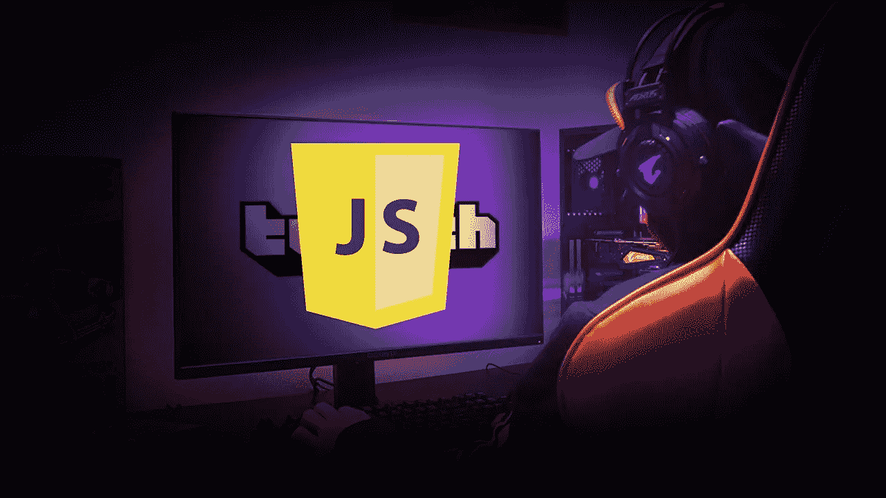
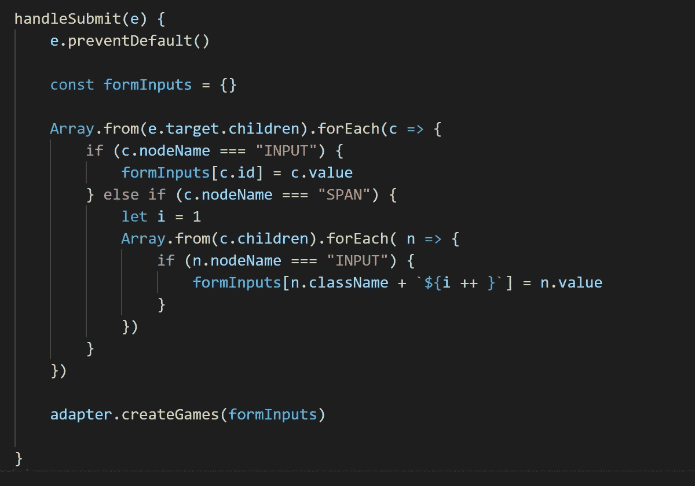
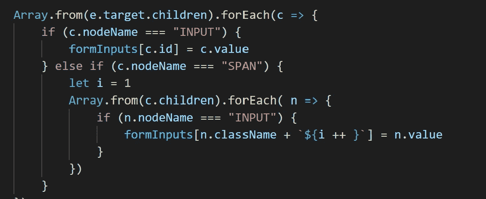
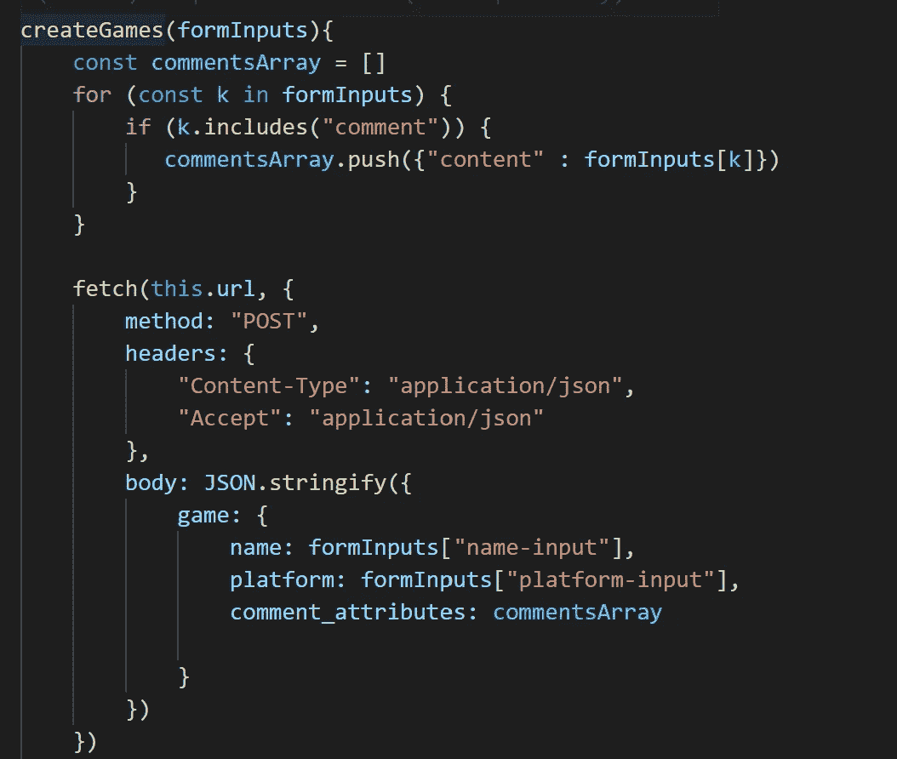
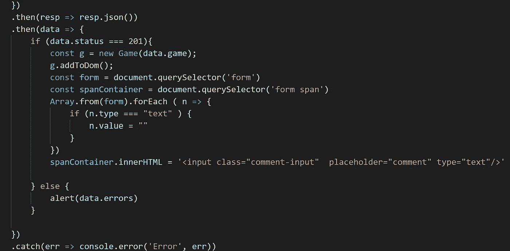

# 我能在聊天中得到一些 J 吗？

> 原文：<https://medium.com/geekculture/can-i-get-some-js-in-the-chat-5d89a8a27f7a?source=collection_archive---------22----------------------->

I am a JavaScript streamer/content creator now

这是你的朋友切·戈拉诺夫带来的另一个 JavaScript Twitch 流。好吧，聊天爱好者，你的朋友开发了一个叫 Poggers 的疯狂应用！我能在聊天中得到一些 J 吗…和一些 poggers 吗…

感谢五个天才的 subs BigFlexGamer！

另一个是 JScriptGod，欢迎来到我的朋友的聊天室！

MsApexLegend 问，“车侠，给我们看看这个应用！”好的，我抓住你了！

好吧，聊天，你知道我们总是有那些游戏列表在我们的脑海里，我们总是有一些笔记绑在它上面？和《哦，男人》一样，传奇工作室的导演宫崎英高也即将推出《埃尔登戒指》？现在你可以和波格斯一起了！

这是一个简单的单页应用程序，您可以在上面的表格中填写游戏的详细信息，提交后它会在您的列表中创建一个游戏！简单的聊天。但我知道你们都是冲着好东西来的。让我们到幕后去。我看到你 JDNeal 与 poggers 在聊天…让我们得到它…

让我们检查一下表单的构建，然后提交数据，好吗？我没有整个晚上做整个应用程序聊天抱歉！除非我们在聊天中得到一些更有天赋的 subs 首先，我们开始用一个实例方法构建一个 GameForm 类，这个方法叫做…你猜它是 Fam…addForm()。哦，是的，JS 是面向对象的宝贝！

这里我们设置了两个常量变量，formContainer 从我的 index.html 页面中抓取了

元素，该页面将保存

接下来，我们使用 gameForm 的 innerHTML 方法，获取 gameForm 变量并添加游戏 html。现在我们有了表单，让我们将坏男孩添加到 formsContainer 变量中。但是我们还没有完成！

我们需要添加一些事件侦听器，否则，猜猜看，当我们单击 submit 按钮时，什么也不会发生。类型属性为 **submit** 的元素的行为就像一个按钮！因此，我们需要向 gameForm 添加一个事件监听器来监听“提交”，然后我们需要构建处理该事件的回调函数。你还跟我聊天吗？好的，让我们来看看 handleSubmit 方法…

方法接受的参数是事件(e)。在做任何事情之前，我们想在事件上调用 preventDefault()方法，因为 submit 会自动尝试将我们的表单提交给服务器，而这并不是我们在这里要做的。

下一次聊天，我们将设置一个名为 formInputs 的常量变量，并用一个空对象声明它。在这里，我们将捕获表单的 id 属性作为键，并捕获值来创建我们的游戏！是时候抓住那些形式元素并运行它了…那么我们该如何着手去做呢？简单聊天，信任，我们调用我们事件的目标属性，它将返回我们事件被调用的对象，在这种情况下记住我们在我们的

现在让我们迭代 HTML 集合，获取我们需要的一切。停止聊天。没那么快。你知道 HTML 集合，虽然它看起来像一个数组，但实际上不是。所以在迭代之前，我们需要调用 Array.from()静态方法，将 HTML 集合转换成一个数组。现在让我们打电话。去拿我们需要的东西。

分解这个公式，变量 **c** 表示<表单>元素的每个子节点，但是技巧是我们需要<输入>元素和<跨度>元素内部的内容。因此，一个简单的控制流将帮助我们做到这一点。首先，如果节点名=== "INPUT ",那么我们要获取它的 id 属性，并将其设置为 formInputs 对象中的一个键，而<输入>值将是该键的新值。不错！但是<跨度>呢？

好问题。在我们的 else if 部分中，如果节点是一个元素，我们将设置一个 **i** 变量为 1(用于第一个注释),然后获取< span >元素的子元素(保存注释的<输入>)并使用 Array.from()和 forEach 方法遍历它们。同样，如果节点是<输入>，我们获取节点的类属性作为键加上 **i** 变量，因为所有键必须是唯一的。设置<输入>值和 viola！我们有我们的表单输出！

所以一旦这些都完成了，我们就进入适配器类，创建一个新的游戏添加到页面中！

我们在那边聊得怎么样？我们快完成了！看一看适配器类 createGames 的实例方法，它接受的参数应该看起来很熟悉…它是我们的 formInputs 对象！

第一步是把我们的意见和格式发送到我们的后端。我知道你们都是 Rails 专业人士，所以记住在后端，我们在游戏的类中有我们的 comments_attributes setter！我们必须格式化它！那么，我们如何着手做这件事呢？我们将在循环中使用**for……来遍历我们对象中的所有键，由 **k** 变量表示，但只遍历包含“注释”的键。Boom，perfect 现在让我们用一个空数组设置一个 const commentsArray 变量，并推送那些用“content:”键格式化的注释值，以适当地反映后端的内容属性。一个对象数组！**

是我们设置获取请求并将数据发送到后端的时候了。这里的关键是在我们创建一个新对象时设置“method: POST ”,并将我们的数据发送到 JSON.stringify，以正确的格式发送它——JavaScript 对象符号。我们使用 formInputs 和 commentsArray 设置数据，这些数据将被正确格式化，以便在后端创建一个对象并将其保存到 ActiveRecord。

为了结束这次聊天，我将简要介绍一下返回的数据。如果数据返回成功，我们将使用数据对象的游戏键创建一个新的游戏实例，并在新的游戏实例上调用 addToDom()方法。这将创建一个新的

*   元素，在你的主页上显示你的新游戏的详细信息。

你有它聊天。JavaScript 是一种独特的动物，老实说，我仍在努力掌握它。然而，具有讽刺意味的是，这是我真正喜欢的一种语言。如果你想看更多的代码，我邀请你去看看前端回购:[https://github.com/cgoranov/poggers-frontend](https://github.com/cgoranov/poggers-frontend)。

这将结束那里的流，但不要忘记粉碎以下按钮，我会看到你们所有人以后！和平！