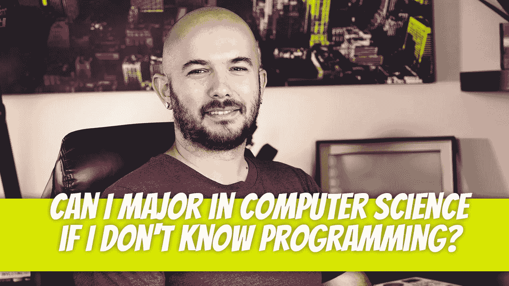

# 不懂编程可以学计算机专业吗？

> 原文：<https://medium.com/geekculture/can-i-major-in-computer-science-if-i-dont-know-programming-738172dfea3d?source=collection_archive---------16----------------------->

这是我从那些认真追求计算机科学学位的人那里得到的第一个问题。似乎他们知道计算机科学学位不是编程学位，尽管大多数人是因为这个原因才获得计算机科学学位的。为什么？因为大多数大学不提供编程学位。