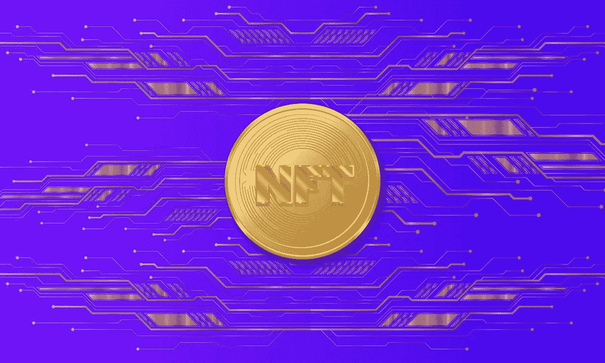

# Lunar (LNR)能从 DeFi 生态系统中赚钱吗？—市场疯人院

> 原文：<https://medium.com/geekculture/can-lunar-lnr-make-money-from-a-defi-ecosystem-market-mad-house-303110a62d0d?source=collection_archive---------7----------------------->

月球(LNR) 的开发者希望从币安智能链区块链上的 DeFi 生态系统中赚钱。Lunar 是他们在币安智能链中构建的一个分散金融(DeFi)生态系统。

详细来说，[月球生态系统](https://www.lunardefi.com/)由**月球令牌(LNR)** 、月球 App、月球水晶 NFTs 组成。Lunar 是币安智能链(BSC)令牌…